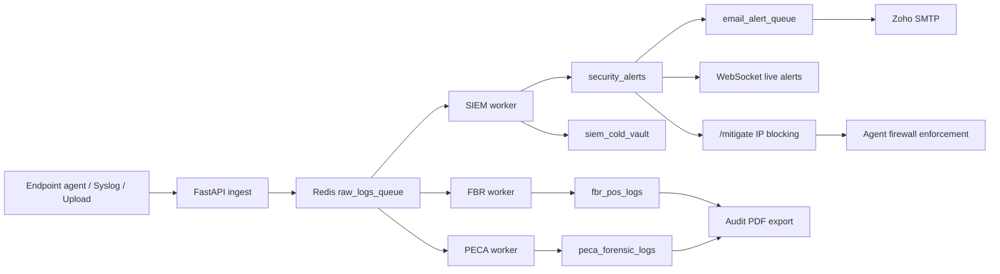

# WarSOC 15-Agent FBR and PECA Launch Handoff

Date: 2026-06-18

Audience: frontend engineer, implementation lead, sales/ops handoff

Scenario: one customer signs a 15 endpoint/agent package with both compliance packs:

- FBR POS pack: backend pack id `fbr_pos`
- PECA forensic pack: backend pack id `peca_forensic`
- Expected tenant entitlement: `compliance_packs: ["fbr_pos", "peca_forensic"]`
- Expected agent limit: `max_agents: 15`

## Executive Verdict

The backend is strong enough for a controlled client onboarding flow where sales/admins provision the tenant, activate the plan, issue agent activation codes, collect telemetry, show alerts/logs, export audit PDFs, and send email notifications.

Do not present these as fully finished without the caveats below:

- Payment gateway is not end-to-end yet. Current billing is quote capture plus internal billing ledger. The Safepay webhook route exists but is only a placeholder.
- Public quote pricing and internal upgrade pricing now use the same backend source of truth: `app/utils/pricing.py`.
- Email delivery is implemented through Redis plus Zoho SMTP, not SendGrid.
- VirusTotal UI lookup is not live. The `/api/v1/virustotal/ip/{ip}` route returns `501`.
- Azure archival is implemented as a production maintenance profile job, but ops must configure Azure credentials and schedule the job.

For the frontend person: build the customer-facing product around the working API contracts below, and hide anything marked "not live yet" behind disabled states or "coming soon" copy.

## The 15-Agent Deal Flow

This is how the product should behave as an IT/security company after closing a 15-agent FBR+PECA deal.

1. Customer requests a quote or sales creates the deal.
2. Sales/admin confirms commercial terms and payment outside the current backend payment flow.
3. Admin activates the tenant plan and packs.
4. Customer admin logs in.
5. Frontend shows active plan, active packs, and agent quota.
6. Customer admin downloads the agent installer.
7. Customer admin generates activation codes.
8. Each endpoint registers once using an activation code.
9. Agents send heartbeat and telemetry.
10. Workers process telemetry into SIEM alerts, FBR evidence, PECA evidence, blocked IP state, email notifications, CSV/PDF exports, and dashboard logs.
11. Old records are retained in MongoDB by pack-specific TTL policy and archived to Azure Blob Storage by the scheduled `storage-archiver` maintenance job before deletion from hot storage.

## What Is Working Now

Core platform:

- FastAPI backend with `/api/v1` API namespace.
- MongoDB tenant-isolated collections.
- Redis queues, streams, caching, blacklist, activation codes, and WebSocket fanout.
- Production CORS guard that rejects wildcard/localhost origins in production.
- Trusted proxy configuration via `TRUSTED_PROXY_HOSTS`.
- `/health` endpoint for container health checks.

Auth and tenant access:

- Login sets `warsoc_token` as an HttpOnly cookie.
- Login also sets/read returns `csrf_token`; frontend must send it as `x-csrf-token` on mutating requests.
- `/api/v1/auth/me` returns user, role, plan, and CSRF token.
- `/api/v1/auth/my-packs` returns active compliance packs.
- Team invite/list/delete endpoints exist.
- Profile and TOTP setup endpoints exist.

Agent lifecycle:

- Admin generates activation code at `/api/v1/agent/generate-activation`.
- Endpoint registers at `/api/v1/agent/register`.
- Registration consumes one tenant seat with Redis atomic counter.
- Agent heartbeat is signed with Ed25519 at `/api/v1/agent/heartbeat`.
- Deregistration marks the agent inactive and frees a seat once.
- Agent download redirects from `/api/v1/agent/download` if `AGENT_CDN_URL` is configured.

Log and detection pipeline:

- Endpoint telemetry enters Redis stream `raw_logs_queue`.
- SIEM worker writes normalized logs to `siem_cold_vault`.
- Detection/SIEM alerts write to `security_alerts`.
- FBR worker writes compliance records to `fbr_pos_logs`.
- PECA worker writes forensic records to `peca_forensic_logs`.
- Manual CSV uploads write normalized rows to `csv_uploads` and metadata to `analysis_results`.

Email:

- Quote requests queue sales and prospect emails.
- High/critical/security alerts queue customer emails when the tenant is entitled to the relevant pack.
- Email daemon sends through Zoho SMTP config:
  - `ZOHO_SMTP_HOST`
  - `ZOHO_SMTP_PORT`
  - `ZOHO_SMTP_USER`
  - `ZOHO_SMTP_PASS`

Exports and evidence:

- Alerts are paginated through `/api/v1/alerts`.
- Logs are paginated through `/api/v1/logs`.
- Compliance evidence is available through `/api/v1/compliance/evidence`.
- CSV export is available through `/api/v1/export/csv`.
- Audit PDF export is available through `/api/v1/export/audit-report`.
- Reports can be listed/downloaded through `/api/v1/export/list` and `/api/v1/export/download/{report_id}`.

Mitigation:

- Admin/manager can block IP/CIDR with `/api/v1/mitigate`.
- Admin/manager can revoke a block with `/api/v1/revoke`.
- Agents can fetch enforced bans through the existing agent heartbeat/mitigation path.
- Current block state is stored in `firewall_rules` and Redis set `warsoc:banned_ips:{tenant_id}`.

## Current Billing Reality

There are two billing-related paths. They should not be confused.

### Public quote path

Endpoint:

```http
POST /api/v1/sales/request-quote
```

Request:

```json
{
  "contact_name": "Client Admin",
  "contact_email": "admin@example.com",
  "contact_phone": "+92...",
  "company_name": "Client Company",
  "plan_type": "Enterprise",
  "endpoints": 15,
  "compliance_packs": ["fbr_pos", "peca_forensic"],
  "billing_cycle": "monthly",
  "frontend_calculated_total": 80000
}
```

Backend quote math currently used by `/sales/request-quote`:

- Per endpoint: 2000
- 15 endpoints: 30000
- FBR pack: 20000
- PECA pack: 25000
- Monthly recurring total: 75000
- Activation fee: 5000
- Initial monthly payment: 80000
- Yearly deal amount, if yearly: 75000 x 10 + 5000 = 755000

What happens after submit:

- Lead is saved in `sales_leads`.
- Sales email job is queued.
- Prospect confirmation email job is queued.
- API returns only:

```json
{
  "message": "Quote request received successfully. Our team will contact you shortly."
}
```

Frontend should show "quote submitted" or "sales will contact you." Do not show "payment completed."

### Internal plan activation path

Endpoint:

```http
POST /api/v1/auth/upgrade
```

This is authenticated and admin-only. It updates the current user's tenant plan, packs, storage, retention, Redis feature cache, and inserts a `billing` ledger row.

Request shape:

```json
{
  "plan_type": "Enterprise",
  "compliance_packs": ["fbr_pos", "peca_forensic"],
  "endpoints": 15,
  "storage_gb": 100,
  "retention_months": 12,
  "billing_cycle": "monthly"
}
```

This route now uses the same backend pricing utility as `/sales/request-quote`.

Current shared commercial package pricing:

- Per endpoint: 2000
- FBR pack: 20000
- PECA pack: 25000
- Activation fee: 5000
- Monthly initial payment: monthly total plus activation fee
- Yearly initial payment: 10 billed months plus activation fee

For the 15-agent FBR+PECA package, `/sales/request-quote` and `/auth/upgrade` both calculate:

- Monthly recurring total: 75000
- Initial monthly payment: 80000
- Yearly initial payment: 755000

This route also syncs `tenant.max_agents` and `tenant.agent_limit` to the purchased endpoint count, so a 15-agent package can actually activate 15 agents.

### Safepay status

Endpoint exists:

```http
POST /api/v1/sales/safepay/webhook
```

Current behavior:

```json
{
  "status": "received"
}
```

This does not validate signatures, does not reconcile payment status, and does not auto-provision the tenant. Do not build a card payment screen against this yet.

## Frontend Auth Contract

Use cookie auth. Do not store JWTs in localStorage.

Login:

```http
POST /api/v1/auth/login
Content-Type: application/json
```

Body:

```json
{
  "username": "admin@example.com",
  "password": "password"
}
```

Expected response:

```json
{
  "username": "admin",
  "tenant_id": "TENANT_123",
  "plan_type": "Enterprise",
  "has_active_plan": true,
  "compliance_packs": ["fbr_pos", "peca_forensic"],
  "csrf_token": "uuid-token"
}
```

Browser receives:

- `warsoc_token` HttpOnly cookie
- `csrf_token` readable cookie

Frontend HTTP client requirements:

```js
const API_BASE = import.meta.env.VITE_API_BASE_URL;

export async function api(path, options = {}) {
  const method = (options.method || "GET").toUpperCase();
  const headers = new Headers(options.headers || {});

  if (method !== "GET" && method !== "HEAD") {
    const csrf = getCookie("csrf_token");
    if (csrf) headers.set("x-csrf-token", csrf);
  }

  if (!headers.has("Content-Type") && options.body && !(options.body instanceof FormData)) {
    headers.set("Content-Type", "application/json");
  }

  const res = await fetch(`${API_BASE}${path}`, {
    ...options,
    headers,
    credentials: "include"
  });

  if (!res.ok) {
    const payload = await res.json().catch(() => ({}));
    throw new Error(payload.detail || "Request failed");
  }

  return res.json();
}

function getCookie(name) {
  return document.cookie
    .split("; ")
    .find((row) => row.startsWith(`${name}=`))
    ?.split("=")[1];
}
```

Session check:

```http
GET /api/v1/auth/me
```

Pack check:

```http
GET /api/v1/auth/my-packs
```

Logout:

```http
POST /api/v1/auth/logout
```

Frontend gating:

- Show FBR screens only if `compliance_packs` contains `fbr_pos`.
- Show PECA screens only if `compliance_packs` contains `peca_forensic`.
- Show agent onboarding only if `has_active_plan` is true.
- Show admin-only controls only for role `admin` or `manager`, depending on endpoint.

## Frontend Pages To Build

### 1. Login and session

Build:

- Login page.
- Session restore on app load using `/api/v1/auth/me`.
- Logout action.
- 401 handling that sends user back to login.

Do:

- Send email as `username`.
- Use `credentials: "include"`.
- Send CSRF header on mutating requests.

Do not:

- Store JWT manually.
- Send tenant id from frontend for tenant-scoped data. Backend derives tenant from cookie/JWT.

### 2. Deal/quote page

Build:

- Company/contact form.
- Endpoint count input. Backend minimum is 10, maximum is 1000.
- FBR and PECA pack checkboxes.
- Billing cycle selector.
- Calculated estimate display.
- Submit to `/api/v1/sales/request-quote`.

For the 15-agent FBR+PECA example, display:

- 15 endpoints
- FBR POS pack
- PECA forensic pack
- Monthly recurring estimate: 75000
- Initial payment estimate: 80000

Because pricing has two backend formulas today, the safest UI label is "estimated quote" until pricing is unified.

### 3. Dashboard home

Build cards using:

- `/api/v1/auth/me`
- `/api/v1/data/status`
- `/api/v1/alerts?limit=10`
- `/api/v1/logs?source=security_alerts&limit=10`

Suggested cards:

- Active agents / 15 seats
- Active packs: FBR, PECA
- Critical alerts last 7 days
- Latest endpoint activity
- Blocked IPs
- Latest compliance evidence

### 4. Agent onboarding

Admin generates activation:

```http
POST /api/v1/agent/generate-activation
```

Response:

```json
{
  "activation_code": "WARSOC-ABCDEFGH",
  "expires_in_seconds": 86400
}
```

Frontend should show:

- Activation code
- Expiry countdown: 24 hours
- Seat usage: active agents vs `max_agents`
- Download button hitting `/api/v1/agent/download`

Important:

- `/api/v1/agent/download` redirects to the static URL in `AGENT_CDN_URL`.
- The compiled `warsoc_installer.exe` should be hosted in Azure Blob Storage, S3, or a CDN. FastAPI should not stream the installer binary.
- Production compose requires `AGENT_CDN_URL`, so `.env.prod` must include the hosted HTTPS URL before launch.
- Agent registration is done by the endpoint installer/agent, not by the React frontend.

Agent registration request for reference:

```http
POST /api/v1/agent/register
```

```json
{
  "activation_code": "WARSOC-ABCDEFGH",
  "public_key": "-----BEGIN PUBLIC KEY-----..."
}
```

Response:

```json
{
  "agent_id": "WARSOC_AGENT_...",
  "status": "active",
  "tenant_id": "TENANT_123",
  "agent_jwt": "..."
}
```

### 5. Alerts page

Endpoint:

```http
GET /api/v1/alerts?limit=50&severity=HIGH&status=NEW&next_cursor=...
```

Use:

- Cursor pagination with `next_cursor`.
- Severity filter: `LOW`, `MEDIUM`, `HIGH`, `CRITICAL`.
- Status filter: `NEW`, `ACKNOWLEDGED`, `CLOSED`, `FALSE_POSITIVE`.

Update status:

```http
PATCH /api/v1/alerts/{alert_id}/status
```

Body:

```json
{
  "status": "CLOSED",
  "assignee_id": "analyst@example.com",
  "resolution_notes": "Confirmed and remediated."
}
```

Important:

- Closing an alert requires `resolution_notes`.
- Only manager/admin should see status-changing controls.

### 6. Logs page

Endpoint:

```http
GET /api/v1/logs?source=security_alerts&limit=100
GET /api/v1/logs?source=siem&limit=100
GET /api/v1/logs?source=uploads&limit=100
GET /api/v1/logs?source=compliance&pack=fbr_pos&limit=100
GET /api/v1/logs?source=compliance&pack=peca_forensic&limit=100
```

Frontend tabs:

- Alerts: `source=security_alerts`
- SIEM logs: `source=siem`
- Uploaded CSV: `source=uploads`
- FBR evidence: `source=compliance&pack=fbr_pos`
- PECA evidence: `source=compliance&pack=peca_forensic`

Evidence drawer:

```http
GET /api/v1/logs/{log_id}/evidence
```

This lazy-loads raw forensic data. Use it only when the analyst opens a row detail drawer, not for every list row.

### 7. Manual upload page

Upload:

```http
POST /api/v1/upload/analyze
Content-Type: multipart/form-data
```

Form field:

- `file`: CSV file

Backend limits:

- Max file size: 50 MB
- CSV-style extensions/content types only

Results:

```http
GET /api/v1/upload/results
GET /api/v1/upload/results/{analysis_id}
GET /api/v1/upload/report/{analysis_id}
DELETE /api/v1/upload/results/{analysis_id}
```

Storage behavior:

- Frontend uploads CSV to backend.
- Backend parses it and stores normalized rows in `csv_uploads`.
- Backend stores upload metadata in `analysis_results`.
- Azure does not receive the raw browser upload directly today.

### 8. Compliance page

Available packs:

```http
GET /api/v1/compliance/packs
GET /api/v1/compliance/packs/{pack_id}
```

Evidence:

```http
GET /api/v1/compliance/evidence
GET /api/v1/compliance/evidence/fbr_pos
GET /api/v1/compliance/evidence/peca_forensic
```

CSV compliance export:

```http
GET /api/v1/compliance/export?type=fbr
GET /api/v1/compliance/export?type=peca
```

Audit PDF:

```http
GET /api/v1/export/audit-report?pack_id=fbr_pos
GET /api/v1/export/audit-report?pack_id=peca_forensic
```

Frontend should:

- Show FBR and PECA as separate pack tabs.
- Use pack ids exactly: `fbr_pos`, `peca_forensic`.
- Show "no entitlement" state if pack is not returned by `/auth/my-packs`.
- Download PDFs through the browser using a normal file download flow.

### 9. Threat mitigation page

Block IP/CIDR:

```http
POST /api/v1/mitigate
```

Body:

```json
{
  "ip": "203.0.113.10",
  "reason": "Confirmed brute-force source"
}
```

Unblock:

```http
POST /api/v1/revoke
```

List:

```http
GET /api/v1/list
```

Important:

- Only admin/manager should see block/revoke actions.
- Backend rejects invalid IPs, localhost/system IPs, and customer whitelist entries.
- VirusTotal direct lookup is not live yet. Hide or disable reputation lookup until `/api/v1/virustotal/ip/{ip}` is implemented.

### 10. WebSocket live alerts

The backend uses a short-lived ticket flow.

1. Frontend gets a ticket from `/api/v1/ws/ticket`.
2. Frontend opens:

```text
/ws/alerts?ticket={ticket}
```

Use this for live alert toast/feed updates. Keep normal paginated HTTP calls as the source of truth.

## What Logs We Are Getting

### Endpoint logs

Collected by Windows agent and endpoint policies:

- Windows Security events.
- Sysmon events when Sysmon is installed.
- Web/access logs from configured local paths.
- Agent heartbeat.
- Agent local firewall actions.
- Offline-spooled telemetry replay after reconnect.

Common Windows event coverage includes:

- `4624`: successful logon
- `4625`: failed logon
- `4672`: special privileges assigned
- `4720`: account created
- `4726`: account deleted
- `1102`: audit log cleared
- `4663`: object/file access
- `4660`: object deleted
- `4657`: registry value modified
- `4698`: scheduled task created
- `4732`: local group member added
- `4670`: permissions changed
- `4616`: system time changed
- `4697` and `7045`: service installed
- `4719`: audit policy changed
- `4648`: explicit credential use
- `5157`: Windows Filtering Platform network connection blocked
- Sysmon `1`: process creation
- Sysmon `3`: network connection
- Sysmon `11`: file creation

### Network logs

Current network-facing coverage:

- UDP syslog receiver.
- RFC 3164 syslog.
- RFC 5424 syslog.
- CEF appliance/security events.
- Plain text syslog fallback.
- Nginx gateway access/error logs.
- Endpoint network telemetry through Sysmon Event 3 and Windows Event 5157 (block).

### Compliance logs

FBR:

- **Mode A (Zero-Integration FIM)**: Agent detects POS database file deletions and modifications through Windows SACL, routed to `fbr_pos_logs`.
- **Mode B (Invoice-Level API)**: POS backend pushes authenticated invoice events directly to `/api/v1/fbr/pos/ingest` (preferred for pilot).
- See `docs/FBR_POS_Integration_Contract.md` for full integration rules and payload schemas.
- FBR ingest route accepts only FBR-relevant events from agents.
- FBR records are available in compliance logs and audit PDF export.

PECA:

- Forensic events routed to `peca_forensic_logs`.
- Sealed/forensic fields are preserved for evidence review.
- PECA records are available in compliance logs and audit PDF export.

### Application/security logs

Important collections:

- `security_alerts`: hot alert feed for last 7 days.
- `siem_cold_vault`: normalized SIEM/event vault.
- `fbr_pos_logs`: FBR evidence.
- `peca_forensic_logs`: PECA evidence.
- `csv_uploads`: normalized manual upload rows.
- `analysis_results`: upload job/report metadata.
- `firewall_rules`: tenant block/revoke state.
- `management_audit`: admin/user management audit events.
- `system_audit`: system-level audit events.
- `billing`: internal billing ledger rows.
- `sales_leads`: quote requests.
- `agents`: endpoint agent registrations and status.

## Detection, Email, PDF, and Blocking Flow

High-level event path:



Email alert rule:

- Only `HIGH`, `CRITICAL`, and `ALERT` severity events queue email.
- Tenant must have an active plan.
- Tenant must be entitled to the related pack.
- Redis lock deduplicates repeated alert emails for 300 seconds.

Blocking rule:

- Frontend asks backend to block or revoke.
- Backend stores state in MongoDB and Redis.
- Agent receives/enforces banned IPs during heartbeat/mitigation sync.

PDF rule:

- Frontend calls backend export endpoint.
- Backend generates PDF from Mongo evidence.
- Frontend only downloads the file. It does not generate compliance PDFs itself.

## Azure Storage and Retention Plan

### Current hot storage behavior

MongoDB is the live query database. The frontend should always query the backend APIs, not Azure Blob Storage directly.

Current retention/index behavior:

- `security_alerts`: TTL through `_expire_at`, hot dashboard feed uses a 7-day window.
- `siem_cold_vault`: TTL through `_expire_at`.
- `peca_forensic_logs`: TTL through `_expire_at`.
- `fbr_pos_logs`: TTL through `_expire_at`.
- `logs`: 90-day raw TTL through `_retention_ts`.
- `csv_uploads`: 90-day raw TTL through `_retention_ts`.
- `analysis_results`: 90-day TTL through `uploaded_at`.
- `management_audit` and `system_audit`: TTL intentionally removed/excluded.

### Current Azure archiver implementation

File:

```text
app/workers/storage_archiver.py
```

Environment:

```text
AZURE_STORAGE_CONNECTION_STRING
AZURE_STORAGE_CONTAINER=warsoc-cold-storage
MONGODB_URI
MONGODB_DB_NAME
```

Current behavior:

- Connects to Azure Blob Storage.
- Creates container if missing.
- Iterates tenants.
- Uses tenant `retention_days`.
- Finds expired documents.
- Writes JSON archive and `.sha256` hash to Azure.
- Deletes MongoDB records only after upload succeeds.

Current blob path format:

```text
{tenant_id}/{collection}/archive_{YYYY-MM-DD}.json
{tenant_id}/{collection}/archive_{YYYY-MM-DD}.sha256
```

Current production shape:

- `azure-storage-blob` is listed in `requirements.txt`.
- `docker-compose.prod.yml` includes `storage-archiver` under the `maintenance` profile.
- The archiver targets current collections: `logs`, `siem_cold_vault`, `security_alerts`, `fbr_pos_logs`, `peca_forensic_logs`, `csv_uploads`, and `analysis_results`.
- Archives are written in batches and tracked in `storage_archives`.
- Deletion happens only after the JSON archive, `.sha256` hash, and metadata record are written successfully.

Ops still must:

- Set `AZURE_STORAGE_CONNECTION_STRING`.
- Set `AZURE_STORAGE_CONTAINER`.
- Schedule `docker compose --profile maintenance run --rm storage-archiver` or an equivalent cron/job runner.
- Monitor `storage_archives` and Mongo disk usage.

Frontend impact:

- No direct frontend work is needed for Azure archival.
- The frontend should show retention/archive status only if the backend adds an archive status endpoint.
- Do not build Azure Blob browser/download UI unless backend creates signed download endpoints.

### Recommended Azure production model

Use backend-only Azure access:

- Browser uploads logs/files only to the backend.
- Backend stores/query-hot data in MongoDB.
- Background archiver writes cold archives to Azure.
- Backend serves evidence/export/retrieval APIs.
- Azure connection strings and keys never touch frontend code.

Recommended blob path:

```text
{tenant_id}/{collection}/year={YYYY}/month={MM}/day={DD}/archive_{collection}_{YYYYMMDDHHmmss}.json
{tenant_id}/{collection}/year={YYYY}/month={MM}/day={DD}/archive_{collection}_{YYYYMMDDHHmmss}.sha256
```

Recommended metadata collection:

```json
{
  "tenant_id": "TENANT_123",
  "collection": "fbr_pos_logs",
  "blob_name": "TENANT_123/fbr_pos_logs/year=2026/month=06/day=18/archive_fbr_pos_logs_20260618000000.json",
  "sha256": "hash",
  "document_count": 5000,
  "oldest_timestamp": "2026-01-01T00:00:00Z",
  "newest_timestamp": "2026-01-31T23:59:59Z",
  "created_at": "2026-06-18T00:00:00Z",
  "status": "archived"
}
```

Recommended Azure controls:

- Lifecycle management to move old blobs to cooler tiers or delete after policy.
- Blob soft delete and container soft delete for recovery from accidental deletes.
- Blob versioning where overwrites are possible, with lifecycle cleanup to control cost.
- Immutable storage/WORM for legal/compliance evidence where required.
- Private container access. Use backend APIs or short-lived signed links only if needed.

Microsoft references:

- Azure Blob lifecycle management can transition blobs to cooler tiers or delete current/previous versions/snapshots based on rules: https://learn.microsoft.com/en-us/azure/storage/blobs/lifecycle-management-overview
- Azure immutable storage supports WORM, time-based retention, and legal hold: https://learn.microsoft.com/en-us/azure/storage/blobs/immutable-storage-overview
- Blob soft delete keeps deleted/overwritten blobs recoverable during the retention period: https://learn.microsoft.com/en-us/azure/storage/blobs/soft-delete-blob-overview
- Blob versioning keeps previous object versions, but can increase cost if not managed with lifecycle rules: https://learn.microsoft.com/en-us/azure/storage/blobs/versioning-overview
- Azure's Python client uploads blobs through `upload_blob` and requires the Blob Data Contributor role or equivalent permission: https://learn.microsoft.com/en-us/azure/storage/blobs/storage-blob-upload-python

## Email Integration Status and Next Guidance

Current working email:

- Queue: `email_alert_queue`
- Worker: `app/workers/email_daemon.py`
- Provider: Zoho SMTP
- Job types:
  - `sales_quote`
  - `sales_quote_confirmation`
  - `security_alert_email`
  - `welcome_email`

Frontend behavior:

- Show "email queued" or "request submitted."
- Do not show "delivered" unless the backend adds delivery tracking.
- Do not call Zoho/SendGrid from frontend.

Recommended next step if switching to SendGrid:

- Keep the same Redis email queue.
- Replace SMTP sending in the worker with SendGrid API calls.
- Add SendGrid event webhook for delivered, bounce, dropped, unsubscribe.
- Store email status in a new `email_events` collection.
- Add an admin-only email health/status page after backend exposes a status endpoint.

## Threat Intel Integration Status and Next Guidance

Current:

- IP block/revoke works.
- Learned malicious IP cache exists.
- AbuseIPDB/worker-side enrichment appears partially present.
- Public VirusTotal endpoint returns `501`.

Frontend now:

- Build IP block/revoke/list.
- Hide provider reputation lookup.
- Show enrichment status only when backend includes it in alert/log payloads.

Recommended backend next:

- Add provider-neutral `threat_intel_indicators` collection.
- Add MISP/TAXII/STIX feed workers.
- Add VirusTotal domain/hash/URL/IP enrichment workers.
- Keep provider calls in workers, not user request paths.
- Cache results in Redis.
- Add allowlist governance before any auto-blocking.

Suggested frontend later:

- Indicator table.
- Provider/source badges.
- Confidence score.
- TLP label.
- Expiry/last seen.
- "Block" action for high-confidence IP indicators.

## Final Security Review For Launch

Good controls already present:

- HttpOnly JWT cookie auth.
- CSRF token on mutating browser requests.
- Tenant id taken from token, not from frontend query/body.
- Role checks for sensitive actions.
- Redis token blacklist on logout.
- Agent activation codes with TTL.
- Agent seat enforcement.
- Signed Ed25519 agent heartbeat.
- Pack entitlement checks for compliance evidence.
- Production CORS rejects unsafe origins.
- Trusted proxy hosts no longer default to wildcard.
- Mongo indexes for tenant/time lookup and unique tenant/event ids.
- Redis health monitoring and worker restart wrappers.

Launch blockers to close or accept:

- Replace Safepay placeholder webhook with verified payment reconciliation before card/payment UI goes live.
- Configure Azure credentials and schedule the `storage-archiver` maintenance job.
- Configure `AGENT_CDN_URL` or hide the download button.
- Keep `ALLOWED_ORIGINS` set to the actual production frontend URL only.
- Set `APP_ENV=production`.
- Use strong production `JWT_SECRET_KEY`, `ENCRYPTION_KEY`, `PRIVATE_KEY_B64`, `SUPER_ADMIN_API_KEY`, Redis password, Mongo password, SMTP password, and metrics token.
- Rotate any local/test keys or secrets used during development.
- Confirm `/metrics` is protected by `METRICS_BEARER_TOKEN`.
- Run tenant isolation tests with at least two tenants before client onboarding.
- Run one live endpoint install test with Sysmon available.
- Run FBR and PECA export tests after the 15-agent tenant is provisioned.

## Frontend Implementation Checklist

Build first:

- Auth client with credentials and CSRF.
- Login/session/logout.
- Quote request page.
- Dashboard home.
- Agent activation page.
- Alerts page.
- Logs page with tabs.
- Compliance evidence page.
- PDF/CSV export actions.
- Upload page.
- IP block/revoke/list page.

Hide or disable until backend is finished:

- Card payment/checkout.
- Safepay payment status.
- VirusTotal lookup.
- Azure archive browser.
- Email delivery status.
- SendGrid webhook/bounce status.
- Threat intel feed management.

Environment required for frontend:

```text
VITE_API_BASE_URL=https://api.your-domain.example
```

Production browser settings:

- API and frontend domains must match `ALLOWED_ORIGINS`.
- Use HTTPS only.
- Use `credentials: "include"` for all API calls.
- Use the backend returned/CSRF cookie token for all mutating requests.

## Plain-English Client Positioning

For the 15-agent FBR+PECA customer, the honest launch message is:

WarSOC will onboard the tenant, activate a 15 endpoint entitlement, enable FBR and PECA evidence packs, deploy endpoint agents, collect endpoint/network/security telemetry, generate alerts, send high-severity email notifications, support IP blocking, and provide downloadable CSV/PDF audit evidence. Logs are stored in tenant-isolated MongoDB collections for active querying, with Azure cold archival handled by the backend maintenance archiver once ops configures credentials and schedules it.

Do not say "automatic payment provisioning" or "VirusTotal lookup is live" until those items are finished. Do not say "Azure archival is operational" until the maintenance job has run successfully against production credentials.
