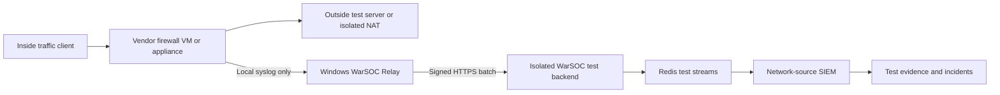

# WarSOC Firewall Validation Research and Acceptance Plan

**Status:** Research and acceptance design only
**Date:** 2026-08-02
**Runtime impact:** None
**Production decision:** Keep `NETWORK_RELAY_ENABLED=false`
**Current vendor scope:** Fortinet FortiGate, Cisco ASA, MikroTik RouterOS, and pfSense

## 1. Executive Decision

WarSOC does not need to purchase every physical firewall before validating the
network-relay architecture. It does need to distinguish four different levels
of proof:

1. **Fixture proof:** a documented vendor log sample is parsed correctly.
2. **Virtual-appliance proof:** the vendor's real firewall operating system
   generates the record and sends it through the WarSOC Relay.
3. **Physical-device proof:** one exact hardware model and firmware sends real
   traffic through the same path under approved test conditions.
4. **Customer-pilot proof:** the customer's actual device, policies, clock,
   volume, and network conditions remain stable for at least 24 hours.

Virtual appliances are valid for parser, transport, signing, queueing,
correlation, outage, and false-positive testing when they run authorized vendor
images. They do not prove hardware acceleration, physical interfaces, HA pairs,
ASIC behavior, model-specific firmware behavior, or production throughput.

The commercial support label must therefore be explicit:

| Label | Meaning |
|---|---|
| `PARSER_CANDIDATE` | Documentation and fixtures only. Not customer supported. |
| `VIRTUAL_LAB_VALIDATED` | Real vendor VM passed the WarSOC acceptance suite. Limited pilot only. |
| `PHYSICAL_MODEL_VALIDATED` | Exact hardware model and firmware passed. |
| `CUSTOMER_PILOT_APPROVED` | Exact tenant deployment passed health, volume, outage, and false-positive review. |

WarSOC must not advertise a vendor as generally supported from a parser unit
test or generic syslog replay alone.

## 2. Current WarSOC Boundary

The existing candidate already provides:

- A separate customer-side Windows `WarSOC_Relay` service.
- UDP, RFC 6587/newline TCP, and TLS listeners on explicitly configured local
  interfaces.
- Source-address and device registration contracts.
- Strict parsers for `fortinet`, `cisco_asa`, `mikrotik`, and `pfsense`.
- Per-device and global EPS/byte limits.
- Separate bounded encrypted evidence and control spools.
- Ed25519-signed deterministic HTTPS batches.
- Backend identity, sequence, chain, quota, schema, and tenant validation.
- Network-source isolation in SIEM.
- Limited VPN and endpoint/network correlations.

The candidate deliberately does not provide:

- Public-cloud UDP syslog intake.
- Packet capture or PCAP.
- General packet payload inspection.
- Linux endpoint monitoring.
- Generic unknown-vendor parsing.
- Automatic FBR invoice truth from network records.
- Device-authenticated evidence for legacy UDP syslog.

The relay signature proves which enrolled relay accepted a message. It does not
prove that a UDP firewall cryptographically authored that datagram. The correct
assurance label remains `relay_attested`.

## 3. Firewall Categories

### 3.1 Physical network appliances

Examples include FortiGate appliances, Cisco Secure Firewall/ASA appliances,
MikroTik RouterBOARD/CCR devices, and Netgate appliances. These are the final
source of truth for model-specific behavior.

### 3.2 Vendor virtual appliances

These run the vendor's real network operating system as a VM. They are the best
low-cost test source because they generate real vendor syslog formats:

- FortiGate-VM runs FortiOS.
- Cisco ASAv is Cisco's production virtual ASA image.
- MikroTik CHR is RouterOS for virtualized x86-64 environments.
- pfSense CE/Plus can run as a virtual firewall.

### 3.3 Open-source or software firewalls

pfSense is already in the candidate scope. OPNsense, VyOS, Linux nftables, and
similar products are separate vendors/formats and are not covered merely because
they are software firewalls. Each requires its own source contract and parser
acceptance before it can be added.

### 3.4 Host firewalls

Windows Defender Firewall is not a replacement for perimeter-firewall testing.
WarSOC already observes selected native Windows Filtering Platform events such
as 5156/5157. Those events describe one Windows endpoint; they do not provide the
firewall/VPN traffic view of the customer network.

### 3.5 Cloud-native firewalls

Azure Firewall, AWS Network Firewall, and similar services usually require
cloud-native export APIs, event hubs, or object-storage integration. They are a
future source family and are outside the current four-vendor syslog relay scope.

## 4. Lab Platform Decision

### 4.1 GNS3

GNS3 is the preferred multi-vendor lab option when WarSOC has legally obtained
the required images. Appliance templates configure QEMU settings but do not
grant vendor-image licenses. On Windows, QEMU appliances should run through the
GNS3 VM. A GNS3 Cloud node can also bridge a topology to a physical interface,
which is useful later when testing a real appliance.

Use GNS3 for FortiGate-VM, MikroTik CHR, pfSense, traffic hosts, and the relay
network. Do not obtain unofficial Cisco or vendor images.

### 4.2 Cisco Modeling Labs Free

CML-Free is the preferred Cisco ASA test path. Cisco currently includes ASAv in
the free reference-platform image, allows five simultaneously running nodes,
and licenses those images only inside CML. Cisco states that the ASAv image is
the same VM image licensed as a production virtual firewall, although demo mode
has throughput and connection limits.

Do not copy a CML ASAv image into GNS3 or EVE-NG unless a separate license allows
that use.

### 4.3 EVE-NG

EVE-NG can run the relevant vendor images and is useful for a larger shared lab.
It does not remove vendor licensing requirements. Nested virtualization and its
recommended memory footprint make it less suitable for the current laptop than
a small GNS3 or direct-hypervisor lab.

### 4.4 Direct hypervisor

For one firewall at a time, VMware/Hyper-V plus two lightweight traffic VMs is
simpler than a complete GNS3/EVE environment. This is acceptable if the network
segments are isolated and all test evidence is captured reproducibly.

### 4.5 Current local-machine feasibility

Observed on 2026-08-02:

- Intel Core i7-8565U, 4 physical cores and 8 logical processors.
- 15.2 GB RAM.
- Hardware virtualization/hypervisor active.
- Approximately 114 GB free on drive C.
- Only approximately 2.5 GB RAM free during the inspection.

This is sufficient for a small serial lab after stopping unrelated workloads,
but not for a comfortable all-vendor topology while Docker and desktop tools
remain heavily loaded. Run one firewall vendor at a time. Never let a lab VM
compete with a production service on this machine.

## 5. Vendor-by-Vendor Research Matrix

| Vendor | Lowest-cost real image | Transport to validate first | WarSOC parser boundary | Physical proof still required |
|---|---|---|---|---|
| Fortinet | FortiGate-VM permanent evaluation license; one free evaluation VM per FortiCloud account, limited to low-encryption operation, 1 CPU, 2 GB RAM, three interfaces/policies/routes, and no FortiGuard/support | UDP or another transport that the exact evaluation build can exercise. TCP/TLS and VPN proof are conditional on the trial license permitting the required cryptographic feature. | Default FortiGate key/value traffic fields. VPN fields can be functionally approved only when generated by a licensed mode that supports the tested VPN path. Do not silently switch to CEF/CSV without a separate parser contract. | Exact FortiGate model/firmware, VPN/crypto behavior, source-interface behavior, real EPS, reboot/HA if contracted |
| Cisco ASA | CML-Free ASAv; up to five running nodes and ASAv included, but demo forwarding is approximately 180 Kbit/s and unlicensed connections are limited to 100 | UDP first for isolation; then TCP/TLS with careful `permit-hostdown` review | Documented `%ASA-message-id` records, including 106023, 302013, selected 113xxx/716039 VPN outcomes. This is functional proof only, not capacity proof. | Exact appliance/firmware and customer logging severity; hardware/HA and performance behavior if contracted |
| MikroTik | CHR free license, limited to 1 Mbit/s upload per interface, or a 60-day paid-tier trial | BSD syslog over UDP for the current parser | Firewall flow metadata only. Reject `packet` and `raw` topics. Absence of an explicit drop/reject marker is an observation, not proof of allow. The free license is functional proof only, not capacity proof. | Exact RouterBOARD/CCR model and RouterOS version, customer-defined prefixes/topics, real EPS |
| pfSense | Official pfSense installer/ISO in a VM | Native remote syslog over UDP; TLS/TCP only through an explicitly reviewed syslog-ng setup | Documented `filterlog` CSV only. Do not accept arbitrary system, DNS, DHCP, IPsec, or OpenVPN records under this parser. | Exact Netgate/third-party hardware and pfSense version; explicitly logged pass rules and source address |

### Important transport observations

- FortiGate supports UDP and reliable TCP, with TLS options in supported
  FortiOS configurations.
- Cisco ASA supports UDP and TCP; secure logging is TLS over TCP. Cisco warns
  that unavailable TCP syslog can block new connections unless host-down
  behavior is deliberately configured. This must be tested and never applied
  blindly to a customer firewall.
- MikroTik BSD syslog remains UDP even when a remote protocol setting suggests
  TCP/TLS; RouterOS documents TCP/TLS for CEF output. The current parser should
  therefore validate BSD syslog over UDP first.
- pfSense's native remote syslog is UDP and cleartext. TCP/TLS requires an
  additional package or protected network path. WarSOC's approved design keeps
  this traffic on the customer LAN between the firewall and relay.

## 6. Required Lab Topology

Rules for this topology:

1. Do not point the relay at production during engineering tests.
2. Use an isolated test tenant and isolated Redis/Mongo databases.
3. Keep the firewall management interface host-only or on a dedicated lab
   network.
4. Use only test IPs, users, policies, and payloads.
5. Synchronize the firewall, relay, traffic hosts, and backend to a controlled
   NTP source, then deliberately test clock drift.
6. Preserve the vendor software version, image hash, license mode, configuration
   export, and WarSOC commit for every run.

## 7. Event Scenarios Required Per Vendor

Every offered vendor must generate these events from the real virtual appliance
before physical validation:

1. One permitted TCP flow.
2. One blocked TCP flow.
3. One UDP flow with a known source/destination/port.
4. IPv6 permit/block when the customer contract includes IPv6.
5. VPN authentication rejection with a visible remote IP and username when the
   vendor/VPN feature is in scope.
6. VPN authentication success and session start when in scope.
7. Firewall restart and relay disconnect/reconnect.
8. Device clock offset within and outside the accepted confidence threshold.
9. Unknown or changed log format that must fail closed.
10. A burst above the per-device EPS limit.
11. A spoofed or non-registered source address.
12. Backend or WAN outage long enough to exercise the encrypted evidence and
    control spools, exact retry, sequence continuity, and duplicate suppression.
13. Azure archive outage after backend admission, proving that the archive
    worker retains Mongo evidence and does not delete it prematurely. This is a
    separate backend/archive test; it does not validate firewall-to-relay
    transport.

For each event, compare three artifacts:

- The firewall's local event/log view.
- The exact relay-received raw syslog record and SHA-256.
- The normalized WarSOC network event and resulting incident/evidence link.

No field may be guessed. Missing action, username, remote IP, bytes, or timestamp
must remain missing or low-confidence rather than being invented.

## 8. End-to-End Acceptance Gates

### Gate A: Parser fidelity

- Correct vendor, device, event type, action, source/destination, ports,
  protocol, bytes, user, policy/session, and timestamps where supplied.
- Unknown formats fail closed and produce bounded parser-loss health records.
- No packet/raw content topics are accepted.
- No vendor record triggers Windows, web-WAF, or FBR rule families.

### Gate B: Relay security and durability

- Source allowlist and unambiguous device mapping pass.
- Per-device/global EPS and byte limits pass.
- Evidence and control spools remain bounded and encrypted.
- Accepted evidence survives outage, service restart, and exact retry.
- Tampered ciphertext, chain, sequence, signature, or identity is rejected.
- A full evidence spool cannot suppress the control-spool saturation report.

### Gate C: Backend and tenant isolation

- Relay activation is separate from endpoint activation.
- Signed batch admission is tenant, relay, device, sequence, chain, quota, and
  stream-capacity bound.
- Exact retries create no duplicate event and no duplicate quota charge.
- Cross-tenant devices, relays, evidence, incidents, and status reads are denied.
- Network evidence enters the seven-day SIEM path and approved archive path only.

### Gate D: Detection behavior

- Five distinct VPN usernames from one verified remote IP within five minutes
  produce one password-spray incident.
- Successful VPN followed by matching Windows logon remains context, not an
  automatic threat.
- A high-risk Windows event followed by a verified same-host public connection
  produces one hybrid incident with both evidence references.
- Normal browsing, approved VPN use, tax/POS traffic, software updates, and
  routine firewall noise do not create unsupported threat claims.

### Gate E: Physical/customer proof

- Exact model and firmware documented.
- Customer-approved source address, transport, logging category, severity, and
  NTP documented.
- Measured average/peak EPS and bytes/day remain within the contracted limits.
- At least 24 hours of stable relay health, spool behavior, and detection latency.
- Customer signs the supported coverage and known omissions.

## 9. Hardware Validation Without Buying Every Device

Use this order:

1. Ask each pilot/customer for vendor, model, firmware, HA mode, VPN type,
   expected EPS, and available syslog transport before promising support.
2. Complete the virtual-appliance test for that vendor and nearest firmware.
3. Perform an approved on-site or remote acceptance against the customer's own
   firewall, sending logs only to the local relay.
4. If no customer hardware is available, borrow/rent a low-end device or use a
   vendor/reseller demonstration unit.
5. Purchase a permanent lab appliance only after repeated demand justifies it.

GNS3 can bridge a lab topology to a physical Ethernet interface through a Cloud
node, but direct firewall-to-relay LAN testing is simpler for a single appliance.

## 10. Security Rules for the Lab

- Download images only from the vendor or an authorized portal.
- Verify published hashes where available and record the image version.
- Never share Cisco CML images outside CML unless separately licensed.
- Use unique lab credentials and never reuse production secrets.
- Keep management interfaces off the public Internet.
- Do not disable Windows Defender to install the relay; use signed binaries or
  documented hash allowlisting.
- Do not use real customer traffic or personal data.
- Do not enable `NETWORK_RELAY_ENABLED` in production during lab work.
- Do not send unencrypted UDP syslog over a WAN; keep it on the customer LAN or
  a protected tunnel.
- Treat raw syslog as potentially sensitive even though it is not packet payload.
  Preserve it encrypted and expose it only to authorized evidence views.

## 11. Recommended Execution Sequence

1. **pfSense virtual lab:** lowest licensing friction; prove `filterlog`, source
   allowlisting, spool/outage behavior, and normal/blocked flows.
2. **MikroTik CHR lab:** prove customer-defined prefixes, drop/observation
   semantics, topic restrictions, and functional rate-control behavior. Do not
   use the 1 Mbit/s free tier as production-capacity evidence.
3. **FortiGate-VM lab:** prove default key/value format and basic traffic/syslog
   behavior under the evaluation limits. VPN and TLS evidence is accepted only
   when the selected license mode can actually exercise the required crypto.
4. **Cisco CML-Free ASAv lab:** prove licensed ASAv syslog IDs, transport, VPN
   attribution, and Cisco-specific host-down behavior in isolation. Its demo
   throughput and connection limits make this functional, not capacity, proof.
5. **One physical pilot device:** use the first real customer's exact model
   under a customer-approved, non-disruptive test and rollback plan.
6. **Twenty-four-hour non-POS relay pilot:** review volume, drops, spool growth,
   clock confidence, latency, and false positives.
7. Only then consider tenant-specific production activation.

No new vendor parser should be added during these steps. Record unsupported
messages and demand evidence first; then propose a separately approved parser
contract if real customer demand exists.

## 12. Official Research Sources

- GNS3 appliance images and licensing:
  https://docs.gns3.com/docs/using-gns3/beginners/install-from-marketplace
- GNS3 Cloud/NAT connectivity:
  https://docs.gns3.com/docs/using-gns3/advanced/connect-gns3-internet
- GNS3 Windows and VM requirements:
  https://docs.gns3.com/docs/getting-started/installation/windows
  https://docs.gns3.com/docs-3.1-en/gns3-vm/gns3-vm-usage
- Cisco CML-Free and ASAv:
  https://developer.cisco.com/docs/modeling-labs/2-9/cml-free/
  https://developer.cisco.com/docs/modeling-labs/asav/
- Cisco ASA logging:
  https://www.cisco.com/c/en/us/td/docs/security/asa/asa917/configuration/general/asa-917-general-config/monitor-syslog.html
- FortiGate-VM evaluation and syslog configuration:
  https://docs.fortinet.com/document/fortigate/7.4.11/administration-guide/441460/permanent-trial-mode-for-fortigate-vm
  https://docs.fortinet.com/document/fortigate/6.4.3/cli-reference/444620/log-syslogd-setting
- MikroTik CHR and RouterOS logging:
  https://manual.mikrotik.com/docs/getting-started/installation-and-upgrade/install/chr-installation/
  https://manual.mikrotik.com/docs/getting-started/routeros-licensing/chr/chr-licensing/
  https://help.mikrotik.com/docs/spaces/ROS/pages/328094/Log
- pfSense installation, virtualization, and remote logging:
  https://docs.netgate.com/pfsense/en/latest/install/download-installer-image.html
  https://docs.netgate.com/pfsense/en/latest/virtualization/index.html
  https://docs.netgate.com/pfsense/en/latest/monitoring/logs/remote.html
  https://docs.netgate.com/pfsense/en/latest/monitoring/logs/raw-filter-format.html
- EVE-NG supported systems:
  https://www.eve-ng.net/index.php/supported-hardware-and-software-systems/
