# WarSOC Network Relay Backend Foundation

**Status:** Backend candidate implemented; disabled by default; not production enabled  
**Snapshot:** 2026-07-28  
**Scope:** Customer-LAN network-device metadata ingestion and PECA-oriented SIEM correlation  
**Non-scope:** Linux endpoints, PCAP, packet payload capture, public UDP syslog, and new FBR invoice truth

## 1. Decision

WarSOC must not expose an unauthenticated UDP syslog listener to the public cloud. The approved network path is:

1. A customer-owned firewall sends local syslog to a customer-side WarSOC Relay.
2. The relay validates the registered source, applies resource limits, parses only approved metadata, and durably stores accepted records in an encrypted local spool.
3. The relay signs a deterministic batch using its own Ed25519 identity.
4. The relay sends the batch to the WarSOC HTTPS API.
5. The API verifies identity, tenant, signature, source contract, schema, sequence, chain, queue capacity, and tenant quota before atomic Redis admission.
6. The SIEM stores the observation and performs only source-aware rules and correlations.

The relay signature proves which enrolled relay accepted and forwarded the record. It does not prove that a legacy UDP firewall cryptographically authored the original datagram. Such evidence is `relay_attested`, not `device_authenticated`.

## 2. Legal and Product Boundary

The current Pakistan Code version of PECA defines traffic data as communication origin, destination, route, time, size, duration, or service type. Section 32 requires a service provider, within its technical capability, to retain specified traffic data for at least one year or another notified period. Whether a particular customer is a statutory service provider is a legal determination, not something WarSOC can infer from telemetry.

Authoritative references:

- Pakistan Code, PECA 2016, definitions and Section 32: https://www.pakistancode.gov.pk/pdffiles/administrator6a061efe0ed5bd153fa8b79b8eb4cba7.pdf
- RFC 5424 syslog format: https://datatracker.ietf.org/doc/html/rfc5424
- Fortinet log field reference: https://docs.fortinet.com/document/fortigate/7.6.0/fortios-log-message-reference/357866/log-message-fields
- Cisco ASA syslog reference: https://www.cisco.com/c/en/us/td/docs/security/asa/syslog/asa-syslog.pdf
- MikroTik RouterOS logging: https://help.mikrotik.com/docs/spaces/ROS/pages/328094/Log
- pfSense remote logging: https://docs.netgate.com/pfsense/en/latest/monitoring/logs/remote.html
- pfSense raw filter format: https://docs.netgate.com/pfsense/en/latest/monitoring/logs/raw-filter-format.html
- pfSense firewall logging behavior: https://docs.netgate.com/pfsense/en/latest/monitoring/logs/settings.html

WarSOC therefore uses these claim boundaries:

- It provides PECA-oriented traffic-data collection, integrity, retention, and correlation support.
- It does not claim that the WarSOC 11-control catalog is written into PECA.
- It does not claim blanket PECA compliance for every SMB.
- It does not collect general packet content or PCAP.
- It does not interpret network metadata as FBR invoice truth.

## 3. As-Built Candidate Flow

```mermaid
flowchart LR
    FW["Registered firewall or VPN device"] -->|"Customer LAN syslog"| C["Relay collector"]
    C --> L["Source allowlist and edge limits"]
    L --> P["Vendor parser"]
    P --> E["Encrypted evidence spool"]
    L --> H["Loss and health summaries"]
    H --> CS["Independent encrypted control spool"]
    E --> O["Signed outbox"]
    CS --> O
    O -->|"Authenticated HTTPS batch"| API["Feature-gated network relay API"]
    API --> V["Ed25519, tenant, schema, source and chain checks"]
    V --> R["Atomic Redis admission"]
    R --> S["SIEM source isolation"]
    S --> SE["Seven-day SIEM evidence"]
    S --> HC["Explicit hybrid correlations"]
    SE --> A["Existing Azure archive path"]
    HC --> I["Existing incident projection"]
```

This diagram is the implemented candidate architecture. The cloud API, parsers,
encrypted spools, exact-retry outbox, Windows runtime, UDP/TCP/TLS listeners,
DPAPI-protected relay identity, NSSM installer, lifecycle recovery, and limited
correlations exist. A Windows build and real-device production proof are still
required before enabling it for tenants.

## 4. Cloud API Contract

The feature is controlled by `NETWORK_RELAY_ENABLED`, which defaults to `false`. When false, the router is not registered and the routes do not exist publicly.

Candidate routes:

| Route | Caller | Purpose |
|---|---|---|
| `POST /api/v1/network-relay/generate-activation` | Tenant admin | Create a short-lived, one-time activation bound to an approved device list. |
| `POST /api/v1/network-relay/register` | New relay | Consume the activation, register an Ed25519 public key, and receive a relay JWT. |
| `GET /api/v1/network-relay/status` | Entitled tenant user | Read tenant-scoped relay health and registered device coverage. |
| `POST /api/v1/network-relay/{relay_id}/revoke` | Tenant admin | Revoke cloud admission for a relay. |
| `POST /api/v1/network-relay/{relay_id}/authorize-key-recovery` | Tenant admin with MFA | Authorize one dead-key recovery. |
| `POST /api/v1/network-relay/recover-key` | Recovering relay | Register a new key epoch and preserve the previous chain checkpoint. |
| `POST /api/v1/network-relay/ingest` | Registered relay | Submit a signed, deterministic batch for atomic admission. |

Relay identities are stored separately in `network_relays`. They do not consume Windows endpoint seats and cannot use endpoint activation codes.

The registration contract includes:

- Relay name and host identity.
- Separate relay public key and key ID.
- Registered device ID, vendor, model, source IP/CIDR, transport, timezone, and expected EPS.
- Per-tenant relay limit.
- Relay lifecycle status and revocation state.
- Idempotent registration nonce and retry-safe activation claim.
- Audited key-epoch recovery with previous-chain continuity metadata.

## 5. Signed Batch and Admission Contract

The accepted schema is `warsoc-relay-batch-v1`.

Each batch contains:

- Relay ID.
- Chain ID and key epoch.
- Monotonic sequence.
- Previous batch hash.
- Batch creation time.
- One or more strict relay events.

Each event contains:

- Stable event UID.
- Evidence or control class.
- Registered device identity and vendor.
- Observed local source address and transport.
- Device event time when trustworthy.
- Relay receipt time.
- Raw syslog message and SHA-256 hash.
- A scalar-only normalized metadata object.

The API verifies the Ed25519 signature over the exact raw request body before schema admission. It rejects unknown fields, nested normalized objects, malformed IP/port/count values, unsupported event types, duplicate event UIDs, unregistered devices, vendor/transport mismatches, source-address mismatches, impossible future times, excessive event counts, excessive body size, wrong chain state, and wrong sequence. Historical signed batches remain valid after an outage; sequence and batch hashes provide replay protection.

The Redis Lua transaction performs these operations atomically:

1. Verify or initialize relay chain state.
2. Return an idempotent acknowledgement for an exact duplicate retry.
3. Reject an incorrect sequence, chain, or key epoch.
4. Check daily tenant byte quota.
5. Check raw-stream admission capacity.
6. Append every batch event.
7. Increment quota usage.
8. Advance the relay chain checkpoint.

An exact duplicate retry neither duplicates the stream records nor charges quota twice. A Mongo receipt failure after Redis admission returns a retryable failure; the next exact retry repairs the missing receipt without duplicating queue data.

## 6. Collector and Spool Contract

The collector primitives enforce limits before expensive parsing and signing:

- Registered source IP/CIDR only.
- Unambiguous device match only.
- Per-device token bucket, evaluated before shared limits so one noisy source
  cannot consume the allowance reserved for other registered devices.
- Global EPS limit.
- Global byte-rate limit.
- Datagram size limit.
- Strict UTF-8 input.
- Parser time budget.
- Bounded evidence and control spools.

The evidence and control spools are separate SQLite databases using WAL, full synchronization, AES-GCM authenticated encryption, record hashes, and a hash chain.

Spool behavior is fail-bounded:

- Already accepted evidence is never evicted to make room.
- At capacity, new datagrams are dropped.
- Drops are coalesced into control records with reason, interval, event count, byte count, EPS, and spool state.
- The control spool remains separate so evidence saturation cannot hide health loss.
- Records are removed only after a valid cloud acknowledgement.
- A retry resends the exact same body and signature.
- A ciphertext or chain modification fails local verification.

Implemented runtime boundary:

- The relay is a separate `WarSOC_Relay` NSSM service, never an implicit endpoint-agent mode.
- UDP, newline/RFC6587 TCP, and TLS listeners bind only an explicit interface address.
- The installer creates source-scoped Windows Firewall rules and refuses workstation or endpoint co-location unless explicitly overridden.
- The data directory is SYSTEM-only and audited with inheritable DACL/SACL rules.
- The Ed25519 private key, relay JWT, and spool key are protected with machine-scope Windows DPAPI and stored atomically.
- The service uses separate bounded evidence/control spools, a lifecycle journal, graceful listener quiescing, bounded drain, and preserved dead-key recovery directories.
- Uninstall removes the service and firewall rules but deliberately preserves evidence.

Current limitations:

- DPAPI is the pilot key boundary; a local SYSTEM compromise can still use or extract service secrets. TPM-backed Ed25519 storage is not claimed.
- The current SQLite transaction is the durable record boundary. Chain checkpoints make an uncommitted tail detectable, but a future segmented updater remains optional hardening.
- UDP source identity is allowlisted and relay-observed, not cryptographically device-authenticated.

## 7. Vendor Parsing Contract

Supported candidate vendors are intentionally limited:

### Fortinet

The parser accepts key/value event logs and extracts source/destination IP and port, protocol/service, user, bytes, policy, session, interfaces, VPN metadata, hostname, severity, and message. VPN outcomes are normalized to `successful` or `rejected` only when the vendor fields support that conclusion.

### Cisco ASA

The parser recognizes documented IDs including:

- `106023`: blocked connection.
- `302013`: built/permitted connection.
- `113004` and `113012`: successful VPN authentication.
- `113005`, `113015`, `113016`, `113017`, and `716039`: rejected VPN authentication.
- `113039`: VPN session start.

The remote `user IP` is extracted separately from the firewall source address. This is required before multi-user password-spray correlation can run.

### MikroTik

The parser extracts firewall flow metadata. Because RouterOS prefixes are customer-defined, absence of an explicit drop/reject marker is recorded as `network_observation`, not as an allowed connection. `packet` and `raw` logging topics are rejected because they can contain content outside the approved metadata scope.

### pfSense

The parser accepts only documented `filterlog` CSV records and extracts rule,
tracker, interface, action, direction, IP version, protocol, addresses, ports,
lengths, TCP flags, and ICMP type. OpenVPN, IPsec, DHCP, DNS, and arbitrary
pfSense system messages are rejected until separate strict contracts exist.
pfSense must explicitly log any pass rules the tenant wants observed; default
filter logging alone must not be represented as complete permitted-flow coverage.

Unknown vendors are rejected from tenant device registration. A generic parser exists only for relay-generated health/control records and cannot be registered as an evidence device.

## 8. SIEM Isolation and Correlation

Relay records enter the network telemetry family only when all of these are true:

- `source_type=network_device`.
- `source_assurance=relay_attested`.
- The relay signature was verified.
- The structured event type is approved.

`NET-*` records do not run legacy raw-message keyword dictionaries. This prevents Windows, web, and vendor messages from triggering the wrong rule family.

Implemented candidate correlations:

### VPN password spray

- Source: rejected VPN authentication from a verified relay.
- Required attribution: vendor-reported remote client IP and a non-hidden username.
- Threshold: five distinct usernames from one remote IP within five minutes.
- State: Redis sorted set with expired members removed before counting.
- Outcome: one stable SIEM alert identity per source/window; no automatic blocking.

### VPN to Windows logon

- Source: successful VPN authentication followed by Windows Event 4624.
- Match: same tenant, normalized username, remote IP, and Windows logon type 3 or 10 within ten minutes.
- Outcome: context is attached to the Windows evidence record.
- It does not create a threat alert because this sequence is often normal remote access.

### High-risk host event to public network

- Host inputs: 1100, 1102, 4697, 4732, or 7045.
- Network input: a verified permitted connection from the exact same endpoint IP to a public destination within five minutes.
- Outcome: a high/critical hybrid SIEM alert with endpoint and network evidence references.
- It does not automatically block the address.

Not implemented:

- DNS tunneling.
- DHCP/NAT identity reconstruction.
- Beaconing based on ordered flow intervals.
- A tenant-specific destination baseline.
- POS-modification-to-network alerting. Normal POS updates and tax API traffic would make that unsafe without a reviewed baseline.
- Device-authenticated attribution for legacy UDP.

## 9. FBR and PECA Boundaries

The relay does not alter the existing FBR truth sources:

- Invoice evidence still requires strict `pos_audit.log` JSONL or authenticated POS API events.
- Database-file tamper evidence still requires configured POS/database paths and native Windows auditing.
- Network metadata may later enrich an investigation but cannot invent an invoice ID, actor, modification, or deletion.

The PECA worker continues to vault the existing 11 native Windows catalog controls. Relay observations and hybrid alerts currently remain SIEM evidence; they are not silently inserted into `peca_forensic_logs` or counted as a twelfth statutory control.

This avoids two false claims: that every firewall message is court-authenticated, and that PECA itself defines WarSOC's 11-control catalog.

## 10. Failure and Security Behavior

| Failure | Required behavior |
|---|---|
| Unknown or ambiguous LAN source | Drop before parsing; record a coalesced loss summary. |
| Per-device or global rate exceeded | Drop new datagrams; preserve accepted evidence. |
| Evidence spool full | Drop new datagrams; preserve FIFO; write control state separately. |
| Internet unavailable | Keep bounded local records and retry without changing the signed body. |
| Invalid relay JWT or revoked relay | Reject before admission. |
| Invalid signature or wrong relay identity | Reject; never mark verified. |
| Unknown field, vendor, source, or event type | Reject; never guess. |
| Wrong sequence or chain | Return conflict; retain local batch for operator recovery. |
| Redis unavailable or stream full | Reject with retryable failure; relay retains local data. |
| Daily quota exceeded | Return 429; relay retains local data and reports pressure. |
| Mongo receipt unavailable after Redis admission | Return retryable failure; duplicate retry repairs the receipt. |
| Parser cannot represent a record | Quarantine/drop locally and report a signed parser-failure control record. |
| Local ciphertext or chain changes | Fail verification and report degraded/tamper state when connectivity permits. |

## 11. Verification Performed

Selected backend validation through 2026-07-29:

- 32 focused relay parser, schema, signing, spool, outbox, outage, lifecycle,
  registration, status, revocation, recovery, source-isolation, feature-gate,
  and hybrid-correlation tests passed.
- 122 selected security, ingestion, worker, SIEM, FBR, PECA, stream-retention, archive, and relay tests passed together in the writable Docker test harness.
- The complete backend suite then passed with 346 passed, 3 skipped, and 0 failed in the writable Docker test harness. The skips were the explicitly opt-in `E2E=1` grand-master test and two Git tracking checks when Git was unavailable inside the runtime image.
- `git diff --check` is clean except informational Windows line-ending warnings.

The suite verifies parser conservatism, packet/raw rejection, schema rejection, signing compatibility, encrypted spool bounds, FIFO retention, tamper detection, exact outbox retries, control priority, atomic Redis admission, duplicate suppression, quota rejection, VPN spraying, non-alert VPN context, same-host hybrid correlation, source-family isolation, worker behavior, FBR, PECA, retention, and archive contracts.

It does not replace real-device acceptance.

The Windows relay candidate was built locally as a 29,263,064-byte executable with SHA-256 `04602CBBCEEA8EF2BE18D5FD1C9DC2F89DADD0B9B8BA140C9B4444264BE055E3`. Microsoft Defender real-time protection was enabled and a custom scan produced no matching detection. The executable is unsigned, and only CLI/package startup was exercised; the packaged binary was not installed as a Windows service or connected to a physical firewall.

## 12. Production Gate

Do not set `NETWORK_RELAY_ENABLED=true` yet.

The gate remains closed until all of these pass:

1. Reproduce the Windows relay build in the pinned/release environment, code-sign or formally hash-allowlist it, and repeat malware scanning on the exact release artifact. The local unsigned candidate build is evidence, not release certification.
2. On a disposable Windows Server, prove NSSM restart, DPAPI identity reload, source-scoped firewall rules, DACL/SACL behavior, graceful stop, crash recovery, and uninstall evidence preservation.
3. Replay approved vendor fixtures and then obtain real-device proof for every vendor offered to a tenant: Fortinet, Cisco ASA, MikroTik, and pfSense.
4. Prove outage, saturation, spoof flood, disk reserve, parser pressure, cloud quota, revocation, and dead-key recovery under the tenant's measured EPS.
5. Run one non-POS pilot relay for at least 24 hours and review drops, spool growth, detection latency, and false positives.
6. Decide and configure the legally reviewed Azure retention class for PECA-oriented traffic metadata. Until then it remains SIEM evidence and must not be marketed as a one-year PECA traffic vault.

Current Windows endpoint, SIEM, FBR, and PECA production paths do not depend on this feature and remain unchanged while it is disabled.

## 13. Frontend Plan - No Frontend Code Changed

The frontend should remain hidden behind the same feature flag until the backend production gate passes.

Recommended components:

1. `NetworkRelayPage`
   - Admin-only route.
   - Shows enrolled relays, state, last receipt, version, source assurance, and device count.

2. `RelayActivationWizard`
   - Collects relay name and registered device contracts.
   - Generates the one-time activation only after a confirmation summary.

3. `NetworkDeviceForm`
   - Vendor selector limited to Fortinet, Cisco ASA, MikroTik, and pfSense.
   - Inputs for device ID, model, source IP/CIDR, transport, timezone, and expected EPS.
   - No generic vendor or payload-capture option.

4. `RelayHealthPanel`
   - Displays Active, Degraded, Saturated, Offline, Revoked, or Not Configured.
   - Shows evidence spool, control spool, drops, parser failures, clock confidence, and last cloud acknowledgement.

5. `NetworkCoverageBadge`
   - Separates endpoint coverage from relay/network coverage.
   - Never shows PECA network coverage as active when the relay is missing or unhealthy.

6. `NetworkEvidenceTable`
   - Displays metadata only: device, source/destination, port, protocol, action, user when supplied, timestamps, and assurance.
   - Raw vendor message is restricted to authorized detail views.

7. `HybridIncidentDetail`
   - Shows endpoint event reference, network event reference, match keys, clock confidence, outcome, and why WarSOC correlated them.
   - Uses `relay_attested` wording instead of `device authenticated` for UDP.

8. API client additions
   - Activation generation, relay list/status, revoke, device contract read, health, and evidence/incident detail.
   - Existing authenticated API wrapper, CSRF behavior, and generic user-safe error formatter must be reused.

9. RBAC and states
   - Admin configures/revokes.
   - Manager and analyst view health/evidence according to existing permissions.
   - Auditor receives read-only evidence and custody views.
   - Empty, loading, degraded, stale, quota, and unavailable states must be explicit.

10. Acceptance
   - Desktop/mobile layout, modal close/escape, keyboard focus, no raw backend exceptions, tenant isolation, role denial, stale health, source assurance, and incident evidence links.

No frontend work should begin until the backend service/runtime contract is frozen and the feature remains disabled in production.
