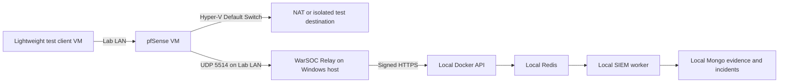

# WarSOC pfSense Network Relay Lab Runbook

**Status:** `VIRTUAL_LAB_VALIDATED` for pfSense CE 2.8.1; production disabled
**Last verified:** 2026-08-02
**Production impact:** None
**Required production state:** `NETWORK_RELAY_ENABLED=false`
**Purpose:** Obtain the first real-firewall-OS proof for the disabled network relay

## 1. Acceptance Boundary

This lab can approve pfSense as `VIRTUAL_LAB_VALIDATED` for one recorded pfSense
version and the WarSOC `filterlog` contract. It cannot approve a physical
Netgate model, all pfSense versions, production capacity, VPN records, or any
other firewall vendor.

The proof must use:

- An official pfSense installer image with its SHA-256 recorded.
- An isolated local WarSOC backend and test tenant.
- A separately installed `WarSOC_Relay` test service or foreground process.
- No production activation code, tenant, Redis, MongoDB, or Azure container.
- Metadata-only firewall records. No PCAP or packet payload collection.

## 2. Verified Host Preflight

Observed on 2026-08-02:

- Windows 10 Pro 64-bit.
- Hyper-V hypervisor and VM management service are active.
- No VMware, VirtualBox, GNS3, or QEMU command-line installation was found.
- WSL2 is active but `/dev/kvm` is unavailable, so WSL software emulation is
  not the recommended firewall path.
- The machine has enough resources for one pfSense VM and one lightweight test
  client only after unnecessary workloads are closed.
- The internal Hyper-V switch `WarSOC-Lab-LAN` has been created and the
  host-side adapter is fixed at `192.0.2.10/24`. No default route, NAT rule, or
  production firewall rule was added.
- The Alpine `3.24.1` virtual ISO was downloaded from the official Alpine
  distribution service and verified as SHA-256
  `E73A6241BD5F3C5C2D4D38C02CC52C378C0415A7C888BD292066BF36E0F41A39`.
- The official Netgate Installer `v1.2-RELEASE` AMD64 ISO image was downloaded
  through Netgate Store order `SO26-850763`. The compressed file was verified
  against Netgate's independent checksum list as SHA-256
  `184514FE7DF0D339362C1E33FA051C464577A450528759B343ADE894C7C57955`
  before decompression. The decompressed ISO SHA-256 is
  `F55DC289EEDA16C9698DB092C93B3F26A36FDACAADC4FAB67876530BD3AEAE96`.
- `WarSOC-Lab-pfSense` is a powered-off-by-default Generation 2 VM with two
  vCPUs, 2 GiB startup memory, a 16 GiB VHDX, Secure Boot disabled, WAN on the
  Hyper-V Default Switch, and LAN on `WarSOC-Lab-LAN`.
- `WarSOC-Lab-Client` is a powered-off-by-default Generation 2 VM with two
  vCPUs, 512 MiB startup memory, a 4 GiB VHDX, and only the isolated lab LAN.

Use direct Hyper-V for this first proof. GNS3 is unnecessary for a single
pfSense test and can be introduced later for multi-vendor topology management.

## 3. Isolated Topology



Lab addressing:

| Component | Address |
|---|---|
| pfSense LAN | `192.0.2.1/24` |
| Windows host relay interface | `192.0.2.10/24` |
| Test client | DHCP or static `192.0.2.100/24` |
| Syslog target | `192.0.2.10:5514/udp` |

`192.0.2.0/24` is documentation space and must remain isolated from customer
networks. If the host already routes this range, choose another dedicated lab
subnet and update every artifact consistently.

## 4. Sensitive Host Changes

The following actions require explicit approval and an elevated PowerShell
session because they alter local virtualization and networking:

1. Create an internal Hyper-V switch named `WarSOC-Lab-LAN`.
2. Assign the host-side adapter the selected lab address.
3. Create the pfSense and test-client VMs.
4. Attach pfSense WAN to the Hyper-V Default Switch and LAN to the isolated
   switch.
5. Create a source-scoped inbound UDP rule permitting only the pfSense LAN
   address to reach relay port 5514.
6. Install/start the test relay service.

Before execution, record existing Hyper-V switches, host routes, firewall
rules, and adapter addresses. Rollback removes only resources prefixed with
`WarSOC-Lab-` and the `WarSOC_Relay` test service. It must not modify Docker,
WSL, the endpoint agent, or unrelated network adapters.

## 5. Local Backend Contract

The production feature remains disabled. For the isolated Docker test stack:

1. Use development-only secrets and databases.
2. Set `NETWORK_RELAY_ENABLED=true` only in the local test process.
3. Provision a dedicated test tenant.
4. Register one device contract:
   - vendor: `pfsense`
   - source: `192.0.2.1/32`
   - transport: `udp`
   - expected EPS: initially `100`
5. Generate a relay-specific activation. Endpoint activation codes are invalid
   for a relay.
6. Confirm the relay router is absent when the local flag is restored to false.

The relay runtime configuration should be derived from
`deploy/network-relay-config.example.json`. Do not commit an activation code,
JWT, private key, DPAPI file, spool database, or captured customer record.

## 6. pfSense Logging Contract

Configure pfSense to send **Firewall Events** to the relay target. Do not select
`Everything`; the current WarSOC parser accepts only documented `filterlog` CSV
records. System, DNS, DHCP, IPsec, OpenVPN, and authentication records require
separate future parser contracts.

Native pfSense remote syslog is cleartext UDP. In this lab it is permitted only
on the isolated local switch. In a customer environment it must remain on the
customer LAN, VPN, or another reviewed protected path.

Enable logging explicitly on the pass and block rules used by the test. Default
pfSense logging does not prove complete permitted-flow visibility.

## 7. Required Scenarios

Run each scenario once, then repeat selected cases to prove grouping and retry:

1. Logged permitted TCP connection.
2. Logged blocked TCP connection.
3. Logged UDP connection.
4. IPv6 permit and block if IPv6 is offered.
5. Firewall restart.
6. Relay service restart.
7. Local backend outage followed by recovery.
8. Exact signed-batch retry after an ambiguous acknowledgement.
9. Unknown non-`filterlog` pfSense record.
10. Truncated/malformed `filterlog` record.
11. Datagram from an unregistered source address.
12. Burst above the configured per-device rate.
13. Evidence-spool pressure and separate control-spool reporting.
14. Deliberate device-clock offset.

Azure archival failure is tested separately after backend admission. It is not
part of firewall-to-relay transport proof.

## 8. Evidence Bundle

Create one run directory outside Git containing:

- `run-manifest.json`: date, operator, WarSOC commit, parser version, pfSense
  version, image SHA-256, VM settings, source IP, transport, and limits.
- `pfsense-config.xml`: sanitized configuration export with secrets removed.
- `firewall-local-events.jsonl`: event IDs/times and screenshots or exports from
  pfSense; no packet content.
- `relay-receipts.jsonl`: receipt time, raw-message SHA-256, device mapping,
  parse outcome, spool sequence, batch sequence, and acknowledgement.
- `backend-events.jsonl`: tenant-scoped normalized evidence IDs and incident
  references.
- `health.jsonl`: relay status, drops, parser failures, spool use, clock
  confidence, and last acknowledgement.
- `result.json`: one PASS/FAIL entry for every scenario and acceptance gate.

Raw syslog may contain sensitive metadata. Store the bundle encrypted and never
publish it or commit it to Git.

## 9. Pass Criteria

The pfSense candidate passes only when:

- Every local firewall event maps to exactly one accepted WarSOC evidence
  record, except an intentionally coalesced health/loss record.
- Source/destination addresses, ports, protocol, action, interface, direction,
  rule/tracker, device time, and relay receipt time match the source record.
- Unknown and malformed records fail closed without guessed fields.
- No pfSense record runs Windows, web-WAF, FBR, or PECA-native rule families.
- Exact retry creates no duplicate evidence and no duplicate quota charge.
- Accepted records survive backend outage and relay restart within spool limits.
- Unregistered sources and tampered signed batches are rejected.
- Drops and saturation are visible through the independent control spool.
- Tenant isolation is proven for evidence, status, incidents, and metrics.
- Normal allowed/blocked traffic creates no unsupported threat narrative.

Performance is not approved from this laptop lab. Production EPS and bytes/day
must be measured against the exact customer model and HostKey/Azure deployment.

## 10. Final State

After a successful run, record:

```text
Vendor: pfSense
Firewall version: <exact version>
Transport: UDP syslog on protected customer LAN
WarSOC commit/parser version: <exact values>
Assurance: relay_attested
Status: VIRTUAL_LAB_VALIDATED
Known omissions: system, DNS, DHCP, VPN and authentication log families
Performance status: NOT VALIDATED
```

Do not enable the production feature from this result. The next gate is the
MikroTik CHR virtual lab, followed by exact physical/customer-device acceptance.
