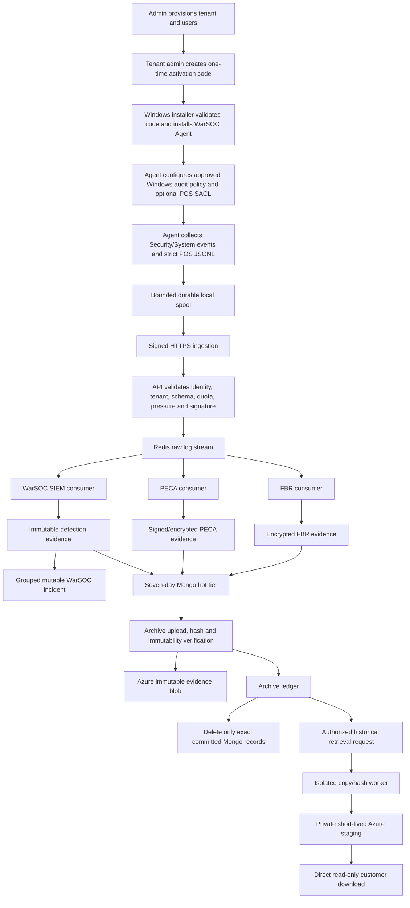
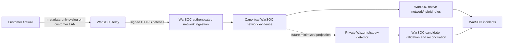
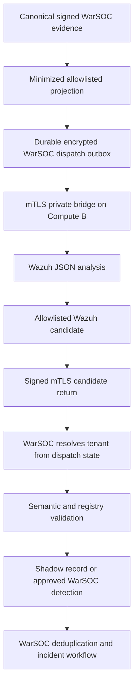

# WarSOC Current Implementation and Future Scope Register

**Document role:** Consolidated source-of-truth index
**Snapshot date:** 2026-09-10
**Windows Server engineering delta:** 2026-09-03
**Evidence governance delta:** 2026-09-06
**Retention, detector, and Security Stories production delta:** 2026-09-08
**Historical retrieval and firewall/Wazuh acceptance delta:** 2026-09-10
**Audience:** WarSOC engineering, operations, security review, and product leadership
**Applies to:** The backend and frontend release state, the published Windows agent boundary, the entitled network relay, and the controlled Wazuh shadow boundary

This register answers two questions:

1. What exists and is usable in WarSOC now?
2. What remains a candidate, deployment gate, or future capability?

It does not convert local code or a passing test into a production claim. Detailed
implementation contracts remain in the documents listed in Section 16.

## 1. Status Vocabulary

| Status | Meaning |
|---|---|
| `ACTIVE` | Part of the current customer data path when the corresponding entitlement is enabled. |
| `PRODUCTION-ACCEPTED` | The exact deployed revision and a named production workflow acceptance artifact have passed for the stated scope. |
| `SOURCE-PROVEN` | Implemented and covered by maintained local tests, but the exact current release has not been accepted in production. |
| `HISTORICALLY-PROVEN` | Previously exercised in production or on a real endpoint; a later source change still needs release-parity proof. |
| `IMPLEMENTED-DISABLED` | Code, configuration, and tests exist, but a feature flag/profile keeps the capability outside the customer product. |
| `LAB-PROVEN` | Demonstrated in a controlled lab, not on accepted customer hardware or a production topology. |
| `OPEN-GATE` | Required operational, security, infrastructure, or customer acceptance has not been completed. |
| `FUTURE` | Approved direction only; it must not be advertised as current capability. |
| `OUT-OF-SCOPE` | Deliberately excluded from the current product. |

## 2. Repository and Release Truth

At this snapshot:

- The deployed core backend revision is `7e9f00d` from authoritative branch
  `backend`; later documentation-only commits do not change that runtime identity.
- The authoritative frontend branch is `main` at deployed commit `e7c5aa0`.
- OCI runs the exact core backend release from `/opt/warsoc/releases/7e9f00d`.
  The API, unified worker, compliance cron, archiver, evidence-export worker,
  evidence-hold worker, and archive-retrieval worker are running. The existing
  Wazuh dispatcher/candidate/manager bridge remained online across this scoped
  release and retain their separately accepted detector image identity.
- The deployed frontend bundle contains Evidence Cases, Legal Holds, Firewall
  Relays, and the evidence-export workflow and points to the production API.
- Production preflight `83aa506f9e` passed DNS, TLS, frontend assets and API
  binding, backend dependency health, CORS, security headers, blocked public
  docs/private ports, and the exact public Azure installer hash.
- The pfSense relay backend is enabled behind fail-closed tenant entitlement.
  A customer-style relay is active through heartbeat, but its first physical
  `filterlog` event remains open. Wazuh v2 remains an internal controlled
  shadow; WarSOC stays authoritative.

Release identity is recorded for this deployment. Docker image digests,
sanitized configuration fingerprint, database/index migration state, and
authenticated post-deploy customer-flow evidence remain release artifacts to
capture for a formal paid-customer freeze.

### 2.1 Windows agent release state

| Item | State |
|---|---|
| Published/accepted agent | `4.2.8-Native-Signed`; public Azure artifact and local manifest match exactly. |
| Historical exact-machine proof | `4.2.6-Native-Signed` completed enrollment, signed ingestion, SIEM, PECA, and FBR validation on the test endpoint. |
| Working source agent | `4.2.8-Native-Signed`. |
| 4.2.8 additions | Bounded XML parsing with DTD/entity rejection, bounded historical replay, and a build gate for required Windows/DPAPI dependencies. |
| 4.2.8 release state | Published and preflight-proven: 17,797,079 bytes, SHA-256 `04D594A771B0E7F047D4CFDFF5359AC83B8934E5C592D2843ADD59D276E72F67`. Exact clean-machine workflow acceptance remains inherited from 4.2.6 until repeated on 4.2.8. |
| Installer trust | Hash allowlisting supports controlled pilots while Defender remains enabled. The installer is not publisher code-signed. |

## 3. Current Product Boundary

WarSOC is currently a Windows-first, multi-tenant security monitoring and evidence
platform for SMB environments. Its active scope is:

- native Windows Security and System telemetry without Sysmon;
- signed agent enrollment and authenticated HTTPS ingestion;
- WarSOC-native SIEM rules and Redis-backed correlations;
- mutable incident workflow derived from immutable detection evidence;
- PECA-oriented evidence for the WarSOC 11-control Windows profile;
- FBR invoice evidence from a strict POS integration contract;
- FBR protected-path file-tamper evidence when POS/database paths are configured;
- seven-day operational hot storage and immutable Azure archival;
- explicit asynchronous historical retrieval with direct Azure downloads;
- entitlement-gated pfSense relay ingestion and governed Wazuh v2 shadow
  observation, neither of which changes WarSOC evidence authority;
- tenant isolation, RBAC, reports, team access, agent activation, quotas, health,
  and operational metrics.

WarSOC is not currently a packet-capture platform, full EDR, antivirus, vulnerability
scanner, Linux SIEM, general database activity monitor, or blanket compliance
certification product.

## 4. Current End-to-End Flow

## 5. Component Status Matrix

### 5.1 Commercial provisioning and tenant control

| Component | Current state | Boundary / limitation | Next gate |
|---|---|---|---|
| Manual sales and quote flow | `ACTIVE` | Contracts and payment remain manual. No payment gateway is required. | Keep commercial terms and technical retention entitlements synchronized. |
| Admin tenant provisioning | `ACTIVE` | Super-admin operation creates a separate tenant, admin, entitlements, quota, retention, and seat limit. | Final deployed admin workflow acceptance. |
| Multi-tenancy | `SOURCE-PROVEN` and historically exercised | Tenant identity must come from authenticated server state, never from a client-supplied tenant ID. | Cross-tenant deployment test against the frozen release. |
| Agent seats | `ACTIVE` | Maximum 50 per tenant and default 50 aggregate active agents on the current shared host. Contract seats do not override platform capacity. | Re-measure before raising either limit. |
| Daily ingestion | `ACTIVE` | Default 50 MiB/day per agent, bounded tenant/platform floors and maximum, with a 3 GiB/day platform ceiling. | Two-tenant fairness and exact-host load proof. |

### 5.2 Identity, team access, and RBAC

| Component | Current state | Boundary / limitation | Next gate |
|---|---|---|---|
| Login/session/JWT | `ACTIVE` | Passwords must meet policy; backend authorization remains authoritative. | Frozen-release browser and API acceptance. |
| Team invitations | `SOURCE-PROVEN` | One-time token sets the invited user's password. The admin receives a manual link even if SMTP is unavailable. | Deployed invite, activation, replay rejection, and role-view test. |
| Roles | `SOURCE-PROVEN` | Admin, manager, analyst, and auditor have distinct API permissions. Frontend visibility is not an authorization control. | Full role matrix with direct API and cross-tenant attempts. |
| Support access | `FUTURE` | JIT tenant-approved support and break-glass metadata-only access are architecture proposals, not current features. | Separate approved design and threat model. |

### 5.3 Agent installation, collection, and delivery

| Component | Current state | Boundary / limitation | Next gate |
|---|---|---|---|
| CDN installer delivery | `ACTIVE` | API redirects the browser to the configured Azure artifact URL. Backend must not proxy installer bytes. | Confirm the deployed URL and manifest hash for every release. |
| Activation/enrollment | `ACTIVE` | One-time activation code binds an Ed25519 public key to the server-created tenant/agent identity. Random strings must not enroll. | Exact-release invalid/replay/dead-code proof. |
| Windows service | `ACTIVE` | Agent runs independently of the dashboard as an automatic Windows service. Closing the browser does not stop collection. | Service restart/upgrade and clean-machine proof for 4.2.8. |
| Native collection | `ACTIVE` | Security and System channels only, plus health. No Sysmon and no plaintext password collection. | Match every advertised rule to an enabled audit category and accepted event volume. |
| Local spool | `SOURCE-PROVEN` | 500 MiB hard ceiling, lower resume boundary, retry-preserving files, quarantine, disk checks, and watermark safety. | Controlled outage, saturation, restart, and recovery test on the release binary. |
| Event signing | `SOURCE-PROVEN`; 4.2.6 historically proven | Ed25519 signature is verified before Redis admission. Production candidate defaults to `required`; development may use `observe`. | Verify zero legitimate unsigned traffic from approved agents, then deploy `required` with rollback. |
| Endpoint health | `ACTIVE` | Health depends on recent signed heartbeats, channel/audit status, spool state, and agent state. | Define exact customer-facing degraded reasons for the deployed UI. |

### 5.4 Ingestion and transport

| Component | Current state | Boundary / limitation | Next gate |
|---|---|---|---|
| API validation | `ACTIVE` | Auth, tenant binding, schemas, body limits, quotas, pressure, and signature checks precede queue admission. | Production malformed/oversized/replay acceptance. |
| Redis Streams | `ACTIVE` | SIEM, PECA, and FBR use independent consumer groups and acknowledge after durable action or safe quarantine. | Failure injection on the frozen release. |
| Backpressure | `SOURCE-PROVEN` | API rejects under pressure so agents retain data in bounded local spools. | Measure exact host thresholds and multi-tenant fairness. |
| Dead-letter handling | `SOURCE-PROVEN` | Poison or failed records are retained for controlled analysis rather than silently discarded. | Operational alerting and replay procedure. |

### 5.5 WarSOC-native SIEM

| Component | Current state | Boundary / limitation | Next gate |
|---|---|---|---|
| Source isolation | `SOURCE-PROVEN` | Windows, web, and network families route only to compatible rules. Windows telemetry cannot trigger Web-WAF rules. | Re-run with final release and production-shaped corpus. |
| Stateless rules | `ACTIVE` | Direct native event and precise command/process detections exist. Enabled coverage requires the needed event and fields. | Rule-by-rule benign/malicious acceptance matrix. |
| Stateful rules | `ACTIVE` | Redis-backed windows, thresholds, order, cooldowns, and distinct-subject logic exist. | Duplicate, reorder, concurrency, and Redis-failure proof per rule family. |
| Detection provenance | `SOURCE-PROVEN` | Internal rule ID, version, module, telemetry family, and bounded evidence references are stored. | Production deploy and query verification. |
| Incident projection | `SOURCE-PROVEN` | Repeated equivalent detections group into one mutable incident with occurrence count while evidence remains event-granular. | Concurrency and refresh persistence on the final UI/API pair. |
| Detection claim boundary | `ACTIVE` policy | WarSOC reports observed evidence and correlations, not guaranteed compromise attribution or complete ATT&CK coverage. | Keep every customer claim linked to a proved telemetry contract. |

Current attack/suspicious-behavior families include credential attacks, account
and privilege abuse, suspicious process/PowerShell behavior, defense evasion,
service persistence, destructive file activity, selected blocked-network behavior,
and ordered multi-event correlations. Rules that require trusted geolocation,
complete byte counts, long-lived flow telemetry, DNS telemetry, or tenant baselines
remain disabled when those inputs do not exist.

### 5.6 PECA evidence

| Component | Current state | Boundary / limitation | Next gate |
|---|---|---|---|
| 11-control catalog | `ACTIVE` | A WarSOC evidence-readiness profile derived from native Windows telemetry; not blanket legal certification. | Final 11-row field/signature/archive acceptance matrix. |
| Evidence sealing | `ACTIVE` | Canonical JSON, RSA-PSS signature, encryption of sensitive evidence, tenant/agent identity, and source event identity. | Confirm key custody, verification, and archive linkage on the frozen release. |
| Alerting | `ACTIVE` policy | Normal controls can remain evidence/context. Inherently dangerous events may create SIEM incidents. | Avoid converting every compliance event into a threat. |
| Network scope | `FUTURE` | Current active PECA evidence is endpoint-focused. Firewall metadata support is disabled. | Relay and real-device gates in Section 7. |

### 5.7 FBR evidence

| Component | Current state | Boundary / limitation | Next gate |
|---|---|---|---|
| Invoice truth | `ACTIVE` when integrated | Only strict `FBR-INV-MOD` and `FBR-INV-DEL` JSONL/API records provide invoice-level semantics. | Customer-specific POS contract and real POS-like acceptance. |
| Protected-path FIM | `ACTIVE` when paths configured | Uses approved SACLs and Events 4663/4660/4670 for deletion/change-permission evidence. It is not invoice truth. | Validate each actual POS/database path and service-account permissions. |
| Correlation | `SOURCE-PROVEN` | Redis correlation can create native FIM evidence such as confirmed database deletion/tamper. Ordinary writes must not alert. | Real customer workload tuning and retry/reorder proof. |
| Confidentiality | `ACTIVE` | Sensitive FBR fields are application-encrypted. | Key rotation and authorized recovery procedure. |

No POS directory means no protected-path FIM. No strict POS application event means
no invoice-level evidence. WarSOC does not automatically understand proprietary
POS schemas or safely read arbitrary production databases.

### 5.8 Incidents, response, reports, and dashboard

| Component | Current state | Boundary / limitation | Next gate |
|---|---|---|---|
| Incident workflow | `ACTIVE` | Assignment, acknowledgement, notes, closure, occurrence grouping, and evidence references. | Final role/concurrency/browser acceptance. |
| IP/CIDR mitigation | `ACTIVE` with guards | Uses active agents and self-lockout protections. It is not a general EDR response system. | Controlled production rollback proof. |
| Dashboard | `ACTIVE`; current bundle verified | Separates telemetry, detection evidence, and incidents. Frontend `6f0cc5a` is present in the deployed Vercel bundle and uses the production API binding. | Complete current authenticated WebSocket/HTTP reconciliation and role-view acceptance. |
| CSV/PDF | `ACTIVE` for bounded hot data | PDF is a human-readable report, not the cryptographic evidence object. Historical bytes use retrieval. | Final layout/data completeness and role acceptance. |
| Email | `OPTIONAL` | Security-alert email is intentionally disabled. Sales/contact/invitation email may use SMTP, with manual invitation-link fallback. | Monitor SMTP quota only for retained email uses. |

### 5.9 Hot storage, archival, and retrieval

| Component | Current state | Boundary / limitation | Next gate |
|---|---|---|---|
| Mongo hot tier | `ACTIVE` | SIEM/raw/upload/analysis/PECA/FBR operational window is seven days with tenant/time indexes and bounded reads. | Exact-host query/working-set soak. |
| Azure archiver | `ACTIVE / PRODUCTION-PROVEN` | Upload, streamed SHA-256 readback, immutability/version verification, ledger commit, Legal Hold recheck, then exact-ID Mongo deletion. Failure preserves Mongo data. | Monitor daily runs and alert on failures or unexpected Mongo growth. |
| Physical retention split | `ACTIVE / PRODUCTION-PROVEN FOR 90/180/270/365 DAYS` | Private account `warsocevidence90prod` has separate SIEM/general Cold containers with versioning and locked exact-duration version-WORM policies for 3, 6, 9 and 12 month entitlements. The 90-day acceptance remains valid; runtime canary `retention_canary_20260907T191203Z_dca3a697` additionally proved all six 180/270/365 routes, streamed SHA readback, ledger-before-delete and exact hot deletion. | Keep exact routing fail-closed. Do not sell unsupported durations, and do not move legacy locked blobs. |
| Historical retrieval | `ACTIVE / BACKEND PRODUCTION-PROVEN / RAW FRONTEND LIVE` | OCI release `7e9f00d` runs the isolated worker. Production canary `ARCHIVE-RETRIEVAL-CANARY-20260910T133007Z-413b5717` proved tenant/allowance authorization, server-side copy, streamed SHA verification, direct read-only SAS download, and complete mutable cleanup while leaving the WORM source untouched. Frontend commit `caa10bc` exposes the existing request/status/download view to permitted production roles. Current mode is an explicit service-SAS fallback because the university tenant denied the preferred service-principal path. | Frontend designer polish and authenticated role-by-role browser acceptance remain. Replace the fallback with user-delegation SAS only when a production Entra identity permits it. |
| Backup/restore | `SOURCE-PROVEN` drill | Mongo backup is separate from evidence archive. Final replacement-host recovery remains unproved. | Final-host encrypted backup and blank-host RPO/RTO drill. |

#### 5.9.1 Evidence cases, custody, holds, and packages

| Component | Current state | Boundary / limitation | Next gate |
|---|---|---|---|
| Evidence cases | `PRODUCTION-ACCEPTED` | Admin/auditor can create a tenant-scoped case and attach exact hot evidence by event UID or document ID. Archived evidence is never silently substituted. | Preserve run `EVIDENCE-ACCEPTANCE-20260906T043509Z-c9b91a9d` with the release record. |
| Custody and closure | `PRODUCTION-ACCEPTED` | Hash-linked, recovery-safe VIEW/VERIFY/TRANSFER/EXPORT transitions are verified before closure. Empty cases or broken chains cannot close; only admin can close. | Human browser click-through remains UX evidence, not a backend gate. |
| Legal holds | `PRODUCTION-ACCEPTED` | Admin-only tenant/collection/event holds block hot deletion. Event targets must exist. The dedicated worker reconciles Azure JSON/SHA holds; release remains fail-closed until reconciliation and audit commit. | Continue monitoring worker restarts and failed reconciliations. |
| Evidence packages | `PRODUCTION-ACCEPTED` | The deployed isolated worker produced a private Azure package, SHA readback, scoped read-only SAS download, and offline RSA-PSS verification. Cold items still return `REQUIRES_ARCHIVE_RETRIEVAL` rather than being silently attached. | Use the separately active historical-retrieval workflow before adding cold evidence to a package; automatic case attachment remains out of scope. |

Direct deletion through `scripts/vault_pruner.py --confirm` is disabled. Retained
evidence must leave Mongo only through the archive-before-delete transaction.

### 5.10 Security Stories V1

| Component | Current state | Boundary / limitation | Next gate |
|---|---|---|---|
| Correlation projection | `PRODUCTION-ACCEPTED` | Five bounded server/hybrid stories reference canonical evidence and incidents without modifying them. One high-confidence server-account-compromise path is runtime-proven; the other four remain source/integration-proven. | Real Windows Server qualification and customer-shaped observation; do not present the remaining four families as hardware-proven. |
| Durable processing | `PRODUCTION-ACCEPTED` | Independent Redis group, Mongo signal ledger, leases, retry, pending-incident recovery, idempotency and bounded references are covered by the complete suite. Production has a fresh worker heartbeat with zero pending entries and zero lag. | Monitor heartbeat, retries, failed ledger rows and Redis lag under real volume. |
| Tenant and operator API | `PRODUCTION-ACCEPTED` | Live checks proved authenticated status/detail/summary, cross-tenant denial, analyst read-only access, auditor denial, admin workflow updates and stale-version conflict. No frontend is included in this backend activation. | Separately design and accept the customer UI. |
| Wazuh/firewall relationship | `RELAY ENABLED; WAZUH SHADOW` | Shadow Wazuh data is never actionable. Allowed external activity requires authenticated relay evidence; Windows 5156/5157 and blocked traffic do not qualify. The external-activity story family was not part of this production canary. | Entitled customer relay acceptance remains separate; Wazuh primary promotion remains prohibited. |

The source/integration gate recorded 112 focused passes and a complete backend
run of 684 passed with 2 expected skips. High-severity Bandit and direct
requirements audits are clean. Production run
`DETECTION-STORY-20260908T055417Z-8a55d8` proved the first positive family and
operator boundaries. Run `STORY-FLAG-20260908T055848Z-555a78` proved the
disabled state and safe restoration. `SECURITY_STORIES_ENABLED=true` is the
accepted OCI setting. See `docs/WARSOC_SECURITY_STORIES_V1.md` for the exact
rule, failure, and scope boundaries.

## 6. Enabled Under Entitlement: Network Firewall Relay

### 6.1 Intended flow

### 6.2 What is implemented

- Separate relay identity and one-time activation; endpoint codes cannot enroll a relay.
- Ed25519-signed HTTPS batches with tenant binding performed by WarSOC.
- Strict metadata-only parsers for pfSense, Fortinet, Cisco ASA, and MikroTik.
- UDP and bounded TCP framing support.
- Per-source allowlists, token buckets, global limits, and source health.
- Separate encrypted bounded evidence and control spools.
- Retry-safe outbox, loss reporting, revocation, and dead-key recovery.
- Network-source isolation and selected endpoint/network correlations.
- Backend feature gate remains off by default in source; OCI currently sets
  `NETWORK_RELAY_ENABLED=true`. Tenant entitlement still defaults to zero.

### 6.3 What has been proved

- Focused parser, schema, spool, signing, admission, lifecycle, and correlation tests.
- A pfSense CE 2.8.1 Hyper-V lab generated native pass/block syslog.
- Local Windows firewall and route setup demonstrated a controlled lab path.
- The colleague's customer-style installation generated the exact relay config,
  activated a one-time identity, installed `WarSOC_Relay` as an Automatic
  running service, restricted UDP `192.168.56.1:5514` to pfSense source
  `192.168.56.254`, and reached backend `ACTIVE` state with a fresh heartbeat.
- Production canary `NETWORK-WAZUH-CANARY-20260909T181805Z-b59594ca` proved the
  signed relay API, canonical persistence and v2 Wazuh shadow path for blocked
  traffic, including a non-triggering permitted comparison and zero incidents.

### 6.4 What is not yet proved

- The colleague installation has not produced its first parseable physical
  pfSense `filterlog` event. Its relay heartbeat proves service/control health,
  not firewall-event collection; no device-status row exists until that event.
- The exact relay Windows service binary has not completed the full DPAPI,
  outage, crash, upgrade, uninstall and Defender acceptance set on that host.
- Fortinet, Cisco ASA, and MikroTik have parser tests, not real-device acceptance.
- Exact tenant EPS, bandwidth, spool growth, loss behavior, and retention cost are
  not yet measured in a customer-shaped environment.
- Frontend relay onboarding exists, but its complete role/error/device-event
  browser acceptance remains gated.

The relay backend and frontend contract are active, but entitlement is
fail-closed and defaults to zero. pfSense is the only eligible vendor. Do not
call the colleague installation end-to-end accepted until one real `filterlog`
record is matched to the correct tenant/device and the device status becomes
current; later commercial onboarding still measures that customer's EPS/loss
and retention path.

## 7. Active Shadow-Only: Wazuh Detection Subsystem

### 7.1 Ownership rule

WarSOC remains the product and authority. Wazuh is a replaceable private detector.
It must not own:

- tenant identity or RBAC;
- endpoint or relay enrollment;
- canonical evidence;
- FBR or PECA classification;
- incident IDs, severity, workflow, reports, retention, customer UI, or response.

Normal customer UI should present one WarSOC detection engine and one WarSOC
incident model. Internal provenance and required licensing/security documentation
must still record Wazuh and its exact rule/version when it contributed a match.

### 7.2 Implemented target flow

Implemented controls include:

- modes `disabled`, `shadow`, and approval-gated `primary`;
- private HTTPS/mTLS requirements and purpose-separated signing secrets;
- minimized source-family allowlists and redaction before dispatch;
- opaque tenant correlation HMAC rather than authoritative tenant identity;
- durable encrypted and bounded outboxes/spools;
- replay, staleness, body-size, registry-hash, rule-version, and semantic checks;
- candidate quarantine rather than automatic trust;
- bridge receipts, health/loss events, stage counters, retry bounds, and retention;
- cursor safety for late Mongo insertions;
- A pinned, allowlisted shadow rule registry; no stock rule can cross into
  WarSOC without dispatch lineage and a registry match.

### 7.3 Current proof and limitations

- Pinned Wazuh 4.14.7 manager and the WarSOC bridge run on the always-on OCI
  host with no public Wazuh port. Indexer, dashboard, enrollment, Wazuh agents,
  Active Response and Wazuh email are absent or disabled in production.
- Private Docker DNS, mTLS and signed requests protect both detector hops.
- The active registry is `warsoc-projected-shadow-v2`. It contains 22 explicitly
  registered candidates: 18 direct Windows rules and four tenant-scoped burst
  correlations across Windows authentication and relay-derived network events.
  The projector supplies only bounded derived features and opaque correlation
  HMACs. Raw command lines, identities, IP addresses, task XML, registry/service
  content, tenant IDs, and FBR/PECA payloads remain outside Wazuh.
- V2 passed its focused contract/negative corpus and native Wazuh 4.14.7
  configuration plus rule-execution validation for every rule ID 100611-100632.
  Production canary `NETWORK-WAZUH-CANARY-20260909T181805Z-b59594ca` then
  proved rule `100630` through signed network dispatch and candidate return;
  31 blocked events reached Wazuh, one permitted comparison produced no
  candidate, and no Wazuh-derived WarSOC incident was created.
- Focused WarSOC/Wazuh and manager-only deployment contract suites pass.
- Wazuh TCP handoff does not provide an application acknowledgement for every
  nonmatching event. It cannot be used as the legal evidence/completeness source.
- No Wazuh rule family is approved for primary incident creation.

The subsystem is `ACTIVE SHADOW`. It contributes internal candidate observations
only. The network canary closes the software relay-to-Wazuh runtime path but
does not replace the missing physical pfSense event on the colleague host.
`WAZUH_PRIMARY_APPROVED=false` keeps the WarSOC-native detector and incident
pipeline authoritative.

## 8. Approved Dual-Detector Future Architecture

WarSOC-native rules and Wazuh rules may both evaluate compatible evidence. They
must not create two customer incidents for one observation.

The future reconciliation layer must:

1. normalize both results into one WarSOC candidate contract;
2. retain internal engine, rule, version, confidence, and evidence provenance;
3. resolve tenant only from WarSOC-authenticated state;
4. group equivalent candidates by tenant, endpoint/device, behavior, target, and
   bounded time window;
5. create one WarSOC incident with multiple detector observations;
6. preserve every immutable source evidence record;
7. apply WarSOC severity, suppression, lifecycle, retention, and RBAC;
8. permit immediate rollback to the WarSOC-native detector.

Wazuh must begin in shadow mode. Promotion is per rule family, not system-wide.
No family moves to primary until malicious and benign corpus tests prove source
requirements, false-positive bounds, deduplication, latency, resource cost, and
fallback.

## 9. Endpoint Collection Future Scope

The Windows service remains the WarSOC Agent. The approved direction is a modular,
capability-driven collector rather than a blind second agent installation.

### 9.1 Current collector modules

- Windows Security and System events;
- process/PowerShell evidence available from native auditing;
- selected Defender/firewall event evidence;
- protected POS/database path auditing;
- strict POS JSONL ingestion;
- health, audit-policy, channel, spool, and signature state.

### 9.2 General Server V1 engineering candidate

Agent `4.2.13-Native-Signed-Server-V1` adds a fixed, backend-owned and
monitor-only profile for Windows Server 2022 Standard Desktop Experience AMD64.
Source, API and packaging work is implemented locally, but the feature flag is
off and the candidate is neither deployed nor customer-supported. It reuses the
signed ingestion, spool, SIEM, PECA, incident and storage paths while excluding
IIS, domain controllers, shares, POS/database paths, broad FIM and automatic
response. Clean-server functional, outage/recovery and soak evidence remain the
release gate. See `docs/WARSOC_WINDOWS_SERVER_MONITORING_V1.md`.

### 9.3 Future endpoint modules

| Module | Future purpose | Hard boundary |
|---|---|---|
| Expanded FIM | Baseline/checksum and change evidence for explicitly approved paths. | Do not monitor whole disks or broad read activity by default. |
| SCA/posture | Narrow approved Windows security posture checks, later mapped to customer policies/CIS where licensed and validated. | Evidence and scoring first; no automatic remediation. |
| Wazuh projection | Convert canonical WarSOC endpoint evidence into the minimized Wazuh contract. | Wazuh never receives secrets, authoritative tenant IDs, or unrestricted raw evidence. |
| Coverage telemetry | Per-tenant/per-endpoint proof that required sources and checks are healthy. | Missing telemetry must degrade coverage, not silently produce a green status. |

Current WarSOC protected-path FIM is not a complete Wazuh-style whole-host FIM
inventory. Current WarSOC audit-policy checks are not a complete SCA/CIS engine.
Those are future scope and must be introduced as separately tested modules.

## 10. Multi-Tenant Detection and Reputation Rules

All present and future detection state must be tenant-scoped:

- baselines, counters, cooldowns, reputation, allowlists, device identities,
  suppression, incidents, and reports include tenant identity internally;
- payload-supplied tenant identity is ignored or rejected;
- Wazuh receives only an opaque correlation value and cannot authorize tenant data;
- a detector candidate has no direct read access to another tenant's evidence;
- any IP/domain/process reputation enrichment is computed or approved by WarSOC,
  cached with tenant/global provenance as appropriate, and never treated as proof
  of compromise by itself.

On the current host, multi-tenancy is logically supported but capacity remains a
shared deployment-wide pool of 50 active agents and 3 GiB/day. Increasing Redis or
Mongo memory does not by itself justify increasing this limit; CPU steal, disk I/O,
Mongo indexes, queue lag, archive throughput, and query latency must be measured.

## 11. Storage, Privacy, and Retention Future Scope

Before commercial retention promises are expanded:

1. retain the proven private immutable SIEM/general routes for 90, 180, 270 and 365 days;
2. monitor each exact locked policy and prevent configuration drift;
3. reject unsupported tenant durations rather than falling back to another route;
4. preserve archive, hash, ledger, readback, and exact-ID deletion evidence for every class;
5. keep retrieval staging and database backups separate from evidence WORM storage;
6. define the SIEM raw-evidence privacy model before broadening collected command
   lines, file details, firewall metadata, FIM, or SCA data;
7. minimize searchable normalized fields and require authorized access for sensitive
   raw evidence;
8. define deletion and over-retention behavior for expired pilot tenants.

No packet payload or general PCAP collection is approved. Firewall scope is
traffic metadata. FBR invoice content is structured application evidence only
when the customer POS explicitly supplies it under the agreed contract.

## 12. Delivery Phases

### Phase 0: Freeze and reconcile the repository

**Priority:** P0
**Outcome:** One reviewed release candidate.
**Current status:** Superseded by deployed core backend `7e9f00d`; the frontend
and agent retain their independently recorded release identities.

- Reconcile the local branch with `origin/backend` without losing dirty work.
- Split current work into reviewable commits by component.
- Decide which candidate modules ship disabled with the release.
- Run the maintained backend/security/agent/relay/Wazuh suites.
- Produce the release manifest and rollback point.

### Phase 1: Close current Windows product gates

**Priority:** P0
**Outcome:** Current SIEM/FBR/PECA product is deployable without relying on future modules.
**Current status:** Core release deployed and healthy. Exact 4.2.8 clean-machine
workflow repetition, SIEM raw-evidence privacy design, and final paid-customer
backup/retention acceptance remain separate controlled gates.

- Align required audit categories and SACL profiles with enabled rules.
- Approve the SIEM raw-evidence privacy boundary.
- Re-prove agent 4.2.8 or retain 4.2.6 as the approved artifact.
- Complete role, invitation, incident, quota, failure, backup, and archive acceptance.
- Validate exact deployment parity and frontend/backend integration.

### Phase 2: Wazuh two-host shadow proof

**Priority:** P1 after Phase 1
**Outcome:** One approved canary traverses WarSOC to Wazuh and back without changing customer incidents.
**Current status:** Complete for the controlled lab and active as an isolated
OCI shadow subsystem. V2 network rule 100630 has production runtime proof;
primary promotion remains disabled.

- Connect Compute A and the separate Wazuh lab through an approved private link.
- Install mTLS identities and pin registry/config hashes.
- Send one minimized signed Windows canary.
- Prove durable dispatch, Wazuh match, signed candidate return, WarSOC tenant
  resolution, quarantine rules, health/loss reporting, and no customer alert.
- Run outage, replay, tamper, oversize, rotation, and recovery scenarios.

### Phase 3: Dual-detector reconciliation

**Priority:** P1 after shadow proof
**Outcome:** Both detectors can contribute to one WarSOC incident.
**Current status:** Contracts, provenance, candidate validation, and shadow
ledger are implemented. Rule-family quality measurement and any incident
promotion remain open.

- Implement the normalized candidate and reconciliation contract.
- Preserve multi-engine observations as internal provenance.
- Tune and promote one Windows rule family at a time.
- Keep WarSOC-native fallback active.

### Phase 4: Firewall relay physical acceptance

**Priority:** P1/P2
**Outcome:** One explicitly supported firewall model has evidence-backed onboarding.
**Current status:** pfSense CE 2.8.1 is virtual-lab-validated and the OCI backend
is entitlement-gated and enabled. The colleague's packaged Windows service is
active through heartbeat, but its first parseable physical `filterlog` event,
measured load, full lifecycle and role-by-role UI acceptance remain open.

- Complete exact Windows Relay service/ACL/DPAPI/spool/upgrade tests.
- Validate pfSense end to end first, then each separately offered vendor.
- Measure normal and burst EPS, clock skew, parsing, drops, outage spool time, and
  daily storage cost.
- Candidate v2 can project only derived `NET-CONNECTION-BLOCK`, `NET-VPN-AUTH`,
  and `NET-DEVICE-ADMIN` failure features to tenant-scoped Wazuh shadow rules.
  Treat this as code/native-engine proof until an entitled relay produces the
  exact production canaries; do not infer packet inspection or device-native
  authentication.
- Prove tenant/device isolation and endpoint/network correlations.
- Keep tenant entitlement at zero until that tenant is explicitly enabled.

### Phase 5: Focused FIM and SCA expansion

**Priority:** P2
**Outcome:** Stronger endpoint posture without turning WarSOC into an uncontrolled EDR.
**Current status:** Future scope. It is not part of the current Wazuh or relay
production claim.

- Expand only approved path baselines and security posture checks.
- Measure event volume and false positives before enabling each policy.
- Keep FBR invoice truth separate from filesystem truth.
- Expose WarSOC coverage and findings, not a second product UI.

### Phase 6: Storage, retrieval, and host scale

**Priority:** P0 before paid retention promises; otherwise P2
**Outcome:** Retention contracts and capacity are physically enforceable.
**Current status:** Archive-before-delete and the historical immutable fallback
are active. Eight exact SIEM/general containers for 90, 180, 270 and 365 days
are locked, routed from OCI and runtime-proven. Retrieval staging and the
backend direct-download path are production-proven on `7e9f00d`; browser
acceptance, preferred user-delegation identity, and replacement-host scale
proof remain open.

- Monitor all active exact-duration routes, the daily archiver, staging cleanup,
  and retrieval worker.
- Preserve asynchronous retrieval and monthly allowance enforcement; complete
  the browser acceptance and migrate from service SAS to user delegation.
- Run exact-host multi-tenant soak, Azure-outage survival, and blank-host restore.
- Raise capacity only from measured evidence.

## 13. Explicitly Deferred or Out of Scope

- Packet capture, TLS decryption, or general network payload storage.
- Linux/macOS endpoint agents in the current product.
- Automatic Wazuh Active Response.
- Customer-facing Wazuh dashboard or separate Wazuh tenant accounts.
- Full EDR, antivirus replacement, memory forensics, patch management, or broad
  vulnerability scanning.
- Automatic proprietary POS/database discovery.
- Unbounded ad-hoc raw-log regex search.
- High availability, automatic multi-region failover, or scale beyond the proved
  single-host envelope.
- External attack-surface scanning and broad third-party integrations until the
  current evidence, detection, retention, and recovery gates are closed.

## 14. Customer-Safe Capability Summary

WarSOC currently provides:

- a Windows security telemetry agent that runs as a background service;
- signed and authenticated event delivery;
- WarSOC-native detection and correlation, including structured suspicious-task
  and large-clock-change rules with private/trusted threat-indicator suppression;
- grouped operational incidents with evidence references;
- PECA-oriented native Windows evidence for the WarSOC 11-control profile;
- FBR invoice monitoring when the POS supplies the required structured events;
- FBR protected-path tamper monitoring when directories are configured;
- role-based multi-tenant access, reports, hot retention, and immutable archival.

Customer material must also state:

- WarSOC does not inspect plaintext passwords or general packet contents;
- it does not automatically understand proprietary POS systems;
- FBR invoice and path monitoring require customer-specific configuration;
- the PECA/FBR profiles are evidence-support capabilities, not blanket legal
  certification;
- network firewall ingestion, expanded FIM/SCA, historical self-service retrieval,
  and Wazuh-assisted detection are not current customer capabilities until their
  respective gates are accepted.

## 15. Definition of Done for a Capability

A capability is not `ACTIVE` merely because code exists. It is done only when:

1. its data source and trust boundary are documented;
2. tenant and RBAC behavior are enforced by the backend;
3. body, volume, memory, disk, retry, and failure bounds exist;
4. benign, malicious, malformed, replay, outage, and recovery cases pass;
5. evidence and incident semantics are accurate and deduplicated;
6. retention, privacy, and deletion behavior are approved;
7. observability and rollback are available;
8. the exact deployed commit/config/artifact match the accepted candidate;
9. customer claims do not exceed the proved scope.

## 16. Detailed Source-of-Truth Documents

| Concern | Detailed source |
|---|---|
| Approved build, validation, pentest, and release sequence | `docs/WARSOC_BUILD_VALIDATE_FREEZE_EXECUTION_PLAN.md` |
| Current as-built system | `docs/WARSOC_CURRENT_STATE_ARCHITECTURE.md` |
| Windows Server General Server V1 candidate | `docs/WARSOC_WINDOWS_SERVER_MONITORING_V1.md` |
| Security Stories V1 release contract | `docs/WARSOC_SECURITY_STORIES_V1.md` |
| Current operator/customer flow | `docs/WARSOC_END_TO_END_PRODUCT_AND_OPERATOR_GUIDE.md` |
| Current architecture questions and proof gaps | `docs/WARSOC_COMPLETE_ARCHITECTURE_QUESTION_REGISTER.md` |
| Current-scope 15-question closure register | `docs/WARSOC_CURRENT_SCOPE_15_ARCHITECTURE_QUESTIONS.md` |
| Wazuh/firewall completed-phase and remaining-gate ledger | `docs/WARSOC_WAZUH_FIREWALL_IMPLEMENTATION_LEDGER_2026-08-13.md` |
| Network relay implementation boundary | `docs/NETWORK_RELAY_BACKEND_FOUNDATION.md` |
| Firewall research and validation | `docs/NETWORK_FIREWALL_VALIDATION_RESEARCH.md` |
| pfSense lab | `docs/PFSENSE_NETWORK_RELAY_LAB_RUNBOOK.md` |
| Wazuh future detection architecture | `docs/WARSOC_WAZUH_DETECTION_TARGET_ARCHITECTURE.md` |
| Wazuh implementation sequence | `docs/WARSOC_WAZUH_EXECUTION_MIND_MAP.md` |
| Wazuh lab/integration operations | `docs/WARSOC_WAZUH_IMPLEMENTATION_AND_LAB_RUNBOOK.md` |
| Wazuh readiness requirements | `docs/WARSOC_WAZUH_INTEGRATION_READINESS_REQUIREMENTS.md` |
| Active commercial retention classes and Azure proof | `docs/WARSOC_COMMERCIAL_RETENTION_CLASSES.md` |
| Backend release `5bdb107` production acceptance | `docs/WARSOC_RELEASE_5BDB107_PRODUCTION_ACCEPTANCE.md` |
| Historical 90-day activation evidence | `docs/WARSOC_90_DAY_RETENTION_CLOSURE.md` |
| Azure account/storage creation | `docs/AZURE_ACCOUNT_AND_STORAGE_CREATION_RUNBOOK.md` |
| Backend migration | `docs/AZURE_BACKEND_MIGRATION_RUNBOOK.md` |
| Production backup and restore | `docs/PRODUCTION_BACKUP_RUNBOOK.md` |

When two documents appear to conflict, this register decides scope/status, while
the specialized document decides the detailed implementation contract. A dated
production acceptance record decides what is actually live.
