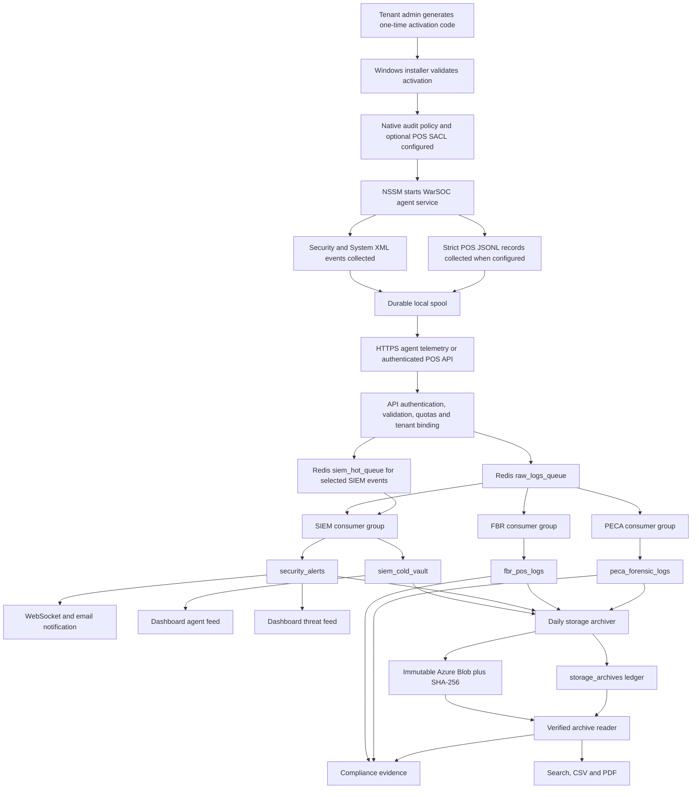
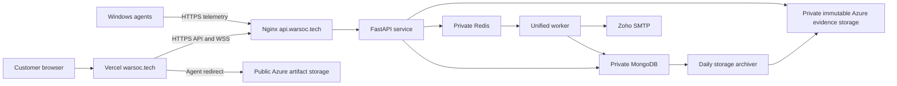

# WarSOC Current-State Architecture and Operational Contract

**Document status:** Authoritative as-built map
**Snapshot date:** 2026-07-16
**Scope:** Windows agent, ingestion, Redis, SIEM, FBR, PECA, MongoDB hot storage, Azure cold storage, retrieval, reports, dashboard, RBAC, email, deployment, and launch proof.

This document describes what the current source code does. It is not a sales claim and it does not treat an implemented path as production-proven unless verification evidence exists.

## 1. Current Verdict

WarSOC currently has a coherent end-to-end architecture for a maximum of 50 Windows agents per tenant:

1. A tenant admin generates a one-time activation code.
2. The Windows installer validates that code, configures native Windows auditing, and installs the agent as an NSSM service.
3. The agent collects native Windows Security and System events, maintains a durable local spool, and sends authenticated telemetry over HTTPS.
4. Redis Streams buffer each accepted event for independent SIEM, FBR, and PECA consumers.
5. SIEM creates operational alerts and a short-lived operational evidence feed governed by the seven-day hot policy.
6. PECA creates signed and encrypted forensic evidence for the entitled 11-control catalog.
7. FBR creates encrypted invoice evidence and database-file tamper evidence for the entitled six-control catalog.
8. MongoDB holds seven days of operational SIEM, PECA, and FBR data.
9. The storage archiver uploads expired hot records to immutable Azure Blob storage, verifies integrity and immutability, writes a Mongo archive ledger, and only then removes the Mongo copies.
10. Compliance views, search, CSV exports, and PDF reports can merge Mongo hot records with verified Azure archive records.
11. The dashboard intentionally separates normal agent telemetry from actual security alerts and groups repeated detections into operator incidents.

The production backend is deployed from commit `526c55b` with Windows agent `4.2.4-Native`. Its bounded live-read API, database indexes, ingestion, workers, compliance pipelines, archive reader and reports were verified directly on DigitalOcean on 2026-07-16. The complete backend suite passes with `285 passed`, `3 skipped`, and zero failures; the three skips are the explicit `E2E=1` external run and two Git-metadata checks unavailable inside the mounted test container.

The production frontend is **not yet aligned with that backend contract**. The Vercel asset `/assets/index-BVowvCgg.js`, served from the forced-updated GitHub `main` line ending at `bae3905`, does not contain `/logs/live`; it polls historical `/api/v1/logs` every 1.5 seconds and refreshes again on WebSocket messages. A surgical repair exists locally on `codex/restore-live-dashboard`, based on the exact current `origin/main` design. It passes frontend lint and the production Vite build, preserves the visual design, separates SIEM evidence from alerts and restores bounded request scheduling. It is not production truth until committed, pushed and redeployed to Vercel. Therefore the backend processing platform is production-verified, while the complete browser-to-backend system remains conditionally accepted pending that frontend redeploy and post-deploy traffic check.

## 2. Product Boundary

### 2.1 What WarSOC currently provides

- Native Windows endpoint telemetry without Sysmon.
- Windows Security and System event collection.
- Stateless signatures and contextual/stateful SIEM detection.
- Live alert delivery through authenticated WebSockets.
- Alert acknowledgement, closure, notes, and incident occurrence tracking.
- IP/CIDR mitigation with active-agent and self-lockout guards.
- FBR invoice evidence through strict JSONL or authenticated API ingestion.
- FBR database file-integrity monitoring when POS/database paths are configured.
- PECA forensic evidence for 11 native Windows controls.
- Tenant isolation and role-based access.
- Seven-day Mongo hot storage for operational SIEM, FBR, and PECA data.
- Immutable Azure archive storage with hashes and an archive ledger.
- Hot-plus-cold compliance retrieval and CSV/PDF export.
- Email queue processing for configured operational messages and high/critical alert notifications.
- Manual B2B sales, manual payment/invoicing, and administrative tenant provisioning.

### 2.2 What WarSOC does not currently provide

- It does not automatically understand proprietary POS database schemas.
- It does not create invoice-level FBR evidence unless the POS vendor writes the required JSONL records or calls the authenticated POS API.
- It does not provide FBR file-integrity monitoring when no POS/database directory is configured.
- It does not replace endpoint antivirus or EDR.
- It does not require customers to disable Windows Defender.
- It does not use Safepay or self-service payment for the current commercial flow.
- It does not use Sysmon.
- It does not currently ingest Linux or network-device syslog. The receiver remains a disabled future profile and is outside the Windows SMB pilot contract.
- It does not guarantee that every normal Windows event becomes an alert. Normal events are evidence and correlation inputs; only dangerous or contextually suspicious activity alerts.
- It does not make a PDF cryptographically signed. The PECA source records contain the forensic signatures; the PDF is a human-readable summary.
- It does not automatically email an agent installer link to analysts. Agent activation and download are tenant-admin actions.

## 3. End-to-End Data Flow



## 4. Tenant and Commercial Flow

1. A prospect selects the desired endpoint count and compliance packs on the website.
2. The prospect submits a quote request to `POST /api/v1/sales/request-quote`.
3. WarSOC contacts the prospect, agrees the scope, and issues a manual invoice outside the product.
4. An authorized WarSOC operator provisions the tenant through the protected admin provisioning API or the local operations console.
5. Provisioning creates the tenant, admin account, endpoint limit, compliance entitlements, retention value, and required cache/genesis state.
6. Credentials are transferred to the customer through the agreed secure onboarding channel.
7. Public self-service signup is configured to fail closed for the launch model.

There are no fixed product-tier names required by the operating flow. The tenant contract is defined by its endpoint limit, selected compliance packs, and configured retention.

## 5. Identity, Session, and RBAC Flow

### 5.1 Browser authentication

- Login endpoint: `POST /api/v1/auth/login`.
- Session identity is hydrated from `GET /api/v1/auth/me`.
- The browser uses secure cookie authentication and CSRF protection for state-changing requests.
- Logout invalidates the session.
- Frontend authentication state is centralized in the Zustand auth store.

### 5.2 Role matrix

| Capability | Admin | Manager | Analyst | Auditor |
|---|---:|---:|---:|---:|
| Operational dashboard | Yes | Yes | Yes | No |
| Read operational alerts | Yes | Yes | Yes | No |
| Acknowledge/close alerts | Yes | Yes | No | No |
| Mitigate IP/CIDR | Yes | Yes | No | No |
| Generate activation code | Yes | No | No | No |
| Download agent | Yes | No | No | No |
| Manage team | Yes | No | No | No |
| Read catalog metadata | Yes | Yes | Yes | Yes |
| Read sensor coverage | Yes | Yes | No | Yes |
| View FBR/PECA evidence | Yes | No | No | Yes |
| Export compliance evidence | Yes | No | No | Yes |

The frontend exposes the Compliance workspace to admin and auditor roles. The backend permits every authenticated role to read non-evidence catalog metadata, permits admin/manager/auditor to read coverage, and restricts evidence/export to admin/auditor. The backend enforces the sensitive role checks; hiding a frontend button is not treated as authorization.

### 5.3 Team management

- Create or resend a pending team invitation: `POST /api/v1/auth/invite`, admin only.
- Activate an invitation and choose a password: `POST /api/v1/auth/activate-invite`, public one-time-token endpoint.
- List team: `GET /api/v1/auth/team`, admin only.
- Remove team member: `DELETE /api/v1/auth/team/{user_id}`, admin only.
- Roles are assigned by the tenant admin within the backend's allowed-role policy.
- The invite email contains a 24-hour single-use HTTPS activation link. It never contains a temporary password.
- Invited users remain `pending` and cannot log in until the token is atomically consumed and a policy-compliant password is stored.
- Analysts do not receive agent enrollment authority merely because they can investigate alerts.
- New and changed passwords must contain at least 16 characters, an uppercase letter, a lowercase letter, a number, and a symbol; bcrypt-compatible input is capped at 72 UTF-8 bytes.

## 6. Agent Activation and Installation

### 6.1 Activation code

- Endpoint: `POST /api/v1/agent/generate-activation`.
- Caller: authenticated tenant admin.
- Format: `WARSOC-XXXXXXXX`.
- Default validity: 86,400 seconds (24 hours).
- The backend checks tenant status, contract state, and the maximum-agent seat count.
- The code is one-time enrollment material, not a permanent agent token.
- Installer validation endpoint: `POST /api/v1/agent/validate-activation`.
- Agent registration endpoint: `POST /api/v1/agent/register`.
- Successful registration binds the generated Ed25519 public key, tenant, and agent identity and returns agent credentials.
- The activation secret is scrubbed after enrollment.

### 6.2 Installer sequence

1. The admin selects Download Agent in the dashboard.
2. The frontend requests `GET /api/v1/agent/download`.
3. The backend returns a redirect to `AGENT_CDN_URL`.
4. Azure public artifact storage serves the approved `warsoc_installer-4.2.4.exe` artifact. Production preflight verified 17,417,877 bytes and SHA-256 `D7B2541FB0447697D3DE76812A785913FF63D2688CDE26A48EF1660E4F34E41B` against `pilot_hash_manifest-4.2.4.json`.
5. The installer asks for the activation code, confirms `https://api.warsoc.tech`, and optionally accepts local POS directories.
6. The installer validates the activation code before making the installation operational.
7. The native telemetry script configures auditing and optional POS SACLs.
8. NSSM installs and starts `WarSOC_Agent` with automatic restart and output rotation.

Random text must not successfully enroll an agent. An installer may copy files before validation failure, but it must not register a functioning agent without a valid, unexpired, unused tenant activation code.

### 6.3 Unsigned pilot artifact

The current installer is unsigned and may be flagged by Windows Defender or SmartScreen. The supported pilot procedure is:

1. Keep Defender enabled.
2. Calculate and distribute the exact SHA-256 manifest over a trusted onboarding channel.
3. Have the customer's IT administrator verify the downloaded file hash.
4. Apply an organization-approved hash allow rule through Defender, WDAC, or Intune where required.
5. Rebuild and redistribute the manifest whenever any packaged binary or script changes.

A code-signing certificate remains the correct long-term solution.

## 7. Native Windows Telemetry

### 7.1 Data sources

- Windows Security channel.
- Windows System channel, including Event 7045.
- Language-independent XML fields rather than rendered localized message text.
- Optional strict POS JSONL file at `%ProgramData%\WarSOC\pos_audit.log`.

### 7.2 Audit policy configured by the installer

- Logon: success and failure.
- Process Creation: success, with command-line inclusion for Event 4688.
- File System: success and failure.
- Registry: success and failure.
- Other Object Access: success and failure.
- Filtering Platform Connection: failure events for blocked connections.
- User Account Management: success and failure.
- Security Group Management: success and failure.
- Special Logon: success.
- Security System Extension: success and failure.
- Audit Policy Change: success and failure.

The installer stores the pre-existing audit/SACL state and removes only WarSOC-owned changes during uninstall.

### 7.3 POS directories

- POS directories are optional for general SIEM and PECA monitoring.
- They are required for native FBR file-integrity monitoring.
- Paths must be existing local absolute directories; UNC/network paths are rejected.
- WarSOC adds inherited SACL auditing for delete, child-delete, and permission-change actions.
- Supplied-path configuration failure aborts installation rather than silently claiming FBR coverage.

### 7.4 Agent health

Signed heartbeat data reports:

- Security channel state.
- System channel state.
- Audit policy state.
- Telemetry version.
- POS SACL path count.
- POS audit-log state.
- Last-seen and sensor state.
- Local spool usage, hard limit, free-disk reserve, backpressure state, and limit-hit count.

The backend stores the state on the agent record and exposes it through `GET /api/v1/data/status`.

Dashboard health means:

- `Active`: enrolled agent is reporting and required telemetry is healthy.
- `Degraded`: the agent is reporting but a channel/audit requirement is incomplete or local spool backpressure is active. An unconfigured optional POS feed is reported separately and does not invent FBR coverage.
- `Not Configured` or offline: no healthy enrolled reporting agent is available for the requested coverage.

## 8. Durable Agent Delivery

1. Windows events are normalized into the agent's local queue.
2. The event is durably appended to disk before its Windows watermark advances.
3. If durable spool writing fails, the watermark does not advance; the source event is not treated as delivered.
4. The agent sends batches to the HTTPS ingestion endpoint.
5. Transient failures leave records in the local spool for retry.
6. Malformed POS JSONL records are quarantined locally and are not guessed, relabelled, or sent as valid evidence.
7. `event_uid` is preserved across retries for backend idempotency.
8. The spool has a 500 MiB hard boundary, a 400 MiB recovery boundary, and a 2 GiB free-disk reserve by default.
9. Reaching either disk boundary pauses new durable collection, leaves existing unacknowledged records intact, and reports the endpoint as Degraded.

This is at-least-once delivery with event-level duplicate suppression, not fire-and-forget delivery.

## 9. API Ingestion Contract

### 9.1 Agent telemetry

- Endpoint: `POST /api/v1/ingest/pulse`.
- Requires valid agent authentication.
- Tenant and agent identity are taken from the authenticated token, not trusted from client payload fields.
- Enforces request-size, event-count, rate, and tenant daily-ingest controls.
- Rejects new batches with HTTP 503 when `raw_logs_queue` reaches the configured admission boundary; the agent retains and retries them.
- Rejects banned sources according to the active mitigation state.
- Accepted events enter Redis Streams.

### 9.2 Authenticated POS evidence

- Endpoint: `POST /api/v1/fbr/pos/ingest`.
- Requires agent authentication.
- Maximum request body: 5 MB.
- Maximum event count: 500.
- Unknown fields are rejected.
- Accepted IDs: `FBR-INV-DEL` and `FBR-INV-MOD` only.
- Required contract fields include event ID, event UID, invoice ID, timezone-aware timestamp, actor, and source system.
- API clients cannot submit `FIM-DB-MOD`; only validated native Windows telemetry can generate it.

## 10. Redis Transport and Failure Semantics

### 10.1 Streams

| Stream | Purpose |
|---|---|
| `raw_logs_queue` | Durable fan-out source for SIEM, FBR, and PECA consumers. |
| `siem_hot_queue` | Priority path for selected SIEM-interest events. |

### 10.2 Consumer groups

| Consumer | Redis group | Source stream |
|---|---|---|
| SIEM general | `siem_group` | `raw_logs_queue` |
| SIEM priority | `siem_hot_group` | `siem_hot_queue` |
| FBR | `fbr_group` | `raw_logs_queue` |
| PECA | `eto_group` | `raw_logs_queue` |

`eto_group` is a legacy internal group name. It currently owns PECA consumption and must not be renamed casually because stream retention requires it.

### 10.3 Acknowledgement rules

- Each consumer group receives its own copy of a stream entry.
- A worker acknowledges only after its required persistence/action succeeds.
- Transient Mongo or Redis failures leave messages pending for reclaim/retry.
- Repeated poison messages are copied to a DLQ before acknowledgement.
- SIEM DLQ: `raw_logs_queue_dlq`.
- FBR/PECA DLQ: `warsoc:dlq:{tenant_id}`.
- Stream trimming runs only when all required consumer groups exist and their pending state permits safe progress.
- The trim boundary considers only the active required groups: `siem_group`, `fbr_group`, and `eto_group`. Historical/profile-gated groups such as `threat_hunters` cannot pin the active pipeline.
- The raw stream is never blindly trimmed to enforce memory. `RAW_STREAM_MAX_ENTRIES` applies admission backpressure while acknowledged-entry retention performs safe trimming.
- Metrics expose raw depth, cumulative safe trims, and the stream-retention worker heartbeat so retention can be proven rather than inferred.
- Production Redis uses a 640 MB `noeviction` dataset ceiling inside a 1 GB container, leaving allocator/AOF headroom while preserving fail-closed admission behavior.

### 10.4 Unified worker

The production unified worker supervises SIEM, FBR, PECA, email, and stream-retention loops concurrently. A crashed loop is restarted after a delay without terminating the other loops.

## 11. SIEM Detection Architecture

### 11.1 Evidence versus alerts

This distinction is intentional:

- `siem_cold_vault` stores normalized native events for investigation and correlation.
- `siem_cold_vault` indexes `(tenant_id,event_uid)` for idempotent writes and `(tenant_id,timestamp)` for newest-first tenant dashboard reads.
- `security_alerts` stores detections that require action.
- Normal Events 4624, 4625, 4672, and 4688 do not automatically create one alert per event. A 4688 PowerShell launch with a full elevated token is a narrow medium-severity operator signal, not a claim that exploitation occurred.
- They feed stateful correlation and signature logic.
- Inherently dangerous events, including audit-log clearing, audit shutdown, blocked connections, dangerous service installation, and selected account changes, may alert directly.

This prevents a normal Windows endpoint from producing thousands of meaningless alerts.

### 11.2 Native event map

The current engine understands these core native IDs and custom FBR IDs:

`1100`, `1102`, `4616`, `4624`, `4625`, `4648`, `4657`, `4660`, `4663`, `4670`, `4672`, `4688`, `4697`, `4698`, `4719`, `4720`, `4726`, `4732`, `4768`, `4769`, `4776`, `4798`, `5140`, `5156`, `5157`, `7045`, `FBR-INV-DEL`, `FBR-INV-MOD`, and `FIM-DB-MOD`.

Event 5157 is treated as a blocked connection. Event 5156, when supplied by a reviewed source, is permitted-connection evidence and must never be mislabelled as a block. The default Windows SMB audit policy collects Filtering Platform failures (5157), not every permitted connection, to prevent a high-volume 5156 flood.

### 11.3 Stateless/signature coverage

Current rule families include:

- SQL injection.
- Cross-site scripting.
- Command injection.
- Path traversal.
- XXE.
- Web-shell patterns.
- PowerShell obfuscation.
- Privilege escalation.
- Lateral movement.
- Log evasion.
- Reverse shell behavior.
- Reconnaissance.
- Persistence.
- Data exfiltration and staging.
- Brute-force patterns.
- Malware execution.
- Ransomware shadow-copy deletion.
- Credential dumping.
- Defender evasion.
- LOLBin download behavior.
- Firewall blocking.

Web rules require structured HTTP log-file context. Windows keyword/EDR rules require native Security/System XML context, so ordinary Windows text cannot enter Web-WAF classification. Process command-line rules use normalized Event 4688 `process_create` input.

### 11.4 Stateful/contextual coverage

Current executable stateful categories include:

- Identity/authentication correlation: phishing chain, high-velocity brute force, low-and-slow brute force, five-user password spraying, impossible travel when trusted coordinates exist, concurrent sessions, after-hours login, account storm, privilege spike, dormant-account activation, ghost-admin behavior, SMB lateral movement, share enumeration, and registry persistence.
- File/ransomware correlation: six file-system/ransomware behavior families.
- Network/lateral correlation definitions consume structured flow fields when such telemetry is supplied. The Windows SMB pilot directly supplies blocked-connection Event 5157 plus SMB/authentication events; it does not claim full flow analytics without a reviewed flow source.
- Web-application correlation: six contextual web behavior families.

Contextual detectors reduce false positives by requiring sequences, thresholds, distinct-user counts, time windows, or event-type context. Phishing correlation requires ordered delivery-context telemetry followed by suspicious process execution for the same tenant, agent, and human user; machine accounts, native process telemetry alone, cross-agent joins, and execution-before-delivery are rejected. Five catalog entries are explicitly disabled for the Windows pilot because their required telemetry is not collected: new-location baseline, byte-counted exfiltration, interval-based C2 beaconing, connection duration, and rare-port baseline. They are not production capability claims.

Linux/syslog rule definitions are retained only as future design inventory. They have no enabled production intake profile and are not part of current detection coverage.

### 11.5 SIEM persistence and notification

- Normalized evidence: `siem_cold_vault`.
- Actionable detections: `security_alerts`.
- Stable alert identity: `alert_uid` within a tenant.
- Duplicate occurrences roll into the same alert/incident where the rule identity matches.
- Live notifications are published through Redis and delivered through authenticated WebSockets.
- High/critical alerts can enqueue email notifications when SMTP and tenant notification configuration are active.

## 12. PECA Pipeline

### 12.1 Entitlement and storage

- Pack ID: `peca_forensic`.
- Collection: `peca_forensic_logs`.
- Hot Mongo window: 7 days.
- Azure vault period: 365 days.
- Only entitled tenants receive PECA forensic records.

### 12.2 Current 11-control catalog

| Control | Event | Purpose |
|---|---:|---|
| PECA-101 | 4625 | Failed logon evidence. |
| PECA-102 | 1102 | Audit log cleared. |
| PECA-103 | 4624 | Successful logon evidence. |
| PECA-104 | 4688 | Process creation evidence and detection input. |
| PECA-105 | 4672 | Special privileges assigned. |
| PECA-106 | 4720 | Account created. |
| PECA-107 | 4726 | Account deleted. |
| PECA-108 | 4732 | Member added to privileged/local group. |
| PECA-109 | 4697 | Service installed through Security auditing. |
| PECA-110 | 7045 | Service installed through the System channel. |
| PECA-111 | 1100 | Windows Event Log service shut down. |

### 12.3 Evidence properties

- Canonical event representation.
- Tenant and agent identity.
- Stable event UID/idempotency.
- Sensitive field encryption.
- Forensic hash/seal.
- RSA-PSS signature using a key of at least 2048 bits.
- Duplicate isolation through tenant-plus-event UID uniqueness.

PECA evidence can exist without a corresponding actionable SIEM alert. For example, a normal 4624 login is useful forensic evidence but is not automatically a threat.

## 13. FBR Pipeline

### 13.1 Entitlement and storage

- Pack ID: `fbr_pos`.
- Collection: `fbr_pos_logs`.
- Hot Mongo window: 7 days.
- Azure vault period: 2,190 days (six years).
- Only entitled tenants receive FBR evidence.

### 13.2 Current six-control catalog

| Control | Event | Source and purpose |
|---|---|---|
| FBR-101 | `FBR-INV-DEL` | POS JSONL/API invoice deletion evidence. |
| FBR-102 | `FBR-INV-MOD` | POS JSONL/API invoice modification evidence. |
| FBR-103 | `4660` | Native Windows object-deletion evidence. |
| FBR-104 | `4663` | Delete-intent context containing path and handle. |
| FBR-105 | `4670` | Native permission-change evidence. |
| FBR-106 | `FIM-DB-MOD` | Correlated database-file tamper evidence. |

### 13.3 Two independent FBR truth sources

1. **Invoice semantic evidence:** the POS vendor writes strict JSONL or sends authenticated API events. This identifies invoice IDs, actors, source systems, and modification/deletion intent.
2. **Native file-integrity evidence:** Windows auditing monitors configured database/POS paths. This proves database-file deletion or permission tampering but does not infer invoice line items.

### 13.4 Redis FIM correlation

Event 4660 does not carry a usable path. WarSOC correlates it with Event 4663:

1. A qualifying 4663 delete-intent event stores the path under `warsoc:fim_correlate:{tenant_id}:{agent_id}:{handle_id}` with a 60-second TTL.
2. A matching 4660 reads that key.
3. The worker validates the file extension.
4. The worker persists one `FIM-DB-MOD` event.
5. The correlation key is consumed without allowing duplicate FIM creation.
6. Redis or Mongo failure leaves the stream event retryable rather than silently losing evidence.

Approved database extensions are `.mdf`, `.ndf`, `.ldf`, `.sqlite`, `.sqlite3`, `.db`, `.db3`, and `.bak`.

Normal file writes do not create FIM database-tamper alerts. Unmatched 4660 events remain SIEM evidence. Event 4670 can directly generate FIM evidence when it targets an approved database file.

### 13.5 FBR confidentiality

Sensitive FBR fields, including message, raw event, raw data, raw event data, and processed data, are encrypted with `encryption_version="fernet-v1"`. Authorized detail and export paths decrypt fields for the requesting tenant and permitted role.

## 14. MongoDB Hot Storage

### 14.1 Collection ownership

| Collection | Owner | Purpose |
|---|---|---|
| `logs` | Upload/raw normalized routes | General uploaded or normalized log records. |
| `siem_cold_vault` | SIEM worker | Seven-day operational event/evidence feed. The name is historical; it is Mongo hot storage before Azure archival. |
| `security_alerts` | SIEM/mitigation paths | Actionable incidents and status history. |
| `fbr_pos_logs` | FBR worker | Encrypted FBR evidence. |
| `peca_forensic_logs` | PECA worker | Signed/encrypted PECA evidence. |
| `storage_archives` | Storage archiver | Azure archive ledger and retrieval index. |
| `csv_uploads` | Upload workflow | Uploaded source metadata. |
| `analysis_results` | Analysis workflow | Derived analysis results. |
| `management_audit` | Administrative actions | Operator/management audit trail. |
| `system_audit` | System actions | System-level audit trail. |

### 14.2 Seven-day hot-storage policy

| Data class | Mongo hot-policy threshold | Logical vault requirement |
|---|---:|---:|
| Raw/general logs | 7 days | Tenant contract, normally 90 days. |
| SIEM evidence (`siem_cold_vault`) | 7 days | Tenant contract, normally 90 days. |
| SIEM alerts (`security_alerts`) | 7 days | Tenant contract, normally 90 days. |
| FBR evidence | 7 days | 2,190 days. |
| PECA evidence | 7 days | 365 days. |
| Uploads/results | Tenant retention | Tenant retention. |

There is no end-user retention button for PECA or FBR because these values are compliance policy, not an arbitrary UI preference. SIEM archive retention follows the tenant contract. All three core live data classes use a seven-day Mongo archival threshold.

The production Azure evidence container is currently protected by one locked 2,190-day container-scoped immutability policy. This is stronger than the logical SIEM and PECA minimums, but it also means every blob written to that container is physically non-deletable for the container policy period. A three-, six-, nine-, or twelve-month general archive selection therefore controls WarSOC metadata and retrieval expectations but does **not** currently make the Azure blob deletable at that shorter date. Exact physical retention requires future archives to be routed to separate containers or storage accounts by retention class. A locked Azure policy cannot be shortened for blobs already governed by it.

The threshold and the physical move time are not identical:

- The archiver runs once every 24 hours, so timestamp-selected FBR, PECA, and general-log records normally move on the first run after they become seven days old, approximately between day 7 and day 8.
- SIEM evidence and alerts have `_expire_at` set to day 7. The production one-day archive lead makes them eligible approximately at day 6, and the daily schedule normally moves them between day 6 and day 7.
- If the archiver or Azure is unavailable, Mongo records remain beyond these windows. This is intentional fail-safe behavior: storage use grows visibly instead of evidence being deleted without a verified archive.
- Therefore, "seven-day hot" is the operating policy, not a destructive Mongo TTL guarantee. Archiver health and Mongo disk growth must be monitored.

### 14.3 Retention markers

- `_expire_at` is the SIEM hot-expiry marker. On FBR/PECA records it also carries the long compliance-expiry metadata, while the fixed collection timestamp policy controls the seven-day move to Azure.
- `_retention_ts` is used as a stable date anchor for raw/upload collections.
- The archiver knows the valid fields for each collection and also applies the fixed seven-day collection threshold.
- Legacy records are backfilled so they remain discoverable by the archiver.
- Mongo TTL indexes are removed from archive-managed collections.

MongoDB itself is therefore not allowed to delete evidence on a timer. Only the verified archive transaction may remove hot copies.

### 14.4 Dashboard read indexes and startup guarantee

The operational read indexes are part of the fast database startup phase, not only the slower compliance migration phase:

- `security_alerts`: `(tenant_id, timestamp DESC)`.
- `siem_cold_vault`: `(tenant_id, timestamp DESC)` for live reads.
- `siem_cold_vault`: `(tenant_id, event_uid)` for idempotent evidence writes.
- FBR, PECA, raw logs, uploads, users, firewall policy, and alert identity retain their existing tenant-scoped indexes.

The same index names/options are used by core and compliance startup. An existing equivalent index is accepted even when its legacy name differs; WarSOC does not drop and rebuild a large index merely to rename it. An incompatible unique, sparse, TTL, or partial index is still repaired according to the collection contract.

Read-only execution-plan proof is available through `scripts/measure_dashboard_reads.py`. On the 2026-07-16 local production-shaped dataset, the unindexed SIEM query scanned 156,257 documents. After the guaranteed index was created, a populated-tenant page returned 501 rows while examining exactly 501 keys and 501 documents and used `IXSCAN`.

Production was measured again on 2026-07-16 for an active tenant. Both `security_alerts` and `siem_cold_vault` returned 501 documents while examining exactly 501 keys and 501 documents. Both plans used `IXSCAN`, neither performed `COLLSCAN`, and wall times were 7.739 ms and 8.590 ms respectively. The diagnostic is now explicitly tracked and copied into the API image so later releases can run the same proof without an ad hoc file transfer.

## 15. Azure Cold Archive Transaction

### 15.1 Production scheduler

- Production service: `storage-archiver` in `docker-compose.prod.yml`.
- Default interval: 86,400 seconds (daily).
- Default batch size: 5,000 documents.
- Default archive lead: one day for explicit expiry markers.
- Azure configuration is mandatory for the production service.
- `AZURE_IMMUTABILITY_REQUIRED` defaults to true in production Compose.

### 15.2 Archive-before-delete sequence

For each tenant, collection, and batch:

1. Select eligible Mongo records using the collection's hot-retention rules.
2. Serialize the batch as JSON.
3. Calculate SHA-256 over the exact JSON bytes.
4. Upload the JSON blob with collection, hash, and vault-retention metadata.
5. Upload a companion `.sha256` blob.
6. Read Azure blob properties.
7. Verify legal hold or a locked immutability policy that lasts through the required retention date.
8. Insert a `storage_archives` ledger row with tenant, collection, blob names, hash, count, timestamps, event IDs, retention, and immutability status.
9. Delete only those exact Mongo `_id` values for the same tenant.

If upload, hash handling, immutability verification, or ledger insertion fails, the Mongo records are not deleted. The visible failure mode is hot-storage growth, not silent evidence loss.

### 15.3 Blob layout

Archive paths use tenant and collection partitions:

```text
{tenant_id}/{collection}/year=YYYY/month=MM/day=DD/archive_{collection}_{run_id}_batch_NNNN.json
{tenant_id}/{collection}/year=YYYY/month=MM/day=DD/archive_{collection}_{run_id}_batch_NNNN.sha256
```

The public agent-artifact account/container must remain separate from the private immutable evidence account/container.

### 15.4 Production immutability scope

- Container: `warsoc-cold-storage` in the private evidence account.
- Verification mode: `AZURE_IMMUTABILITY_SCOPE=container`.
- Operator declaration: locked for 2,190 days.
- The archiver verifies Azure container immutability capability and the declared locked period before deleting hot Mongo records.
- The current single-container design satisfies the six-year FBR floor but physically over-retains PECA and shorter general/SIEM contracts.
- Correct future segmentation is: FBR six-year evidence, PECA one-year evidence, and separate general/SIEM containers for each supported contract window. That change requires code/config support for collection-to-container routing and must not attempt to weaken the existing locked container.

## 16. Cold Archive Retrieval

### 16.1 Reader safety

The archive reader:

1. Queries `storage_archives` for the authenticated tenant and permitted collections.
2. Narrows ledger entries by date, event ID, event UID, or document ID when filters exist.
3. Downloads the referenced private Azure blob.
4. Recomputes and verifies SHA-256 before parsing.
5. Rejects invalid JSON, failed hashes, and records whose tenant does not match the authenticated tenant.
6. Applies date/event/search filters.
7. Marks records as archived and records their source collection/blob.
8. Deduplicates hot and cold identities and sorts newest first.

The internal reader preserves `_archived`, source collection, and blob identity while verifying the payload. Compliance response curation now exposes only `storage_tier: "hot" | "cold_archive"` and `archived: true | false`; internal blob names, paths, and credentials remain hidden. The evidence tab renders these fields in the curated record and now distinguishes a retrieval failure from a valid empty vault instead of silently displaying "No forensic evidence" for both conditions. Production proof of this presentation change is required after the current candidate is deployed.

Compliance list routes use hot-first pagination. They read the requested Mongo page first and obtain an unfiltered archive count from the local `storage_archives` ledger. When Mongo completely satisfies the requested page, no Azure blob is downloaded. Azure is read only when the page crosses beyond the available hot rows or a filtered request cannot be satisfied from hot data. This removes private-blob network latency from normal dashboard loads without changing archive integrity verification, exports, or retention behavior.

Responses expose `meta.archive_read_performed`, `meta.archive_rows`, and `meta.total_is_exact`. An unfiltered ledger count is exact when every archive ledger row contains `document_count`. A filtered request that is satisfied entirely from hot storage deliberately reports `total_is_exact: false` rather than claiming a count for archive blobs that were not scanned.

### 16.2 Routes that read hot plus cold

- Compliance evidence detail/list routes.
- Global data search.
- CSV export.
- PDF audit report.

The dashboard's live SIEM feed intentionally reads Mongo hot data only. It is an operational screen, not a six-year archive browser.

### 16.3 Bounded retrieval

- Default archive-ledger scan: 100 blobs.
- Hard code cap: 500 blobs.
- API result limits still apply.
- Normal first-page compliance reads do not open Azure when the hot tier fills the page.
- A page that crosses the hot/cold boundary requests only the missing cold slice and applies the correct archive offset.
- CSV default: 5,000 rows; maximum: 50,000 rows.
- PDF considers the newest 500 matching records and prints a 50-row evidence preview.

For deep historical work, users must apply date/event filters or use CSV in bounded exports. A single unfiltered browser request is not intended to materialize an entire multi-year vault.

## 17. Dashboard Data Contract

### 17.1 Operational views

| Screen/widget | Backend source | Meaning |
|---|---|---|
| Omni Agent Feed | `GET /api/v1/logs/live?source=siem&limit=100&aggregate=false` | Latest normal and suspicious hot endpoint evidence from `siem_cold_vault`. |
| Live Inspection / threats | `GET /api/v1/logs/live?source=security_alerts&limit=500&aggregate=true` | Latest actionable hot records from `security_alerts`, grouped by incident/occurrence. |
| Historical charts | Dashboard history/search endpoints | Tenant-scoped aggregates for selected time window. |
| Agent health badge | `GET /api/v1/data/status` | Active, degraded, or offline/not-configured telemetry state. |
| Compliance catalog | `GET /api/v1/compliance/packs` and `GET /api/v1/auth/my-packs` | Available and entitled packs. |
| Compliance coverage | `GET /api/v1/compliance/coverage` | Sensor/control coverage status. |
| PECA/FBR evidence | `GET /api/v1/compliance/evidence/{pack_id}` | Merged hot and Azure evidence for authorized roles. |

The Agent Feed and Live Inspection must not use the same dataset. If normal events appear as threats, or threats disappear because only raw events are fetched, that is a frontend binding regression.

`GET /api/v1/logs/live` is deliberately separate from historical `GET /api/v1/logs`:

- It accepts only `security_alerts` and `siem`.
- It is tenant-isolated and restricted to admin, manager, and analyst roles. Auditors receive HTTP 403.
- It reads Mongo hot storage only and never opens Azure.
- It excludes raw/heavy/encrypted detail fields from the list projection.
- It fetches at most the requested limit plus one row to return `has_more`.
- It performs no `count_documents` scan and returns no misleading total.
- It does not create a management-audit record for every automatic browser refresh.
- Historical `/logs`, forensic detail, compliance evidence, search, CSV, and PDF retain their existing complete/audited contracts.

### 17.2 Live updates

1. The browser requests a one-time WebSocket ticket from `POST /api/v1/ws/ticket`.
2. The ticket is short-lived, stored in Redis, and bound to the session/tenant.
3. The browser connects to `/ws/alerts` over WSS.
4. The backend validates and consumes the ticket.
5. The browser receives tenant-scoped alert messages and displays critical notification text immediately.
6. Alert bursts are coalesced into at most one server reconciliation every five seconds.
7. Only one alert request and one endpoint-evidence request may be in flight at a time.
8. Alert HTTP reconciliation runs every 30 seconds as a fallback; endpoint evidence runs every 10 seconds; agent health runs every 30 seconds.

The previous implementation issued both live queries every five seconds, refetched on every WebSocket message, counted both collections, and wrote a management-audit row for every automatic `/logs` request. Two active browsers could overlap requests until Axios cancelled them at ten seconds. The dedicated live contract removes this read/write amplification while preserving the 500-alert and 100-event display boundaries.

### 17.3 Duplicate presentation

Repeated occurrences of the same stable alert identity are represented as an incident with a count and occurrence details instead of creating unrelated rows for every duplicate. Raw evidence remains individually traceable.

## 18. Alert and Mitigation Workflow

### 18.1 Alert status

- Read alerts: admin, manager, analyst.
- Acknowledge or close: admin and manager.
- Endpoint: `PATCH /api/v1/alerts/{alert_id}/status`.
- Close requires resolution notes.
- Status changes persist and are returned after refresh.
- Related/grouped alert identities are handled as one incident where applicable.

### 18.2 IP/CIDR mitigation

- Authorized roles: admin and manager.
- Validates IPv4/IPv6/CIDR syntax.
- Blocks loopback, protected/system addresses, the current administrative source, and active enrolled-agent addresses from unsafe self-lockout.
- Writes the enforcement state to Redis first.
- Persists the management record to Mongo.
- Rolls back Redis if database persistence fails.
- Signed agent heartbeats receive the current tenant ban list.

This is WarSOC policy distribution. Actual packet enforcement on an endpoint depends on the installed agent applying the returned policy.

## 19. Reports and Exports

### 19.1 CSV

- Endpoint: `GET /api/v1/export/csv`.
- Enforces tenant scope, role, and compliance entitlement.
- Merges hot Mongo and verified Azure records.
- Decrypts authorized compliance fields.
- Removes internal retention fields and private signature implementation fields from ordinary tabular output.
- Default limit 5,000; maximum 50,000.

### 19.2 PDF audit report

- Endpoint: `GET /api/v1/export/audit-report`.
- Authorized for admin and auditor compliance workflows.
- Merges hot Mongo and verified Azure evidence.
- Considers the newest 500 matching records.
- Prints a 50-record ledger preview and states that additional records were omitted from the human-readable summary.
- Includes compliance/control scorecard information.
- Is not itself digitally signed.

The source PECA evidence remains signed and verifiable even though the PDF presentation is a bounded summary.

## 20. Email Behavior

- General contact and quote requests are sent to the WarSOC backend, not Web3Forms.
- The unified worker includes the email delivery daemon.
- Production SMTP variables use the Zoho configuration expected by the backend.
- High/critical SIEM alerts can queue email notifications when tenant notification settings and SMTP are valid.
- Team invite behavior must be judged by the actual invite endpoint response and mail queue result; creating a team account and successfully delivering email are separate operations.
- Email bodies and credentials must not be logged.
- Delivery failures must be visible through queue/worker metrics or logs and retried according to the email worker policy.

## 21. Production Topology



### 21.1 Production services

| Service | State | Purpose |
|---|---|---|
| `warsoc-api` | Required | HTTPS API behind Nginx. |
| `unified-worker` | Required | SIEM, FBR, PECA, email, stream retention. |
| `storage-archiver` | Required | Daily immutable Azure archival. |
| `compliance-cron` | Required | Scheduled compliance/report activity. |
| `mongodb` | Required/private | Hot operational data and archive ledger. |
| `redis` | Required/private | Streams, correlation, sessions/tickets, cache, mitigation. |
| `nginx` | Required/public 80/443 | TLS termination and reverse proxy. |
| `syslog-receiver` | Disabled future profile | Reserved for a separately reviewed Linux/network-device intake; not part of the Windows SMB pilot. |
| `threat-hunter` | Legacy optional profile | Legacy detector, not the primary unified SIEM path. |

### 21.2 Infrastructure controls

- MongoDB, Redis, and API port 8000 are not directly exposed to the internet.
- Nginx mounts native Let's Encrypt files read-only.
- Redis uses authentication, AOF with `everysec`, and `noeviction`.
- Persistent volumes protect Mongo and Redis across container recreation.
- Docker JSON logs rotate at 10 MB with five files per service.
- API and workers use read-only filesystems with explicit writable volumes/tmpfs.
- Production target: DigitalOcean 4 vCPU / 8 GB RAM.
- Frontend target: Vercel at `https://warsoc.tech`.
- API target: DigitalOcean at `https://api.warsoc.tech`.
- Agent artifact: separate public Azure storage.
- Evidence: separate private immutable Azure storage.

## 22. Verification State

### 22.1 Release identity and regression evidence

- DigitalOcean is running backend commit `526c55b`. The production API container reported healthy MongoDB and Redis dependencies and all Compose services were running at verification time.
- GitHub `main` is `bae3905`, but its deployed Vercel bundle is functionally behind the backend contract because it lacks `/logs/live`. The corrected source is local on `codex/restore-live-dashboard` and still requires commit, push and Vercel redeploy.
- The complete backend regression completed on 2026-07-16 with `285 passed`, `3 skipped`, and zero failures. The skips are the explicit external `E2E=1` run and two Git-metadata checks unavailable inside the mounted test container.
- SIEM source routing now requires trusted web-log provenance for web and phishing signatures while preserving native Event `4688` command-line detection. This prevents Windows events from being mislabeled as Web-WAF or phishing detections.
- The `security_alerts` unique index now applies only to documents with a string `alert_uid`; the startup migration handles both Mongo index options and key-spec conflicts, while legacy rows without `alert_uid` remain readable.
- Compliance evidence responses expose safe hot/cold provenance, and the frontend evidence tab no longer treats an API/archive failure as a valid empty vault.
- Frontend lint and the production Vite build pass on the repaired latest-design branch. The candidate bundle contains the production API binding `https://api.warsoc.tech/api/v1`, contains `/logs/live`, and has no localhost API binding. The main JavaScript chunk remains a performance warning at approximately 1.67 MB minified / 530 KB gzip.
- Python compilation passed for the changed API, database, worker, launch-validator, and measurement modules. Both repositories pass `git diff --check`.
- Approved installer: `warsoc_installer-4.2.4.exe`, 17,417,877 bytes, SHA-256 `D7B2541FB0447697D3DE76812A785913FF63D2688CDE26A48EF1660E4F34E41B`.
- The versioned manifest is `pilot_hash_manifest-4.2.4.json` and also covers the packaged agent, NSSM, native telemetry script, and tenant policy.

### 22.2 Production preflight

Production preflight run `15545d8ce7` passed on 2026-07-16:

- `warsoc.tech` resolves to Vercel and `api.warsoc.tech` resolves to DigitalOcean `143.198.201.185`; the frontend and backend do not share an address.
- Frontend/API TLS, HTTPS, HSTS, clickjacking protection, MIME protection, CORS with credentials, backend dependency health, and blocked public API docs passed.
- MongoDB `27017`, Redis `6379`, and API `8000` are closed externally.
- The deployed frontend is bound to `https://api.warsoc.tech/api/v1`, its same-origin API proxy returns the expected unauthenticated 401, and its contact form uses the WarSOC backend.
- The authenticated agent download returns HTTP 307 to the versioned Azure `4.2.4` artifact, whose size and SHA-256 match the local manifest exactly.

### 22.3 Production platform pipeline

Current deployed validator run `b87116c8af` completed on 2026-07-16 with zero failures and two explicit warnings:

- Health, blocked signup, quote, contact, absent legacy payment webhook, tenant provisioning, login, and auth hydration passed.
- Agent activation, Ed25519 registration, attacker-IP mitigation, heartbeat blacklist delivery, telemetry ingest, and authenticated POS ingest passed.
- Run-specific SIEM alerting, Redis-correlated FBR tamper evidence, FBR invoice evidence, PECA evidence, and authenticated WebSocket delivery passed.
- Both bounded live dashboard sources passed inside the deployed API in 9-10 ms for the disposable validation tenant.
- Secure invitation creation returned pending with `email_queued=true`; the pending account could not log in.
- CSV, PDF, and SMTP delivery passed; the delivered counter increased by six and all email queues were empty afterward.

The current warnings are not hidden:

- The validator did not receive a manifest path inside the container. Independent public preflight `15545d8ce7` verified the exact Azure artifact hash.
- The emailed auditor invitation was not activated manually during this run. Invitation queuing and pending-login denial passed; active auditor RBAC remains supported by the regression suite and earlier production-assisted proof, but a current human click-through is still an acceptance obligation.

Additional production-assisted lifecycle proof remains recorded:

- A controlled database-assisted self-lockout check returned HTTP 409 for an active enrolled-agent IP and restored the temporary agent state.
- An active disposable auditor received HTTP 200 for auth/compliance and HTTP 403 for team management, operational alerts, and agent activation.
- A disposable alert accepted acknowledgement, rejected close-without-notes with HTTP 400, accepted close-with-notes, and returned the persisted `CLOSED` state after reread.

### 22.4 Native agent, detection, capacity, and frontend proof

- The live endpoint reports `4.2.4-Native`, online/Active, native audit policy configured, Security and System channels `ok`, one POS SACL path, strict POS log present, zero parse/channel/spool failures, and an unblocked empty 500 MiB spool.
- Real Windows telemetry produced all 11 PECA controls: `4624`, `4625`, `4672`, `4688`, `4697`, `4720`, `4726`, `4732`, `7045`, `1102`, and `1100`.
- Native FBR proof produced one invoice modification, one invoice deletion, one correlated database-file deletion, and one database permission-change event. The ordinary database write produced no additional FIM alert.
- Current production metrics showed Redis healthy, DLQ depth/ejections zero, all required SIEM/FBR/PECA/retention workers healthy, email queue/processing/DLQ depth zero, 285 delivered emails, zero agent parse/channel/spool failures, an unblocked empty spool and last-observed detection latency of 0.018385 seconds.
- The current Redis snapshot showed `siem_group`, `fbr_group`, `eto_group`, and `siem_hot_group` at the current stream tail with zero pending messages. Redis's large historical `lag` counters reflect trimmed history and are not current unread entries; operational checks use tail position plus pending count.
- Fifty-agent soak run `2053d97832` registered 50/50 agents, rejected seat 51 with HTTP 403, accepted 50/50 concurrent ingests, produced SIEM in 5.18 seconds, vaulted all 50 PECA events, produced the FBR correlation, and completed in 7.22 seconds.
- A real browser login can load the production dashboard and Active agent state, but the currently deployed Vercel bundle still uses the historical `/logs` polling contract. Visual availability is therefore not accepted as proof of correct dashboard integration until the repaired bundle is deployed and its network traffic shows `/logs/live` for both feeds.

### 22.5 Production archive and report proof

- The private Azure evidence container is reachable and declares locked container-scoped immutability for 2,190 days.
- The archive ledger contains committed entries for `siem_cold_vault`, `security_alerts`, `fbr_pos_logs`, and `peca_forensic_logs`, each with verified immutability metadata and SHA-256.
- A cold-only tenant read returned four SIEM evidence rows, two alert rows, two FBR rows, and one PECA row from four verified Azure blobs.
- The production reader downloaded each blob, recomputed SHA-256, rejected no records, and marked every returned row archived internally.
- A fresh 2026-07-16 runtime probe repeated that path for all four collections. It retrieved 4 SIEM rows, 2 alert rows, 2 FBR rows and 1 PECA row; every ledger had a 64-character SHA-256, verified immutability and an Azure-returned sample marked archived.
- Public authenticated FBR and PECA evidence routes returned the archived tenant's records.
- Cold-backed exports returned valid CSV and `%PDF-` documents for both FBR and PECA.
- The latest archiver cycle completed without errors; when no records are eligible it performs no deletion.

### 22.6 Remaining controlled-pilot obligations

| Remaining item | Current state | Completion condition |
|---|---|---|
| Customer-style invitation activation | SMTP delivery, pending-login denial, activation contract tests, and active-auditor RBAC are proven. The latest emailed token was not clicked through manually. | Open one real invitation email, choose a policy-compliant password, log in, and confirm the intended role view. |
| Independent backup recovery | Azure evidence archival is not a Mongo operational backup. | Restore a current Mongo backup into an isolated environment and record collection counts plus login/search checks. |
| Physical retention segmentation | One locked 2,190-day container currently governs all evidence blobs. | Route future FBR, PECA, and general/SIEM archives to containers whose locked policy matches the promised retention class. |
| Archive provenance presentation | Backend hot/cold provenance, Azure retrieval and explicit reader failures are implemented. Runtime cold retrieval passed. | After the repaired Vercel bundle is deployed, confirm one hot row, one cold row and one simulated reader failure in the production browser. |
| Dashboard frontend redeploy | Backend `/logs/live` and both indexes are deployed and measured at 7.739-8.590 ms. The live Vercel bundle still polls audited historical `/logs` every 1.5 seconds and refetches on WebSocket messages. The repaired latest-design branch passes lint/build. | Commit/push `codex/restore-live-dashboard`, redeploy Vercel, verify the served asset contains `/logs/live`, and observe browser requests at the 30-second alert/10-second evidence schedule with no legacy automatic `/logs` polling. |
| Dashboard post-deploy resources | Before the frontend redeploy, Mongo used approximately 55.91% CPU and 1.639 GiB of its 2 GiB container limit; two legacy HTTP 499 cancellations occurred around the backend restart. Direct bounded live reads returned in 493-519 ms over the public network with no new 499. | Measure Mongo CPU/memory and Nginx status codes for at least 15 minutes after the frontend redeploy; require no live-read 499s and p95 below two seconds. |
| Ingest request buffering | Real agent ingestion is returning HTTP 200, but Nginx reports that some request bodies spill to its temporary request-body files. This is bounded buffering, not evidence loss, but it creates disk I/O. | Record agent batch sizes and temporary-file/disk growth during the 50-agent pilot; tune `client_body_buffer_size` or request batching only from measured data. |
| Intermittent ingest exception | The deployed API logs `repr` plus traceback. No recurrence appeared during the current real-agent and acceptance windows; surrounding ingestion remained HTTP 200. | If it recurs, preserve the complete traceback and resolve that exact failure before declaring the incident closed. |
| Formal disposable-VM artifact | Real native Windows functional proof passed on the test host. | Repeat on a clean snapshot-based VM and preserve the generated JSON/EVTX evidence bundle for formal audit records. |
| Pilot data hygiene | The current demo tenant contains intentional detection-test history. | Provision clean customer tenants and do not demonstrate the contaminated engineering tenant as customer production data. |
| Installer trust | The pilot installer remains unsigned. | Keep Defender enabled, verify the manifest, use approved hash allowlisting, and complete code signing when available. |

These items do not invalidate the verified processing pipeline. They define the remaining operational, audit-evidence, and data-lifecycle work that must not be hidden from pilot customers.

### 22.7 Production component truth matrix

Status meanings:

- **PROVEN:** exercised against the currently deployed production backend or exact public artifact.
- **PARTIAL:** implemented and partly proven, but a named production acceptance step remains.
- **BLOCKED:** deployed behavior contradicts the current contract and must be corrected before complete system acceptance.
- **UNPROVEN:** configured or implemented but not demonstrated with current production evidence.
- **OUT OF SCOPE:** deliberately excluded from the Windows SMB pilot.

| Component | Responsibility and data path | Status | Current production truth |
|---|---|---|---|
| DNS and TLS | `warsoc.tech` to Vercel; `api.warsoc.tech` to DigitalOcean/Nginx | PROVEN | DNS separation, HTTPS certificates, HSTS and certificate validity passed preflight `15545d8ce7`. |
| Vercel frontend | Browser UI, auth hydration, dashboard, compliance and team workflows | BLOCKED | Site and assets load and bind to the correct API, but the deployed bundle lacks `/logs/live` and uses the legacy 1.5-second `/logs` loop. The repaired latest-design branch is local and passes lint/build but is not deployed. |
| Nginx gateway | TLS termination, security headers and reverse proxy | PROVEN with observation | Public headers/CORS/private-port checks pass. Real ingest returns 200. Some request bodies are buffered to temporary files; disk impact needs pilot measurement. |
| FastAPI application | Authentication, tenant APIs, validation, orchestration and reads | PROVEN | Backend commit `526c55b` is deployed; health reports Mongo and Redis healthy. Current platform validator completed with zero failures. |
| Authentication/session | Login, HttpOnly access cookie, CSRF double-submit and `/auth/me` | PROVEN | Existing tenant login, auth context and profile returned 200. Public signup returned 403. |
| Manual sales flow | Quote/contact to operator follow-up; no automatic payment | PROVEN | Quote and contact requests returned 200; legacy payment webhook returned 404. No Safepay dependency is required. |
| Tenant provisioning | Super-admin creates tenant, admin, packs and seat limit | PROVEN | Disposable production tenant provisioning and login passed in run `b87116c8af`. |
| Team invitation | Admin queues role-specific one-time activation email | PARTIAL | Secure invitation returned 201, `pending`, and `email_queued=true`; pending login was denied and SMTP delivered. The latest real email link was not manually completed. |
| RBAC | Admin/manager/analyst/auditor route restrictions | PARTIAL | Regression and earlier production-assisted checks cover route denial/allow rules. A current invited auditor click-through remains required. |
| Azure agent artifact | Public versioned installer delivery outside DigitalOcean | PROVEN | `warsoc_installer-4.2.4.exe` returned 17,417,877 bytes and matched SHA-256 `D7B2541F...F34E41B`; backend download redirected with HTTP 307. |
| Installer and Windows service | Validate activation, configure telemetry and run agent under NSSM | PROVEN | Current real endpoint reports agent `4.2.4-Native`, Active, with fresh heartbeats and continuous ingestion. |
| Native Windows telemetry | Security/System XML collection without Sysmon | PROVEN | Audit policy is configured; Security and System channels report `ok`; current native Event 4688 evidence continues to arrive. |
| Agent durability boundary | Local spool, retry, disk reserve and 500 MiB cap | PROVEN for current agent state | Metrics report zero spool bytes, zero blocked agents and zero spool-limit hits. Failure/recovery behavior remains covered by regression and prior native tests. |
| Agent ingestion | Signed authenticated batches to `/api/v1/ingest/pulse` | PROVEN | Real agent batches and run-specific validation batches returned HTTP 200; zero parse/channel failures are reported. |
| POS invoice ingestion | Strict JSONL or authenticated `/api/v1/fbr/pos/ingest` | PROVEN | Authenticated production POS ingest returned 202 and produced run-specific FBR invoice evidence. Proprietary databases are not read automatically. |
| Redis Streams | Buffer and fan out accepted events to independent consumers | PROVEN | Redis health is 1. All four consumer groups are at the current stream tail with zero pending messages; DLQ depth/ejections are zero. |
| Unified worker supervision | Run SIEM, FBR, PECA, email and stream-retention loops | PROVEN | Required-worker health is 1; SIEM, FBR, PECA and stream-retention heartbeat gauges are all 1. |
| SIEM evidence | Store bounded hot operational evidence in `siem_cold_vault` | PROVEN | Fresh evidence is visible; bounded production query uses `IXSCAN`; current dashboard API returned 100 rows in 519 ms publicly. |
| SIEM detection | Contextual/stateless detection and `security_alerts` creation | PROVEN | Run-specific SIEM alert, current high/critical alerts and 0.018385-second last-observed detection latency were recorded. Frontend must not recalculate severity. |
| PECA pipeline | Entitled 11-control signed/encrypted forensic vault | PROVEN | Current worker continuously vaults PECA evidence; coverage is Active 1/1 and run-specific evidence was visible. Prior native proof covers all 11 controls. |
| FBR file-integrity pipeline | Redis 4663/4660 correlation and 4670 permission evidence | PROVEN | Run-specific correlated tamper evidence passed; current FBR coverage is Active 1/1. Normal database writes remain non-alert context by contract. |
| FBR invoice pipeline | Invoice modification/deletion evidence from strict source contract | PROVEN | Run-specific invoice evidence passed and current hot `FBR-INV-MOD` evidence is retrievable. |
| WebSocket alerts | Ticket-bound tenant-scoped alert delivery | PROVEN | Run-specific production SIEM alert was received over the authenticated WebSocket. Browser repair coalesces messages instead of refetching per message. |
| Alert lifecycle | Acknowledge, close-with-notes and incident-related IDs | PROVEN in backend; frontend pending redeploy | Backend lifecycle and persistence are regression/production-assisted proven. The repaired frontend restores all related alert IDs; deployed bundle has not received that repair. |
| IP mitigation | Block/unblock with active-agent self-lockout prevention | PROVEN | Attacker-IP mitigation returned 200, heartbeat delivered the ban, and active-agent self-lockout returned 409. |
| MongoDB hot tier | Seven-day operational store and tenant-scoped indexes | PROVEN with capacity watch | Both live queries use `IXSCAN` and examine only requested rows. Before frontend repair deployment, Mongo used about 55.91% CPU and 1.639/2 GiB. |
| Daily storage archiver | Archive-before-delete transaction from Mongo to Azure | PROVEN | Service is running; latest cycle completed without errors. It verifies upload/hash/immutability/ledger before exact Mongo deletion. |
| Azure immutable evidence | Private blob storage, SHA companion and locked retention | PROVEN | Runtime probe verified ledger, SHA-256, immutability and actual Azure retrieval for SIEM, alerts, FBR and PECA. |
| Hot-plus-cold retrieval | Merge Mongo and SHA-verified Azure records | PROVEN in API; browser presentation pending | Current authenticated FBR/PECA reads return data; runtime cold samples were returned and marked archived. Repaired frontend deployment still needs visual verification. |
| CSV export | Bounded detailed export from hot and cold sources | PROVEN | Current production CSV returned HTTP 200 and 204,350 bytes; validator CSV also passed. |
| PDF report | Human-readable compliance summary | PROVEN | Current PECA PDF returned HTTP 200 and a valid PDF payload. The PDF itself is not cryptographically signed. |
| Email daemon | Queue, retry, SMTP delivery and DLQ | PROVEN | Current metrics show 285 delivered, zero queued/processing/dead-letter/retries; validator increased delivery by six. |
| Metrics and health | Worker, queue, agent, DLQ, detection and dashboard telemetry | PROVEN | Protected production metrics were read successfully. Dashboard live-read histograms are deployed on the backend. |
| Independent Mongo backup | Operational disaster recovery separate from evidence archive | UNPROVEN | Backup configuration is not equivalent to a tested restore. A dated isolated restore remains mandatory. |
| Physical retention classes | Match actual Azure lock duration to commercial 3/6/9/12-month or compliance terms | PARTIAL | One locked 2,190-day container protects all current evidence; it is safe from early deletion but cannot honor shorter physical deletion dates. |
| Installer code signing | Publisher reputation and Defender trust | PARTIAL | Exact hash allowlisting supports the pilot while Defender stays enabled; the binary remains unsigned. |
| Capacity ceiling | Maximum 50 active agents per tenant | PROVEN for synthetic soak | Prior production soak registered 50/50, rejected seat 51 and met latency. Real customer mix must still be monitored because event volume per endpoint varies. |
| Linux/syslog | Linux and network-device telemetry | OUT OF SCOPE | The syslog receiver is bound only to loopback and is not part of the Windows SMB pilot contract. Preserve it only as future work. |
| External threat-intelligence enrichment | Third-party reputation/provider lookups | OUT OF SCOPE | No live provider integration is claimed for the current pilot. Native SIEM/FBR/PECA operation does not depend on it. |

## 23. Failure Map

| Failure | Expected behavior | Operational signal |
|---|---|---|
| Agent cannot reach API | Keep local spool; retry; do not advance undurable watermark. | Agent/service log and stale heartbeat. |
| Spool reaches 500 MiB or disk reserve | Pause new durable collection; retain existing evidence; report Degraded. | `/data/status`, spool metrics, agent log. |
| Security/System channel fails | Continue reporting heartbeat as degraded. | `/data/status` and dashboard Degraded. |
| Malformed POS JSONL | Quarantine locally; do not invent evidence. | Agent quarantine/parse metric. |
| Redis unavailable at ingest | Reject/fail request; agent retries from spool. | API error, Redis health, ingest metrics. |
| Raw stream reaches admission limit | Return HTTP 503; never trim unacknowledged events; agent retries. | `warsoc_raw_stream_depth`, API log, endpoint spool growth. |
| Worker cannot write Mongo | Leave stream message pending for reclaim. | Worker error/pending count. |
| Poison stream event | Copy to DLQ after delivery threshold, then acknowledge. | DLQ metric and security signal. |
| FIM Redis correlation misses | No false FIM alert; keep unmatched event as SIEM evidence. | Correlation-miss metric. |
| Azure upload fails | Do not delete hot Mongo records. | Archiver error and hot-storage growth. |
| Azure immutability insufficient | Do not delete hot Mongo records. | Archiver hard failure. |
| Archive hash mismatch on read | Reject that blob's records. | Archive-reader integrity error. |
| WebSocket disconnects | HTTP refresh reconciles; reconnect with a fresh ticket. | UI reconnect state and API polling. |
| Live dashboard read becomes slow | Preserve the previous feed; reject overlapping browser requests and emit a slow-read warning/metric. | `warsoc_dashboard_live_read_seconds`, Nginx 499 count, Mongo execution-plan proof. |
| SMTP fails | Detection/evidence persists; notification retries/fails visibly. | Email worker metrics/logs. |

## 24. Operating Checks

### Daily

- API, Mongo, Redis, unified worker, archiver, and Nginx health.
- Redis stream pending and DLQ counts.
- Agent Active/Degraded/offline counts.
- Detection latency and queue age.
- Disk, Mongo volume, and Redis memory usage.
- Latest successful Azure archive ledger timestamp.
- Email queue failures.
- Dashboard live-read latency/failures and new Nginx HTTP 499 responses.
- Mongo CPU plus execution plans if live-read p95 exceeds two seconds.

### Weekly

- Sample Azure blob download and SHA verification.
- Sample hot-plus-cold compliance search/export.
- Backup restoration test status.
- Agent version and audit-policy coverage.
- Top noisy rules, false positives, and ignored normal-write metrics.
- Expiring TLS, encryption, signing, and admin credentials.

### Before each production release

- Backend unit/integration suite.
- Frontend lint and production build.
- Read-only `measure_dashboard_reads.py` proof for an active tenant with `IXSCAN` and no collection scan.
- Production acceptance preflight.
- Real activation, registration, heartbeat, and telemetry smoke test.
- One SIEM detection, one PECA control, one FBR invoice event, and one FBR FIM correlation.
- Alert acknowledge/close and mitigation check.
- CSV and PDF hot-plus-cold check.
- Azure archive/restore integrity check.
- SMTP delivery check.
- Installer SHA-256 manifest regeneration and artifact/CDN match.

## 25. Final Production Acceptance Gate

Do not declare the current release fully accepted until all of the following are captured in a dated launch-artifacts folder:

1. Production preflight JSON with DNS, TLS, CORS, private-port, health, and artifact-hash checks passing.
2. Tenant provisioning and browser login proof.
3. Valid activation generation and successful real Windows agent enrollment.
4. Signed heartbeat showing Security and System channels healthy.
5. SIEM alert generated from a known native test event within the target latency.
6. PECA evidence for the required native controls, including System Event 7045.
7. FBR invoice evidence from strict JSONL or authenticated API.
8. FBR file delete/permission scenario producing exactly one encrypted FIM event and no alert for ordinary writes.
9. Dashboard Agent Feed showing normal evidence and Live Inspection showing only actionable threats.
10. Both `/api/v1/logs/live` sources return within ten seconds, expose `mode=hot_live`, omit exact totals, and produce no fresh Nginx HTTP 499 responses.
11. Alert acknowledgement, closure with notes, and safe IP mitigation.
12. Auditor access allowed for entitled evidence and denied for operations/team/agent/live-feed controls.
13. Email delivery proof.
14. PDF and CSV proof.
15. Azure blob upload, immutability, SHA verification, archive-ledger entry, and successful API retrieval proof.
16. Backup restore proof distinct from the compliance archive.

## 26. Source-of-Truth Files

| Concern | Source |
|---|---|
| Compliance controls and fixed retention | `app/utils/compliance_catalog.py` |
| SIEM event/rule catalog | `app/utils/siem_catalog.py` |
| SIEM processing | `app/workers/siem_worker.py` |
| FBR processing and Redis correlation | `app/workers/fbr_worker.py` |
| PECA evidence/signing | `app/workers/peca_worker.py` |
| Unified supervision | `app/workers/unified_worker.py` |
| Stream trimming safety | `app/workers/stream_retention.py` |
| Storage archival | `app/workers/storage_archiver.py` |
| Azure retrieval | `app/utils/archive_reader.py` |
| Fast startup database indexes | `app/database.py` |
| Compliance indexes/TTL removal | `app/db/init_db.py` |
| Agent enrollment/download/heartbeat | `app/routes/agent_orchestration.py` |
| Agent ingest | `app/routes/ingest_pulse.py` |
| POS API | `app/routes/pos.py` |
| Compliance API | `app/routes/compliance.py` |
| Alert lifecycle | `app/routes/alerts.py` |
| Search/status | `app/routes/data.py` |
| Historical and bounded live reads | `app/routes/logs.py` |
| Reports | `app/routes/export.py` |
| Roles | `app/utils/rbac.py` plus route dependencies |
| Windows agent | `agent/` |
| Native audit configuration | `agent/deploy_warsoc_telemetry.ps1` |
| Installer | `installer.iss` |
| Production services | `docker-compose.prod.yml` |
| Dashboard integration | Frontend `src/assets/Pages/Dashboard/Dashboard.jsx` |
| Compliance integration | Frontend `src/assets/Pages/Compliance/ComplianceDashboard.jsx` |
| Dashboard query-plan proof | `scripts/measure_dashboard_reads.py` |
| Full platform acceptance | `scripts/launch_readiness_validator.py` |

## 27. Interpretation Rules

- `siem_cold_vault` is a historical name for the Mongo SIEM evidence collection governed by the seven-day hot policy. Azure Blob is the actual cold archive.
- Empty Live Inspection does not mean the agent is broken if the Agent Feed is receiving normal events; it means no actionable detection currently matches.
- Empty compliance evidence can mean no entitled control fired, an unhealthy sensor, or an archive/API error. The UI must show API errors separately from a valid empty result.
- `Degraded` is not a cosmetic failure. It means at least one required telemetry/coverage condition needs investigation.
- A successful PDF proves report generation, not full-vault materialization. CSV and filtered archive search are the detailed evidence paths.
- FBR FIM and FBR invoice semantics are complementary but not interchangeable.
- Azure archive is evidence retention. Independent Mongo backup and restoration remain separate operational requirements.

This file should be updated whenever a queue name, consumer group, collection, retention value, API path, role permission, detector threshold, installer contract, or production service changes.
