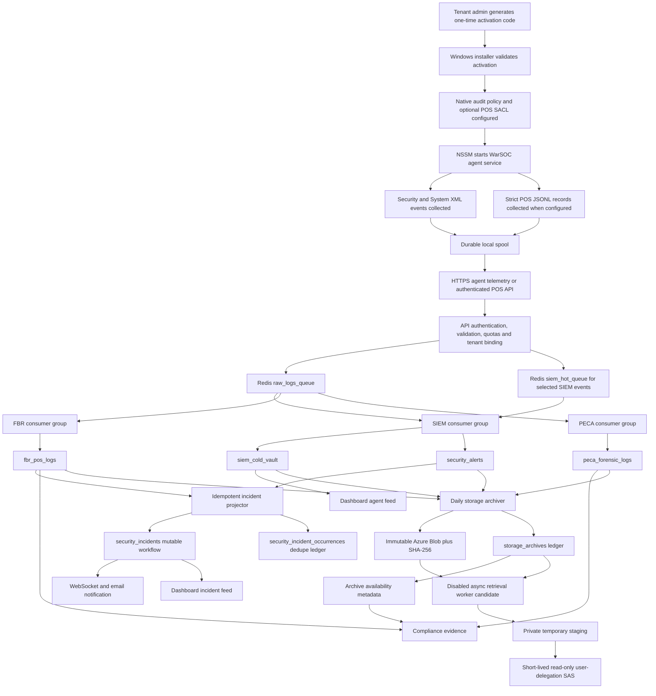
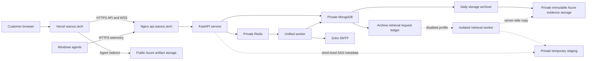

# WarSOC Current-State Architecture and Operational Contract

**Document status:** Authoritative as-built map
**Snapshot date:** 2026-08-30
**Scope:** Windows agent, ingestion, Redis, SIEM, FBR, PECA, MongoDB hot storage, Azure cold storage, retrieval, reports, dashboard, RBAC, email, deployment, launch proof, the controlled pfSense network-relay path, and the controlled Wazuh shadow-detector path.

**Current OCI application identity:** `5664dc8`
**Always-on Wazuh deployment foundation:** `7cd02e0`
**Repository note:** the manager-only deployment package changes the Wazuh runtime boundary; it does not replace the core application image identity
**Current Vercel frontend identity:** `67162a3`

This document describes what the current source code does. It is not a sales claim and it does not treat an implemented path as production-proven unless verification evidence exists.

## 1. Current Verdict

WarSOC currently has a coherent end-to-end architecture. The application enforces both a maximum of 50 Windows agents per tenant and a default hard ceiling of 50 active agents across the current shared deployment. The second limit protects the 8 GiB single host and prevents several tenants from each consuming 50 seats:

1. A tenant admin generates a one-time activation code.
2. The Windows installer validates that code, configures native Windows auditing, and installs the agent as an NSSM service.
3. The agent collects native Windows Security and System events, maintains a durable local spool, and sends authenticated telemetry over HTTPS.
4. Redis Streams buffer each accepted event for independent SIEM, FBR, and PECA consumers.
5. SIEM creates immutable detection evidence and projects actionable detections into a separate mutable incident workflow.
6. PECA creates signed and encrypted forensic evidence for the entitled 11-control catalog.
7. FBR creates encrypted invoice evidence and database-file tamper evidence for the entitled six-control catalog.
8. MongoDB holds seven days of operational SIEM, PECA, and FBR data.
9. The storage archiver uploads expired hot records to immutable Azure Blob storage, verifies integrity and immutability, writes a Mongo archive ledger, and only then removes the Mongo copies.
10. Normal compliance views, search, CSV exports, and PDF reports read bounded hot Mongo data and archive-ledger availability. Historical bytes require the feature-gated asynchronous retrieval workflow.
11. The dashboard separates normal endpoint telemetry, immutable detection evidence, and mutable operator incidents.

The public Azure artifact is Windows agent `4.2.10` at the approved versioned
artifact URL. Its installer SHA-256 is
`DAC9991A6CDA6E802E0DF6C2E70B5A6BDCFA1096A41E2142070BE6154A6E6ACF`.
The production backend requires signed endpoint events. The executable is still
not Authenticode publisher-signed, so exact-hash verification remains a pilot
control rather than an enterprise publisher-trust claim.

The last complete exact-machine native workflow remains the 2026-07-21 `4.2.6-Native-Signed` run: enrollment, fresh heartbeats, SIEM alerting, PECA Event 4688 evidence, FBR invoice evidence, native FBR database-deletion correlation, 7,191 verified endpoint signatures and zero rejected signatures. Agent 4.2.8 preserves that architecture and adds the bounded DTD/entity-rejecting Windows XML parser guard plus bounded historical spool replay. Existing 4.2.6 agents remain compatible only while the backend permits their signed event format; new installations use 4.2.8.

The network-relay backend is enabled under tenant entitlement, with pfSense as
the only validated commercial vendor. The current relay executable is
30,189,810 bytes with SHA-256
`16DCDCF382F0587BE50BCCE2FED1AA306ED4CF2B280D1A3727847B1BF5496B3C`.
Its source/build manifest reproduces exactly. The setup workflow now creates a
strict source/listener contract, a server-validated `relay-config.json`, and a
separate one-time activation secret. The generic setup kit contains neither.
The relay and bundled NSSM binary are not Authenticode-signed, so the generated
kit is lab-only until publisher signing and final artifact publication pass.

The complete clean backend campaign closed with 570 passed, one explicitly
skipped and zero assertion failures on 2026-08-30. The skip is the opt-in
isolated-stack destructive E2E harness. `pip check`, `pip-audit`, Python
compilation, production Compose parsing, generated API inventory, high-severity
Bandit and diff hygiene also passed. Frontend lint, production build and
high-severity dependency audit passed. Backend `5664dc8` is deployed on OCI and
healthy; frontend `67162a3` is live on Vercel. The public relay contract is live,
and its authenticated status and setup-package routes are present. Package
availability remains false until a signed versioned setup ZIP is published.

### 1.1 SIEM architecture and scope decision (2026-08-02)

WarSOC follows the same logical layers used by mature SIEM platforms, but it does
not claim their source breadth, scale, or product maturity:

| SIEM responsibility | WarSOC owner | Current boundary |
|---|---|---|
| Collection | Windows agent; entitled customer-side pfSense relay | Native Windows Security/System events are active. The relay accepts source-restricted pfSense syslog on the customer LAN and sends signed HTTPS batches; no public cloud syslog listener or PCAP is used. |
| Parsing and normalization | Windows XML parser, POS JSONL parser, network vendor parsers | Network parsers are candidate-only. No packet payload or PCAP is collected. |
| Buffering | Redis Streams with independent consumer groups | SIEM, FBR, and PECA acknowledge independently. |
| Detection and correlation | `siem_worker.py`, `siem_logic.py`, `siem_catalog.py` | Rules run only when their required trusted telemetry family and fields exist. |
| Evidence projection | `siem_cold_vault`, `fbr_pos_logs`, `peca_forensic_logs` | Evidence remains event-granular and separate by purpose. |
| Operator incidents | `security_incidents` and occurrence ledger | Repeated detections are grouped for operations without deleting evidence. |
| Console and reporting | API, WebSocket, dashboard, CSV/PDF exports | Tenant and role boundaries apply to every read/export path. |
| Hot/cold storage | Seven-day Mongo hot tier and immutable Azure archive | Archive retrieval remains feature-gated until its production acceptance is complete. |

The capacity contract has two independent limits:

- Every tenant has a contracted `max_agents` value, capped at 50.
- The shared deployment has an atomic `PLATFORM_ACTIVE_AGENT_LIMIT=50` across all tenants.
- Examples such as 30 agents for tenant A, 10 for tenant B, and 10 for tenant C exhaust the shared host. A further registration must fail even when that tenant still has contractual seats.

The focused Docker-backed architecture suite was rerun on 2026-08-02 with the
actual password-protected Redis service. After the detector-provenance, public
error-contract, and service-install correlation patch, it closed with 89 passed
tests covering rule contracts, source isolation, per-tenant and shared endpoint
limits, atomic activation, relay admission/correlation while feature-gated,
incident isolation/workflow, provenance bounds, validation-error sanitization,
and Event 4697/7045 incident identity. An earlier run that connected to Redis
without its password was an invalid environment run, not a product failure.
An additional 33 native-detection and incident-presentation tests passed in a
separate focused run, including Redis-backed FBR retry/correlation behavior and
Windows event normalization. These runs validate working source against local
Docker dependencies; they do not replace post-deployment production acceptance.

### 1.2 Detection ownership and claim boundary

| Domain | Current truth source | What may alert | What must not be claimed |
|---|---|---|---|
| SIEM | Trusted normalized Windows events and approved imported web/network metadata | Direct high-risk events, precise command patterns, and Redis-backed multi-event correlations | WarSOC does not detect every attack or inspect plaintext passwords. |
| PECA | The entitled 11-event native Windows catalog | Inherently dangerous controls alert through SIEM; normal controls remain evidence/correlation context | The 11 controls are a WarSOC evidence profile, not statutory text or blanket PECA certification. |
| FBR | Strict `FBR-INV-MOD`/`FBR-INV-DEL` application records plus configured POS/database FIM | Valid invoice changes and confirmed protected database deletion/permission tamper | Native file telemetry is not invoice truth, and no POS path means no FIM coverage. |

Windows does not expose a user's plaintext password to WarSOC. A defensible
credential-access capability can observe credential validation, explicit
credential use, known credential-dumping process behavior, and a future
contextual Credential Manager read signal. Event 5379 is not collected in the
current release and must not be advertised. If approved later, it must be
evidence/correlation input first, not a direct alert, because legitimate
Credential Manager activity can be frequent.

General file-read monitoring is also not a current claim. Event 4663 is emitted
only for objects with a matching SACL, and the installer deliberately applies
delete/change-permission auditing only to configured POS paths. Broad read SACLs
would create excessive volume. File and directory discovery should therefore be
detected from high-context Event 4688 process behavior, not from every normal
`dir` or file-open operation.

Event 4688 command lines can themselves contain credentials or other sensitive
arguments. WarSOC currently redacts common secret assignments in operator-facing
alert context, while the event-granular SIEM vault preserves the raw source fields
for forensic use. Unlike the FBR and PECA evidence collections, the SIEM raw
fields do not currently use the application-level Fernet field-encryption layer.
Access control and infrastructure encryption at rest are necessary but do not
replace a documented raw-evidence privacy decision.

### 1.3 Approval-gated current-scope hardening

The statuses below describe the working source, not the deployed production
release:

1. **OPEN:** Align collection policy with declared rules. Event 4776 requires Credential Validation auditing; Event 5140 requires File Share auditing; Event 4657 requires a Set Value SACL on approved registry keys. Kerberos Events 4768/4769 are domain-controller telemetry and must not be promised for normal workstations. File Share and domain-controller profiles need explicit volume acceptance rather than blanket enablement.
2. **IMPLEMENTED / LOCAL-PROVEN:** Every persisted SIEM, FBR, DLQ, correlation, and legacy-detector finding receives internal `rule_id`, `rule_version`, `detector_module`, required telemetry family, and bounded non-raw evidence references. The provenance schema is `detector-provenance-v1`.
3. **NOT APPROVED:** Event 5379 remains outside collection and claims. If approved later, it must be credential-access evidence/context with noise measurement, never password disclosure.
4. **NOT APPROVED:** A future file-discovery rule must be limited to recursive or sensitive-path enumeration from unusual process/privilege context. Ordinary Explorer and shell listing must not alert.
5. **IMPLEMENTED / LOCAL-PROVEN:** Security Event 4697 and System Event 7045 use one canonical `WINDOWS_SERVICE_INSTALLED` incident identity when tenant, endpoint, service identity, and the bounded five-minute window match. The original event-granular records and both event references remain separate; only the operator incident is grouped.
6. **IMPLEMENTED / LOCAL-PROVEN:** HTTP failures now return a backward-compatible `detail` plus a stable `error.code`, generic/safe message, and request ID. Validation responses do not expose Pydantic field names or internal schema errors. Full details remain in server logs under the request ID.
7. **OPEN:** Decide and implement the SIEM raw-evidence privacy boundary: application-level encryption for raw message/event fields, minimal normalized searchable fields, authorized decryption, and a bounded idempotent migration. Measure search and worker cost before release.

Items 2, 5, and 6 still require deployment of the reviewed commit and production
acceptance before they become production-proven. Items 1 and 7 require separate
approval because they change telemetry volume, search behavior, or evidence
privacy. Items 3 and 4 remain explicitly outside the current patch.

### 1.4 Future firewall onboarding boundary

Network-device support remains a disabled module. The approved business flow is:

1. Record the customer's vendor, model, firmware, device count, expected EPS, NTP state, and approved source addresses.
2. Install a separate WarSOC Relay on an approved Windows Server or back-office host, not silently on a POS terminal.
3. Configure each firewall to send metadata-only syslog over the customer LAN to the relay.
4. Enroll the relay with its own Ed25519 identity; an endpoint activation code is not valid for a relay.
5. Apply source allowlists, per-device/global rate limits, bounded encrypted evidence/control spools, and signed HTTPS batches.
6. Admit batches only after tenant, relay, source, signature, sequence, quota, and queue-capacity validation.
7. Prove parsing and timestamps on every offered physical vendor, then prove endpoint/network correlations and loss reporting.
8. Enable `NETWORK_RELAY_ENABLED` only for the accepted tenant after rollback and retention checks pass.

Supported candidate parsers exist for Fortinet, Cisco ASA, MikroTik, and pfSense.
Parser unit tests and simulated correlations do not equal real-device proof.

### 1.5 Wazuh detection target boundary

`WARSOC_WAZUH_DETECTION_TARGET_ARCHITECTURE.md` defines the reviewed contract for
using the Wazuh manager as a replaceable generic detection subsystem. On
2026-08-28, backend `3a35e3f` activated the controlled shadow path. The first
acceptance used a temporary colleague-hosted Compute B. That dependency has now
been removed: pinned Wazuh manager 4.14.7 and the WarSOC bridge run as bounded,
isolated containers on the always-on OCI host. Dispatcher-to-bridge and
bridge-to-candidate traffic uses private Docker DNS with mutual TLS and signed
requests. Candidate and bridge administration bind only to the OCI Tailscale
address. The Wazuh manager has no host port; indexer, dashboard, enrollment,
API, Wazuh agents, Active Response and Wazuh email are absent or disabled.

The active registry is `warsoc-projected-shadow-v1`. It permits only four
minimized Windows projections: Event 1102/rule 100511 (`audit_log_cleared`),
4625/100512 (`authentication_failure`), 7045/100513
(`service_installation`), and 4688/100514 (`process_creation`). All four are
shadow-only in this deployment. `WAZUH_DETECTION_MODE=shadow` and
`WAZUH_PRIMARY_APPROVED=false` prevent incident promotion. The current WarSOC
SIEM remains authoritative. Wazuh must not own
endpoint enrollment, tenant identity,
canonical evidence, FBR, PECA, incidents, storage, retrieval, customer access,
or response. Wazuh remains hidden from customer APIs and UI.

The hardened bridge foundation uses encrypted byte/age-bounded spools, bounded
retry and receipt metadata, truncation/digest-safe `alerts.json` checkpoints,
strict per-source projection fields, opaque tenant correlation HMACs, candidate
event-time validation, pinned registry hashes, signed health/loss records and
stage counters. A controlled Event 4625 canary completed canonical persistence,
durable dispatch, Wazuh rule 100512, signed candidate return, WarSOC lineage
validation and shadow persistence with zero incident promotion. This proves the
approved transport and one positive family path; it is not broad Wazuh rule
quality, capacity, high-availability or customer-firewall acceptance.

### 1.6 August 14 release-candidate verification delta

The August 14 work changed bounded query behavior and frontend failure handling; it did not enable Wazuh, network relay, or archive self-service:

1. **Seven-day hot search:** the previous `(timestamp DESC, _id DESC)` sort could not use the existing `(tenant_id, timestamp DESC)` index completely. A production-shaped explain examined 471,571 matching SIEM records and the public request took approximately 8.96 seconds, leaving almost no margin under the browser's ten-second timeout. Backend `d92fb65` now sorts hot records by the indexed time field only. The corresponding index plan examines the requested page rather than the complete seven-day tenant window.
2. **Dashboard failure state:** frontend `6ffc9e0` switches to historical mode only after a successful response. A timeout or network failure keeps the current live/history rows visible and shows a generic retry message instead of replacing the dashboard with an empty result.
3. **Frontend startup:** route-level lazy loading removed the fixed preloader delay. The initial production bundle fell from approximately 1,835.83 kB minified / 569.27 kB gzip to 291.20 kB / 96.90 kB. The separately loaded dashboard chunk remains approximately 1,456.16 kB / 447.05 kB and is a measured optimization target, not a hidden launch claim.
4. **Focused regression:** 208 unique active-scope tests passed. This includes hot search, user journeys, agent and platform quotas, security/error contracts, team invitation, FBR, PECA, archive, pricing, sales, deployment, and stream-retention paths. Two initially failing Redis-backed cases passed when rerun against the required authenticated local Redis; the earlier unauthenticated run was an environment mismatch.
5. **Current Windows state:** the exact workstation reports `WarSOC_Agent` running automatically as LocalSystem with version `4.2.8-Native-Signed`, healthy Security/System channels, configured native audit policy, one configured POS SACL path, no parse/channel/spool errors, an empty unblocked spool, a 500 MiB spool ceiling, and more than 71 GiB free disk.
6. **Observed active data:** the same tenant recorded 16,529 SIEM events, 25 alerts and 3,650 PECA records in the last 24 hours. Its seven-day hot window contained 480,407 SIEM records, 370 alerts, 125,753 PECA records and 7 FBR records. These are operational observations, not load-capacity certification.
7. **FBR truth:** the seven-day vault contains five `FIM-DB-MOD` and two `FBR-INV-MOD` records. Zero fresh FBR records in the last 24 hours is expected when no qualifying POS file tamper or signed invoice operation occurs. Native POS-path FIM proves protected-file activity; invoice semantics still require the documented POS JSONL/API contract.
8. **Azure read proof:** the running storage archiver reported no archive/immutability/critical error in the observed 24-hour window. A read-only retrieval of the latest PECA archive downloaded 31,205,879 bytes for 1,039 records, matched the ledger payload SHA-256 and companion hash blob, and confirmed container-scoped immutability. No archive byte was proxied through the API or written to the application host.

At that dated checkpoint, the unresolved boundaries included disabled Wazuh shadow integration. The later 2026-08-28 activation in section 1.14 supersedes only that Wazuh statement; the other boundaries remain independently governed.

### 1.7 August 20 FBR/PECA Phase 0 truth hardening

Phase 0 corrected compliance terminology and governance without changing event
routing, workers, retention numbers, storage, or historical evidence. Its
retention snapshot is superseded for new evidence by the August 24 PECA
retention decision. The PECA pack is now named `WarSOC PECA Evidence Pack`; it no longer claims a mapping
to PECA Section 46. The FBR pack is now `WarSOC FBR POS Evidence Readiness` and
states that WarSOC is an independent evidence platform, not an FBR-licensed
integrator or invoice-submission system.

`app/utils/compliance_legal_registry.py` records legal instrument status,
regime, official source, source version, verification date, and claim scope.
S.R.O. 288(I)/2026 remains recorded as a draft Income Tax instrument, not a
final Sales Tax POS authority. The eleven PECA and six FBR controls now publish
required telemetry, evidence purpose, source class, legal references,
applicability, claim state, and explicit proof limitations. Evidence API rows
separate `evidence_state` from `claim_state`.

`scripts/generate_api_security_inventory.py` produces the internal route/RBAC/
tenant artifact at `docs/generated/WARSOC_API_SECURITY_INVENTORY.json` without
enabling public API documentation. The detailed Phase 0 contract and explicit
non-goals are in `WARSOC_FBR_PECA_PHASE_0_TRUTH_MAP.md`.

### 1.8 August 20 Wazuh/firewall RC2 backend closure

The RC2 backend foundation is code-complete and locally regression-proven, but
it remains production-disabled and is not equivalent to customer acceptance.
The closure patch enforces these boundaries:

1. A native Wazuh candidate can link only to the same tenant and bound WarSOC
   endpoint, with an exact Windows record/event/channel match, recent canonical
   evidence, `signature_verified=true`, and `source_assurance=agent_signed`.
2. Missing or ambiguous canonical evidence cannot create an incident. Primary
   promotion requires `WAZUH_DETECTION_MODE=primary`, global
   `WAZUH_PRIMARY_APPROVED=true`, an approved registry family, and complete
   lineage. The only approved RC2 family is `audit_log_cleared`; authentication
   failure, service installation, and process creation remain shadow families.
3. An approved candidate enters the normal WarSOC incident projector rather
   than creating a second Wazuh-shaped incident schema. Internal detector
   provenance is retained for audit, while customer APIs identify the incident
   authority as WarSOC and do not disclose the detector vendor or raw rule ID.
4. Native-alert deduplication uses the exact canonical event UID. Same-tenant,
   different-endpoint records cannot satisfy candidate lineage or merge merely
   because they share a category or source address.
5. Relay entitlement defaults to zero per tenant and is capped by the platform
   setting. `GET /api/v1/network-relay/status` now returns the authoritative
   capability object plus nested relay/device state for frontend gating.
6. Compliance database/index initialization fails startup visibly when a
   critical schema operation fails. Conflicting-index cleanup ignores only
   MongoDB's explicit `IndexNotFound` race; other failures are not swallowed.
7. The maintained suite passed 446 tests with one isolated destructive test
   skipped. Focused post-patch checks passed, Python compilation and
   `git diff --check` passed, Bandit reported no finding in the changed backend
   files, and the local Redis/Mongo/API/Git validation script passed.

A local frontend correction candidate based exactly on authoritative frontend
`6ffc9e0` now follows the relay contract: it reads `capability` and
`relays[].devices[]`, sends the complete relay/device activation request,
derives allowed vendors and management visibility from the backend, and keeps
the workspace behind both the deployment kill switch and successful tenant
entitlement. It also reads tenant retention from
`/compliance/retention/status` and removes fixed FBR/PECA vault claims. ESLint,
the production Vite build and focused source assertions pass. This candidate is
not pushed or deployed; the backend must remain disabled until paired runtime
acceptance passes.

### 1.9 August 20 P0 evidence-integrity closure

This source candidate closes the current evidence-admission gap without enabling
the relay, Wazuh, archive retrieval, or any new customer feature. Its deployment
state is **SOURCE-ACCEPTED / NOT PRODUCTION-DEPLOYED**.

1. Legacy UDP syslog is classified as `legacy_syslog` and remains SIEM-only. It
   cannot create PECA or FBR evidence, even if a sender supplies forged source or
   signature labels.
2. Signed Windows endpoint events are `signed_windows_agent`; signed POS HTTP
   bodies are `authenticated_pos`; relay batches are `relay_attested_network`.
   Only the first two classes are eligible for the applicable current compliance
   evidence paths.
3. Endpoint, POS, and disabled-relay admission persists an encrypted canonical
   source envelope in MongoDB before Redis dispatch becomes ready. The durable
   outbox references the encrypted envelope instead of storing a second plaintext
   payload.
4. Redis publication is leased, retryable, idempotent by source/event identity,
   and bounded by the raw-stream entry ceiling. Canonical source envelopes are
   archive-before-delete evidence; only published transport-ledger rows receive a
   post-publication TTL.
5. This historical checkpoint introduced fail-closed FBR tax-period metadata.
   Section 1.11 supersedes that product decision: new FBR evidence now uses the
   tenant's normal retention entitlement and legacy records are not rewritten.

The maintained backend suite passed 462 tests with one expected skip. Focused
failure, replay, source-isolation, retention, archive, and Redis-retry tests are
recorded in `WARSOC_P0_EVIDENCE_INTEGRITY_CLOSURE_2026-08-20.md`.

### 1.10 August 20 backend evidence-program implementation

The P0 closure has since been extended in source without enabling a new customer
feature. Legacy period-aware FBR utilities, explicit legal/proceeding holds, bounded
archive cohorts and pre-delete hold fences, SIEM sensitive-field encryption,
evidence claim evaluation, case/custody state machines, deterministic signed
evidence packages, an isolated package-export worker, an optional daily Azure
root commitment, a disabled synthetic FBR reconciliation contract, and an
independent authorization-policy manifest now exist.

All operationally sensitive additions remain disabled or require explicit
infrastructure configuration. They are **not production-deployed** and do not
prove live Azure behavior, a real POS database/integrator connection, Wazuh or
relay promotion, or frontend completion. The exact implementation and remaining
gates are recorded in
`WARSOC_BACKEND_EVIDENCE_PROGRAM_IMPLEMENTATION_2026-08-20.md`.

The initial August 20 local checkpoint passed 520 maintained tests with one explicitly opt-in
destructive E2E test skipped. Python compilation, production Compose parsing,
route-inventory generation, diff hygiene, high-severity Bandit scanning, and
local Redis/Mongo/API connectivity also passed. This is source regression proof,
not production or live-Azure acceptance.

### 1.11 August 24 release-candidate condition

This section supersedes earlier current-state numbers without deleting their
historical evidence.

1. **Backend source:** the complete evidence-program, source-envelope,
   tenant-entitlement FBR retention, custody, privacy and disabled Wazuh/relay changes exist
   in the local release candidate based on `6c3900f`. They are not yet one
   pushed release commit.
2. **Regression:** one uncontaminated full run passed 523 tests with one
   explicitly skipped destructive isolated-stack test and 44 deprecation
   warnings. Dependency consistency/audit, compile, Compose, Bandit,
   authorization inventory and diff checks pass.
3. **Identity and secrets:** normalized case-insensitive uniqueness is enforced
   in application and Mongo index contracts after a live duplicate audit found
   no conflicts. Candidate production startup rejects short JWT and platform
   administrator secrets without printing them.
4. **Agent:** 4.2.9 extends the signed endpoint envelope with collection time,
   channel, epoch and sequence continuity and reports signed coverage in the
   heartbeat. It preserves the bounded spool, XML parser guard and POS source
   contract. The local installer and manifest are built, but the installer is
   unsigned and not yet on the public Azure artifact path.
5. **Production:** the pre-candidate backend `d92fb65` reports healthy Mongo and
   Redis dependencies and the expected containers. Optional network relay,
   Wazuh, evidence export, daily anchor and FBR reconciliation remain disabled.
6. **Azure:** the deployed private evidence account uses a historical fallback
   container declared at 2,190 immutable days. Candidate code selects the
   duration-aware general-retention route for new FBR and PECA evidence from
   `tenants.retention_days`, but the duration-specific production environment
   routes remain unconfigured. Until those routes are created, locked and
   enabled, the fallback over-retains rather than deleting early. Existing
   blobs and legacy Mongo rows remain untouched.
7. **Compliance catalog:** PECA remains 11 endpoint evidence controls and FBR
   remains six POS-semantic/FIM controls. Catalog version
   `2026-08-24.tenant-retention-v4` exposes tenant-entitlement FBR and PECA retention.
8. **Claim boundary:** WarSOC provides technical evidence support. It does not
   prove blanket PECA/FBR compliance, submit invoices to FBR, act as a licensed
   integrator, infer invoice rows from file changes, or treat normal Windows
   administrative activity as an attack without rule context.

The current release condition is therefore:

```text
local backend candidate       ACCEPTED
local frontend build/security ACCEPTED
agent 4.2.9 build/manifest    ACCEPTED
publisher signature/CDN       OPEN
candidate production deploy   OPEN
live role and pipeline proof  OPEN
FBR/PECA duration routing     CODE COMPLETE / CLOUD ROUTES PENDING
Wazuh shadow                  ACTIVE / PRIMARY DISABLED
network relay                BACKEND ENABLED / SIGNED CUSTOMER KIT OPEN
```

### 1.12 August 24 PECA retention product decision

New records in the `WarSOC PECA Evidence Pack` inherit the tenant's existing
`retention_days` entitlement. They remain operationally hot in Mongo for seven
days and then use the matching `GENERAL_<days>` Azure route. The ingestion
boundary stamps `retention_model=TENANT_ENTITLEMENT_V1` on both the canonical
source envelope and derived PECA evidence. The archiver selects only records
with that marker, verifies Azure integrity and immutability, writes the archive
ledger, rechecks holds, and only then deletes exact hot-copy IDs.

Unmarked historical PECA rows and existing locked Azure blobs are not rewritten,
rerouted, shortened, or deleted by this release. Pending pre-release queue
entries without a trusted tenant-retention snapshot are preserved with manual
review state and excluded from automatic archival. This product decision does
not change the 11 controls and does not claim that endpoint forensic evidence is
PECA section 32 service-provider traffic data.

### 1.13 August 26 release-validation delta

The PECA retention correction has source-level release evidence, but it is not
yet runtime-accepted on a real isolated Redis/Azure stack:

1. The exact candidate collects 533 maintained tests. The previous 523-test
   clean campaign remains historical evidence for the earlier candidate.
2. A structurally selected service-independent campaign passed 323 tests with
   zero assertion failures. A focused retention/evidence plus relay/Wazuh
   campaign passed 175 tests. The archive tests include upload/immutability
   failure preserving Mongo and an active-hold recheck preserving both PECA and
   FBR hot copies.
3. Python compilation, production Compose rendering, diff hygiene, forbidden
   tracked-file checks, the 122-route authorization inventory and high-severity
   Bandit scanning passed. The inventory has zero manual-review routes.
4. The current frontend at `origin/main` passes ESLint and a production Vite
   build. Its dashboard chunk remains 1,377.61 kB minified / 428.65 kB gzip.
5. The local frontend correction candidate now matches the relay capability,
   nested status and complete activation contracts. Its source/build gates pass;
   authenticated activation, registration, status, revocation/recovery and
   role-negative checks remain paired runtime acceptance work.
6. The local frontend correction candidate now uses the tenant entitlement
   returned by `/compliance/retention/status` in compliance, pricing, quote and
   legal views. It displays unavailable when the authority endpoint fails and
   no longer invents a PECA/FBR duration. Deployment proof remains open.
7. The local pfSense lab address answers ICMP, but HTTPS was not reachable and
   the earlier synthetic route was absent during this run. The Wazuh host is a
   separate colleague machine and was not reachable from this validation
   session. Source/lab evidence remains valid; neither physical path received a
   fresh all-to-all acceptance.
8. On August 26 Docker/Redis access was denied to the validation sandbox, so
   the complete Mongo/Redis run was then open. This test-suite limitation was
   superseded on August 29 by the clean 563-test campaign recorded in section
   1.15. The controlled Azure PECA archive success/failure/hold exercise remains
   a separate production-environment gate.
9. Local production-shaped Azure configuration exposes only the existing
   fallback route. No `GENERAL_90/180/270/360` route is available for a safe
   isolated success test. Existing production/locked evidence was not touched.

This delta does not enable network relay, Wazuh or archive retrieval and does
not approve production deployment. The exact closure commands and evidence
requirements are recorded in `WARSOC_RELEASE_VALIDATION_2026-08-26.md`.

### 1.14 August 28 controlled Wazuh shadow activation

The Wazuh candidate detector is now active only as a private, shadow-only
subsystem. The activation does not change the native SIEM, FBR, PECA, incident,
archive or customer UI authorities.

1. Backend `3a35e3f` is deployed on OCI. Deployment foundation `7cd02e0`
   supplies a digest-pinned ARM64 Wazuh manager 4.14.7 and non-root bridge.
2. Runtime detector hops use private Docker networks, mutual TLS and signed
   request contracts. Candidate and bridge health endpoints bind only to the
   OCI Tailscale address; public access is blocked and unauthenticated TLS is
   rejected. The Wazuh manager publishes no host port.
3. The pinned ruleset contains only rules 100511 through 100514. No stock rule
   can cross the bridge without an approved dispatch UID and registry match.
4. Two fresh Event 4625 canaries completed after OCI cutover. Each delivered on
   the first outbox attempt, fired rule 100512, returned a lineage-complete
   `shadow_observation`, created zero incidents and left zero canary records
   after cleanup. The second passed after the laptop stack was stopped.
5. Runtime fixes closed standalone seed import resolution, TLS/alert-volume
   permissions, deterministic persisted-manager configuration, direct
   read-only rule mounting, and same-host private-DNS routing.
6. The maintained 55-test Wazuh/deployment selection and four manager-only
   deployment contract checks pass. Core API, MongoDB and Redis remained
   healthy; recent manager, bridge, dispatcher and candidate logs contain no
   error or critical entries.
7. Primary mode remains prohibited: `WAZUH_PRIMARY_APPROVED=false`. Wazuh Active
   Response, email, customer agents, FBR/PECA ownership and customer-visible
   provenance remain disabled.
8. Customer detection no longer depends on either laptop. The previous laptop
   manager, bridge, indexer and dashboard are stopped with restart disabled and
   preserved only for rollback. The OCI deployment is still one physical host,
   so it removes laptop availability risk but does not provide host-level HA.
   Certificates still require scheduled rotation and the bounded manager-only
   topology must be monitored under real event volume.
9. Firewall metadata is not projected to Wazuh. `NETWORK_RELAY_ENABLED=false`
   remains unchanged and its independent packaged-service, customer-device and
   pilot gates remain open.

### 1.15 August 29 network-relay reliability closure candidate

The backend candidate closes the remaining relay control-plane consistency
gaps without changing the firewall evidence schema or enabling production:

1. The Mongo tenant document is the canonical relay grant. Redis is a
   restrictive hot-path mirror; enforcement uses the lower valid value, so a
   stale-high cache cannot authorize an additional relay.
2. Platform-admin entitlement changes acquire a tenant-scoped Redis lease
   before reading or updating state. Concurrent writers receive `409`, Redis
   outages fail `503`, and failed Mongo changes restore or remove the cache so
   resolution falls back safely.
3. Relay watchdog alerts persist channel-level delivery state in
   `security_alerts`. Incident, dashboard-stream, and email failures remain
   pending and are retried by later cron cycles; the watchdog interval is
   bounded to 30-86,400 seconds when the feature is enabled.
4. The public relay compatibility contract remains feature-gated and now has
   static inventory evidence for its `10/minute` rate limit.
5. The API inventory and relay build-manifest generators are explicit Git
   deliverables. Generated executables, spools, local relay configuration and
   per-build output remain excluded.

Candidate validation on August 29 completed with `563 passed, 1 skipped` in
the full maintained backend suite. Bandit reported no high-severity,
high-confidence findings, `pip-audit` reported no known dependency
vulnerabilities, Python compilation and PowerShell parser checks passed, and
`git diff --check` found no whitespace errors. Pytest now defaults to Redis
database 14 (override with `TEST_REDIS_DB` or `TEST_REDIS_URL`) so a live local
release-validation worker on database 15 cannot join test consumer groups or
remove SIEM/PECA events from the acceptance run.

This is source and integration-test evidence only until the exact candidate is
committed, deployed and accepted against the production environment.

## 2. Product Boundary

### 2.1 What WarSOC currently provides

- Native Windows endpoint telemetry without Sysmon.
- Windows Security and System event collection.
- Stateless signatures and contextual/stateful SIEM detection.
- Live alert delivery through authenticated WebSockets.
- Alert acknowledgement, closure, notes, and incident occurrence tracking.
- IP/CIDR mitigation with active-agent and self-lockout guards.
- FBR invoice evidence through strict JSONL or authenticated API ingestion.
- FBR database file-integrity monitoring when POS/database paths are configured.
- PECA forensic evidence for 11 native Windows controls.
- Tenant isolation and role-based access.
- Seven-day Mongo hot storage for operational SIEM, FBR, and PECA data.
- Immutable Azure archive storage with hashes and an archive ledger.
- Hot compliance/search/export paths plus archive availability metadata; historical blob retrieval is implemented but disabled pending Azure and UI acceptance.
- Email queue processing for configured operational messages and high/critical alert notifications.
- Manual B2B sales, manual payment/invoicing, and administrative tenant provisioning.

### 2.2 What WarSOC does not currently provide

- It does not automatically understand proprietary POS database schemas.
- It does not create invoice-level FBR evidence unless the POS vendor writes the required JSONL records or calls the authenticated POS API.
- It does not provide FBR file-integrity monitoring when no POS/database directory is configured.
- It does not replace endpoint antivirus or EDR.
- It does not require customers to disable Windows Defender.
- It does not use Safepay or self-service payment for the current commercial flow.
- It does not use Sysmon.
- It does not currently ingest Linux endpoint telemetry. The separate network relay does not change that boundary.
- The entitled customer network relay is enabled for the validated pfSense path. Fortinet, Cisco ASA and MikroTik parsers remain implemented but are not commercially offered without separate real-device acceptance. The setup kit remains lab-only until publisher signing and versioned artifact publication pass.
- It does not guarantee that every normal Windows event becomes an alert. Normal events are evidence and correlation inputs; only dangerous or contextually suspicious activity alerts.
- It does not make a PDF cryptographically signed. The PECA source records contain the forensic signatures; the PDF is a human-readable summary.
- It does not automatically email an agent installer link to analysts. Agent activation and download are tenant-admin actions.
- Manual log injection is disabled by default in production and returns 404 unless operations explicitly enables `ENABLE_MANUAL_LOG_INJECTION` for a controlled exercise.

### 2.3 Controlled pfSense network relay

The relay is documented in `NETWORK_RELAY_BACKEND_FOUNDATION.md`. It does not change the Windows endpoint path, public ports, FBR truth sources, PECA catalog or retention. The frontend uses the exact device/listener request, nested status, entitlement and role contracts in `WARSOC_FIREWALL_WAZUH_FRONTEND_BUILD_GUIDE.md`. The backend feature switch is enabled on OCI; tenant entitlement remains fail-closed and defaults to zero.

Candidate capabilities include separate relay identities, retry-safe one-time activation, Ed25519-signed HTTPS batches, atomic Redis admission, strict Fortinet/Cisco ASA/MikroTik/pfSense metadata parsing, encrypted bounded evidence/control spools, encrypted raw cloud evidence, exact retry bodies, Windows DPAPI protection, NSSM lifecycle, revocation and dead-key recovery, per-device active/degraded/silent state, network-source isolation, receipt-time VPN spray detection, non-alert VPN-to-Windows context, and chronology-checked same-host high-risk-to-public-network correlation.

Only pfSense may be presented as validated. Customer release of the downloadable
kit still requires Authenticode signing, versioned artifact publication, and an
exact customer-host installation/heartbeat/event acceptance record.

## 3. End-to-End Data Flow



### 3.1 Disabled network-device candidate flow

This path exists in source but is not part of the enabled customer product:

```mermaid
flowchart LR
    ND["Registered firewall or VPN device"] -->|"LAN syslog metadata"| RC["Customer-side relay collector"]
    RC --> EL["Source allowlist, EPS and byte limits"]
    EL --> VP["Strict vendor parser"]
    VP --> ES["Encrypted bounded evidence spool"]
    EL --> CS["Independent encrypted control spool"]
    ES --> SB["Deterministic Ed25519-signed batch"]
    CS --> SB
    SB -->|"Authenticated HTTPS"| RA["Feature-gated relay API"]
    RA --> AV["Tenant, relay, device, schema, signature and chain verification"]
    AV --> AR["Atomic Redis admission"]
    AR --> NS["Network-source SIEM isolation"]
    NS --> HE["Network evidence and approved hybrid correlations"]
```



No packet capture or general network payload collection is performed. The candidate accepts metadata fields and the original syslog record under a strict vendor contract. Raw records are encrypted before Redis/Mongo persistence and excluded from list/search projections; normalized vendor messages are generated summaries rather than raw-body copies. UDP evidence is described as `relay_attested`, not device-authenticated, because legacy UDP devices do not cryptographically sign their messages.

## 4. Tenant and Commercial Flow

1. A prospect selects the desired endpoint count, compliance packs, archive request and billing preference on the website. The public flow does not display or create an authoritative price.
2. The prospect submits a quote request to `POST /api/v1/sales/request-quote`.
3. WarSOC contacts the prospect, agrees the scope, and issues a manual invoice outside the product.
4. An authorized WarSOC operator provisions the tenant through the protected admin provisioning API or the local operations console.
5. Provisioning creates the tenant, admin account, endpoint limit, compliance entitlements, retention value, and required cache/genesis state.
6. Credentials are transferred to the customer through the agreed secure onboarding channel.
7. Public self-service signup is configured to fail closed for the launch model.

There are no fixed product-tier names or public price formulas required by the operating flow. The tenant contract is defined by its endpoint limit, selected compliance packs, configured retention and manually agreed commercial terms.

## 5. Identity, Session, and RBAC Flow

### 5.1 Browser authentication

- Login endpoint: `POST /api/v1/auth/login`.
- Session identity is hydrated from `GET /api/v1/auth/me`.
- The browser uses secure cookie authentication and CSRF protection for state-changing requests.
- Logout invalidates the session.
- Frontend authentication state is centralized in the Zustand auth store.

### 5.2 Role matrix

| Capability | Admin | Manager | Analyst | Auditor |
|---|---:|---:|---:|---:|
| Operational dashboard | Yes | Yes | Yes | No |
| Read operational alerts | Yes | Yes | Yes | No |
| Acknowledge/close alerts | Yes | Yes | No | No |
| Mitigate IP/CIDR | Yes | Yes | No | No |
| Generate activation code | Yes | No | No | No |
| Download agent | Yes | No | No | No |
| Manage team | Yes | No | No | No |
| Read catalog metadata | Yes | Yes | Yes | Yes |
| Read sensor coverage | Yes | Yes | No | Yes |
| View FBR/PECA evidence | Yes | No | No | Yes |
| Export compliance evidence | Yes | No | No | Yes |

The frontend exposes the Compliance workspace to admin and auditor roles. The backend permits every authenticated role to read non-evidence catalog metadata, permits admin/manager/auditor to read coverage, and restricts evidence/export to admin/auditor. The backend enforces the sensitive role checks; hiding a frontend button is not treated as authorization.

### 5.3 Team management

- Create or resend a pending team invitation: `POST /api/v1/auth/invite`, admin only.
- Activate an invitation and choose a password: `POST /api/v1/auth/activate-invite`, public one-time-token endpoint.
- List team: `GET /api/v1/auth/team`, admin only.
- Remove team member: `DELETE /api/v1/auth/team/{user_id}`, admin only.
- Roles are assigned by the tenant admin within the backend's allowed-role policy.
- The invite response returns a 24-hour single-use HTTPS activation link once to the authenticated tenant admin with `Cache-Control: no-store`. Email delivery is attempted when SMTP is available; the admin can securely transfer the same link when it is not. The system never creates, returns or emails a temporary password.
- Invited users remain `pending` and cannot log in until the token is atomically consumed and a policy-compliant password is stored.
- Analysts do not receive agent enrollment authority merely because they can investigate alerts.
- New and changed passwords must contain at least 16 characters, an uppercase letter, a lowercase letter, a number, and a symbol; bcrypt-compatible input is capped at 72 UTF-8 bytes.

## 6. Agent Activation and Installation

### 6.1 Activation code

- Endpoint: `POST /api/v1/agent/generate-activation`.
- Caller: authenticated tenant admin.
- Format: `WARSOC-XXXXXXXX`.
- Default validity: 86,400 seconds (24 hours).
- The backend checks tenant status, contract state, and the maximum-agent seat count.
- The code is one-time enrollment material, not a permanent agent token.
- Installer validation endpoint: `POST /api/v1/agent/validate-activation`.
- Agent registration endpoint: `POST /api/v1/agent/register`.
- Successful registration binds the generated Ed25519 public key, tenant, and agent identity and returns agent credentials.
- The activation secret is scrubbed after enrollment.

### 6.2 Installer sequence

1. The admin selects Download Agent in the dashboard.
2. The frontend requests `GET /api/v1/agent/download`.
3. The backend returns a redirect to `AGENT_CDN_URL`.
4. Azure public artifact storage must serve the versioned `warsoc_installer-4.2.8.exe` artifact. The local release is 17,797,079 bytes with SHA-256 `04D594A771B0E7F047D4CFDFF5359AC83B8934E5C592D2843ADD59D276E72F67` and is covered by `pilot_hash_manifest-4.2.8.json`. Production acceptance must hash the downloaded CDN object and compare it with this manifest.
5. The installer asks for the activation code, confirms `https://api.warsoc.tech`, and optionally accepts local POS directories.
6. The installer validates the activation code before making the installation operational.
7. The native telemetry script configures auditing and optional POS SACLs.
8. NSSM installs and starts `WarSOC_Agent` with automatic restart and output rotation.

Random text must not successfully enroll an agent. An installer may copy files before validation failure, but it must not register a functioning agent without a valid, unexpired, unused tenant activation code.

### 6.3 Unsigned pilot artifact

The current installer is unsigned and may be flagged by Windows Defender or SmartScreen. The supported pilot procedure is:

1. Keep Defender enabled.
2. Calculate and distribute the exact SHA-256 manifest over a trusted onboarding channel.
3. Have the customer's IT administrator verify the downloaded file hash.
4. Apply an organization-approved hash allow rule through Defender, WDAC, or Intune where required.
5. Rebuild and redistribute the manifest whenever any packaged binary or script changes.

A code-signing certificate remains the correct long-term solution.

## 7. Native Windows Telemetry

### 7.1 Data sources

- Windows Security channel.
- Windows System channel, including Event 7045.
- Language-independent XML fields rather than rendered localized message text.
- Optional strict POS JSONL file at `%ProgramData%\WarSOC\pos_audit.log`.

### 7.2 Audit policy configured by the installer

- Logon: success and failure.
- Process Creation: success, with command-line inclusion for Event 4688.
- File System: success and failure.
- Registry: success and failure.
- Other Object Access: success and failure.
- Filtering Platform Connection: failure events for blocked connections.
- User Account Management: success and failure.
- Security Group Management: success and failure.
- Special Logon: success.
- Security System Extension: success and failure.
- Audit Policy Change: success and failure.

The installer stores the pre-existing audit/SACL state and removes only WarSOC-owned changes during uninstall.

### 7.3 POS directories

- POS directories are optional for general SIEM and PECA monitoring.
- They are required for native FBR file-integrity monitoring.
- Paths must be existing local absolute directories; UNC/network paths are rejected.
- WarSOC adds inherited SACL auditing for delete, child-delete, and permission-change actions.
- Supplied-path configuration failure aborts installation rather than silently claiming FBR coverage.

### 7.4 Agent health

Signed heartbeat data reports:

- Security channel state.
- System channel state.
- Audit policy state.
- Telemetry version.
- POS SACL path count.
- POS audit-log state.
- Last-seen and sensor state.
- Local spool usage, hard limit, free-disk reserve, backpressure state, and limit-hit count.

The backend stores the state on the agent record and exposes it through `GET /api/v1/data/status`.

Dashboard health means:

- `Active`: every registered non-revoked agent is reporting, required telemetry is healthy, and event signing is ready when production is in `required` mode.
- `Degraded`: at least one agent is reporting but a channel/audit/signing requirement is incomplete, local spool backpressure is active, or another registered agent is offline. An unconfigured optional POS feed is reported separately and does not invent FBR coverage.
- `Not Configured` or offline: no healthy enrolled reporting agent is available for the requested coverage.

The frontend Endpoint Fleet consumes this API decision directly. It shows seat use,
online/degraded/offline counts, native Security/System channel health, event-signing
readiness, FBR source readiness, spool pressure, version and last-seen time. It does
not infer compliance or signature readiness from local browser state.

## 8. Durable Agent Delivery

1. Windows events are normalized into the agent's local queue.
2. The event is durably appended to disk before its Windows watermark advances.
3. If durable spool writing fails, the watermark does not advance; the source event is not treated as delivered.
4. The agent sends batches to the HTTPS ingestion endpoint.
5. Transient failures leave records in the local spool for retry.
6. Malformed POS JSONL records are quarantined locally and are not guessed, relabelled, or sent as valid evidence.

7. `event_uid` is preserved across retries for backend idempotency.
8. The spool has a 500 MiB hard boundary, a 400 MiB recovery boundary, and a 2 GiB free-disk reserve by default.
9. Reaching either disk boundary pauses new durable collection, leaves existing unacknowledged records intact, and reports the endpoint as Degraded.

This is at-least-once delivery with event-level duplicate suppression, not fire-and-forget delivery.

### 8.1 Endpoint event authenticity

- Agent `4.2.6-Native-Signed` assigns the durable `event_uid` and timestamp before spooling, then signs the exact delivery payload with its enrolled Ed25519 key.
- Existing plaintext private keys are migrated to a Windows DPAPI-protected key file; new keys are never written as plaintext.
- The API verifies the canonical payload hash, agent identity, enrolled public key and Ed25519 signature before admitting a signed event to Redis.
- A supplied but invalid signature always fails with HTTP 401 and is never treated as a legacy event.
- `AGENT_EVENT_SIGNATURE_MODE=observe` accepts unsigned legacy agents while marking their evidence `agent_jwt_only`; verified events are marked `agent_signed`.
- The production candidate defaults to `AGENT_EVENT_SIGNATURE_MODE=required`. It rejects unsigned endpoint evidence; every endpoint must install a signed-agent release before this candidate is deployed. Development keeps an explicit observe-mode path for compatibility tests only.
- Signature verification proves which enrolled endpoint key signed the accepted payload. It does not prove that an endpoint was uncompromised or that a DPAPI-protected software key could not be abused by a SYSTEM-level attacker.

### 8.2 Agent 4.2.6 release delta

Agent `4.2.6-Native-Signed` is a compatibility and key-protection release over `4.2.5-Native-Signed`; it is not a new detection-catalog release.

1. It retains native Windows Security/System XML collection, durable bounded spooling, POS JSONL handling, heartbeat health, Ed25519 payload signing and NSSM service behavior from the existing native-signed agent line.
2. It introduces a strict DPAPI result normalizer for both `CryptProtectData` and `CryptUnprotectData` so supported pywin32 releases that return different tuple/byte shapes are handled consistently.
3. It rejects incomplete or non-byte DPAPI results instead of writing or loading invalid key material.
4. It protects new Ed25519 private keys with Windows DPAPI and loads existing protected keys through the same validated compatibility layer.
5. It updates the installer and pilot hash-manifest names from 4.2.5 to 4.2.6.

The release does **not** add Sysmon, packet capture, firewall-device collection, proprietary POS database parsing or new customer-facing SIEM rules. Detection behavior is controlled by the backend catalogs and worker logic, not by the installer version alone.

### 8.3 Agent 4.2.8 artifact state

The repository source is labelled `4.2.8-Native-Signed` so the XML-guard and
replay-bounded build cannot be confused with historical 4.2.6 bytes. The
versioned installer and manifest were built after enforcing mandatory pywin32
dependencies. The public Azure object now matches the local 17,797,079-byte
installer SHA-256 `04D594A7...76E72F67`. This proves artifact identity, not the
live backend redirect, clean-machine lifecycle or deployed backend revision.

## 9. API Ingestion Contract

### 9.1 Agent telemetry

- Endpoint: `POST /api/v1/ingest/pulse`.
- Requires valid agent authentication.
- Tenant and agent identity are taken from the authenticated token, not trusted from client payload fields.
- Enforces request-size, event-count, rate, tenant daily-ingest and deployment-wide daily-ingest controls.
- Tenant and deployment counters are admitted atomically in Redis. A tenant limit returns HTTP 429; the deployment ceiling returns HTTP 503 so the agent retains and retries instead of overloading the single host.
- `INGEST_PLATFORM_DAILY_BYTES_MAX` defaults to 3 GiB/day, matching the current 50-agent aggregate sizing model. It is a host-protection boundary, not a customer entitlement and not proof that every event mix can sustain that volume.
- Without an explicit contracted byte override, tenant allowance is calculated from the tenant's active agent count, not its maximum purchased seats. The default is 50 MiB/day per active agent with a 50 MiB minimum and a 3 GiB tenant ceiling.
- Redis admission is bounded independently by stream entries, `raw_logs_queue` memory, and total Redis memory. The default raw-stream byte ceiling is 192 MiB and the default whole-Redis high-water mark is 70% while preserving at least 128 MiB below `maxmemory`.
- Rejects new batches with retryable HTTP 503 before those boundaries are crossed; the agent retains and retries them.
- Agent 4.2.8 distinguishes current telemetry from events at least five minutes old. Acknowledged historical backlog replays at no more than ten events/second by default, while current telemetry retains the normal low-latency sender cadence.
- Rejects banned sources according to the active mitigation state.
- Accepted source material and exact dispatch payloads are first compressed,
  encrypted, and committed to the retention-class Mongo source-envelope
  collection. A durable outbox is then made ready and publishes to Redis.
- A source-envelope UID replay with identical authenticated content heals an
  interrupted dispatch. Reuse with different source bytes or dispatch content
  returns a conflict and cannot overwrite the original evidence.

### 9.2 Authenticated POS evidence

- Endpoint: `POST /api/v1/fbr/pos/ingest`.
- Requires agent authentication and the enrolled Ed25519 key.
- The exact JSON request body is signed in `X-WarSOC-Signature`.
- The strict envelope contains only `nonce`, `timestamp`, and `payload`.
- Redis records each agent-scoped nonce as processing and then completed for five
  minutes. A completed replay returns HTTP 409; an exact retry after an
  interrupted server-side dispatch can heal the committed source envelope.
- Requests older or newer than the five-minute acceptance window are rejected.
- Maximum request body: 5 MB.
- Maximum event count: 500.
- Unknown fields are rejected.
- Accepted IDs: `FBR-INV-DEL` and `FBR-INV-MOD` only.
- Required contract fields include event ID, event UID, invoice ID, timezone-aware timestamp, actor, and source system.
- API clients cannot submit `FIM-DB-MOD`; only validated native Windows telemetry can generate it.
- The exact signed HTTP request body is encrypted in the FBR source-envelope
  collection before its event payloads are eligible for Redis dispatch.

## 10. Redis Transport and Failure Semantics

### 10.1 Streams

| Stream | Purpose |
|---|---|
| `raw_logs_queue` | Durable fan-out source for SIEM, FBR, and PECA consumers. |
| `siem_hot_queue` | Priority path for selected SIEM-interest events. |

### 10.2 Consumer groups

| Consumer | Redis group | Source stream |
|---|---|---|
| SIEM general | `siem_group` | `raw_logs_queue` |
| SIEM priority | `siem_hot_group` | `siem_hot_queue` |
| FBR | `fbr_group` | `raw_logs_queue` |
| PECA | `eto_group` | `raw_logs_queue` |

`eto_group` is a legacy internal group name. It currently owns PECA consumption and must not be renamed casually because stream retention requires it.

### 10.3 Acknowledgement rules

Before a consumer group can receive an accepted endpoint/POS/relay event, the
source-evidence outbox follows this order:

```text
authenticated source bytes
        -> encrypted Mongo source envelope PREPARING
        -> outbox rows created not-ready
        -> source envelope COMMITTED
        -> outbox ready
        -> Redis transaction publish
        -> outbox published
        -> source envelope dispatch_complete
```

An API-process or Redis failure after Mongo commit leaves the outbox retryable.
The unified worker publishes it later. A crash after Redis accepts a transaction
but before Mongo records `published` can cause at-least-once redispatch; stable
event UIDs and downstream unique indexes are the duplicate-suppression boundary.

- Each consumer group receives its own copy of a stream entry.
- A worker acknowledges only after its required persistence/action succeeds.
- Transient Mongo or Redis failures leave messages pending for reclaim/retry.
- Repeated poison messages are copied to a DLQ before acknowledgement.
- SIEM DLQ: `raw_logs_queue_dlq`.
- FBR/PECA DLQ: `warsoc:dlq:{tenant_id}`.
- Stream trimming runs only when all required consumer groups exist and their pending state permits safe progress.
- The trim boundary considers only the active required groups: `siem_group`, `fbr_group`, and `eto_group`. Historical/profile-gated groups such as `threat_hunters` cannot pin the active pipeline.
- The raw stream is never blindly trimmed to enforce memory. Entry, stream-byte, and whole-Redis memory admission limits apply backpressure while acknowledged-entry retention performs safe trimming.
- Metrics expose raw depth, cumulative safe trims, and the stream-retention worker heartbeat so retention can be proven rather than inferred.
- Production Redis uses a 640 MB `noeviction` dataset ceiling inside a 1 GB container, leaving allocator/AOF headroom while preserving fail-closed admission behavior.
- Endpoint and disabled relay admission share the same deployment-wide daily byte counter, so later network enablement cannot bypass the host budget.

### 10.4 Unified worker

The production unified worker supervises the source-evidence outbox, SIEM, FBR,
PECA, email, and stream-retention loops concurrently. A crashed loop is restarted
after a delay without terminating the other loops.

## 11. SIEM Detection Architecture

### 11.1 Evidence versus alerts

This distinction is intentional:

- `siem_cold_vault` stores normalized native events for investigation and correlation.
- `siem_cold_vault` indexes `(tenant_id,event_uid)` for idempotent writes and `(tenant_id,timestamp)` for newest-first tenant dashboard reads.
- `security_alerts` stores detections that require action.
- Normal Events 4624, 4625, 4672, and 4688 do not automatically create one alert per event. A 4688 PowerShell launch with a full elevated token is a narrow medium-severity operator signal, not a claim that exploitation occurred.
- They feed stateful correlation and signature logic.
- Inherently dangerous events, including audit-log clearing, audit shutdown, blocked connections, dangerous service installation, and selected account changes, may alert directly.

This prevents a normal Windows endpoint from producing thousands of meaningless alerts.

### 11.2 Native event map

The current engine understands these core native IDs and custom FBR IDs:

`1100`, `1102`, `4616`, `4624`, `4625`, `4648`, `4657`, `4660`, `4663`, `4670`, `4672`, `4688`, `4697`, `4698`, `4719`, `4720`, `4726`, `4732`, `4768`, `4769`, `4776`, `4798`, `5140`, `5156`, `5157`, `7045`, `FBR-INV-DEL`, `FBR-INV-MOD`, and `FIM-DB-MOD`.

Event 5157 is treated as a blocked connection. Event 5156, when supplied by a reviewed source, is permitted-connection evidence and must never be mislabelled as a block. The default Windows SMB audit policy collects Filtering Platform failures (5157), not every permitted connection, to prevent a high-volume 5156 flood.

### 11.3 Stateless/signature coverage

Current rule families include:

- SQL injection.
- Cross-site scripting.
- Command injection.
- Path traversal.
- XXE.
- Web-shell patterns.
- PowerShell obfuscation.
- Privilege escalation.
- Lateral movement.
- Log evasion.
- Reverse shell behavior.
- Reconnaissance.
- Persistence.
- Data exfiltration and staging.
- Brute-force patterns.
- Malware execution.
- Ransomware shadow-copy deletion.
- Credential dumping.
- Defender evasion.
- LOLBin download behavior.
- Firewall blocking.

Web rules require structured HTTP log-file context. Windows keyword/EDR rules require native Security/System XML context, so ordinary Windows text cannot enter Web-WAF classification. Process command-line rules use normalized Event 4688 `process_create` input.

### 11.4 Stateful/contextual coverage

Current executable stateful categories include:

- Identity/authentication correlation: phishing chain, high-velocity brute force, low-and-slow brute force, five-user password spraying, impossible travel when trusted coordinates exist, concurrent sessions, after-hours login, account storm, privilege spike, dormant-account activation, ghost-admin behavior, SMB lateral movement, share enumeration, and registry persistence.
- File/ransomware correlation: six file-system/ransomware behavior families.
- Network/lateral correlation definitions consume structured flow fields when such telemetry is supplied. The Windows SMB pilot directly supplies blocked-connection Event 5157 plus SMB/authentication events; it does not claim full flow analytics without a reviewed flow source.
- Web-application correlation: six contextual web behavior families.

Contextual detectors reduce false positives by requiring sequences, thresholds, distinct-user counts, time windows, or event-type context. Phishing correlation requires ordered delivery-context telemetry followed by suspicious process execution for the same tenant, agent, and human user; machine accounts, native process telemetry alone, cross-agent joins, and execution-before-delivery are rejected. Five catalog entries are explicitly disabled for the Windows pilot because their required telemetry is not collected: new-location baseline, byte-counted exfiltration, interval-based C2 beaconing, connection duration, and rare-port baseline. They are not production capability claims.

Linux/syslog rule definitions are retained only as future design inventory. They have no enabled production intake profile and are not part of current detection coverage.

### 11.5 SIEM persistence and notification

- Normalized evidence: `siem_cold_vault`.
- Actionable detection records: `security_alerts`. Detection content remains unchanged; status/notes are mirrored only for legacy compatibility until archival.
- Mutable operator workflow: `security_incidents`.
- Stable alert identity: `alert_uid` within a tenant.
- Duplicate raw detections remain individually traceable while compatible occurrences are projected into one incident.
- Live incident notifications are published on `security_incidents`; the legacy `security_alerts` channel remains available during migration.
- High/critical alerts can enqueue email notifications when SMTP and tenant notification configuration are active.

### 11.6 Incident projection and operator workflow

The incident layer is downstream of detection. It does not change SIEM matching, PECA signatures, FBR encryption, raw evidence, or Azure archival.

1. Every actionable SIEM detection and FBR operational alert is persisted to its existing evidence collection first.
2. The projector builds a tenant-scoped identity from the UTC minute, pack, rule/event, endpoint, agent, actor, target, process, redacted command fingerprint, network tuple, protected object, and event outcome.
3. Severity and workflow status are deliberately excluded from identity. A severity escalation or acknowledgement updates the same incident.
4. A unique occurrence ledger prevents retry, worker, or archive-backfill duplicates from increasing the count twice.
5. Compatible occurrences increment one incident and append bounded evidence references. Different processes, users, targets, endpoints, network tuples, protected objects, outcomes, rules, tenants, or minute buckets remain separate.
6. Generic interpretations are hidden when a specific rule references the same immutable `event_uid`; the underlying evidence is not deleted.
7. PECA vault rows are evidence by default. They become incidents only when the SIEM path classifies them as actionable. Normal 4624/4625/4672/4688 evidence is not automatically presented as a threat.

Incident storage contracts:

| Collection | Contract |
|---|---|
| `security_incidents` | Mutable tenant-scoped workflow state, bounded context and evidence references. No raw payloads. |
| `security_incident_occurrences` | Idempotency and interpretation links. Unique by tenant plus occurrence UID; TTL is 30 days by default because it is not evidence. |
| `incident_audit_log` | Workflow-change audit rows for acknowledgement, assignment and closure. |

Incident detail orders workflow entries by the monotonic `workflow_version`, with timestamp and audit ID only as tie-breakers. This prevents equal-precision or differently serialized timestamps from displaying closure before detection.

The projector fails closed with respect to evidence processing: worker persistence/projection failures leave the Redis stream event retryable. Before `security_alerts` can be removed from Mongo, the archiver also verifies that projection succeeds. Production Compose starts incident-writing workers and the archiver only after the API is healthy and has created the required indexes.

### 11.7 Attack and suspicious-behavior coverage matrix

The word "coverage" means that WarSOC has an enabled rule with the required input contract. It does not mean prevention, guaranteed compromise attribution or complete MITRE ATT&CK coverage.

| Family | Enabled or directly actionable coverage | Required source/context | Important boundary |
|---|---|---|---|
| Credential attacks | High-velocity brute force, low-and-slow brute force, five-user password spraying, RDP brute force and concurrent remote sessions | Native failed/successful logon events with source IP, user and logon type | Impossible travel and new-location detection are disabled without trusted GeoIP data. |
| Account and privilege abuse | Account creation/deletion, privileged-group membership, special-privilege evidence, account storms, dormant-account activation and ghost-admin sequence | Events 4720, 4726, 4732, 4672, 4624 and 1102 | A generic "privilege escalation spike" rule is disabled; precise native-event rules remain active. |
| Execution and malware behavior | Suspicious PowerShell/command-line execution, obfuscation, reverse-shell patterns, credential-dumping patterns, Defender-evasion commands, LOLBin download behavior, malware patterns and shadow-copy deletion | Structured Event 4688 process path, command line, parent and actor context | These are behavior/signature detections, not a replacement for antivirus, memory inspection or EDR. |
| Persistence | New service installation, scheduled-task creation and registry persistence | Security/System Events 4697/7045, 4698 and 4657 | Registry alerts require reviewed persistence paths; ordinary registry writes must not be labelled persistence. |
| Anti-forensics | Audit log clearing, Event Log service shutdown, audit-policy change and log-evasion commands | Events 1102, 1100, 4719 and structured process telemetry | Evidence of shutdown/clearing does not prove who compromised the host without supporting identity context. |
| Discovery and lateral movement | Reconnaissance commands, user enumeration, SMB lateral movement, SMB share enumeration and SMB access storms | Events 4798, 4648, 4769 and 5140 plus process telemetry | Full east-west flow analytics are not claimed from endpoint telemetry alone. |
| Ransomware and destructive file activity | Mass deletion, database deletion correlation, permission tamper, ransomware commands and FBR database-file tamper | Configured Windows SACLs, Events 4663/4660/4670 and Event 4688 | Mass ordinary-write and extension-change rules are disabled because the pilot SACL does not collect reliable write/rename telemetry. |
| Network behavior | Blocked connection evidence, vertical blocked-port scan, horizontal blocked-host scan | Event 5157 with structured destination fields | C2 beaconing, tunnel duration, rare-port baselines and DNS tunnelling are disabled without complete flow/DNS telemetry. |
| Web attacks | SQL injection, XSS, command injection, path traversal, XXE, web-shell and WAF-evasion patterns/floods | A reviewed structured HTTP log source classified as `http_request` | Windows messages never enter Web-WAF rules. The Windows agent does not itself provide web-server access logs. |
| Hybrid endpoint/network candidate | VPN password spray and high-risk host activity followed by a permitted public connection; VPN-to-Windows logon is non-alert context | Verified relay metadata plus native Windows evidence | Candidate only; `NETWORK_RELAY_ENABLED=false` and no production claim exists. |

Explicitly disabled or unavailable categories include trusted-location analytics, byte-counted exfiltration, ordered beaconing, long-connection tunnelling, tenant rare-port baselines, native DNS tunnelling, general Linux detection, packet-payload inspection and device-authenticated legacy UDP attribution.

## 12. PECA Pipeline

### 12.1 Entitlement and storage

- Pack ID: `peca_forensic`.
- Collection: `peca_forensic_logs`.
- Hot Mongo window: 7 days.
- New-evidence Azure period: tenant retention entitlement through the matching `GENERAL_<days>` route.
- Historical unmarked records and locked blobs remain under their recorded historical obligations.
- Only entitled tenants receive PECA forensic records.

### 12.2 Current 11-control WarSOC evidence catalog

| Control | Event | Purpose |
|---|---:|---|
| PECA-101 | 4625 | Failed logon evidence. |
| PECA-102 | 1102 | Audit log cleared. |
| PECA-103 | 4624 | Successful logon evidence. |
| PECA-104 | 4688 | Process creation evidence and detection input. |
| PECA-105 | 4672 | Special privileges assigned. |
| PECA-106 | 4720 | Account created. |
| PECA-107 | 4726 | Account deleted. |
| PECA-108 | 4732 | Member added to privileged/local group. |
| PECA-109 | 4697 | Service installed through Security auditing. |
| PECA-110 | 7045 | Service installed through the System channel. |
| PECA-111 | 1100 | Windows Event Log service shut down. |

### 12.3 Evidence properties

- Canonical event representation.
- Tenant and agent identity.
- Stable event UID/idempotency.
- Sensitive field encryption.
- Forensic hash/seal.
- RSA-PSS signature using a key of at least 2048 bits.
- Duplicate isolation through tenant-plus-event UID uniqueness.

PECA evidence can exist without a corresponding actionable SIEM alert. For example, a normal 4624 login is useful forensic evidence but is not automatically a threat.

These controls are investigation-supporting endpoint observations, not
statutory PECA rules. They do not establish blanket PECA compliance or PECA
Section 32 traffic-data retention. The evidence API publishes observation and
claim state separately so an observed event cannot silently become a legal
conclusion.

## 13. FBR Pipeline

### 13.1 Entitlement and storage

- Pack ID: `fbr_pos`.
- Collection: `fbr_pos_logs`.
- Hot Mongo window: 7 days.
- Active retention model: `TENANT_ENTITLEMENT_V1`.
- Vault retention inherits `tenants.retention_days`, the same commercial
  retention architecture used for general security evidence.
- WarSOC FBR monitoring is not the customer's statutory tax-record repository.
- Only entitled tenants receive FBR evidence.

### 13.2 Current six-control catalog

| Control | Event | Source and purpose |
|---|---|---|
| FBR-101 | `FBR-INV-DEL` | POS JSONL/API invoice deletion evidence. |
| FBR-102 | `FBR-INV-MOD` | POS JSONL/API invoice modification evidence. |
| FBR-103 | `4660` | Native Windows object-deletion evidence. |
| FBR-104 | `4663` | Delete-intent context containing path and handle. |
| FBR-105 | `4670` | Native permission-change evidence. |
| FBR-106 | `FIM-DB-MOD` | Correlated database-file tamper evidence. |

The catalog separates `POS_SEMANTIC` from `WINDOWS_FIM` evidence and states what
each source can and cannot establish. WarSOC does not submit invoices, issue FBR
invoice numbers, or act as a licensed integrator. The older fixed 2,190-day
fallback and tax-period model are retired from the active product. New FBR
evidence uses the tenant's normal retention entitlement. Historical records
and locked Azure evidence are not rewritten or shortened.

### 13.3 Two independent FBR truth sources

1. **Invoice semantic evidence:** the POS vendor writes strict JSONL or sends authenticated API events. This identifies invoice IDs, actors, source systems, and modification/deletion intent.
2. **Native file-integrity evidence:** Windows auditing monitors configured database/POS paths. This proves database-file deletion or permission tampering but does not infer invoice line items.

### 13.4 Redis FIM correlation

Event 4660 does not carry a usable path. WarSOC correlates it with Event 4663:

1. A qualifying 4663 delete-intent event stores the path under `warsoc:fim_correlate:{tenant_id}:{agent_id}:{handle_id}` with a 60-second TTL.
2. A matching 4660 reads that key.
3. The worker validates the file extension.
4. The worker persists one `FIM-DB-MOD` event.
5. The correlation key is consumed without allowing duplicate FIM creation.
6. Redis or Mongo failure leaves the stream event retryable rather than silently losing evidence.

Approved database extensions are `.mdf`, `.ndf`, `.ldf`, `.sqlite`, `.sqlite3`, `.db`, `.db3`, and `.bak`.

Normal file writes do not create FIM database-tamper alerts. Unmatched 4660 events remain SIEM evidence. Event 4670 can directly generate FIM evidence when it targets an approved database file.

### 13.5 FBR confidentiality

Sensitive FBR fields, including message, raw event, raw data, raw event data, and processed data, are encrypted with `encryption_version="fernet-v1"`. Authorized detail and export paths decrypt fields for the requesting tenant and permitted role.

## 14. MongoDB Hot Storage

### 14.1 Collection ownership

| Collection | Owner | Purpose |
|---|---|---|
| `logs` | Upload/raw normalized routes | General uploaded or normalized log records. |
| `siem_cold_vault` | SIEM worker | Seven-day operational event/evidence feed. The name is historical; it is Mongo hot storage before Azure archival. |
| `security_alerts` | SIEM/FBR detection paths | Actionable detection records. Detection content is stable; legacy workflow fields may mirror incident state before the seven-day hot-to-Azure transaction. |
| `security_incidents` | Incident projector and workflow API | Lightweight mutable operator state and bounded evidence references. |
| `security_incident_occurrences` | Incident projector | Short-lived idempotency and generic/specific interpretation ledger; not evidence. |
| `incident_audit_log` | Incident workflow API | Tenant-scoped acknowledgement, assignment and closure audit history. |
| `fbr_pos_logs` | FBR worker | Encrypted FBR evidence. |
| `peca_forensic_logs` | PECA worker | Signed/encrypted PECA evidence. |
| `source_envelopes_siem` | Ingestion/outbox | Encrypted canonical endpoint or relay source material retained with SIEM evidence. |
| `source_envelopes_peca` | Ingestion/outbox | Encrypted canonical signed-endpoint source material retained with PECA evidence. |
| `source_envelopes_fbr` | Ingestion/outbox | Encrypted canonical signed-endpoint/POS source material with tenant-entitlement retention metadata. |
| `source_evidence_outbox` | Ingestion/outbox | Retryable transport ledger referencing encrypted source envelopes; not canonical evidence. |
| `storage_archives` | Storage archiver | Azure archive ledger and retrieval index. |
| `csv_uploads` | Upload workflow | Uploaded source metadata. |
| `analysis_results` | Analysis workflow | Derived analysis results. |
| `management_audit` | Administrative actions | Operator/management audit trail. |
| `system_audit` | System actions | System-level audit trail. |

### 14.2 Seven-day hot-storage policy

| Data class | Mongo hot-policy threshold | Logical vault requirement |
|---|---:|---:|
| Raw/general logs | 7 days | Tenant contract, normally 90 days. |
| SIEM evidence (`siem_cold_vault`) | 7 days | Tenant contract, normally 90 days. |
| SIEM alerts (`security_alerts`) | 7 days | Tenant contract, normally 90 days. |
| Incident workflow (`security_incidents`) | Lightweight operational record; not part of the evidence archiver | Retained while the tenant is active under the current pilot contract. |
| FBR evidence | 7 days | Tenant retention entitlement, matching general commercial security evidence. |
| PECA evidence | 7 days | Tenant retention entitlement for new evidence. |
| Uploads/results | Tenant retention | Tenant retention. |

SIEM, general security evidence, FBR evidence and new PECA evidence follow the
tenant retention entitlement. All three core live evidence classes use a
seven-day Mongo archival threshold.

The deployed Azure evidence account has used one locked 2,190-day
container-scoped immutability policy. This over-retains shorter classes but
remains an immutable historical fact. New FBR and PECA evidence route through
duration-aware `GENERAL_<days>` containers; SIEM uses `SIEM_<days>`. Every
ledger row records its physical container. Existing
blobs and locks remain untouched and cannot be shortened.

The threshold and the physical move time are not identical:

- The archiver runs once every 24 hours, so timestamp-selected FBR, PECA, and general-log records normally move on the first run after they become seven days old, approximately between day 7 and day 8.
- SIEM evidence and alerts have `_expire_at` set to day 7. The production one-day archive lead makes them eligible approximately at day 6, and the daily schedule normally moves them between day 6 and day 7.
- If the archiver or Azure is unavailable, Mongo records remain beyond these windows. This is intentional fail-safe behavior: storage use grows visibly instead of evidence being deleted without a verified archive.
- Therefore, "seven-day hot" is the operating policy, not a destructive Mongo TTL guarantee. Archiver health and Mongo disk growth must be monitored.

### 14.3 Retention markers

- `_expire_at` remains a SIEM hot or legacy explicit-expiry marker. Active FBR
  and PECA evidence use the collection's seven-day archive threshold instead
  of an independent document expiry.
- New FBR and PECA records use `retention_model=TENANT_ENTITLEMENT_V1`,
  `retention_state=TENANT_POLICY`, `retention_basis`, and an ingest-time tenant
  retention snapshot. Archive selection uses the tenant's active entitlement.
- `_retention_ts` is used as a stable date anchor for raw/upload collections.
- The archiver knows the valid fields for each collection and also applies the fixed seven-day collection threshold.
- Legacy FBR records are not backfilled or automatically selected by the new
  archive path. A separately approved migration is required for them.
- Mongo TTL indexes are removed from archive-managed collections.

MongoDB itself is therefore not allowed to delete evidence on a timer. Only the verified archive transaction may remove hot copies.

The exceptions are short-lived workflow/transport ledgers. For example,
`security_incident_occurrences` expires retry/idempotency references and
`source_evidence_outbox` expires only rows already marked published. Neither TTL
is attached to canonical SIEM/FBR/PECA/source-envelope evidence.
`security_incidents` is deliberately not copied into immutable Azure while it
remains mutable; its linked evidence is archived independently and remains
retrievable by event UID.

### 14.4 Dashboard read indexes and startup guarantee

The operational read indexes are part of the fast database startup phase, not only the slower compliance migration phase:

- `security_alerts`: `(tenant_id, timestamp DESC)`.
- `security_incidents`: unique `(tenant_id, incident_id)`, open-feed `(tenant_id, status, last_seen DESC)`, and summary indexes.
- `security_incident_occurrences`: unique `(tenant_id, occurrence_uid)`, event-interpretation lookup, and TTL expiry.
- `siem_cold_vault`: `(tenant_id, timestamp DESC)` for live reads.
- `siem_cold_vault`: `(tenant_id, event_uid)` for idempotent evidence writes.
- FBR, PECA, raw logs, uploads, users, firewall policy, and alert identity retain their existing tenant-scoped indexes.

The same index names/options are used by core and compliance startup. An existing equivalent index is accepted even when its legacy name differs; WarSOC does not drop and rebuild a large index merely to rename it. An incompatible unique, sparse, TTL, or partial index is still repaired according to the collection contract.

Read-only execution-plan proof is available through `scripts/measure_dashboard_reads.py`. On the 2026-07-16 local production-shaped dataset, the unindexed SIEM query scanned 156,257 documents. After the guaranteed index was created, a populated-tenant page returned 501 rows while examining exactly 501 keys and 501 documents and used `IXSCAN`.

Production was measured again on 2026-07-16 for an active tenant. Both `security_alerts` and `siem_cold_vault` returned 501 documents while examining exactly 501 keys and 501 documents. Both plans used `IXSCAN`, neither performed `COLLSCAN`, and wall times were 7.739 ms and 8.590 ms respectively. The diagnostic is now explicitly tracked and copied into the API image so later releases can run the same proof without an ad hoc file transfer.

Hot search ordering must remain compatible with these indexes. Backend `d92fb65` deliberately uses `(timestamp DESC)` or the relevant indexed time field without appending an unindexed `_id` tie-breaker. The previous compound sort forced MongoDB to consider the complete matching seven-day tenant window before returning a bounded page. Stable evidence identity is still carried by event/alert UIDs; presentation order does not justify an unindexed full-window sort.

## 15. Azure Cold Archive Transaction

### 15.0 Data classification and privacy boundary

Azure evidence storage is private infrastructure, but it must be treated as PII-bearing. The archiver serializes the Mongo documents selected for a batch; it does not anonymize the batch before upload. Depending on the source and collection, an archive can contain tenant and agent identifiers, endpoint names, usernames or actors, source/destination IP addresses, process command lines, file paths, timestamps, alert context and other security telemetry that may identify a person or device.

Current application-level protection is not uniform across every collection:

- FBR and PECA encrypt their sensitive payload fields, including `message`, raw-event variants and `processed_data`, with the configured Fernet key before Mongo and Azure storage.
- Their routing metadata and selected identifiers can remain readable so records can be located, attributed and verified.
- New SIEM evidence encrypts raw message/data/XML and sensitive command context before Mongo persistence and Azure archival. Searchable routing and summary fields remain bounded and readable; authorized detail/export paths decrypt protected values. Historical plaintext evidence is not silently rewritten and requires a separately approved migration decision.
- The archive SHA-256 companion and immutable policy prove integrity and prevent premature modification/deletion; they do not anonymize data or prevent an authorized reader from seeing readable fields.

The operating rule is data minimization: collect only telemetry needed for a documented SIEM, PECA or FBR purpose; do not collect general packet payloads, document contents, credentials, email bodies or unrelated application data. POS invoice evidence must contain the defined audit fields rather than complete proprietary databases or customer transaction payloads.

Before onboarding a tenant, the contract/onboarding record must identify the evidence purposes, data classes, promised retention, Azure geography, authorized roles and incident/support access process. A locked WORM policy cannot satisfy an early deletion request during its retention period, so the legal/contractual retention basis must be approved before a new container policy is locked. Azure hosting and encryption are safeguards, not a declaration that WarSOC is automatically compliant with every privacy law.

### 15.0.1 Post-pilot storage separation checkpoint

Retention segmentation remains a pre-commercial onboarding gate. The existing locked `warsoc-cold-storage` fallback is safe against early deletion but physically over-retains SIEM and PECA evidence for 2,190 days. Before any new commercial retention promise is activated:

1. Inventory existing containers, policies, ledger rows, tenant retention values and current archive backlog.
2. Create private `warsoc-retention-90`, `warsoc-retention-180`, `warsoc-retention-270` and `warsoc-retention-360` containers only after their product terms are approved. New FBR and PECA evidence use the matching general-retention container; do not create new class-specific statutory-retention containers.
3. Validate tenant-retention routing, explicit legal holds, Azure account capability, immutability scope and cost. Keep the existing locked fallback until each duration route is technically accepted.
4. Validate every approved policy while unlocked with harmless data, then lock the exact approved duration.
5. Add the duration-specific environment variables only after all referenced containers exist and are locked.
6. Recreate only `storage-archiver`, archive controlled samples for every class, and verify the recorded container/hash/immutability.
7. Create a separate private `warsoc-retrieval-staging` container with no immutability lock and an Azure lifecycle rule that deletes staged objects after three days.
8. Assign the retrieval identity least-privilege Blob Data Contributor access plus permission to generate user-delegation keys, enable the opt-in retrieval worker, and prove one request from `REQUESTED` through `READY`, SAS download, SHA-256 validation, and `EXPIRED`.
9. Leave existing blobs in the original 2,190-day container. They cannot be shortened or moved as a way to evade the original lock.

Storage separation and compute migration are separate changes. Do not alter archive routing during the DigitalOcean-to-Azure cutover.

### 15.1 Production scheduler

- Production service: `storage-archiver` in `docker-compose.prod.yml`.
- Default interval: 86,400 seconds (daily).
- Default batch size: 5,000 documents.
- Default archive lead: one day for explicit expiry markers.
- Azure configuration is mandatory for the production service.
- `AZURE_IMMUTABILITY_REQUIRED` defaults to true in production Compose.

### 15.2 Archive-before-delete sequence

For each tenant, collection, and batch:

1. Select eligible Mongo records using the collection's hot-retention rules.
   Source envelopes are eligible only after every referenced outbox event is
   published and `dispatch_complete=true`.
2. Serialize the batch as JSON.
3. Calculate SHA-256 over the exact JSON bytes.
4. Upload the JSON blob with collection, hash, and vault-retention metadata.
5. Upload a companion `.sha256` blob.
6. Read Azure blob properties.
7. Verify legal hold or a locked immutability policy that lasts through the required retention date.
8. Insert a `storage_archives` ledger row with tenant, collection, physical container, blob names, hash, count, timestamps, event IDs, retention, and immutability status.
9. Delete only those exact Mongo `_id` values for the same tenant.

If upload, hash handling, immutability verification, or ledger insertion fails, the Mongo records are not deleted. The visible failure mode is hot-storage growth, not silent evidence loss.

### 15.3 Blob layout

Archive paths use tenant and collection partitions:

```text
{tenant_id}/{collection}/year=YYYY/month=MM/day=DD/archive_{collection}_{run_id}_batch_NNNN.json
{tenant_id}/{collection}/year=YYYY/month=MM/day=DD/archive_{collection}_{run_id}_batch_NNNN.sha256
```

The public agent-artifact account/container must remain separate from the private immutable evidence account/container.

### 15.4 Production immutability scope

- Container: `warsoc-cold-storage` in the private evidence account.
- Verification mode: `AZURE_IMMUTABILITY_SCOPE=container`.
- Operator declaration: locked for 2,190 days.
- The archiver verifies Azure container immutability capability and the declared locked period before deleting hot Mongo records.
- The current deployed single-container policy remains valid for historical
  blobs but over-retains evidence whose commercial entitlement is shorter.
- Code/config routing supports exact-duration SIEM/general buckets such as
  `SIEM_90` and `GENERAL_180`. New FBR and PECA evidence use the general
  duration route. Routing remains inactive until each target container exists,
  has a locked policy covering that duration, and its environment override is
  set. Existing blobs remain in the original locked container.

## 16. Cold Archive Retrieval

Archive retrieval exists so an authorized tenant can request historical evidence after it has left hot MongoDB and been retained in Azure Cold or Archive storage. It is not used for live dashboards, detection, ingestion or routine seven-day searches.

The complete retrieval implementation migrates with every backend release even while `ARCHIVE_RETRIEVAL_ENABLED=false`. The flag prevents request execution and worker activation; it does not remove routes, ledgers, indexes, tests, the Compose profile or configuration from the deployed software.

### 16.1 API memory boundary

Normal API routes never download, deserialize, proxy, or stream Azure archive bytes. They may query only the tenant-scoped `storage_archives` Mongo ledger to report that historical material exists. Dashboard, search, compliance, CSV, and PDF routes remain hot-Mongo operations; they cannot silently materialize a multi-year vault inside the 1 GiB API container.

The global operational search is also bounded to one through seven hot days and exact indexed fields (`event_id`, event/alert UID, source IP, user, and agent). It performs no wildcard or case-insensitive message regex scan.

### 16.2 Asynchronous retrieval ledger

Historical retrieval is an explicit, opt-in workflow:

1. An authenticated admin, manager, or auditor requests permitted collections and a bounded UTC interval.
2. The backend estimates blob count and bytes from the tenant-scoped immutable archive ledger.
3. One exact request of at most 10 GiB may use the included monthly allowance. A unique `(tenant_id, billing_month)` reservation prevents concurrent double use.
4. Wider, additional, or legacy unknown-size requests enter `PENDING_APPROVAL`.
5. WarSOC operations approves a paid/manual request using the super-admin control.
6. An isolated 256 MiB worker performs an Azure server-side copy from immutable Archive storage to a private Cool-tier staging object using Microsoft Entra source authorization. No archive byte passes through the API or local disk.
7. The request becomes `READY` only after every copy reports success.
8. The API creates short-lived, read-only user-delegation SAS URLs for exact staged objects and returns each expected SHA-256.
9. Staged copies expire after 48 to 72 hours. The worker deletes them; an Azure lifecycle rule is a mandatory independent cleanup backstop.

The immutable source blob is never modified or deleted by retrieval.

### 16.3 Deployment gate

`ARCHIVE_RETRIEVAL_ENABLED=false` is the default. Do not enable it until the private staging container, lifecycle cleanup, service-principal/managed-identity RBAC, user-delegation permission, exact-duration retention containers, and an end-to-end rehydration proof exist. The worker is behind the Compose `archive-retrieval` profile, so a normal deployment does not start it accidentally.

The frontend request/status/download interface is a separate integration task. Until that interface is deployed, authorized operations may call the backend retrieval endpoints, but the standard dashboard exposes only hot data and archive metadata counts.

For the selected clean production launch, legacy pilot archives are not attached to the new tenant database or retrieval ledger. A locked legacy pilot container remains isolated until its policy expires; it cannot be destroyed early merely because the pilot data is no longer commercially required.

## 17. Dashboard Data Contract

### 17.1 Operational views

| Screen/widget | Backend source | Meaning |
|---|---|---|
| Omni Agent Feed | `GET /api/v1/logs/live?source=siem&limit=100&aggregate=true` | Latest hot endpoint evidence from `siem_cold_vault`, display-grouped conservatively by minute and context. |
| Live Inspection / open incidents | `GET /api/v1/incidents?limit=500&include_closed=false` | Mutable tenant-scoped incidents with occurrence counts and operator context. |
| Incident metrics | `GET /api/v1/incidents/summary` | Server-derived open, critical, recent and correlation/rule-match counts. |
| Incident detail | `GET /api/v1/incidents/{incident_id}` | SOC investigation view over linked hot evidence, identity, process/network context, detection rationale, assignee, and workflow history. Historical blobs require an archive retrieval request. |
| Incident assignees | `GET /api/v1/incidents/assignees` | Active tenant admin/manager/analyst candidates available only to incident-managing roles. |
| Historical charts | Dashboard history/search endpoints | Tenant-scoped aggregates for selected time window. |
| Agent health badge | `GET /api/v1/data/status` | Active, degraded, or offline/not-configured telemetry state. |
| Compliance catalog | `GET /api/v1/compliance/packs` and `GET /api/v1/auth/my-packs` | Available and entitled packs. |
| Compliance coverage | `GET /api/v1/compliance/coverage` | Sensor/control coverage status. |
| PECA/FBR evidence | `GET /api/v1/compliance/evidence/{pack_id}` | Authorized hot evidence plus archive-ledger availability metadata. Historical bytes require an archive retrieval request. |
| Retention status | `GET /api/v1/compliance/retention/status` | Admin/auditor tenant entitlement, hot window, FBR/PECA tenant-retention model, active-hold count, and observed archive-ledger availability. It exposes no Azure object paths or credentials. |

The Agent Feed and Live Inspection must not use the same dataset. Normal endpoint evidence belongs in the feed; actionable detections belong in incidents. Historical search rows are explicitly typed and cannot expose acknowledgement, closure, or block actions.

`GET /api/v1/logs/live` is deliberately separate from historical `GET /api/v1/logs`:

- It retains `security_alerts` for compatibility and `siem` for endpoint evidence. The candidate dashboard uses `siem`; incident workflow uses `/incidents`.
- It is tenant-isolated and restricted to admin, manager, and analyst roles. Auditors receive HTTP 403.
- It reads Mongo hot storage only and never opens Azure.
- It excludes raw/heavy/encrypted detail fields from the list projection.
- It fetches at most the requested limit plus one row to return `has_more`.
- It performs no `count_documents` scan and returns no misleading total.
- It does not create a management-audit record for every automatic browser refresh.
- Historical availability is represented by the archive ledger; archive bytes are delivered only through the asynchronous retrieval workflow.

### 17.2 Live updates

1. The browser requests a one-time WebSocket ticket from `POST /api/v1/ws/ticket`.
2. The ticket is short-lived, stored in Redis, and bound to the session/tenant.
3. The browser connects to `/ws/alerts` over WSS.
4. The backend validates and consumes the ticket.
5. The browser receives tenant-scoped incident envelopes and displays critical notification text immediately.
6. Incident bursts are coalesced into at most one server reconciliation every five seconds.
7. Only one alert request and one endpoint-evidence request may be in flight at a time.
8. Alert HTTP reconciliation runs every 30 seconds as a fallback; endpoint evidence runs every 10 seconds; agent health runs every 30 seconds.

The previous implementation issued both live queries every five seconds, refetched on every WebSocket message, counted both collections, and wrote a management-audit row for every automatic `/logs` request. Two active browsers could overlap requests until Axios cancelled them at ten seconds. The dedicated live contract removes this read/write amplification while preserving the 500-alert and 100-event display boundaries.

### 17.3 Duplicate presentation

Two different operations intentionally use different grouping contracts:

- **Incident grouping:** authoritative server-side workflow grouping. The identity includes tenant, UTC minute, rule/event, endpoint, agent, actor, target, process/parent, redacted command fingerprint, network tuple, protected object and outcome. The count is idempotent and persists across refreshes and browsers.
- **Endpoint-feed grouping:** display-only grouping over the bounded hot page. It reduces repeated normal telemetry rows but does not write, delete, close, acknowledge or otherwise alter evidence.

Grouping never combines tenants and never combines different users, targets, processes, endpoints, rules, outcomes or minute buckets. Raw detection and compliance evidence remains individually traceable.

### 17.4 Search and startup failure behavior

- A historical-search request may replace the visible dataset only after a successful API response.
- A timeout, authorization failure, or network error keeps the last valid dataset visible and displays a generic user-safe retry message. It must not present an empty table as proof that no evidence exists.
- The browser's live and historical modes remain explicit; a failed historical request does not silently stop the live view.
- Route-level lazy loading is used so the login/session shell does not download the full dashboard implementation before authentication succeeds.
- The current dashboard chunk remains large and must be measured separately from the small initial shell. Future bundle work must not alter endpoint/incident dataset separation or tenant authorization.

## 18. Incident and Mitigation Workflow

### 18.1 Incident status

- Read incidents: admin, manager, analyst.
- Acknowledge, assign, mark false positive, reopen or close: admin and manager.
- Primary endpoint: `PATCH /api/v1/incidents/{incident_id}/status`.
- Legacy compatibility endpoint: `PATCH /api/v1/alerts/{alert_id}/status`, which synchronizes any related incidents.
- Close and false-positive disposition require resolution notes.
- Assignment is restricted to an active operational member of the same tenant; auditors and pending users cannot be assigned.
- Every incident starts with a deterministic `detected` timeline entry. Workflow updates increment a version, atomically append a bounded history entry to the incident, and replicate the same entry to `incident_audit_log`.
- Concurrent stale workflow changes return HTTP 409 instead of overwriting another operator.
- Incident list and WebSocket payloads omit evidence-reference arrays. References, hot/Azure coverage, unresolved-reference count and bounded-history state are exposed only in authorized incident detail.
- Status changes persist after refresh and mirror linked hot-alert workflow fields on a best-effort compatibility basis; the incident remains authoritative workflow state.
- A Redis/WebSocket publish failure after persistence is logged but does not falsely report that the database update failed; polling reconciles the UI.

### 18.2 IP/CIDR mitigation

- Authorized roles: admin and manager.
- Validates IPv4/IPv6/CIDR syntax.
- Blocks loopback, protected/system addresses, the current administrative source, and active enrolled-agent addresses from unsafe self-lockout.
- Writes the enforcement state to Redis first.
- Persists the management record to Mongo.
- Rolls back Redis if database persistence fails.
- Signed agent heartbeats receive the current tenant ban list.

This is WarSOC policy distribution. Actual packet enforcement on an endpoint depends on the installed agent applying the returned policy.

## 19. Reports and Exports

### 19.1 CSV

- Endpoint: `GET /api/v1/export/csv`.
- `data_type=incidents` exports the mutable operational incident view; `data_type=alerts` remains available for the underlying alert-evidence records.
- Enforces tenant scope, role, and compliance entitlement.
- Exports bounded hot-tier Mongo records only. It reports archive availability separately; historical evidence requires the isolated archive-retrieval workflow.
- Decrypts authorized compliance fields.
- Removes internal retention fields and private signature implementation fields from ordinary tabular output.
- Neutralizes spreadsheet formula prefixes in every exported string cell.
- Default limit 5,000; maximum 50,000.

### 19.2 PDF audit report

- Endpoint: `GET /api/v1/export/audit-report`.
- Authorized for admin and auditor compliance workflows.
- Summarizes bounded hot-tier Mongo evidence only. It does not materialize cold Azure blobs through FastAPI.
- Considers the newest 500 matching records.
- Prints a 50-record ledger preview and states that additional records were omitted from the human-readable summary.
- Includes compliance/control scorecard information.
- Is not itself digitally signed.

The source PECA evidence remains signed and verifiable even though the PDF presentation is a bounded summary.

## 20. Email Behavior

- General contact and quote requests are sent to the WarSOC backend, not Web3Forms.
- The unified worker includes the email delivery daemon.
- Production SMTP variables use the Zoho configuration expected by the backend.
- High/critical SIEM alerts can queue email notifications when tenant notification settings and SMTP are valid.
- Alert-email suppression is incident-aware. It deduplicates the same contextual incident while preserving separate notifications for different agents, actors, targets, or source addresses that happen to match the same rule.
- Team invite behavior must be judged by the actual invite endpoint response and mail queue result; creating a team account and successfully delivering email are separate operations.
- Email bodies and credentials must not be logged.
- Delivery failures must be visible through queue/worker metrics or logs and retried according to the email worker policy.

## 21. Production Topology



### 21.1 Production services

| Service | State | Purpose |
|---|---|---|
| `warsoc-api` | Required | HTTPS API behind Nginx. |
| `unified-worker` | Required | SIEM, FBR, PECA, email, stream retention. |
| `storage-archiver` | Required | Daily immutable Azure archival. |
| `archive-retrieval-worker` | Disabled optional profile | Asynchronous Azure rehydration; blocked until staging, lifecycle, RBAC, real-copy, and UI acceptance pass. |
| `compliance-cron` | Required | Scheduled compliance/report activity. |
| `mongodb` | Required/private | Hot operational data and archive ledger. |
| `redis` | Required/private | Streams, correlation, sessions/tickets, cache, mitigation. |
| `nginx` | Required/public 80/443 | TLS termination and reverse proxy. |
| `syslog-receiver` | Disabled legacy/future profile | Not the customer network-relay design and not part of the Windows SMB pilot. |
| `threat-hunter` | Legacy optional profile | Legacy detector, not the primary unified SIEM path. |

The API creates the incident collections and indexes and performs the bounded hot-alert projection before incident-producing workers start. Production Compose therefore gates `unified-worker`, `storage-archiver`, and the optional threat-hunter profile on a healthy `warsoc-api`. This ordering prevents a worker from publishing incident records before the required indexes and migration marker exist.

### 21.2 Infrastructure controls

- MongoDB, Redis, and API port 8000 are not directly exposed to the internet.
- Nginx mounts native Let's Encrypt files read-only.
- Redis uses authentication, AOF with `everysec`, and `noeviction`.
- Persistent volumes protect Mongo and Redis across container recreation.
- Docker JSON logs rotate at 10 MB with five files per service.
- API and workers use read-only filesystems with explicit writable volumes/tmpfs.
- Application containers run as a non-root user with `no-new-privileges`, all Linux capabilities dropped, and a 256-process ceiling.
- Current production source: DigitalOcean 4 vCPU / 8 GB RAM until the emergency cutover.
- Immediate production target: one hardened Azure Ubuntu VM with 4 vCPU / 8 GiB RAM. This changes the host, not the Docker application topology.
- Frontend target: Vercel at `https://warsoc.tech`.
- API hostname: `https://api.warsoc.tech`; its A record moves from DigitalOcean to the Azure static IP after stateful restore acceptance.
- Agent artifact: separate public Azure storage.
- Evidence: separate private immutable Azure storage.

## 22. Verification State

### 22.1 Release identity and regression evidence

- DigitalOcean commit `526c55b` and Vercel commit `952e96b` are retained only as historical verified baselines. They are not evidence of the currently deployed commit after later pushes.
- The 2026-07-22 working release contains agent `4.2.6-Native-Signed`, the custom-contract quote correction, non-cacheable invitation handoff, production-disabled manual injection and optional duration-aware archive-container routing.
- The complete maintained backend regression closed on 2026-08-13 with `432 passed`, `3 skipped`, and zero application failures. The skips are one explicitly gated isolated-stack E2E harness and two Git metadata checks unavailable inside the test image but passed on the host. The focused security closure covers public auth response fields, signed POS replay protection, heartbeat freshness, 2FA throttling, evidence RBAC, CSV formula safety, upload cleanup, purge path containment, tenant/deployment quotas, endpoint-signing readiness, bounded indexed search, asynchronous archive-retrieval controls, and the shared endpoint/relay ingest ceiling.
- Backend `d92fb65` and frontend `6ffc9e0` are the current pushed repository pair. The August 14 active-scope selection closed with 208 unique passing tests, frontend lint and a production Vite build. This is candidate evidence; it does not replace post-deployment identity, authenticated route, browser and resource checks.
- Pytest discovery is now bounded to the maintained `tests/` tree. Root-level live-fire, scratch, browser and binary-output files remain outside the default regression run instead of causing unrelated collection failures. This changes test discovery hygiene, not application behavior.
- The PECA worker integration test now submits and verifies all 11 catalog controls through authenticated signed ingestion, Redis, the PECA consumer and `peca_forensic_logs`; an FBR control event remains excluded from the PECA vault.
- On 2026-07-29, a fresh candidate image built from the current Dockerfile contained `cryptography 49.0.0`, `setuptools 83.0.0`, `wheel 0.46.2`, and no `ecdsa`; its installed-environment `pip-audit` emitted `No known vulnerabilities found`. A direct pinned-requirements audit also reported no known vulnerability. The older cached development image is not release evidence and must not be promoted. Bandit reported no high-severity/high-confidence issue across `app`, `agent`, and `scripts`. Windows Event XML is obtained from the native Windows Event Log API and the current bounded parser rejects DTD/entity declarations before parsing.
- SIEM source routing now requires trusted web-log provenance for web and phishing signatures while preserving native Event `4688` command-line detection. This prevents Windows events from being mislabeled as Web-WAF or phishing detections.
- The `security_alerts` unique index now applies only to documents with a string `alert_uid`; the startup migration handles both Mongo index options and key-spec conflicts, while legacy rows without `alert_uid` remain readable.
- Compliance evidence responses distinguish a valid empty hot vault from API failure and expose archive availability metadata without downloading historical blobs.
- Normal compliance/general CSV and audit PDF responses now declare `X-WarSOC-Data-Scope: hot-tier`, suppress caching, and indicate when isolated archive retrieval is required. Audit PDFs no longer count archive-batch metadata as exact filtered evidence or direct users to CSV for cold history.
- The 2026-08-12 authenticated walkthrough proved dashboard search/live-mode switching but found exact duplicate endpoint and incident rows in the rendered lists. The previous compliance list also returned an approximately 1.1 MB PECA response in about 30 seconds and rendered raw FBR JSON. Backend `7e81a9d` now projects bounded metadata summaries, and frontend `6f0cc5a` renders readable evidence cards and calls the authorized lazy evidence-detail route only after explicit selection. Contracts, lint, build, deployment, and bundle inspection pass; authenticated payload/latency/browser proof remains required.
- Frontend lint and the production Vite build pass. Vercel declares HSTS, CSP, clickjacking, MIME-sniffing, referrer, and browser-permission headers. The authoritative frontend lockfile still resolves DOMPurify 3.4.12 and React Router/React Router DOM 7.18.1; the dependency audit therefore remains open until patched versions are adopted and regression-tested. The reported React Router issue is in the RSC server-action path, which is not reachable in this Vite client-only SPA, but that reduced reachability is not a dependency-closure claim. The frontend uses `/incidents`, `/incidents/summary`, `/logs/live?source=siem&aggregate=true`, `/data/status`, the custom-contract quote payload and the one-time invitation-link response. Its Endpoint Fleet was exercised against an isolated authenticated required-signing tenant. Route splitting reduces the initial shell to approximately 291.20 kB minified / 96.90 kB gzip; the dashboard remains a separate approximately 1,456.16 kB / 447.05 kB chunk and therefore remains a performance target.
- `/auth/me` uses an explicit public-field allowlist, so encrypted 2FA material and future internal database fields cannot be returned accidentally.
- Raw evidence detail is collection-scoped by role and entitlement: admin receives SIEM plus entitled compliance evidence, auditor receives entitled compliance evidence, and manager/analyst receive SIEM evidence only. Management-audit reads are admin-only.
- Uploaded CSV source files are temporary parsing artifacts. Successful and failed uploads remove the physical source; failed partial imports are rolled back. `scripts/purge_legacy_upload_sources.py` provides a dry-run-first cleanup for files retained by older releases.
- Python compilation passed for the changed API, database, worker, launch-validator, and measurement modules. Both repositories pass `git diff --check`.
- The 2026-08-15 frontend implementation report was checked against source and the authenticated production DOM. Frontend lint and production build pass, endpoint health and signed 4.2.8 telemetry render, and the Admin-only activation/download controls are present. The report's claims about browser-complete download, archive retrieval, Wazuh, firewall relay, role behavior, accessibility and performance remain acceptance claims rather than completed proof.
- The installer redirect remains Admin-only and CDN-backed. Configuration failures now return one generic service-unavailable message, while the 307 response is explicitly non-cacheable and suppresses referrer disclosure. The exact authenticated browser click remains a named acceptance step because it creates a one-time activation credential.
- The authenticated installer redirect remains an open browser acceptance step. The backend contract is Admin-only, validates an HTTPS `.exe` CDN URL and returns a 307; protected browser automation refused the executable download and was not bypassed. The acceptance script now records socket/HTTP failures individually instead of aborting when an exception has no `Response` object.
- Compliance pagination now reports `archive_available` and `archive_retrieval_required` while keeping `archive_read_performed=false`; ordinary evidence pages, CSV and PDF no longer imply that the API process read historical Azure bytes.
- Current installer: `warsoc_installer-4.2.8.exe`, 17,797,079 bytes, SHA-256 `04D594A771B0E7F047D4CFDFF5359AC83B8934E5C592D2843ADD59D276E72F67`.
- The versioned manifest is `pilot_hash_manifest-4.2.8.json` and also covers the packaged agent, NSSM, native telemetry script, and tenant policy.

### 22.2 Production preflight

Historical production preflight run `15545d8ce7` passed on 2026-07-16:

- `warsoc.tech` resolves to Vercel and `api.warsoc.tech` resolves to DigitalOcean `143.198.201.185`; the frontend and backend do not share an address.
- Frontend/API TLS, HTTPS, HSTS, clickjacking protection, MIME protection, CORS with credentials, backend dependency health, and blocked public API docs passed.
- MongoDB `27017`, Redis `6379`, and API `8000` are closed externally.
- The deployed frontend is bound to `https://api.warsoc.tech/api/v1`, its same-origin API proxy returns the expected unauthenticated 401, and its contact form uses the WarSOC backend.
- Production preflight `83aa506f9e` on 2026-08-13 reconfirmed DNS/TLS separation, frontend assets, API binding and health, CORS, security headers, blocked public docs and private data ports, plus an exact SHA-256 match between local installer 4.2.8 and the public Azure artifact.
- The older authenticated redirect observation targeted 4.2.4. Preflight `83aa506f9e` proves the direct 4.2.8 Azure object; repeat the authenticated 307 assertion against backend `7e81a9d` to close the route-level release proof.

### 22.3 Production platform pipeline

Historical deployed validator run `b87116c8af` completed on 2026-07-16 with zero failures and two explicit warnings:

- Health, blocked signup, quote, contact, absent legacy payment webhook, tenant provisioning, login, and auth hydration passed.
- Agent activation, Ed25519 registration, attacker-IP mitigation, heartbeat blacklist delivery, telemetry ingest, and authenticated POS ingest passed.
- Run-specific SIEM alerting, Redis-correlated FBR tamper evidence, FBR invoice evidence, PECA evidence, and authenticated WebSocket delivery passed.
- Both bounded live dashboard sources passed inside the deployed API in 9-10 ms for the disposable validation tenant.
- Secure invitation creation returned pending with `email_queued=true`; the pending account could not log in.
- CSV, PDF, and SMTP delivery passed; the delivered counter increased by six and all email queues were empty afterward.

The current warnings are not hidden:

- The validator did not receive a manifest path inside the container. Independent public preflight `15545d8ce7` verified the exact Azure artifact hash.
- The emailed auditor invitation was not activated manually during this run. Invitation queuing and pending-login denial passed; active auditor RBAC remains supported by the regression suite and earlier production-assisted proof, but a current human click-through is still an acceptance obligation.

Additional production-assisted lifecycle proof remains recorded:

- A controlled database-assisted self-lockout check returned HTTP 409 for an active enrolled-agent IP and restored the temporary agent state.
- An active disposable auditor received HTTP 200 for auth/compliance and HTTP 403 for team management, operational alerts, and agent activation.
- A disposable alert accepted acknowledgement, rejected close-without-notes with HTTP 400, accepted close-with-notes, and returned the persisted `CLOSED` state after reread.

### 22.4 Native agent, detection, capacity, and frontend proof

- The exact-machine release test reports `4.2.6-Native-Signed`, successful enrollment and fresh heartbeats. It produced a SIEM alert, exact PECA Event 4688 evidence, FBR invoice evidence and a native correlated FBR database deletion. The backend recorded 7,191 verified endpoint signatures and zero rejected signatures.
- Real Windows telemetry produced all 11 PECA controls: `4624`, `4625`, `4672`, `4688`, `4697`, `4720`, `4726`, `4732`, `7045`, `1102`, and `1100`.
- Native FBR proof produced one invoice modification, one invoice deletion, one correlated database-file deletion, and one database permission-change event. The ordinary database write produced no additional FIM alert.
- Previous production metrics showed Redis healthy, DLQ depth/ejections zero, all required SIEM/FBR/PECA/retention workers healthy, zero agent parse/channel/spool failures, an unblocked empty spool and last-observed detection latency of 0.018385 seconds. Security-alert email is now explicitly disabled; SMTP remains optional for sales/contact/invitation delivery and the invitation flow has a manual secure-link fallback.
- The current Redis snapshot showed `siem_group`, `fbr_group`, `eto_group`, and `siem_hot_group` at the current stream tail with zero pending messages. Redis's large historical `lag` counters reflect trimmed history and are not current unread entries; operational checks use tail position plus pending count.
- Fifty-agent soak run `2053d97832` registered 50/50 agents, rejected seat 51 with HTTP 403, accepted 50/50 concurrent ingests, produced SIEM in 5.18 seconds, vaulted all 50 PECA events, produced the FBR correlation, and completed in 7.22 seconds.
- Endpoint evidence uses `/logs/live?source=siem&limit=100&aggregate=true`; operational threats use `/incidents` with `/incidents/summary`; WebSocket incident envelopes are reconciled by periodic HTTP reads. The current frontend passes ESLint and production build, but each remote deployment still requires authenticated browser proof against its deployed backend commit.
- On 2026-08-14 the current workstation reported agent `4.2.8-Native-Signed` running automatically as LocalSystem, configured audit policy, healthy Security/System channels, one POS SACL path, no parse/channel/spool errors, an empty unblocked spool, and more than 71 GiB free disk. The active tenant had 16,529 SIEM, 25 alert and 3,650 PECA records in 24 hours; the seven-day view had 480,407 SIEM, 370 alert, 125,753 PECA and 7 FBR records.
- The August 14 live observation did not generate a new destructive FBR event. Existing seven-day evidence contains five `FIM-DB-MOD` and two `FBR-INV-MOD` records. The last complete controlled native FBR deletion/permission/invoice workflow therefore remains the earlier exact-machine proof described above.

### 22.5 Production archive and report proof

- The private Azure evidence container is reachable and declares locked container-scoped immutability for 2,190 days.
- The archive ledger contains committed entries for `siem_cold_vault`, `security_alerts`, `fbr_pos_logs`, and `peca_forensic_logs`, each with verified immutability metadata and SHA-256.
- A cold-only tenant read returned four SIEM evidence rows, two alert rows, two FBR rows, and one PECA row from four verified Azure blobs.
- The production reader downloaded each blob, recomputed SHA-256, rejected no records, and marked every returned row archived internally.
- A fresh 2026-07-16 runtime probe repeated that path for all four collections. It retrieved 4 SIEM rows, 2 alert rows, 2 FBR rows and 1 PECA row; every ledger had a 64-character SHA-256, verified immutability and an Azure-returned sample marked archived.
- Public authenticated FBR and PECA evidence routes returned the archived tenant's records.
- Cold-backed exports returned valid CSV and `%PDF-` documents for both FBR and PECA.
- The latest archiver cycle completed without errors; when no records are eligible it performs no deletion.
- On 2026-08-14 the storage archiver remained running and emitted no archive, immutability, traceback or critical failure in the observed 24-hour log window. A read-only retrieval of the latest PECA archive downloaded 31,205,879 bytes containing 1,039 records and matched both the archive-ledger SHA-256 and companion hash blob while confirming container-scoped immutability.

### 22.6 Remaining controlled-pilot obligations

| Remaining item | Current state | Completion condition |
|---|---|---|
| Customer-style invitation activation | Pending-login denial, token activation, replay rejection and active login are covered. SMTP is no longer required because the authenticated admin receives the link once. | Copy one link in the deployed browser, activate it as the invited role and confirm the intended role view. |
| Independent backup recovery | The production-format encrypted Mongo drill now verifies SHA-256 and restores into a network-disabled disposable MongoDB container. | Repository proof `20260721T200605Z-7541a279` restored 156,671 documents with zero failures and recorded collection/index counts. Repeat against the final production backup during the Azure cutover. |
| Physical retention segmentation | One locked 2,190-day container currently governs historical evidence blobs. New FBR evidence now shares the general tenant-duration model. | Route PECA and duration-aware general/SIEM archives to containers whose lock covers the promised class; leave existing locked evidence untouched. |
| Archive retrieval rollout | A prior synchronous reader proved that existing blobs and hashes were readable, but normal API hot/cold merging has been removed to protect API memory. | Configure private staging/lifecycle/RBAC, enable the isolated worker in a non-production acceptance environment, prove rehydration/SAS/hash/expiry, then build the frontend request/status UI. |
| Dashboard post-deploy resources | The deployed frontend uses the intended 30-second alert and 10-second evidence schedule. Before deployment, Mongo used approximately 55.91% CPU and 1.639 GiB of its 2 GiB container limit. In the first post-deploy snapshot it used 1.55% CPU and 939.6 MiB; API, Redis and the unified worker were also low-use and healthy. A brief 502 and two legacy 499 cancellations occurred while the API container restarted at 21:30; no `/logs/live` 499 or 5xx appeared after deployment. | Measure Mongo CPU/memory and Nginx status codes for at least 15 continuous minutes after deployment; require no live-read 499s and p95 below two seconds. |
| Ingest request buffering | Real agent ingestion is returning HTTP 200, but Nginx reports that some request bodies spill to its temporary request-body files. This is bounded buffering, not evidence loss, but it creates disk I/O. | Record agent batch sizes and temporary-file/disk growth during the 50-agent pilot; tune `client_body_buffer_size` or request batching only from measured data. |
| Intermittent ingest exception | The deployed API logs `repr` plus traceback. No recurrence appeared during the current real-agent and acceptance windows; surrounding ingestion remained HTTP 200. | If it recurs, preserve the complete traceback and resolve that exact failure before declaring the incident closed. |
| Formal disposable-VM artifact | Real native Windows functional proof passed on the test host. | Repeat on a clean snapshot-based VM and preserve the generated JSON/EVTX evidence bundle for formal audit records. |
| Pilot data hygiene | The current demo tenant contains intentional detection-test history. | Provision clean customer tenants and do not demonstrate the contaminated engineering tenant as customer production data. |
| Installer trust | The pilot installer remains unsigned. | Keep Defender enabled, verify the manifest, use approved hash allowlisting, and complete code signing when available. |

These items do not invalidate the verified processing pipeline. They define the remaining operational, audit-evidence, and data-lifecycle work that must not be hidden from pilot customers.

### 22.7 Production component truth matrix

Status meanings:

- **PROVEN:** exercised against the currently deployed production backend or exact public artifact.
- **CANDIDATE-PROVEN:** implemented and exercised locally with the complete regression/build gates, but not yet proven after paired production deployment.
- **DEPLOYED / ACCEPTANCE PENDING:** the reviewed source is publicly deployed
  and passes unauthenticated preflight, but a named authenticated or physical
  acceptance artifact is still required.
- **PUSHED CANDIDATE / DEPLOYMENT ACCEPTANCE PENDING:** the reviewed source is present on its authoritative remote branch and passes local candidate gates, but the production deployment identity and runtime acceptance have not been recorded.
- **PARTIAL:** implemented and partly proven, but a named production acceptance step remains.
- **BLOCKED:** deployed behavior contradicts the current contract and must be corrected before complete system acceptance.
- **UNPROVEN:** configured or implemented but not demonstrated with current production evidence.
- **OUT OF SCOPE:** deliberately excluded from the Windows SMB pilot.

| Component | Responsibility and data path | Status | Current production truth |
|---|---|---|---|
| DNS and TLS | `warsoc.tech` to Vercel; `api.warsoc.tech` to DigitalOcean/Nginx | PROVEN | DNS separation, HTTPS certificates, HSTS and certificate validity passed preflight `83aa506f9e`. |
| Vercel frontend | Browser UI, auth hydration, dashboard, endpoint fleet, compliance and team workflows | PUSHED CANDIDATE / DEPLOYMENT ACCEPTANCE PENDING | Frontend `6ffc9e0` is pushed to `origin/main` and passes lint/build/local rendering. Its successful-only historical mode and route splitting require Vercel deployment-identity plus authenticated 24-hour/seven-day browser acceptance. The last recorded production-accepted frontend is `6f0cc5a`. |
| Nginx gateway | TLS termination, security headers and reverse proxy | PROVEN with observation | Public headers/CORS/private-port checks pass. Real ingest returns 200. Some request bodies are buffered to temporary files; disk impact needs pilot measurement. |
| FastAPI application | Authentication, tenant APIs, validation, orchestration and reads | PUSHED CANDIDATE / DEPLOYMENT ACCEPTANCE PENDING | Backend `d92fb65` is pushed to `origin/backend`; its indexed hot-search correction and focused active-scope contracts pass. The last recorded production-accepted backend is `7e81a9d`. Recreate from `d92fb65`, verify health/worker identity, then repeat authenticated hot-search latency before promotion. |
| Authentication/session | Login, HttpOnly access cookie, CSRF double-submit and `/auth/me` | PROVEN | Existing tenant login, auth context and profile returned 200. Public signup returned 403. |
| Manual sales flow | Quote/contact to operator follow-up; no automatic payment | PROVEN | Quote and contact requests returned 200; legacy payment webhook returned 404. No Safepay dependency is required. |
| Tenant provisioning | Super-admin creates tenant, admin, packs and seat limit | PROVEN | Disposable production tenant provisioning and login passed in run `b87116c8af`. |
| Team invitation | Admin creates role-specific one-time activation link; SMTP delivery is optional | CANDIDATE-PROVEN | The response is non-cacheable and returns the 24-hour single-use link once to the authenticated admin. Pending login denial, atomic activation, replay rejection and login with the chosen password pass. Remote browser copy/share activation remains an acceptance step. |
| RBAC | Admin/manager/analyst/auditor route restrictions | PARTIAL | Regression and earlier production-assisted checks cover route denial/allow rules. A current invited auditor click-through remains required. |
| Azure agent artifact | Public versioned installer delivery outside the backend host | PROVEN OBJECT / ROUTE CHECK PENDING | Public and local `warsoc_installer-4.2.8.exe` are 17,797,079 bytes and match SHA-256 `04D594A7...76E72F67`; the deployment environment targets 4.2.8, while an authenticated API 307 remains. |
| Installer and Windows service | Validate activation, configure telemetry and run agent under NSSM | PROVEN on exact machine | Agent `4.2.8-Native-Signed` is currently running with healthy channels, bounded spool and fresh telemetry. The last complete controlled SIEM/PECA/FBR destructive workflow remains the recorded 4.2.6 run. |
| Native Windows telemetry | Security/System XML collection without Sysmon | PROVEN | Audit policy is configured; Security and System channels report `ok`; current native Event 4688 evidence continues to arrive. |
| Agent durability boundary | Local spool, retry, disk reserve and 500 MiB cap | PROVEN for current agent state | Metrics report zero spool bytes, zero blocked agents and zero spool-limit hits. Failure/recovery behavior remains covered by regression and prior native tests. |
| Agent ingestion | Signed authenticated batches to `/api/v1/ingest/pulse` | PROVEN | Real agent batches and run-specific validation batches returned HTTP 200; zero parse/channel failures are reported. |
| POS invoice ingestion | Strict JSONL or authenticated `/api/v1/fbr/pos/ingest` | PROVEN | Authenticated production POS ingest returned 202 and produced run-specific FBR invoice evidence. Proprietary databases are not read automatically. |
| Redis Streams | Buffer and fan out accepted events to independent consumers | PROVEN | Redis health is 1. All four consumer groups are at the current stream tail with zero pending messages; DLQ depth/ejections are zero. |
| Unified worker supervision | Run SIEM, FBR, PECA, email and stream-retention loops | PROVEN | Required-worker health is 1; SIEM, FBR, PECA and stream-retention heartbeat gauges are all 1. |
| SIEM evidence | Store bounded hot operational evidence in `siem_cold_vault` | PROVEN | Fresh evidence is visible; bounded production query uses `IXSCAN`; current dashboard API returned 100 rows in 519 ms publicly. |
| SIEM detection | Contextual/stateless detection and `security_alerts` creation | PROVEN | Run-specific SIEM alert, current high/critical alerts and 0.018385-second last-observed detection latency were recorded. Frontend must not recalculate severity. |
| PECA pipeline | Entitled 11-control signed/encrypted forensic vault | PROVEN | Current worker continuously vaults PECA evidence; coverage is Active 1/1 and run-specific evidence was visible. Prior native proof covers all 11 controls. |
| FBR file-integrity pipeline | Redis 4663/4660 correlation and 4670 permission evidence | PROVEN | Run-specific correlated tamper evidence passed; current FBR coverage is Active 1/1. Normal database writes remain non-alert context by contract. |
| FBR invoice pipeline | Invoice modification/deletion evidence from strict source contract | PROVEN | Run-specific invoice evidence passed and current hot `FBR-INV-MOD` evidence is retrievable. |
| WebSocket incidents | Ticket-bound tenant-scoped incident delivery | CANDIDATE-PROVEN | Ticket security and production alert delivery are proven. The candidate publishes compact incident envelopes and coalesces bursts; production reconciliation proof remains required. |
| Incident projection | Idempotently derive operator workflow from persisted SIEM/FBR detections | CANDIDATE-PROVEN | Retry dedupe, minute/context grouping, generic/specific suppression, cross-tenant isolation, hot evidence detail, and archive-before-delete projection are covered by the full regression suite. |
| Incident lifecycle | Acknowledge, assign and close-with-notes while preserving evidence | CANDIDATE-PROVEN | API persistence, tenant isolation, close-note enforcement, audit logging, linked hot-alert mirroring, and reread are proven locally. Production browser click-through remains required. |
| IP mitigation | Block/unblock with active-agent self-lockout prevention | PROVEN | Attacker-IP mitigation returned 200, heartbeat delivered the ban, and active-agent self-lockout returned 409. |
| MongoDB hot tier | Seven-day operational store and tenant-scoped indexes | PROVEN baseline / CANDIDATE SEARCH FIX | Live-query index use is proven. Backend `d92fb65` removes the unindexed `_id` tie-breaker that caused the seven-day search to examine 471,571 matching records. Repeat the authenticated seven-day request after deployment and require a clear margin below the browser timeout. |
| Daily storage archiver | Archive-before-delete transaction from Mongo to Azure | PROVEN | Service is running; latest cycle completed without errors. It verifies upload/hash/immutability/ledger before exact Mongo deletion. |
| Azure immutable evidence | Private blob storage, SHA companion and locked retention | PROVEN | Runtime probe verified ledger, SHA-256, immutability and actual Azure retrieval for SIEM, alerts, FBR and PECA. |
| Archive retrieval | Asynchronous rehydration and direct Azure download | CODE COMPLETE / DISABLED | Request ledger, one-job/10-GiB monthly allowance, approval path, isolated server-side-copy worker, short-lived user-delegation SAS, and expiry logic are implemented. `ARCHIVE_RETRIEVAL_ENABLED=false`; Azure staging/lifecycle/RBAC, real rehydration, and frontend workflow remain mandatory. |
| CSV export | Bounded detailed export from hot operational data | PROVEN | Current production CSV returned HTTP 200 and 204,350 bytes; validator CSV also passed. Historical export requires the separate retrieval workflow. |
| PDF report | Human-readable compliance summary | PROVEN | Current PECA PDF returned HTTP 200 and a valid PDF payload. The PDF itself is not cryptographically signed. |
| Email daemon | Queue, retry, SMTP delivery and DLQ | OPTIONAL/PARTIAL | Security-alert email is disabled. Quote/contact records persist before email queueing. Team invitations return a secure manual handoff link even when SMTP is unavailable. Current SMTP quota/delivery must not be assumed. |
| Metrics and health | Worker, queue, agent, DLQ, detection and dashboard telemetry | PROVEN | Protected production metrics were read successfully. Dashboard live-read histograms are deployed on the backend. |
| Independent Mongo backup | Operational disaster recovery separate from evidence archive | CANDIDATE-PROVEN | Drill `20260721T200605Z-7541a279` verified SHA-256, decrypted a production-format archive, and restored 156,671 documents across 18 collections with zero failures into a network-disabled disposable MongoDB. The restore drill is now tracked and uses a temporary disk-backed Docker volume instead of a 2 GiB RAM-backed filesystem; the volume is deleted after the drill. Repeat with the final Azure-hosted production backup during cutover. |
| Endpoint event authenticity | Per-event Ed25519 signature tied to the enrolled agent key before Redis admission | REQUIRED / DEPLOYED | Agent/API tests and exact-machine flow pass with 7,191 verified and zero rejected signatures. Accepted-event signature readiness is exposed per endpoint and gates health/coverage. The deployment operator set `AGENT_EVENT_SIGNATURE_MODE=required`; fresh signed-agent metrics remain the runtime watch. |
| Physical retention classes | Match actual Azure lock duration to tenant and general retention terms | CODE COMPLETE / CLOUD PENDING | Routing and readback support duration-aware SIEM/general containers. New FBR and PECA evidence use the general tenant-duration route. Existing blobs and legacy FBR/PECA records remain under their original model. |
| Evidence cases and custody | Reference original evidence and record hash-linked custody transitions | CODE COMPLETE / DEPLOYMENT PENDING | Tenant-scoped case references, recovery-safe custody events, explicit holds, closure and offline-verifiable packages are implemented. Cold evidence requires the isolated retrieval flow first. |
| Evidence package export | Build signed packages outside the API and deliver directly from Azure | CODE COMPLETE / DISABLED | Isolated bounded worker, RSA-PSS package signature, short-lived user-delegation SAS and expiry are implemented. Azure container/RBAC and live browser proof remain open. |
| Daily external evidence root | Anchor daily evidence-chain commitments outside Mongo | CODE COMPLETE / DISABLED | Deterministic hash-only Azure anchor and WORM verification are implemented. Private locked container and live outage/retry proof remain open. |
| FBR multi-source reconciliation | Compare POS, DB and external observations without inventing success | CONTRACT/LAB ONLY / DISABLED | Deterministic raw hashes, semantic fingerprints and non-green missing/replay outcomes are implemented. Real DB and licensed-integrator connectors remain unbuilt. |
| Installer code signing | Publisher reputation and Defender trust | PARTIAL | Exact hash allowlisting supports the pilot while Defender stays enabled; the binary remains unsigned. |
| Capacity ceiling | Maximum 50 active agents per tenant and 50 aggregate active agents on the shared host | PROVEN by contract tests; prior synthetic soak | Mongo-backed floors prevent Redis restarts from bypassing either boundary. Real customer mix must still be monitored because event volume per endpoint varies. |
| Linux/syslog | Linux endpoint telemetry | OUT OF SCOPE | Linux remains outside the Windows SMB pilot and no Linux agent/intake is claimed. |
| Customer network relay | Firewall/VPN metadata through a customer-side relay and signed HTTPS batches | PFSENSE BACKEND ENABLED / CUSTOMER KIT SIGNING OPEN | The pfSense lab proved native pass/block syslog parsing, relay attestation, encrypted outage retention, restart recovery, deduplication and batch-chain continuity. Tenant entitlement defaults to zero. The API publishes nested relay/device health and generates an explicit unicast listener configuration separately from the one-time activation. The generic kit is reproducible and secret-free but remains unsigned/lab-only. Other vendor parsers are not commercially validated. |
| Internal Wazuh detector | Receive minimized WarSOC projections and return validated candidate observations | CONTROLLED SHADOW ACTIVE / PRIMARY DISABLED | An OCI-local, manager-only Wazuh 4.14.7 deployment uses digest-pinned images, private Docker networks, mTLS, signed batches, bounded resources and encrypted spools. Two post-cutover Event 4625 canaries completed rule 100512 with first-attempt delivery, complete lineage and zero incident promotion; the second passed with the old laptop stack stopped. WarSOC remains authoritative and customer APIs hide detector-vendor provenance. Primary promotion, broad stock rules, full capacity/HA approval and firewall projection remain disabled. |
| External threat-intelligence enrichment | Third-party reputation/provider lookups | OUT OF SCOPE | No live provider integration is claimed for the current pilot. Native SIEM/FBR/PECA operation does not depend on it. |

## 23. Failure Map

| Failure | Expected behavior | Operational signal |
|---|---|---|
| Agent cannot reach API | Keep local spool; retry; do not advance undurable watermark. | Agent/service log and stale heartbeat. |
| Spool reaches 500 MiB or disk reserve | Pause new durable collection; retain existing evidence; report Degraded. | `/data/status`, spool metrics, agent log. |
| Security/System channel fails | Continue reporting heartbeat as degraded. | `/data/status` and dashboard Degraded. |
| Malformed POS JSONL | Quarantine locally; do not invent evidence. | Agent quarantine/parse metric. |
| Redis unavailable after source admission | Preserve the committed encrypted source envelope and ready/retry outbox row; API retry and the unified outbox worker heal dispatch. | API error, outbox status/attempts, Redis health, endpoint spool growth. |
| Raw stream reaches admission limit | Return HTTP 503; never trim unacknowledged events; agent retries. | `warsoc_raw_stream_depth`, API log, endpoint spool growth. |
| Worker cannot write Mongo | Leave stream message pending for reclaim. | Worker error/pending count. |
| Detection persists but incident projection fails | Leave the stream event retryable; the archiver must retain the hot alert until projection succeeds. | Worker/archiver error, pending count, incident projection gap. |
| Poison stream event | Copy to DLQ after delivery threshold, then acknowledge. | DLQ metric and security signal. |
| FIM Redis correlation misses | No false FIM alert; keep unmatched event as SIEM evidence. | Correlation-miss metric. |
| Azure upload fails | Do not delete hot Mongo records. | Archiver error and hot-storage growth. |
| Azure immutability insufficient | Do not delete hot Mongo records. | Archiver hard failure. |
| FBR general-retention Azure policy is absent or too short | Fail archive verification and do not delete the Mongo hot copy. | Archive ledger/error and Mongo growth. |
| Archive hash mismatch on read | Reject that blob's records. | Archive-reader integrity error. |
| WebSocket disconnects | HTTP refresh reconciles; reconnect with a fresh ticket. | UI reconnect state and API polling. |
| Live dashboard read becomes slow | Preserve the previous feed; reject overlapping browser requests and emit a slow-read warning/metric. | `warsoc_dashboard_live_read_seconds`, Nginx 499 count, Mongo execution-plan proof. |
| SMTP fails | Detection/evidence and sales/contact records persist; notification retries/fails visibly; admins can transfer the non-cacheable one-time invitation link directly. | Email worker metrics/logs and invitation response. |

## 24. Operating Checks

### Daily

- API, Mongo, Redis, unified worker, archiver, and Nginx health.
- Redis stream pending and DLQ counts.
- Agent Active/Degraded/offline counts.
- Detection latency and queue age.
- Open-incident count, occurrence-ledger growth, projection errors, and incident API latency.
- Disk, Mongo volume, and Redis memory usage.
- Latest successful Azure archive ledger timestamp.
- Email queue failures.
- Dashboard live-read latency/failures and new Nginx HTTP 499 responses.
- Mongo CPU plus execution plans if live-read p95 exceeds two seconds.

### Weekly

- Sample Azure blob download and SHA verification.
- Sample hot-tier compliance search/export plus an independent Azure blob SHA/immutability check. Test historical retrieval separately only when its feature gate is approved.
- Backup restoration test status.
- Agent version and audit-policy coverage.
- Top noisy rules, false positives, and ignored normal-write metrics.
- Expiring TLS, encryption, signing, and admin credentials.

### Before each production release

- Backend unit/integration suite.
- Frontend lint and production build.
- Read-only `measure_dashboard_reads.py` proof for an active tenant with `IXSCAN` and no collection scan.
- Production acceptance preflight.
- Real activation, registration, heartbeat, and telemetry smoke test.
- One SIEM detection, one PECA control, one FBR invoice event, and one FBR FIM correlation.
- Incident grouping/detail plus acknowledge/close and mitigation check.
- CSV and PDF hot-tier scope check, plus separate Azure archive-integrity evidence.
- Azure archive/restore integrity check.
- SMTP delivery check.
- Installer SHA-256 manifest regeneration and artifact/CDN match.

## 25. Final Production Acceptance Gate

Do not declare the current release fully accepted until all of the following are captured in a dated launch-artifacts folder:

1. Production preflight JSON with DNS, TLS, CORS, private-port, health, and artifact-hash checks passing.
2. Tenant provisioning and browser login proof.
3. Valid activation generation and successful real Windows agent enrollment.
4. Signed heartbeat showing Security and System channels healthy.
5. Encrypted source-envelope and outbox proof showing Mongo commit before Redis,
   retry after a forced Redis failure, and no plaintext source body in the outbox.
6. SIEM alert generated from a known native test event within the target latency.
7. PECA evidence for the required native controls, including System Event 7045,
   and proof that legacy syslog cannot enter the PECA collection.
8. FBR invoice evidence from strict JSONL or authenticated API, with
   `TENANT_ENTITLEMENT_V1` retention metadata and no tax-period expiry.
9. FBR file delete/permission scenario producing exactly one encrypted FIM event and no alert for ordinary writes.
10. Dashboard Agent Feed showing grouped normal evidence and Live Inspection showing only actionable incidents.
11. `/api/v1/logs/live?source=siem&aggregate=true`, `/api/v1/incidents`, and `/api/v1/incidents/summary` return within ten seconds and produce no fresh Nginx HTTP 499 or 5xx responses.
12. Two compatible detections grouping into one incident with count two; a materially different context remaining separate; evidence coverage and detected timeline present; tenant-safe assignment; acknowledgement, closure with notes, workflow audit persistence, and safe IP mitigation.
13. Auditor access allowed for entitled evidence and denied for operations/team/agent/live-feed controls.
14. Email delivery proof.
15. PDF and CSV proof.
16. Azure blob upload, immutability, SHA verification and archive-ledger proof.
    For FBR, prove the selected general-duration policy covers the tenant
    entitlement and that an inadequate policy leaves Mongo untouched. If archive retrieval
    is enabled for the release, require a separate asynchronous rehydration and
    short-lived SAS download proof.
17. Backup restore proof distinct from the compliance archive.
18. Endpoint-signature metrics proving zero invalid signatures and, before enabling required mode, zero unsigned active agents for the agreed observation window.

## 26. Source-of-Truth Files

| Concern | Source |
|---|---|
| Compliance controls and policy metadata | `app/utils/compliance_catalog.py` |
| SIEM event/rule catalog | `app/utils/siem_catalog.py` |
| SIEM processing | `app/workers/siem_worker.py` |
| Incident projection and idempotency | `app/utils/security_incidents.py` |
| Incident API and workflow audit | `app/routes/incidents.py` |
| Operator context and command redaction | `app/utils/alert_context.py` |
| Endpoint-feed display grouping | `app/utils/telemetry_groups.py` |
| FBR processing and Redis correlation | `app/workers/fbr_worker.py` |
| PECA evidence/signing | `app/workers/peca_worker.py` |
| Unified supervision | `app/workers/unified_worker.py` |
| Stream trimming safety | `app/workers/stream_retention.py` |
| Storage archival | `app/workers/storage_archiver.py` |
| Azure archive availability | `app/utils/archive_reader.py` |
| Asynchronous archive retrieval | `app/routes/archive_retrieval.py`, `app/utils/archive_retrieval.py`, and `app/workers/archive_retrieval_worker.py` |
| Endpoint event signature verification | `app/utils/agent_crypto.py` and `app/routes/ingest_pulse.py` |
| Source classification and compliance eligibility | `app/utils/source_provenance.py` |
| Encrypted canonical source envelopes and durable Redis outbox | `app/utils/source_evidence.py` |
| Active tenant-entitlement FBR retention and isolated legacy interpreters | `app/utils/fbr_retention.py` |
| FBR retention product decision and historical compatibility boundary | `docs/WARSOC_FBR_RETENTION_PRODUCT_DECISION_2026-08-24.md` |
| Explicit legal/proceeding holds and archive fences | `app/utils/evidence_holds.py` and `app/utils/evidence_locks.py` |
| Evidence-state and claim-state evaluation | `app/utils/evidence_claims.py` |
| SIEM sensitive-field privacy | `app/utils/siem_privacy.py` |
| Evidence cases and hash-linked custody | `app/utils/evidence_custody.py` and `app/routes/evidence_cases.py` |
| Signed evidence packages and offline verifier | `app/utils/evidence_package.py` and `scripts/verify_evidence_package.py` |
| Isolated evidence-package export | `app/workers/evidence_export_worker.py` |
| External daily evidence commitment | `app/utils/evidence_anchor.py` and `app/workers/compliance_cron.py` |
| FBR reconciliation contract/lab engine | `app/utils/fbr_reconciliation.py` |
| Redis ingest memory admission | `app/utils/ingest_capacity.py` |
| Windows event signing and protected key storage | `agent/windows_agent.py` |
| Network-relay API and admission | `app/routes/network_relay.py` |
| Network-relay parsing, spooling, signing and runtime | `app/network_relay/` and `scripts/warsoc_relay_service.py` |
| Network-relay as-built candidate contract | `docs/NETWORK_RELAY_BACKEND_FOUNDATION.md` |
| Future generic detection engine and Wazuh integration | `docs/WARSOC_WAZUH_DETECTION_TARGET_ARCHITECTURE.md` |
| Reviewed 90-day backend evidence plan, phase gates, Azure decision points and contradictions | `docs/WARSOC_90_DAY_BACKEND_EVIDENCE_PLAN_REVIEW.md` |
| FBR/PECA Phase 0 legal, evidence, claim and API truth map | `docs/WARSOC_FBR_PECA_PHASE_0_TRUTH_MAP.md` |
| P0 source isolation, canonical evidence, outbox and FBR-retention closure | `docs/WARSOC_P0_EVIDENCE_INTEGRITY_CLOSURE_2026-08-20.md` |
| Current backend evidence-program implementation and open gates | `docs/WARSOC_BACKEND_EVIDENCE_PROGRAM_IMPLEMENTATION_2026-08-20.md` |
| Current release audit, production-proof boundary and closure order | `docs/WARSOC_RELEASE_AUDIT_2026-08-21.md` |
| Current release condition, completed verification and promotion blockers | `docs/WARSOC_RELEASE_CONDITION_REPORT_2026-08-24.md` |
| FBR and PECA current detection, evidence, retention and acceptance guide | `docs/WARSOC_FBR_PECA_END_TO_END_OPERATING_GUIDE_2026-08-24.md` |
| Upgraded frontend functional delta and API/role contract | `docs/WARSOC_UPGRADED_FRONTEND_DELTA_2026-08-21.md` |
| Generated API authentication, RBAC and tenant-scope inventory | `docs/generated/WARSOC_API_SECURITY_INVENTORY.json` |
| Human-reviewed authorization intent | `docs/WARSOC_AUTHORIZATION_POLICY.json` |
| Versioned compliance legal-reference registry | `app/utils/compliance_legal_registry.py` |
| Wazuh execution mind map and gate status | `docs/WARSOC_WAZUH_EXECUTION_MIND_MAP.md` |
| Detailed Wazuh and firewall phase implementation ledger | `docs/WARSOC_WAZUH_FIREWALL_IMPLEMENTATION_LEDGER_2026-08-13.md` |
| Firewall relay and customer-safe detection frontend contract | `docs/WARSOC_FIREWALL_WAZUH_FRONTEND_BUILD_GUIDE.md` |
| Controlled Wazuh shadow contracts, projector, outbox, bridge and candidate validator | `app/wazuh_integration/`, `app/workers/wazuh_dispatch_worker.py`, `docker-compose.prod.yml`, and `docker-compose.wazuh-compute-b.yml` |
| Wazuh lab implementation and acceptance procedure | `docs/WARSOC_WAZUH_IMPLEMENTATION_AND_LAB_RUNBOOK.md` |
| Cross-system verification and customer-flow acceptance | `docs/WARSOC_VERIFICATION_AND_CUSTOMER_ACCEPTANCE_2026-08-12.md` |
| Sanitized customer capability statement | `docs/WARSOC_CUSTOMER_FEATURES.md` |
| Azure backend migration | `docs/AZURE_BACKEND_MIGRATION_RUNBOOK.md` and `deploy/azure/` |
| Azure account, storage, immutability, and expiry controls | `docs/AZURE_ACCOUNT_AND_STORAGE_CREATION_RUNBOOK.md` |
| Operational backup and restore drill | `scripts/backup_mongodb.sh` and `scripts/run_backup_restore_drill.ps1` |
| Legacy uploaded-source cleanup | `scripts/purge_legacy_upload_sources.py` |
| Fast startup database indexes | `app/database.py` |
| Compliance indexes/TTL removal | `app/db/init_db.py` |
| Agent enrollment/download/heartbeat | `app/routes/agent_orchestration.py` |
| Agent ingest | `app/routes/ingest_pulse.py` |
| POS API | `app/routes/pos.py` |
| Compliance API | `app/routes/compliance.py` |
| Legacy alert lifecycle compatibility | `app/routes/alerts.py` |
| Search/status | `app/routes/data.py` |
| Historical and bounded live reads | `app/routes/logs.py` |
| Reports | `app/routes/export.py` |
| Roles | `app/utils/rbac.py` plus route dependencies |
| Windows agent | `agent/` |
| Native audit configuration | `agent/deploy_warsoc_telemetry.ps1` |
| Installer | `installer.iss` |
| Production services | `docker-compose.prod.yml` |
| Dashboard integration | Frontend `src/assets/Pages/Dashboard/Dashboard.jsx` |
| Compliance integration | Frontend `src/assets/Pages/Compliance/ComplianceDashboard.jsx` |
| Dashboard query-plan proof | `scripts/measure_dashboard_reads.py` |
| Full platform acceptance | `scripts/launch_readiness_validator.py` |

## 27. Interpretation Rules

- `siem_cold_vault` is a historical name for the Mongo SIEM evidence collection governed by the seven-day hot policy. Azure Blob is the actual cold archive.
- Empty Live Inspection does not mean the agent is broken if the Agent Feed is receiving normal events; it means no actionable detection currently matches.
- An incident count is the number of idempotently accepted compatible occurrences, not the number of raw evidence rows returned on the current page. Different minute buckets or contexts intentionally become separate incidents.
- The one-minute identity is deliberately conservative. A long-running campaign may appear as several incidents unless a stateful SIEM correlation rule produces a shared higher-level finding. WarSOC does not claim automatic cross-host case reconstruction or SOAR playbooks in the current pilot.
- Incident detail keeps at most the configured bounded evidence references and workflow entries for operational performance. This limit never deletes underlying SIEM/FBR/PECA evidence; hot-tier filtered search and CSV remain bounded operational paths, while historical evidence requires the separate archive-retrieval workflow.
- Closing an incident changes operational workflow only. It does not delete or rewrite SIEM, FBR, PECA, or archived Azure evidence.
- Empty compliance evidence can mean no entitled control fired, an unhealthy sensor, or an archive/API error. The UI must show API errors separately from a valid empty result.
- `Degraded` is not a cosmetic failure. It means at least one required telemetry/coverage condition needs investigation.
- A successful PDF proves hot-tier report generation, not full-vault materialization. Neither ordinary CSV nor filtered search materializes cold Azure evidence.
- FBR FIM and FBR invoice semantics are complementary but not interchangeable.
- Azure archive is evidence retention. Independent Mongo backup and restoration remain separate operational requirements.

This file should be updated whenever a queue name, consumer group, collection, retention value, API path, role permission, detector threshold, installer contract, or production service changes.
