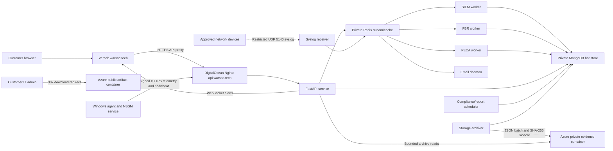

# WarSOC End-to-End Product, Architecture, and Operator Guide

**Document status:** Authoritative operator summary of the backend, Windows agent, frontend, production Compose topology, and production proof as of 2026-07-15. For the detailed implementation map and evidence ledger, use `WARSOC_CURRENT_STATE_ARCHITECTURE.md` and `PRODUCTION_ACCEPTANCE_TEST.md`.

**Launch status:** Approved for a controlled Windows SMB pilot at a maximum of 50 active agents per tenant. Production preflight, platform flow, browser integration, real native Windows detection, 50-agent capacity, immutable archival, cold retrieval, and CSV/PDF exports have passed. Remaining obligations are a customer-style mailbox invitation activation, an independent MongoDB restore drill, physical Azure retention segmentation, archive-source visibility, and production code signing.

## 1. Product boundary

WarSOC is a tenant-isolated monitoring and compliance platform for up to 50 Windows endpoints per tenant. The current product contains three primary capabilities:

1. **SIEM:** Native Windows, web-log, CSV, and optional network-syslog ingestion with rule and correlation-based alerts.
2. **FBR POS evidence:** Database-file tamper monitoring and a strict POS invoice JSONL integration.
3. **PECA forensic evidence:** Selected native Windows security events sealed individually with RSA-PSS signatures.

WarSOC is not an antivirus, a kernel EDR, a packet-capture platform, or a universal POS database reader. It does not replace Microsoft Defender. It supplements existing endpoint protection with native telemetry, centralized detection, evidence retention, and analyst workflows.

## 2. Production architecture

### Production ownership

| Component | Location | Responsibility |
|---|---|---|
| React frontend | Vercel | Login, dashboard, alert workflow, compliance views, quote/contact forms, team/profile UI |
| Nginx | DigitalOcean | TLS termination, API/WebSocket routing, security headers, request limits |
| FastAPI | DigitalOcean private Docker network | Authentication, RBAC, tenant isolation, APIs, agent enrollment, exports |
| Redis | DigitalOcean private Docker network | Ingestion stream, correlations, quotas, sessions, agent status, email queue |
| MongoDB | DigitalOcean private Docker network | Hot operational data, users, tenants, evidence metadata, archive ledger |
| Unified worker | DigitalOcean | SIEM, FBR, PECA, and email loops with isolated restart wrappers |
| Compliance scheduler | DigitalOcean | Daily evidence summary and monthly PDF generation |
| Storage archiver | DigitalOcean | Upload-before-delete cold archival and archive ledger creation |
| Azure artifacts | Azure public blob container | Installer delivery only |
| Azure evidence | Azure private blob container | Long-term evidence batches and SHA-256 sidecars |

MongoDB, Redis, and API port 8000 are not exposed publicly. Only Nginx ports 80/443 and, if explicitly enabled, UDP 5140 are externally reachable.

## 3. Commercial and onboarding flow

1. A prospect selects 10-50 endpoints, FBR and/or PECA, billing cycle, and optional 3/6/9/12-month general archive.
2. The frontend submits the request to `POST /api/v1/sales/request-quote`.
3. The backend recalculates the commercial price, stores the lead, and queues sales and customer-confirmation emails.
4. WarSOC conducts the sales meeting and issues a manual invoice. There is no automated Safepay checkout in the production flow.
5. After payment/contract approval, a WarSOC operator calls the protected admin provisioning endpoint.
6. Provisioning creates the tenant, entitlement set, agent limit, retention policy, ingest quota, and first admin account.
7. Credentials are delivered to the customer using an approved secure channel. Credentials must not be stored in source code or this guide.
8. The customer admin logs in, generates a one-time activation code, downloads the installer, and deploys agents.

## 4. Authentication, roles, and tenant isolation

- Public self-signup is disabled by default with `ENABLE_SELF_SIGNUP=false`.
- New passwords require at least 16 characters, uppercase, lowercase, a number, and a symbol. The bcrypt-compatible maximum is 72 UTF-8 bytes.
- Browser authentication uses the backend session/cookie model, `/auth/me` hydration, CSRF protection for state-changing browser calls, and centralized frontend auth state.
- Agent registration uses a one-time activation code and an Ed25519 public key.
- Agent heartbeats and ingest requests are signed, timestamp checked, and replay protected.
- Every data query and mutation is scoped by `tenant_id`.

| Role | Operational logs | Manage alerts | Block/unblock IP | Compliance evidence/export | Team management | Agent activation/download |
|---|---:|---:|---:|---:|---:|---:|
| Admin | Yes | Yes | Yes | Yes | Yes | Yes |
| Manager | Yes | Yes | Yes | Catalog/view subject to route | No | No |
| Analyst | Yes | View/investigate | No | No audit export | No | No |
| Auditor | No operational alert API | No | No | Entitled evidence and audit export | No | No |

## 5. Windows agent deployment and operation

### Installation flow

1. Customer admin generates an activation code from the dashboard.
2. `GET /api/v1/agent/download` returns a redirect to the approved Azure `warsoc_installer-4.2.4.exe` artifact.
3. The unsigned pilot installer hash is supplied separately to customer IT for an explicit WDAC/Intune/Defender allow rule. Defender remains enabled.
4. The installer runs with administrator rights and receives the activation code, API URL, and optional `/POS_PATHS` directories.
5. The telemetry deployment script records existing audit settings, enables required native Windows auditing, configures inheritable SACL entries on supplied POS paths, and verifies the changes.
6. NSSM starts the agent as the `WarSOC_Agent` Windows service.
7. The agent creates its Ed25519 identity, registers, spools events durably, sends signed telemetry, and reports sensor health.

### Collected native Windows events

The shipped policy monitors the Security and System channels. The target set includes:

`1100`, `1102`, `4624`, `4625`, `4657`, `4660`, `4663`, `4670`, `4672`, `4688`, `4697`, `4698`, `4719`, `4720`, `4726`, `4732`, `5157`, and `7045`.

The parser also contains structured handling for authentication, process, object-access, permission, and service-installation records. Event XML is parsed by named fields rather than localized rendered text.

### Other endpoint inputs

- `%ProgramData%\WarSOC\pos_audit.log` for strict FBR JSON Lines.
- IIS access logs matching `C:/inetpub/logs/LogFiles/W3SVC*/u_ex*.log`.
- Configured application access logs and `firewall.log`.
- Manual CSV backfill, up to 50 MB, through the authenticated upload API.

### Agent resilience and health

- Durable local JSONL spool before source watermarks advance.
- Failed backend sends remain available for retry.
- Malformed POS records are quarantined locally; they are not guessed or relabelled.
- Heartbeats report Security/System channel state, audit-policy state, telemetry version, POS SACL path count, POS log presence, parse failures, rejected POS rows, channel failures, and spool failures.
- `/api/v1/data/status` and `/api/v1/compliance/coverage` translate agent health into Active, Degraded, or Not Configured.

## 6. Ingestion pipeline

1. The agent batches events and sends them over HTTPS.
2. The API enforces agent identity, tenant state, signature, timestamp/replay rules, a 5 MB ingest body limit, per-request rate limits, and daily tenant byte quota.
3. Accepted events enter the Redis `raw_logs_queue` stream.
4. SIEM, FBR, and PECA use independent consumer groups so each entitled pipeline receives the event.
5. A worker acknowledges an event only after its required processing succeeds; failures are retried or routed to a dead-letter path according to the worker contract.
6. Alerts are stored in `security_alerts` and published through Redis to the authenticated tenant WebSocket.

Default quota at the 50-agent platform ceiling is 2.5 GiB per tenant per UTC day: 50 MiB per contracted endpoint, with a 1 GiB floor for smaller tenants. A tenant-specific quota may be provisioned by WarSOC operations only, but custom provisioning is capped at 3 GiB/day on the current shared pilot infrastructure. Quota checks fail closed if Redis is unavailable.

## 7. SIEM capability

### Direct native controls

Inherently dangerous events can alert directly, including audit-log shutdown/clear, service installation, account creation/deletion, privileged group membership, audit-policy change, and blocked network connections. High-volume normal events such as successful login, failed login, special logon, and process creation feed evidence and stateful correlation instead of producing an alert for every event. A 4688 PowerShell process carrying a full elevated token is the narrow exception: it creates a medium `Elevated PowerShell launched` operator alert, while remaining PECA evidence. It is not labelled as confirmed privilege escalation without stronger behavior.

### Rule and correlation families

The current catalog contains logic for:

- Password spraying and repeated authentication failure patterns.
- Suspicious PowerShell and process command lines from Event 4688.
- Elevated PowerShell execution from structured Event 4688 token data.
- Credential dumping and privilege escalation indicators.
- Service and scheduled-task persistence.
- Security-control/logging interference.
- Ransomware-like file mutation/deletion behavior.
- SQL injection, XSS, traversal, command injection, XXE, web-shell, and web flooding patterns when the input is classified as an HTTP request.
- Reverse-shell, reconnaissance, lateral-movement, staging, and exfiltration indicators where the required fields exist.

These are telemetry-driven detections. A named rule does not imply full EDR visibility: if the endpoint does not emit the required event or command line, that rule has no signal to evaluate.

Phishing labels require delivery-context telemetry such as email, browser download, URL-click, web-proxy, or reviewed HTTP-request input. A critical phishing-chain alert additionally requires a suspicious process execution after that delivery event, scoped to the same tenant, agent, and human user. Native process activity alone, machine accounts ending in `$`, unrelated agents, and out-of-order events cannot complete a phishing chain.

## 8. FBR POS capability

### Native FIM path

- Event 4663 with delete access and an approved database extension creates Redis correlation context for 60 seconds.
- Event 4660 atomically consumes that context and generates exactly one `FIM-DB-MOD` event.
- Event 4670 can generate `FIM-DB-MOD` for a permission change on an approved database file.
- Ordinary database writes are ignored and must not create FIM tamper alerts.
- Approved extensions are `.mdf`, `.ndf`, `.ldf`, `.sqlite`, `.sqlite3`, `.db`, `.db3`, and `.bak`.
- Active database files are not opened and hashed by the agent.

### POS invoice integration

The only line-item/invoice truth input is strict JSONL or the authenticated POS endpoint. Accepted event IDs are `FBR-INV-MOD` and `FBR-INV-DEL`. Required fields include `event_id`, `event_uid`, `invoice_id`, `timestamp`, `actor`, and `source_system`. Unknown fields and external attempts to submit `FIM-DB-MOD` are rejected.

WarSOC does not automatically understand a proprietary POS SQL schema. The POS vendor must emit the agreed JSONL events or integrate with the authenticated FBR endpoint.

Sensitive FBR fields are encrypted with Fernet and marked `encryption_version="fernet-v1"`. Authorized evidence/detail/export routes decrypt them for the requesting tenant.

## 9. PECA evidence capability

The entitled PECA vault covers 11 catalog controls:

1. `4625` failed logon.
2. `1102` audit log cleared.
3. `4624` successful logon.
4. `4688` process creation.
5. `4672` special privileges assigned.
6. `4720` account created.
7. `4726` account deleted.
8. `4732` local privileged-group member added.
9. `4697` service installed.
10. `7045` new Windows service.
11. `1100` event logging service stopped.

Each PECA evidence record is canonicalized and signed with RSA-PSS-SHA256 using a key of at least 2048 bits. The PECA worker refuses to start without valid signing key material.

## 10. Dashboard and analyst workflow

1. Login and session hydration occur before protected routes render.
2. Dashboard polling loads tenant alerts/logs and agent status; an authenticated WebSocket ticket provides live alert updates.
3. Admins/managers acknowledge alerts through `PATCH /api/v1/alerts/{reference}/status`.
4. Closing an alert requires resolution notes and persists to MongoDB.
5. Dashboard search queries tenant-scoped operational SIEM/alert data across hot MongoDB and bounded Azure archives. FBR and PECA evidence search remains in Compliance & Audit under its stricter RBAC contract.
6. Compliance views show only entitled packs, monitored controls, coverage state, and evidence.
7. CSV and PDF exports are generated by the backend, not from browser-only state.
8. Admins can invite manager, analyst, and auditor users. Auditor access is restricted to entitled compliance material.
9. Admins/managers can request an IP block. The block is stored per tenant and delivered to active Windows agents on heartbeat for local Windows Firewall enforcement.

## 11. Retention and Azure archive logic

| Data class | Mongo hot target | Azure retention target | Source of policy |
|---|---:|---:|---|
| SIEM alerts | 7 days | Tenant general archive | `SIEM_HOT_RETENTION_DAYS` and tenant contract |
| SIEM evidence vault | 7 days | Tenant general archive | `SIEM_HOT_RETENTION_DAYS` and tenant contract |
| Raw/general logs | 7 days | Tenant general archive | `RAW_LOG_HOT_RETENTION_DAYS` and tenant contract |
| FBR evidence | 7 days | 2190 days / 6 years | Compliance catalog |
| PECA evidence | 7 days | 365 days | Compliance catalog |
| CSV uploads/results | Tenant/general policy, with TTL safeguards | Tenant general archive if selected | Tenant contract and database indexes |

General archive options in the UI are 3, 6, 9, or 12 months. They do not shorten FBR or PECA compliance retention.

Production currently uses one private Azure evidence container with a locked, container-scoped 2190-day immutability policy. That lock satisfies the six-year FBR floor, but it physically over-retains PECA and shorter SIEM/general contracts. A 3/6/9/12-month contract controls WarSOC metadata and retrieval expectations; it does not make the underlying blob deletable before the locked container policy expires. Exact physical deletion dates require separate future containers or storage accounts by retention class. The existing locked policy cannot be shortened.

The archiver runs continuously on a daily interval in production Compose. Production requires verified Azure immutability. It:

1. Selects records reaching the applicable hot-storage cutoff.
2. Uploads a JSON batch to the private Azure container.
3. Uploads a `.sha256` sidecar and records the same digest in blob metadata.
4. Verifies the configured immutability scope. Production uses container-scope verification and requires the locked container period to satisfy the record's minimum retention before Mongo deletion is permitted.
5. Inserts a `storage_archives` ledger entry with collection, tenant, time range, IDs, hash, retention, and immutability evidence.
6. Deletes only the exact successfully archived MongoDB records.
7. Leaves records in MongoDB when upload, immutability, or ledger verification fails.

Archive reads are tenant scoped, hash verified, deduplicated, and capped by `ARCHIVE_READ_MAX_BLOBS` (currently 100). This is suitable for targeted evidence retrieval, not unrestricted data-lake analytics.

The internal reader marks cold records as archived and retains source-blob metadata while verifying integrity. The current curated compliance response does not expose that internal marker, so the browser cannot yet label a row as Mongo hot versus Azure cold. Retrieval remains correct; a safe `storage_tier` response field is a remaining presentation improvement.

## 12. Optional network syslog path

The UDP 5140 receiver accepts RFC 3164, RFC 5424, CEF, and plain text, then places normalized events on the Redis stream.

This path is not equivalent to the signed Windows-agent path:

- UDP syslog has no transport authentication, confidentiality, delivery guarantee, or agent signature.
- The receiver assigns one configured `NETWORK_TENANT_ID` to all received datagrams.
- Its in-memory queue drops packets when full to prevent host exhaustion.

The production Compose service is disabled by default behind the `network-syslog` profile. When enabled, startup requires an explicit tenant and source allowlist, and non-allowlisted datagrams are dropped before parsing. DigitalOcean/UFW must still allow UDP 5140 only from the same contracted static addresses or private VPN. It must not be exposed to the whole internet or presented as court-grade endpoint evidence.

## 13. Verified security controls

- TLS 1.2/1.3 at Nginx and HSTS.
- HttpOnly session model and CSRF checks for browser state changes.
- Server-side RBAC and tenant scoping.
- Public API documentation blocked in production.
- MongoDB, Redis, and API port 8000 closed externally.
- Redis password, append-only persistence, no-eviction policy, and private network placement.
- MongoDB authentication and persistent volume.
- Read-only API/worker containers with bounded temporary filesystems.
- Docker log rotation at 10 MB x 5 files per service.
- Agent Ed25519 identity and signed heartbeat/telemetry.
- Request size, rate, and daily byte quotas.
- FBR field encryption and PECA per-record signatures.
- Azure artifact SHA-256 comparison in production preflight.
- Upload-before-delete archive behavior.

## 14. Hard limits and unsupported claims

### Enforced limits

- Maximum 50 active agents per tenant. Redis restarts cannot reset the Mongo-backed seat floor.
- Quote UI range is 10-50 endpoints; protected provisioning supports 1-50.
- Default ingest limit at 50 agents is 2.5 GiB/day per tenant.
- Live ingest body limit is 5 MB; CSV upload limit is 50 MB.
- Hot SIEM/raw storage is intentionally seven days.
- Archive reads inspect at most 100 indexed blobs by default.
- Current production is one 8 GB / 4 vCPU DigitalOcean node, not a high-availability cluster.

### Not currently supported

- Linux or macOS endpoint agents.
- Kernel-level behavior monitoring, memory scanning, exploit prevention, or antivirus replacement.
- Full packet capture or authenticated multi-tenant network-sensor enrollment.
- Automatic discovery of proprietary POS invoices inside arbitrary databases.
- Cloud identity, Microsoft 365, SaaS, or mailbox telemetry ingestion.
- Automatic online payment or subscription billing.
- Guaranteed prevention of every attack; detections depend on configured audit policy and available telemetry.
- Broad OS compatibility beyond the Windows versions and architecture proven by the final disposable-VM acceptance run.

## 15. Current verification and remaining obligations

### Verified in production

- Backend commit `443939d`, frontend production binding, and agent `4.2.4-Native` are deployed.
- Preflight run `0ab1c87a9f` passed DNS separation, TLS, security headers, CORS, health, private ports, frontend binding, and exact installer hash verification.
- Platform run `18282be9f1` completed with zero failures across provisioning, authentication, agent enrollment, ingest, SIEM, FBR, PECA, WebSocket, mitigation, RBAC, email, CSV, and PDF.
- The real Windows endpoint produced all 11 PECA controls and the approved FBR invoice/FIM scenarios. An ordinary database write did not produce a FIM alert.
- The 50-agent soak registered and ingested 50 agents, rejected seat 51, produced SIEM in 5.18 seconds, and completed in 7.22 seconds without pending Redis work.
- Azure immutability, archive-before-delete, SHA-256 verification, cold retrieval, and cold-backed FBR/PECA CSV/PDF exports passed.
- A real browser loaded login, dashboard, compliance, team access, and activation-code flows without console errors.

### Remaining controlled-pilot obligations

1. Complete one invitation from an actual recipient mailbox by opening the single-use link, setting a compliant password, logging in, and confirming role restrictions.
2. Restore a current MongoDB backup into an isolated database and record the result. Azure evidence storage is not a database backup.
3. Route future evidence to separate immutable containers by retention class before promising exact 3/6/9/12-month physical blob deletion.
4. Add a non-secret `storage_tier` marker so operators can distinguish Mongo-hot records from Azure-cold records in the UI.
5. Obtain a production code-signing certificate. During the controlled pilot, keep Defender enabled and use the approved SHA-256 allowlist process.
6. Use clean customer tenants for pilots; do not present an engineering/demo tenant containing synthetic or historical test data.

## 16. Deployment acceptance sequence

1. Confirm Vercel and DigitalOcean are running the approved commits and all production services are healthy.
2. Run `run_production_acceptance.ps1 -Phase Preflight` and require zero failures after every installer, DNS, TLS, or frontend binding change.
3. Provision each new customer as a separate tenant with a unique admin email, custom entitlements, contract retention, daily quota, and no more than 50 active agents.
4. Complete the customer admin handover through an approved secure channel; do not email a reusable plaintext password.
5. Complete one team invitation through the recipient mailbox and verify the intended role.
6. Install the exact manifest-approved Azure artifact and confirm Active health, Security/System channels, and required POS SACL state.
7. Generate a small approved detection proof and confirm SIEM/FBR/PECA, WebSocket, alert workflow, email, CSV/PDF, and archive retrieval.
8. Confirm daily MongoDB backup health and periodically restore into an isolated database.

## 17. Improvement priorities without product expansion

### Immediate reliability improvements

- Add alarms for Redis stream lag, DLQ growth, archive age, archive failure, disk use, daily quota use, email queue age, and agent degradation.
- Keep per-pilot allowlists and suppression rules so noisy native events do not hide high-value alerts.
- Complete and record the invitation-link and Mongo restore proofs.
- Add explicit hot/cold provenance without exposing private blob details.

### Next operational hardening

- Obtain a production code-signing certificate; retain hash allowlisting only for the controlled pilot.
- Separate SIEM/FBR/PECA workers when measured CPU or queue latency justifies it. Do not split them based on assumption alone.
- Move MongoDB/Redis to managed or replicated services before increasing beyond the validated 50-agent/single-node envelope.
- Restrict syslog by source IP/VPN or replace it later with authenticated TLS syslog.
- Remove dead/unreachable route code and mojibake comments to reduce maintenance risk without changing behavior.

### Detection-quality improvement loop

1. Collect a one-week baseline from each pilot environment.
2. Measure false positives, missed expected controls, detection latency, and agent channel health.
3. Tune thresholds and allowlists per signal while preserving the approved production defaults.
4. Replay a fixed regression corpus after every rule change.
5. Re-run native FBR and PECA scenarios after agent, installer, audit-policy, parser, or rule changes.

This loop improves the existing SIEM/FBR/PECA product without adding unrelated integrations or widening the current support boundary.
