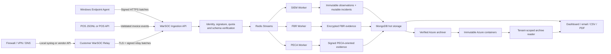

# WarSOC Master Evidence and Hybrid SIEM Plan

**Document status:** Approved target-state engineering blueprint  
**Snapshot date:** 2026-07-28
**Companion document:** `WARSOC_CURRENT_STATE_ARCHITECTURE.md` remains the authority for behavior implemented today.  
**Initial operating scope:** Pakistani SMB pilots, up to 50 Windows endpoints per tenant.

This plan defines how WarSOC evolves from its current Windows endpoint SIEM, FBR evidence, and PECA-oriented forensic monitoring into a cryptographically defensible endpoint-and-network monitoring platform. An item appearing here is not a production claim until its phase acceptance gate has passed and the current-state document has been updated.

**Implementation checkpoint:** The Phase 3 cloud API, strict Fortinet/Cisco ASA/MikroTik/pfSense parsers, bounded encrypted spool/outbox, atomic Redis admission, Windows relay runtime, DPAPI-protected identity, explicit UDP/TCP/TLS listeners, NSSM installer/uninstaller, revocation, dead-key recovery, source isolation, and a narrow subset of Phase 4 correlations are implemented behind `NETWORK_RELAY_ENABLED=false`. The Phase 3 gate remains open for a reproducible Windows build, exact-host security proof, real-device acceptance, capacity measurement, retention approval, and a production pilot. See `NETWORK_RELAY_BACKEND_FOUNDATION.md`.

## 1. Executive Summary

WarSOC will preserve four independent properties:

1. **Collection:** obtain native Windows, POS, and approved network-device telemetry.
2. **Detection:** turn verified observations into contextual incidents without changing the source evidence.
3. **Evidence integrity:** prove the stored bytes, source assurance, sequence, custody, and any known gaps.
4. **Retention and retrieval:** move records from hot MongoDB to verified immutable Azure storage and retrieve them without weakening tenant isolation.

The implementation order is deliberate. Cryptographic identity and a common evidence envelope come before the network relay, PECA correlation, enrichment, or external scanning. New sources must not be connected to an evidence pipeline whose provenance rules are incomplete.

## 2. Truthful Product Boundary

### 2.1 Current product

- Windows-native telemetry; no Sysmon dependency.
- SIEM detection and incident workflow.
- FBR invoice evidence from strict JSONL or authenticated POS ingestion.
- FBR database-file integrity monitoring only for explicitly configured paths.
- PECA-oriented evidence for the current 11-control WarSOC catalog.
- Tenant RBAC, email, reports, hot storage, Azure archival, and archive retrieval.
- Maximum supported commercial limit of 50 Windows agents per tenant until a larger soak test is approved.

### 2.2 Target additions in this plan

- Signed ordinary endpoint telemetry with key epochs and sequence continuity.
- Crash-safe encrypted evidence segments and dead-key recovery.
- Customer-side network relay for firewall, VPN, DNS, DHCP/NAT, and selected network-device events.
- Cross-source endpoint/network correlation.
- Externally anchored daily evidence roots.
- JIT support access and tiered break-glass diagnostics.
- Corrected MITRE/CWE enrichment and isolated external exposure monitoring.

### 2.3 Claims WarSOC must not make

- Blanket legal certification under PECA or FBR.
- Full network visibility before approved network sources are connected.
- Device-authenticated evidence when UDP source identity is only observed by a relay.
- Prevention of tampering by a fully privileged local SYSTEM administrator.
- Full packet capture, Linux monitoring, EDR containment, vulnerability management, or proprietary POS-database understanding.
- FBR line-item monitoring without the POS JSONL/API integration contract.

## 3. Target End-to-End Flow

## 4. Common Evidence Contract

Every endpoint, POS, and relay observation uses a versioned canonical envelope containing:

- `tenant_id`, `source_id`, `source_type`, and `key_epoch`.
- `event_uid`, `chain_id`, `sequence`, and `previous_record_hash`.
- Original event time, relay receipt time where applicable, and cloud receipt time.
- Raw payload hash, canonicalization version, parser version, and schema version.
- Signing algorithm, key ID, signature, and verification result.
- Source assurance: `device_authenticated`, `agent_signed`, `relay_attested`, `source_ip_observed`, or `unverified_source`.
- Time confidence, detected clock offset, loss-gap references, and custody metadata.

Original payloads are immutable. Normalization, MITRE/CWE mapping, severity, correlation, and incident state are projections that can be corrected without rewriting source evidence.

## 5. Twelve-Phase Delivery Sequence

### Phase 0: Scope, Threat Model, and Baseline

- Freeze supported sources, controls, event IDs, retention promises, and customer-facing claims.
- Inventory signing keys, encryption keys, queues, collections, Azure policies, roles, and privileged operations.
- Capture passing tests and production metrics as the regression baseline.
- Define attacker levels: ordinary user, tenant admin, local Windows administrator, SYSTEM compromise, WarSOC operator, and cloud administrator.

**Gate:** Every claim maps to a source, rule, storage destination, retention policy, access role, and proof test.

### Phase 1: Cryptographic Source Identity

- Sign ordinary endpoint telemetry, not only heartbeat traffic.
- Use separate identities and keys for endpoint agents and network relays.
- Prefer TPM/CNG-backed keys using a supported algorithm; use DPAPI-protected software keys as a declared lower-assurance fallback.
- Support algorithm and key-version agility, rotation, revocation, boot/session identity, monotonic sequence, and previous-batch hashes.
- Never escrow endpoint or relay private keys.

**Gate:** Altered, replayed, duplicated, wrong-tenant, revoked-key, and out-of-sequence batches fail or enter quarantine without reaching verified evidence collections.

### Phase 2: Canonical Evidence Envelope and Verification

- Implement deterministic canonical serialization and versioned schemas.
- Verify identity, signature, tenant, size, sequence, timestamp bounds, and replay state before queue admission.
- Preserve signature and verification metadata through Redis, workers, MongoDB, Azure, reports, and archive retrieval.
- Separate verified, provisional, and rejected evidence.

**Gate:** The same record verifies before ingestion, after Mongo storage, after Azure restoration, and inside an authorized export.

### Phase 3: Customer-Side Network Relay

#### 3A. Deployment roles

- Normal installer UI offers Endpoint Agent only.
- Relay mode requires a tenant-issued, short-lived activation code bound to `network_relay`.
- Endpoint and Relay remain separate Windows services, processes, identities, spools, and update lifecycles.
- Windows Server is recommended. Workstation relay mode requires an explicit override and host-safety checks. Critical cashier POS terminals are not approved relay hosts.

#### 3B. Device registration and ingress

- Register tenant, device ID, vendor, model, source addresses, transport, timezone, and expected EPS.
- Prefer Syslog TLS or authenticated vendor APIs.
- Legacy UDP terminates only on the customer LAN relay, never on the public WarSOC API.
- Bind only approved interfaces and enforce source, datagram-size, parser-time, per-device EPS, global EPS, and byte-rate limits.

#### 3C. Evidence and control spools

- Evidence spool stores durably accepted events until cloud acknowledgement.
- Control spool stores health transitions, loss intervals, clock failures, saturation, and tamper events.
- Both are bounded, encrypted, hash-chained, crash-safe, and independently acknowledged.
- Accepted evidence is never evicted to make room. At saturation, new UDP datagrams are rejected; TCP/TLS receives backpressure.
- Syslog severity alone never grants shedding immunity. Reserved admission is available only for validated high-value classes.

#### 3D. Resource and spoofing controls

- Use per-source and global token buckets before expensive parsing or signing.
- Coalesce dropped traffic into signed summaries containing source, interval, counts, bytes, reason, EPS, and spool state.
- Treat sustained rate exhaustion as an anomaly, not proof of IP spoofing.
- Require VLAN/ACL/anti-spoofing controls where practical; only authenticated transport can materially improve device attribution.

#### 3E. Time normalization

- Preserve `device_event_time`, `relay_receipt_time`, and `cloud_receipt_time`.
- Maintain a bounded per-device clock-offset profile.
- Never rewrite original time. Add normalized time and confidence separately.
- Use receipt time when device time is unreliable and lower incident confidence accordingly.

#### 3F. Spool protection

- Restrict DACL access to SYSTEM and the dedicated relay service identity.
- Use SACL entries to audit deletion, ownership, permission, and failed-access attempts.
- Encrypt records with an authenticated cipher and verify chain continuity at startup.
- Acknowledge that local SYSTEM can delete data; WarSOC detects and reports the resulting chain gap rather than claiming prevention.

#### 3G. Updates, crashes, and dead keys

- Use `RUNNING -> QUIESCING -> DRAINING -> CHECKPOINTED -> UPDATING -> RECOVERING -> RUNNING`.
- Segment spools. Each committed record has framing, checksum, authenticated ciphertext, sequence, previous hash, and commit marker.
- On a crash, discard only an incomplete uncommitted tail and emit an unclean-recovery control event.
- A lost key starts a new `key_epoch` and `chain_id`; it never silently continues the old chain.
- Tenant MFA authorization links the new genesis to the last cloud-acknowledged root and records the explicit evidence gap.

**Gate:** Internet outage, saturation, spoof flood, disk pressure, power loss, mid-write termination, restart, update, key loss, duplicate delivery, and recovery all produce bounded resource use and explicit evidence status.

**Current status:** Code-complete candidate and disabled. Backend identity, retry-safe activation/registration, status, revocation, MFA-authorized dead-key recovery, signed HTTPS admission, strict Fortinet/Cisco ASA/MikroTik/pfSense parsing, bounded encrypted evidence/control spools, exact-retry outbox, explicit listeners, DPAPI identity, NSSM lifecycle, source-scoped firewall rules, DACL/SACL setup, loss summaries, atomic Redis quota/queue/chain handling, Mongo receipts, and metrics are covered by candidate tests. DPAPI is a declared pilot boundary, not a TPM claim. A Windows build, exact-host proof, real-device fixtures, capacity review, traffic-retention decision, and pilot remain required before the gate can close.

### Phase 4: PECA-Oriented Correlation and Verification

- Correlate endpoint identity/process activity with firewall, VPN, DNS, DHCP/NAT, and remote-access observations.
- Maintain exact outcome names such as `host_network_block_observed`, `perimeter_network_block_observed`, and `vpn_authentication_observed`.
- Implement correlations including VPN-to-logon, spray attempts, process-to-outbound activity, service installation-to-network activity, audit clearing-to-network activity, and privileged changes-to-remote access.
- Preserve all current PECA evidence signatures and add public-key IDs, reproducible verification, and a supported verification API.
- Treat the 11 controls as the WarSOC catalog, not statutory controls written into PECA.

**Gate:** Real device and Windows events produce expected correlations; missing, unauthenticated, skewed, or lost sources reduce confidence and coverage rather than silently producing a green state.

**Current status:** A narrow backend subset is implemented and dormant while the relay feature is disabled. Verified relay VPN failures support five-distinct-user/five-minute spraying detection; successful VPN followed by matching Windows Event 4624 is stored as context rather than a threat; Events 1100, 1102, 4697, 4732, and 7045 can correlate to a permitted public connection from the same endpoint IP. DNS, DHCP/NAT identity reconstruction, ordered-flow beaconing, destination baselines, and real-device validation remain open. Relay evidence is not silently counted as an additional PECA control.

### Phase 5: FBR Evidence Integrity

- Preserve strict JSONL/API invoice events and reject unknown fields, IDs, malformed records, and API-supplied native FIM events.
- Continue Redis-backed Windows deletion correlation and permission-change detection for configured database paths.
- Encrypt sensitive FBR fields and preserve event UID across retries.
- Distinguish invoice truth from file-integrity evidence and network enrichment.
- Do not hash active databases or claim proprietary SQL understanding.

**Gate:** Normal database writes create no tamper alert; validated deletion or permission modification creates exactly one encrypted event; malformed POS records are quarantined.

### Phase 6: Daily External Evidence Anchoring

- Produce signed daily roots per tenant and evidence family.
- Anchor roots in locked Azure storage outside MongoDB.
- Record algorithm, key ID, record range, prior root, generation time, and storage receipt.
- Treat chain resets, missing anchors, and verification failures as exceptions requiring investigation.

**Gate:** A database administrator cannot alter historical evidence without causing root verification failure against the external anchor.

### Phase 7: Custody, JIT Support, and Break Glass

- Audit views, searches, assignments, status changes, exports, verification, archive retrieval, policy changes, and administrative actions.
- Remove standing support access to tenant evidence and prohibit direct support access to MongoDB, Azure blobs, containers, or encryption secrets.
- Tenant MFA grants specify case, purpose, named principal, scope, expiry, and revocation.
- Use Level 1 metadata, Level 2 redacted diagnostics, and Level 3 raw evidence scopes.
- Level 3 requires tenant approval or explicit pre-contracted emergency authority plus two WarSOC approvers.
- Move toward per-tenant envelope encryption and a policy-enforcing key broker so support tooling never receives raw keys.

**Gate:** Expired, revoked, cross-tenant, over-scoped, and unapproved support access fails and is itself auditable.

### Phase 8: Retention, Archival, and Disaster Recovery

- Maintain short hot windows for operational search; target seven days for SIEM, PECA, and FBR hot collections unless a reviewed requirement changes it.
- Physically separate retention domains rather than applying one long Azure policy to every record type.
- Archive new FBR monitoring evidence through the tenant's normal WarSOC retention entitlement and matching general route; do not position WarSOC as the customer's statutory tax-record repository.
- Apply PECA Section 32's minimum one-year traffic-data retention only where legal review determines that the customer role and approved policy require it; WarSOC must not infer statutory service-provider status from telemetry.
- Keep general SIEM retention contract-driven and capacity-bounded.
- Archive only after upload, hash, immutability, ledger, and retrieval verification. On any failure, retain the Mongo copy.
- Perform scheduled Mongo backup restoration and Azure archive retrieval tests.

**Gate:** Hot-to-cold transition, archive search, CSV/PDF export, integrity proof, backup restoration, and policy expiry are demonstrated using real tenant-isolated records.

### Phase 9: SIEM Detection and Enrichment

- Keep Windows, web, POS, and network rule families source-isolated.
- Use context-aware rules and correlation rather than alerting on every normal event.
- Aggregate repeated occurrences into incidents while retaining every immutable observation.
- Add actor, endpoint, process, target, destination, outcome, confidence, evidence references, and investigative explanation.
- Correctly distinguish MITRE tactics, techniques, and narrowly applicable CWE mappings.
- Enrichment failure must never block ingestion or evidence preservation.

**Gate:** Each enabled rule has a supported source, fixture, native proof where applicable, threshold, false-positive rationale, incident projection, and latency measurement.

### Phase 10: External Exposure Monitoring

- Run scanners from a separate deployment, egress IP, credentials, secrets, rate limits, and failure domain.
- Do not share the core API outbound identity or production signing/encryption secrets.
- Enforce tenant ownership and explicit scope before scanning any asset.
- Use a narrow authenticated findings API or queue; never direct database writes.
- Treat exposure findings as observations requiring validation, not proof of exploitation.

**Gate:** Redirect, DNS rebinding, SSRF, scope expansion, WAF bans, scanner outage, and malicious responses cannot affect the core ingestion plane.

### Phase 11: Integrated Acceptance and Rollout

- Run unit, contract, integration, chaos, security, restore, and user-experience tests.
- Use one disposable Windows VM, one real network device or approved emulator, and the 50-agent simulation.
- Validate RBAC, invitations, activation, agent health, incidents, email, PDF/CSV, hot/cold retrieval, archive immutability, JIT access, and key recovery.
- Roll out to an internal tenant, then one pilot, then the remaining pilots. Stop automatically on tenant leakage, evidence loss, broken chain verification, unbounded resource growth, or rollback failure.

**Gate:** Zero unresolved launch blockers, documented residual risks, signed acceptance artifacts, rollback proof, updated operator runbook, and updated current-state architecture.

## 6. Failure-State Contract

- Invalid signatures or identities: reject or quarantine; never mark verified.
- Redis unavailable: agent/relay retains locally and retries; API must not claim durable acceptance.
- Mongo unavailable: workers leave records pending or place them in a DLQ; no silent acknowledgement.
- Azure or immutability failure: retain Mongo records and alert operations.
- Internet outage: continue bounded local collection; report the gap and state on reconnection.
- Spool saturation: preserve accepted evidence, reject new admission, and create signed loss summaries.
- Clock failure: preserve original timestamps and lower correlation confidence.
- Parser failure: retain raw evidence where permitted, quarantine the event, and record parser/version/error metadata.
- Key loss: create a tenant-authorized new epoch with an explicit discontinuity.
- Local tampering: fail verification and set coverage to degraded; never manufacture continuity.
- Enrichment/scanner failure: core collection, evidence, and incident handling continue.

## 7. Security and Access Model

- Tenant identity is derived from authenticated credentials, never trusted from payload fields.
- Admin, manager, analyst, and auditor permissions remain least-privilege and tenant-scoped.
- Activation codes are role-bound, single-use, short-lived, and never installer defaults.
- Secrets remain server-side; frontend code receives no provider, database, signing, or encryption keys.
- WebSockets use short-lived session-bound tickets.
- Support uses audited APIs, not shell or database access.
- Production databases and Redis remain private; only HTTPS and explicitly approved relay paths are exposed.

## 8. Benefits, Costs, and Limitations

### Benefits

- Clear separation between source evidence, detection logic, and mutable operator workflow.
- Cryptographic detection of modification, replay, deletion, discontinuity, and unauthorized access.
- Network correlation without exposing public UDP ingestion.
- Bounded endpoint, relay, Redis, Mongo, and cloud resource use.
- Explicit degraded states prevent silent compliance claims during collection gaps.
- Hot/cold separation controls storage cost while preserving authorized retrieval.

### Costs and trade-offs

- TPM/CNG, per-tenant keys, key brokers, relays, and recovery workflows add deployment and operational complexity.
- UDP remains lossy and spoofable; authenticated transport requires customer device support.
- Preserving accepted evidence means newer UDP traffic is lost during saturation.
- Strict JIT privacy can delay troubleshooting when the tenant is unavailable.
- Seven-day hot storage makes older investigations dependent on Azure availability and archive-reader performance.
- Cross-source correlation increases tuning effort, clock-skew handling, and false-positive risk.

### Hard limitations

- WarSOC cannot prevent a fully privileged local administrator from deleting local files; it can detect the resulting evidence gap.
- A relay signature proves relay receipt, not firewall authorship, unless the device transport is authenticated.
- No SIEM can recover UDP packets that were never received.
- Evidence integrity does not prove that every relevant real-world event was collected.
- Legal applicability depends on the customer's role, contract, regulator, and counsel; technical controls are not legal certification.
- The 50-agent limit remains until larger production-like load, storage, restore, and cost tests pass.

## 9. Engineering Rules

1. Do not start a later phase while an earlier phase's trust contract is unresolved.
2. Do not convert target architecture into a sales claim before production acceptance.
3. Do not rewrite immutable evidence to correct detection or enrichment mistakes.
4. Do not silently drop, reset, relabel, decrypt, or bridge tenant data.
5. Every degraded state must be visible to the tenant and operations team.
6. Every new source requires identity, schema, quota, health, retention, custody, and failure tests.
7. Documentation, code, tests, deployment configuration, and customer wording must change together.

## 10. Final Product Position

Until Phases 0-8 are accepted, WarSOC remains a Windows endpoint SIEM with FBR evidence and PECA-oriented forensic support. After the relay and correlation phases pass, it may truthfully claim endpoint-and-network correlation for the specifically integrated devices. It should use the phrase **PECA-oriented evidence, traffic-data retention, and investigation support** unless qualified legal counsel approves stronger wording.

The final target is not to imitate every feature of QRadar, Wazuh, or a full EDR platform. It is to provide a smaller, understandable SMB system whose implemented detections, FBR evidence, PECA-oriented custody, storage, and failure behavior are precise, testable, tenant-isolated, and honest.
