# WarSOC Wazuh Detection Target Architecture

**Document status:** Final reviewed target and integration contract; controlled four-family shadow deployment active as of 2026-08-28, primary promotion disabled

**Decision date:** 2026-08-10

**Applies to:** Generic SIEM detection only

**Does not replace:** WarSOC collection, evidence, FBR, PECA, tenancy, incidents, response, retention, or customer UI

## 1. Executive Decision

WarSOC may integrate the Wazuh analysis engine as a replaceable generic detection
subsystem. The proposal is approved only with the corrections in this document.
The original proposal must not be implemented literally.

The permanent ownership rule is:

> WarSOC owns trust, tenant boundaries, collection, canonical evidence, FBR,
> PECA, incidents, storage, retrieval, customer access and response. Wazuh may
> interpret a minimized copy of eligible security telemetry and return untrusted
> detection candidates.

This is an enrichment boundary, not a transfer of platform authority. A Wazuh
alert is never canonical evidence, never a compliance record, never a command to
block an address, and never authority to select a tenant.

The current WarSOC SIEM remains authoritative until individual rule families pass
shadow acceptance and are promoted through the rule-ownership registry. The
disabled adapter foundation is present in code. Wazuh is not present in the
production runtime and has no production authority.

## 2. Verified Current Baseline

The target must preserve these existing facts:

1. The WarSOC Windows agent is the only endpoint agent in the current product.
2. Endpoint events are enrolled, authenticated and Ed25519-signed before backend admission.
3. Redis Streams have independent SIEM, FBR and PECA consumer groups.
4. Canonical evidence is persisted by WarSOC, not by a third-party detector.
5. FBR invoice truth comes only from strict JSONL or authenticated POS ingestion.
6. FBR native file integrity comes only from validated Windows telemetry and Redis-backed correlation.
7. PECA evidence comes from the entitled WarSOC 11-control catalog.
8. Mutable incidents are separate from immutable event-granular detection evidence.
9. MongoDB is the seven-day hot tier; Azure is the immutable archive path.
10. The network relay is a disabled candidate. Its raw vendor record is already encrypted before Redis/Mongo admission.
11. Firewall evidence remains `relay_attested`; it is not device-authenticated evidence.
12. The shared deployment remains capped at 50 aggregate active agents until new capacity proof changes that limit.

## 3. Review of the 36-Section Proposal

| Proposal section | Decision | Required correction or boundary |
|---|---|---|
| 1. WarSOC platform ownership | Accept | Add tenant authority, canonical evidence and response explicitly. |
| 2. WarSOC endpoint agent | Accept | Do not install a second Wazuh endpoint agent in v1. |
| 3. Wazuh generic detection | Accept with limits | Migrate approved generic rule families only; not FBR, PECA or every current WarSOC rule. |
| 4. Detection adapter | Accept | Use engine-neutral input/output contracts, a rule registry and versioned schemas. |
| 5. WarSOC to Wazuh | Correct | Never expose Redis cross-host. Use a durable WarSOC dispatch outbox and authenticated private ingress. |
| 6. Wazuh to WarSOC | Correct | A rotation-safe `alerts.json` tailer is the sole authoritative export path; it checkpoints only after encrypted durable spooling. |
| 7. Connector authentication | Accept and strengthen | Use mTLS plus request signing, replay protection, rotation and connector revocation. |
| 8. Evidence linkage | Correct | Trigger evidence is mandatory. Multi-event lineage is complete only when reconstructed and proven by WarSOC. |
| 9. Incident details | Accept | Normalize and sanitize fields; never show raw Wazuh JSON by default. |
| 10. Payload boundary | Accept | Send only fields needed by an approved rule. No invoice payload, secrets, packet payload or unrelated PII. |
| 11. Firewall architecture | Accept | WarSOC Relay remains the collection and source-assurance boundary. |
| 12. Firewall detections | Narrow | Promote rule by rule only after real-device, tenant and chronology proof. Existing hybrid rules do not move automatically. |
| 13. Relay assurance | Accept | Preserve `relay_attested` in every derived detection. |
| 14. Raw firewall encryption | Already complete in current source | Keep it as an invariant, not a future P0 item. Production relay is still disabled. |
| 15. PECA ownership | Accept | Wazuh may create a SIEM candidate from the same event but cannot create PECA evidence. |
| 16. FBR ownership | Accept | Wazuh never receives invoice payloads and cannot create FBR evidence. |
| 17. FBR/PECA independence | Accept | Add automated outage proof. |
| 18. Vulnerability detection | Defer | Wazuh vulnerability detection depends on Wazuh-agent Syscollector inventory and is not a v1 claim. |
| 19. Mongo hot tier | Accept | Wazuh cannot extend or shorten WarSOC retention. |
| 20. Azure archive | Accept | Wazuh is not an archive or backup. |
| 21. Retention classes | Accept current WarSOC policy | Do not duplicate raw evidence in Wazuh storage. |
| 22. Retention pricing | Separate commercial decision | No detector implementation should encode pricing. |
| 23. Retrieval | Candidate only | Current retrieval remains feature-gated until its own acceptance passes. |
| 24. Backups | Extend | Back up Wazuh config, custom rules, decoders and connector state, not duplicate evidence. |
| 25. Secrets | Accept | Include certificate lifecycle, connector rotation and emergency revocation. |
| 26. Wazuh topology | Correct | Full indexer/dashboard is not automatically required; isolate Wazuh from Compute A and size only after load proof. |
| 27. Network boundary | Correct | IP allowlisting alone is not authentication. Use a private overlay, mTLS and host/provider firewalls. |
| 28. Customer visibility | Accept | Customers use WarSOC only. Engine identity is retained internally for audit. |
| 29. Response ownership | Accept | Wazuh Active Response remains disabled. |
| 30. Suricata | Defer | No packet/IDS expansion in this phase. |
| 31. Monitoring | Expand | Add dispatch, decode, queue-drop, rule, export and lineage metrics. |
| 32. SBOM/release identity | Accept | Pin Wazuh version, package/image digest and ruleset hash. |
| 33. Pentest | Accept later | Run after the integration stabilizes and before commercial enablement. |
| 34. Failure architecture | Correct | Redis is not an unlimited Wazuh backlog. Use an encrypted bounded dispatch outbox, explicit live/replay age limits and terminal expiry. |
| 35. Commercial product | Correct | Firewall monitoring and retrieval remain candidate claims until separately accepted. |
| 36. Sequence | Replace | Follow the gated sequence in section 15 of this document. |

## 4. Final Ownership Matrix

| Capability | WarSOC | Wazuh | Rule |
|---|---:|---:|---|
| Tenant identity and RBAC | Owner | No authority | Tenant is derived from WarSOC dispatch state. |
| Windows collection and signing | Owner | Consumer only | Wazuh does not enroll endpoints. |
| Firewall collection and attestation | Owner | Consumer only | Network relay remains feature-gated. |
| Canonical evidence and chain of custody | Owner | No authority | A Wazuh alert is interpretation only. |
| Generic SIEM signatures | Current owner/fallback | Candidate owner | Promotion is rule-family specific. |
| Generic SIEM correlation | Current owner/fallback | Candidate owner | Tenant-safe state must be proven first. |
| FBR invoice and FIM evidence | Sole owner | Excluded | No FBR payload is dispatched. |
| PECA evidence catalog | Sole owner | Excluded | Wazuh availability cannot affect evidence. |
| Incident grouping and workflow | Sole owner | Candidate source | WarSOC creates and mutates incidents. |
| Severity shown to customer | Sole normalizer | Supplies engine level | Wazuh level is never copied directly. |
| Response/blocking | Sole owner | Disabled | Human/RBAC WarSOC controls apply. |
| Hot/cold retention and retrieval | Sole owner | Excluded | Wazuh keeps only short operational output. |
| Customer UI and reports | Sole owner | Hidden | Engine provenance remains auditable. |

## 5. Corrected Target Topology

```mermaid
flowchart LR
    A["WarSOC Windows Agent"] -->|"Signed HTTPS telemetry"| API["WarSOC API"]
    R["Disabled WarSOC Relay candidate"] -->|"Signed HTTPS firewall batches"| API
    API --> RS["Private Redis Streams"]
    RS --> SIEM["Current WarSOC SIEM and fallback rules"]
    RS --> FBR["WarSOC FBR worker"]
    RS --> PECA["WarSOC PECA worker"]
    SIEM --> M["Canonical Mongo hot evidence"]
    M -->|"Eligible persisted SIEM evidence only"| DW["Post-persistence detection projector"]
    DW --> OUT["Encrypted Mongo detection dispatch outbox"]
    OUT -->|"mTLS over private overlay"| WI["Durable Wazuh ingress on Compute B"]
    WI -->|"Loopback JSON input"| WM["Pinned Wazuh manager and approved rules"]
    WM --> AJ["alerts.json with JSON output enabled"]
    AJ --> WT["Rotation-safe checkpointed tailer"]
    WT --> WS["Encrypted bounded detection spool"]
    WS -->|"mTLS plus signed batch"| DE["WarSOC internal detection endpoint"]
    DE --> DV["Schema, connector, tenant, rule and evidence validator"]
    DV --> SH["Shadow observation ledger"]
    DV --> EV["WarSOC detection evidence"]
    EV --> INC["WarSOC incident projector"]
    FBR --> M
    PECA --> M
    SH --> M
    EV --> M
    M --> AZ["Azure immutable archive"]
```



Compute A contains WarSOC and its private Redis. Compute B contains Wazuh and its
local ingress/export services. Redis must not listen across the host boundary.
Traffic between the computes uses a private overlay such as WireGuard, mTLS,
provider firewall rules and host firewall rules. Wazuh ports are never public.
The Wazuh syslog listener binds to loopback and permits only the local durable
ingress service; no WarSOC application sends directly to port 514 across hosts.

## 6. Detection Input Contract

The adapter submits `DetectionInput/v1`, not raw database documents and not a
Wazuh-specific model. At minimum it contains:

```json
{
  "schema": "warsoc.detection-input/v1",
  "dispatch_uid": "immutable unique identifier",
  "event_uid": "canonical WarSOC evidence identifier",
  "tenant_scope": "opaque server-issued tenant namespace",
  "source_family": "windows_endpoint",
  "source_assurance": "endpoint_signed",
  "original_event_time": "RFC3339 timestamp",
  "receipt_time": "RFC3339 timestamp",
  "dispatch_time": "RFC3339 timestamp",
  "dispatch_mode": "live",
  "event_age_ms": 823,
  "event_id": "4688",
  "endpoint_id": "opaque endpoint identifier",
  "correlation_key_version": "corr-v1",
  "correlation_keys": {
    "corr_tenant": "opaque HMAC value",
    "corr_tenant_source": "opaque HMAC value",
    "corr_tenant_actor": "opaque HMAC value",
    "corr_tenant_endpoint": "opaque HMAC value",
    "corr_tenant_actor_source": "opaque HMAC value"
  },
  "security_fields": {}
}
```

Contract rules:

1. `dispatch_uid`, schema version, dispatch mode and source family are mandatory.
2. `tenant_scope` is opaque and server-issued. It is not accepted back as tenant authority.
3. Only a rule-approved allowlist of normalized security fields is sent.
4. No plaintext passwords, packet payloads, invoice contents, secrets or full user profiles are sent.
5. Arrays of objects are not used because the Wazuh JSON decoder does not support them.
6. Original event, receipt and dispatch time are preserved and `event_age_ms` is calculated by WarSOC.
7. The exact submitted bytes are hash-recorded in the dispatch outbox.
8. A Wazuh-compatible Windows field shape is used only where `wazuh-logtest` proves the intended rule behavior.
9. `dispatch_mode` is server-derived as `live`, `retry` or `historical_replay`; an endpoint or relay cannot choose it.
10. Only live or retry events no older than the approved stateful delay enter the live Wazuh correlation lane.

Arbitrary WarSOC JSON must not be assumed to activate stock Wazuh Windows rules.
For each rule family, first test whether an honest Wazuh-compatible field mapping
can reuse the stock decoder/rule. Add a minimal adapter decoder or child rule only
when necessary. Keep the WarSOC rule when reuse would require falsifying source
semantics or rebuilding a large stock ruleset. Every reused or custom rule is
approved individually through deterministic compatibility proof.

## 7. Detection Output Contract

Wazuh output is treated as untrusted candidate data until WarSOC validates it:

```json
{
  "schema": "warsoc.detection-candidate/v1",
  "connector_id": "wazuh-shadow-01",
  "engine_instance_id": "wazuh-node-01",
  "engine_version": "pinned version",
  "ruleset_version": "immutable hash",
  "engine_alert_id": "stable Wazuh alert identifier",
  "engine_rule_id": "rule identifier",
  "engine_rule_level": 10,
  "engine_detected_at": "RFC3339 timestamp from the pinned Wazuh alert",
  "trigger_dispatch_uid": "WarSOC dispatch identifier",
  "engine_reported_category": "credential_attack",
  "engine_reported_mitre_ids": ["T1110"],
  "engine_context": {}
}
```

WarSOC must then:

1. Authenticate the connector with mTLS and a signed request envelope.
2. Enforce timestamp freshness, nonce uniqueness, request size and rate limits.
3. Resolve `trigger_dispatch_uid` to a server-side tenant and evidence record.
4. Reject unknown, expired, mixed-tenant or unauthorized rule output.
5. Validate engine detection time against dispatch creation, live expiry,
   clock-skew tolerance and maximum delivery age.
6. Deduplicate delivery on `(engine_instance_id, engine_alert_id, ruleset_version)`.
7. Compute a deterministic WarSOC candidate fingerprint to deduplicate re-analysis under a new Wazuh alert ID.
8. Resolve category, severity and allowed MITRE identifiers from the approved WarSOC rule registry, not from candidate claims.
9. Quarantine candidates whose engine-reported semantics disagree with the registry.
10. Sanitize customer-visible title, reason, actor, process, network and remediation fields.
11. Record engine, ruleset and registry provenance without exposing connector internals to customers.
12. Discard or encrypt engine `full_log`/raw fields; they are not copied into incidents.

The logical fingerprint is SHA-256 over canonical, length-delimited values. For a
stateless result it contains ruleset version, rule ID and trigger dispatch UID.
For a stateful result with complete lineage it contains the sorted canonical
evidence UIDs. For trigger-only lineage it contains the rule ID, trigger dispatch
UID, tenant-scoped correlation fingerprint and registry-defined event-time window.
The registry versions every fingerprint recipe so a rule change cannot silently
alter incident identity.

For a stateful rule, a trigger event alone does not prove complete contributing
lineage. WarSOC reconstructs the eligible evidence set from its own tenant-scoped
correlation index. The stored detection states `lineage=complete` only when all
inputs are resolved; otherwise it states `lineage=trigger_only`. It must never
invent a full list of contributing evidence.

## 8. Tenant Isolation Contract

A shared Wazuh manager is allowed only with these controls:

1. Every stateful rule uses an explicit tenant-scoped composite correlation key.
2. Default same-agent frequency behavior is not accepted as tenant isolation.
3. Rules using manager-wide or global frequency are disabled unless a tenant key is proven to partition their state.
4. A returned tenant value is ignored; tenant ownership comes from the WarSOC dispatch record.
5. Multi-event reconstruction rejects any evidence UID outside the resolved tenant.
6. Cross-tenant canary tests run in every ruleset release.
7. A tenant cannot supply, edit or select Wazuh rule identifiers.
8. The connector has write-only access to the internal candidate endpoint and no evidence-read permission.

WarSOC computes correlation fields before dispatch using a versioned correlation
secret that is distinct from encryption and connector keys. Each value is:

```text
base64url(
  HMAC-SHA256(
    K_corr_version,
    length-prefixed UTF-8(
      purpose, tenant_id, normalized component 1, normalized component 2...
    )
  )
)
```

The `purpose` value (`tenant`, `tenant_source`, `tenant_actor`,
`tenant_endpoint`, or `tenant_actor_source`) provides domain separation. IP
addresses use canonical IPv4/IPv6 text, actors use the versioned WarSOC identity
normalizer, and endpoint IDs remain exact enrolled identifiers. Empty and missing
values are distinct. Concatenated strings without length prefixes are forbidden.

Each stateful rule declares exactly one approved field such as
`corr_tenant_source` in `same_field`. The ruleset cannot choose a broader field at
runtime. Correlation-key rotation occurs only after the longest active Wazuh
correlation window has drained and manager state has been restarted or otherwise
cleared; the key version is recorded on every dispatch and candidate.

This is a release blocker. A detection engine that can correlate tenant A's
failures with tenant B's failures cannot enter production.

## 9. Delivery and Backpressure Contract

### WarSOC to Wazuh

External detection dispatch starts only after the current SIEM worker has
persisted the canonical event in `siem_cold_vault`. A post-persistence projector
uses an indexed high-watermark with a bounded time overlap, derives a stable
`dispatch_uid` from tenant ID, canonical event UID and schema version, and upserts
the encrypted outbox record. Re-scanning the overlap is safe because the dispatch
UID is unique. The projector requires a purpose-built
`(ingested_at, _id)` ascending scan index and a durable watermark; it must not run
an unindexed collection scan. The projector never reads FBR or PECA collections.

The projector is not a Redis consumer and therefore cannot pin, expose or alter
the existing stream-retention groups. If it is stopped, canonical WarSOC SIEM,
FBR and PECA continue unchanged. A dispatcher sends eligible outbox records to
the durable ingress on Compute B. The ingress acknowledges only after local
durable acceptance, then feeds Wazuh over loopback.

The outbox is bounded by age and bytes. It may retain dispatch records for audit
and controlled recovery within the seven-day WarSOC hot window, but that does not
make every record eligible for live Wazuh replay. The initial maximum live/retry
age is 60 seconds and can only be reduced or changed per approved rule family.
It may never exceed that rule's correlation timeframe.

An item older than its approved live/retry age becomes `historical_replay`. It is
not injected into the production Wazuh live-correlation lane. It is moved to the
terminal dispatch DLQ with a detection-coverage gap while the current WarSOC
fallback remains active. A future stateless historical-analysis lane requires a
separate manager/state namespace and approval; it cannot update live correlation
state or claim that an old burst was detected in real time.

Wazuh failure never blocks FBR, PECA, canonical SIEM persistence or the other
Redis consumer groups.

The minimum internal state is:

| Store | Purpose | Required controls |
|---|---|---|
| `detection_dispatch_outbox` | Durable minimized input awaiting Wazuh | Unique `dispatch_uid`; encrypted payload; indexed status/next-attempt; bounded payload; terminal TTL. |
| `detection_dispatch_dlq` | Expired or permanently rejected dispatches | Tenant-scoped; reason code; no silent deletion; operational alert. |
| `detection_engine_observations` | Shadow comparison only | Seven-day TTL by default; never projected to customer incidents. |
| `detection_rule_ownership` | Per-family primary/fallback state | Versioned, audited changes with rollback identity. |
| `detection_correlation_inputs` | Reconstruct multi-event lineage | Tenant/rule/fingerprint/window index and TTL beyond the longest approved rule window. |
| `detection_engine_connectors` | Connector identity and state | Secret references only; revocation, rotation and last-seen metadata. |

The outbox stores only routing metadata in readable form. Security fields are
stored as application-level authenticated ciphertext:

```json
{
  "dispatch_uid": "...",
  "tenant_scope": "opaque namespace",
  "status": "pending",
  "dispatch_mode": "live",
  "payload_ciphertext": "...",
  "payload_ciphertext_sha256": "...",
  "encryption_version": "warsoc-detection-v1",
  "created_at": "...",
  "next_attempt_at": "...",
  "attempt_count": 0,
  "live_replay_expires_at": "...",
  "terminal_expires_at": "..."
}
```

The key is separate from FBR evidence and is referenced from the approved secret
store. The dispatcher decrypts only in memory immediately before mTLS delivery.
Plaintext payloads, command lines and paths must not enter application logs,
metrics or exception messages.

### Wazuh to WarSOC

`/var/ossec/logs/alerts/alerts.json` is the sole authoritative Wazuh detection
export source for v1. A WarSOC reconciliation tailer on Compute B tracks file
identity, byte offset, last-record digest and rotation state. It validates a
bounded JSON line, writes the minimized candidate to an encrypted bounded local
spool, fsyncs it, and only then commits the new offset. On crash, duplicate reads
are safe because WarSOC performs delivery and logical deduplication.

The tailer must drain a rotated file before switching to its replacement and must
detect truncation, missing rotations, invalid JSON, oversize alerts and checkpoint
rollback. Wazuh alert-file retention must exceed the tailer recovery objective
(initially 72 hours) and also have a tested hard byte cap. A gap creates a signed
control record and `Degraded` engine health; it is never hidden.

The tailer uses a signed read-only snapshot of the approved rule registry to
spool only approved rule IDs for the active ruleset hash. Unknown rule matches are
counted for tuning but are not exported. Compute A still repeats the full registry
validation because filtering on a potentially compromised Compute B is not a
security boundary.

A separate exporter batches, signs and retries encrypted-spool deliveries to
WarSOC over mTLS. WarSOC returns an idempotent receipt before the local record is
released. `custom-warsoc` is not part of v1 because a second fast path would add
duplicate delivery and failure modes without proving customer value.

The required Wazuh output invariant is:

```xml
<global>
  <jsonout_output>yes</jsonout_output>
  <alerts_log>yes</alerts_log>
  <logall>no</logall>
  <logall_json>no</logall_json>
</global>
```

This writes generated alerts to `alerts.json` without creating a second archive
of every canonical WarSOC event.

TCP acceptance by Wazuh is not proof that its analysis engine decoded or retained
the event. Operations must monitor submitted, accepted, decoded, unmatched,
alerted and dropped counts plus Wazuh queue utilization. A periodic signed canary
must complete the full dispatch-to-candidate path.

## 10. Rule Ownership and Shadow Promotion

Every generic rule family has exactly one customer-visible primary owner:

```text
warsoc_primary
wazuh_shadow
wazuh_primary
warsoc_fallback
disabled
```

The rule registry is also the semantic allowlist. Every entry contains:

```text
registry_version
ruleset_hash
engine_rule_id
source_family
allowed_dispatch_modes
required_correlation_field
correlation_timeframe_seconds
live_retry_max_age_seconds
WarSOC category
WarSOC severity and maximum severity
allowed MITRE IDs
expected lineage mode
fingerprint recipe/version
approved use cases: SIEM detection, PECA investigation context, FBR investigation context
required evidence families and source-assurance level for each context use
evidence-link key set and maximum event-time distance for each context use
primary owner
fallback owner
enabled state
approval evidence and date
```

Candidates from an unknown rule, wrong ruleset hash, wrong source family, stale
dispatch mode, broader correlation field, unexpected lineage mode, disallowed
MITRE mapping or excessive severity are quarantined. Wazuh supplies the match;
WarSOC supplies the customer-facing meaning.

Shadow candidates are written to `detection_engine_observations`, not directly to
customer incidents, notifications or compliance evidence. Promotion is performed
one rule family at a time after:

1. Decoder and rule tests pass with `wazuh-logtest`.
2. Positive, negative and boundary corpora pass deterministically.
3. Tenant isolation and evidence lineage pass.
4. Expected and burst EPS produce zero unexplained Wazuh drops.
5. False-positive and false-negative differences are reviewed.
6. Detection latency stays within the approved objective.
7. Rollback to `warsoc_primary` is proven.

FBR rules, PECA evidence rules, source-assurance logic, incident workflow and
response rules never transfer to Wazuh. Existing endpoint/firewall hybrid rules
remain WarSOC-owned until Wazuh proves source assurance, clock semantics,
tenant-safe state and complete evidence linkage.

### 10.1 Compliance Context Enrichment Contract

Every proposed Wazuh rule family is evaluated for three independent uses:

| Use | Default | Approval meaning |
|---|---|---|
| Generic SIEM detection | Denied | The candidate may become a WarSOC security detection or incident after normal validation. |
| PECA investigation context | Denied | The approved detection may be linked to existing WarSOC PECA evidence to explain surrounding security behaviour. |
| FBR investigation context | Denied | The approved detection may be linked to existing WarSOC FBR evidence to explain surrounding security behaviour. |

Approval for one use never implies approval for either of the others. A rule may
be useful as a generic SIEM detector while being too ambiguous for PECA or FBR
context. Context approval also does not make Wazuh a compliance control or an
evidence source.

The following boundary is absolute:

```text
Wazuh candidate detection != PECA evidence
Wazuh candidate detection != FBR evidence
Wazuh FIM candidate       != FBR invoice evidence
```

Wazuh does not query or mutate the PECA or FBR collections. After candidate
validation, WarSOC alone may create an investigation link to canonical evidence.
Every link must satisfy a versioned registry policy and record:

1. The WarSOC detection ID and immutable canonical evidence IDs.
2. A tenant derived from the trusted dispatch record, equal on every linked item.
3. The approved source family and minimum source-assurance level.
4. The approved agent, device, actor or other correlation keys; missing required
   keys fail closed rather than falling back to message similarity.
5. Original event times within the rule's bounded context window, with receipt
   time retained for clock-quality review.
6. Ruleset, registry, fingerprint and linkage-policy versions.
7. The relationship label `security_interpretation`, never `compliance_evidence`.

The approved detection record carries these evidence links. Linking never edits
the source evidence, its chain of custody, control status, completeness result,
retention class or legal classification. FBR invoice payloads and POS
`processed_data` remain excluded from Wazuh; FBR context can use only separately
approved generic security telemetry already present in canonical SIEM evidence.

Customer views and reports must render the two claims separately:

```text
Compliance evidence: WarSOC-owned records and integrity result
Security interpretation: approved Wazuh-derived behaviour and MITRE context
```

Example attack narratives are not production claims. Password spraying,
persistence, defense evasion, privilege activity and database-tampering context
become customer-visible only after their exact decoder, rule, field mapping,
MITRE mapping, linkage policy and negative corpus pass the relevant gates.

## 11. Wazuh Deployment Decision

The WarSOC product requires the Wazuh manager analysis engine, not a second
customer UI or evidence store. The standard Wazuh architecture also includes an
indexer and dashboard; the indexer alone has a documented 4 GB minimum and 16 GB
recommended RAM. Installing the complete stack without a measured need would
duplicate WarSOC search/storage and raise cost.

The approved sequence is:

1. Lab and shadow evaluation use a dedicated Compute B with a pinned Wazuh manager, durable ingress/exporter and no public ports.
2. `jsonout_output=yes` and `alerts_log=yes` produce the authoritative alert file; `logall=no` and `logall_json=no` prevent a duplicate raw-event archive.
3. Local Wazuh alerts and service logs have short, explicit rotation and deletion policies.
4. Indexer/dashboard are added only if operations prove the manager-only path cannot meet patching, diagnostics or acceptance needs.
5. If the complete stack is required, Compute B is resized from measured EPS and the official Wazuh requirements. It never shares Compute A memory.
6. Wazuh package/image versions, checksums, ruleset and custom decoder hashes are pinned. Automatic ruleset/package upgrades are disabled.

The Wazuh dashboard is an internal diagnostic surface if installed. Customers and
tenant support users never receive access to it.

### 11.1 Component and interface register

| Component | Host | Responsibility | Explicit non-responsibility |
|---|---|---|---|
| Post-persistence detection projector | Compute A | Scan eligible canonical `siem_cold_vault` records through the indexed Mongo insertion `_id` cursor and create idempotent encrypted outbox records | Does not read FBR/PECA, call Wazuh synchronously or participate in Redis acknowledgement. |
| Detection outbox dispatcher | Compute A | Decrypt eligible records in memory, batch, sign, send and record receipts/retries | Does not send historical-expired records into live correlation. |
| Durable Wazuh ingress | Compute B | Authenticate Compute A, validate schema/hash/idempotency, durably accept and feed loopback Wazuh input | Does not select tenants, rules or customer severity. |
| Wazuh manager | Compute B | Decode approved inputs and execute pinned approved rules | Does not store canonical evidence or perform Active Response. |
| Alert reconciliation tailer | Compute B | Read `alerts.json`, survive rotation and checkpoint after encrypted spool fsync | Does not call WarSOC directly or treat `archives.json` as input. |
| Candidate exporter | Compute B | Batch, sign and retry spooled candidates over mTLS | Has no evidence-read, tenant-admin or response permission. |
| Candidate API/validator | Compute A | Authenticate, resolve dispatch/tenant, validate registry, dedupe, reconstruct lineage and sanitize | Does not trust candidate tenant/category/severity/MITRE values. |
| Shadow projector | Compute A | Store comparison observations with TTL | Does not create incidents or notifications. |
| Approved detection projector | Compute A | Persist approved detection evidence and invoke existing incident projection | Does not alter FBR or PECA evidence. |

The private ingress contract is a versioned batch equivalent to:

```text
POST /v1/detection-inputs
client certificate + connector ID + timestamp + nonce + body hash + signature
```

The WarSOC candidate contract is:

```text
POST /api/v1/internal/detection-engines/wazuh/candidates
client certificate + connector ID + timestamp + nonce + body hash + signature
```

Bridge health and loss use a separate signed contract:

```text
POST /api/v1/internal/detection-engines/wazuh/health
client certificate + connector ID + timestamp + nonce + body hash + signature
```

The health record carries only pinned engine/ruleset/registry identity, bounded
spool/lag gauges, cumulative stage counters and sanitized control events. It
does not carry customer evidence or grant Wazuh incident authority.

Both endpoints are private-overlay only, have strict compressed and uncompressed
size/count limits, reject unknown schemas, and return idempotent receipts keyed by
batch and record IDs. A receipt means durable acceptance by that service, not that
Wazuh matched a rule or that WarSOC created an incident.

### 11.2 Configuration and secret register

The implementation may choose final names, but must provide these distinct
configuration responsibilities:

```text
Feature mode: disabled | shadow | primary
Pinned Wazuh package/image version and digest
Pinned ruleset, decoder and rule-registry hashes
Private ingress/export URLs and trusted CA identities
Input/candidate batch count and byte limits
Outbox/spool byte, age, retry and DLQ limits
Live/retry maximum event age (initially 60 seconds)
Tailer checkpoint path and alert-file recovery window
Wazuh queue and disk warning/critical thresholds
Canary interval and maximum successful age
```

Secrets are separate by purpose:

```text
Compute A to Compute B mTLS private key
Compute B to Compute A mTLS private key
Request-signing connector secret
Detection-outbox encryption key
Compute-B spool encryption key
Correlation HMAC key and version
```

No key is reused across purposes. Secret values never live in Git, Mongo
documents, Wazuh rules, container images or normal environment dumps. Rotation,
revocation, owner, creation date and recovery procedure are recorded. The default
feature mode remains `disabled`; deployment alone does not activate dispatch or
candidate projection.

### 11.3 Wazuh manager baseline

The durable ingress feeds newline-delimited bounded JSON to a dedicated loopback
TCP listener. The exact port is configurable; the initial example is `15140` so it
cannot be confused with a customer firewall listener:

```xml
<remote>
  <connection>syslog</connection>
  <port>15140</port>
  <protocol>tcp</protocol>
  <allowed-ips>127.0.0.1</allowed-ips>
  <local_ip>127.0.0.1</local_ip>
</remote>

<global>
  <jsonout_output>yes</jsonout_output>
  <alerts_log>yes</alerts_log>
  <logall>no</logall>
  <logall_json>no</logall_json>
</global>
```

Required WarSOC-managed files are versioned, hashed and backed up:

```text
/var/ossec/etc/decoders/warsoc_decoders.xml
/var/ossec/etc/rules/warsoc_rules.xml
signed rule-registry snapshot
tailer checkpoint and encrypted spool configuration
manager package/image digest and effective ossec.conf hash
```

Only rules proven by the compatibility corpus enter `warsoc_rules.xml`; it is not
a copy of the complete Wazuh catalog. Wazuh email and Active Response are disabled.
The Wazuh API, listener, diagnostics and any optional dashboard remain private.
Every configuration change runs `wazuh-logtest`, configuration validation,
shadow comparison and rollback before promotion.

## 12. Privacy, Evidence and Retention

Wazuh is inside the WarSOC trusted processing zone because detection requires
plaintext normalized security fields. That does not make it an evidence vault.

Required controls:

1. Field-level allowlists per source and rule family.
2. No FBR invoice payload, POS `processed_data` or unrelated PECA payload.
3. No network packet payload or PCAP.
4. Encrypted Compute B disk and encrypted transport.
5. No Wazuh full-event archive.
6. Short local alert retention with disk usage alarms and hard limits.
7. No Wazuh data in normal customer exports unless normalized into a WarSOC detection.
8. Wazuh configuration access is privileged and audited.
9. Data residency, dependency licenses, SBOM and vulnerability scan are recorded per release.

WarSOC retains the canonical signed/encrypted evidence and its existing hot/cold
retention. Wazuh can be destroyed and rebuilt without destroying legal evidence.

### 12.1 Required operational metrics

At minimum, operations records counters and gauges for:

- dispatch created, accepted, retried, expired and DLQ;
- durable ingress accepted, duplicate and rejected;
- Wazuh events received, decoded, unmatched, alerted and dropped;
- alert-tailer offset lag, rotation, checkpoint recovery and detected gaps;
- Wazuh queue utilization and local disk/spool utilization;
- candidate accepted, replayed, schema-rejected and tenant-rejected;
- lineage complete versus trigger-only;
- per-rule matches, suppressions and shadow disagreement;
- end-to-end detection latency percentiles; and
- canary last success and engine/ruleset identity.

Customer health shows only a safe `Active`, `Degraded` or `Disabled` detector
state. Internal error text, ports, queue names and connector details remain in
operator logs correlated by request/canary ID.

## 13. Failure and Security Behavior

| Failure | Required behavior |
|---|---|
| Wazuh unavailable | Collection, SIEM persistence, FBR, PECA, archive and incidents from current rules continue. Generic external detection is `degraded`; eligible retries remain bounded and age-expired items become explicit coverage gaps rather than live replay. |
| Wazuh queue full | Wazuh drop counters alert operations. Dispatch is throttled. No false success is recorded. |
| Projector unavailable | Canonical evidence and current detection continue. The indexed overlap repairs eligible gaps after restart, subject to live-age rules. |
| Dispatch outbox full | New external dispatch is refused and a coverage gap is recorded; canonical ingestion and current WarSOC rules continue. No plaintext fallback is allowed. |
| Candidate API unavailable | Compute B retains accepted candidates in its encrypted bounded spool and retries. |
| Alert tailer unavailable | `alerts.json` retention provides the bounded recovery window; tailer lag/gap health becomes `Degraded`. |
| Compute B spool full | Tailer stops advancing its checkpoint, preserves already-spooled candidates and raises a signed saturation record. |
| Wazuh connector compromised | Revoke certificate/secret, reject all candidates, retain canonical evidence, and disable Wazuh primary ownership. No response action occurs. |
| Compute B lost | Rebuild pinned manager, rules and connectors; replay eligible outbox/evidence within the declared window. |
| Correlation/encryption key unavailable | External dispatch stops and records a coverage gap. It never emits unhashed tenant keys or plaintext payloads. |
| Clock skew exceeds tolerance | Signed batches are rejected, engine health degrades and NTP repair is required before retry. Historical events do not enter live correlation. |
| Redis unavailable | Endpoint/relay spooling and existing WarSOC failure behavior apply. Wazuh receives nothing. |
| Mongo unavailable | No persistence-dependent item is acknowledged. Wazuh dispatch cannot bypass canonical persistence. |
| Azure unavailable | Mongo evidence is retained; no archive-driven deletion occurs. Wazuh behavior is irrelevant. |
| Ruleset upgrade bad | Revert ruleset hash and switch affected families to `warsoc_primary`. |
| Cross-tenant canary fires | Stop Wazuh candidate admission immediately and open a security incident. |

Wazuh Active Response, direct firewall control, shell execution and address
blocking remain disabled. A Wazuh finding can only propose a WarSOC incident.

## 14. Explicit Exclusions

The following are not part of the Wazuh v1 integration:

- A second Wazuh endpoint agent.
- Wazuh vulnerability inventory or Syscollector-based CVE claims.
- Wazuh SCA, rootcheck or Wazuh-agent FIM claims.
- Suricata, packet capture, IDS payload inspection or TLS interception.
- Linux endpoint collection.
- Public Wazuh ports or customer Wazuh dashboard access.
- Wazuh Active Response.
- Migrating FBR or PECA evidence logic into Wazuh.
- Enabling the disabled WarSOC network relay merely because Wazuh exists.
- Increasing the 50-agent platform cap without a new load test.
- Treating historical retrieval as commercial-ready before its separate gate closes.

## 15. Gated Implementation Sequence

### Gate 0 - Freeze current truth

1. Record current WarSOC commit, test evidence, installer hash and production state.
2. Complete any provider migration independently; Wazuh must not be on the cutover critical path.
3. Preserve the current WarSOC detector as primary and fallback.

### Gate 1 - Contract and threat model

1. Freeze `DetectionInput/v1` and `DetectionCandidate/v1` JSON Schemas.
2. Freeze connector authentication, certificate/secret rotation and request-replay contracts.
3. Freeze live/retry/historical dispatch semantics and the 60-second initial stateful age limit.
4. Freeze purpose-separated HMAC correlation fields and their canonicalization/key-rotation procedure.
5. Freeze encrypted outbox/spool formats, byte/age limits, RPO, RTO and DLQ behavior.
6. Freeze delivery and logical candidate fingerprint recipes.
7. Freeze rule-registry semantic validation and lineage states.
8. Freeze the `alerts.json` tailer checkpoint/rotation contract and required Wazuh global settings.

### Gate 2 - Isolated lab

1. Deploy pinned Wazuh on non-production Compute B or an equivalent lab.
2. Keep every Wazuh port private and enable mTLS/private overlay.
3. Add durable ingress/export spools and bounded local retention.
4. Keep Wazuh full-event archives and Active Response disabled.

### Gate 3 - Compatibility harness

1. Build approved endpoint/firewall sample corpora from sanitized evidence.
2. Test every proposed rule with `wazuh-logtest`.
3. Reuse stock Wazuh logic through honest field mapping where proven; add minimal custom decoders/rules only where required.
4. Pin rule results, severity mapping, MITRE mapping and ruleset hash.

### Gate 4 - Shadow integration

1. Add the `(ingested_at, _id)` scan index, durable projector watermark, reconciliation overlap and encrypted durable outbox.
2. Admit Wazuh output only to the shadow observation ledger.
3. Run tenant-crossing, duplicate, replay, outage and queue-saturation tests.
4. Compare precision, recall, latency and evidence lineage against WarSOC.
5. Score SIEM detection, PECA investigation context and FBR investigation
   context independently for every rule family; an unapproved column remains
   fail-closed.
6. Test positive, negative, missing-key, clock-skew and cross-tenant evidence
   linkage corpora without permitting message-similarity fallback.

### Gate 5 - Limited promotion

1. Promote one low-risk generic rule family to `wazuh_primary`.
2. Keep a tested `warsoc_fallback` switch.
3. Observe operations and customer presentation before each later promotion.
4. Do not promote compliance or response ownership.
5. Approve PECA or FBR context separately from SIEM ownership and only after its
   linkage policy and customer wording pass review.

### Gate 6 - Firewall path later

1. Finish the network relay's own production acceptance first.
2. Validate each physical vendor and expected EPS.
3. Shadow only tenant-safe generic firewall rules.
4. Preserve `relay_attested`, event/receipt clocks and raw hash lineage.

### Gate 7 - Security release

1. Generate SBOMs and dependency/license records.
2. Run static, dependency, container and infrastructure security scans.
3. Run external penetration testing after the architecture stops changing.
4. Freeze and verify the deployed release before any commercial claim.

## 16. Acceptance Criteria

Production admission requires all of the following:

- Zero cross-tenant detections in deterministic and burst tests.
- Zero unaccounted event drops at approved normal and burst EPS.
- Every detection resolves to at least one canonical trigger evidence record.
- Complete lineage is claimed only when all inputs resolve.
- Every PECA/FBR context link resolves to immutable evidence in the same tenant
  using the registry-approved source, key and event-time policy.
- Missing linkage keys fail closed; message text alone never creates a compliance
  context relationship.
- Wazuh candidates cannot create or mutate FBR/PECA evidence, control status,
  completeness, retention or legal classification.
- Customer output distinguishes WarSOC compliance evidence from Wazuh-derived
  security interpretation.
- FBR and PECA continue during a forced Wazuh outage.
- Wazuh outage does not grow Redis without bound.
- Duplicate Wazuh delivery creates one WarSOC candidate/detection.
- Re-analysis under a new Wazuh alert ID creates no duplicate logical detection.
- Historical-expired dispatches cannot update live Wazuh correlation or manufacture burst detections.
- Outbox and Compute-B spool records contain no plaintext security payload.
- Purpose-separated tenant correlation keys prevent cross-tenant state and survive normalization boundary tests.
- `alerts.json` crash, truncation and rotation tests produce no silent candidate loss.
- `jsonout_output=yes`, `alerts_log=yes`, `logall=no` and `logall_json=no` are continuously verified.
- Unknown or semantically inconsistent rule/level/category/MITRE output is quarantined.
- Connector replay, stale timestamp, bad signature and oversize requests are rejected.
- Wazuh Active Response and public ports are absent.
- Full-event Wazuh archiving is disabled and local disk limits are proven.
- Ruleset rollback restores the previous result corpus.
- The customer UI receives sanitized WarSOC incidents, not raw engine errors.
- The 50-agent load profile passes with measured Compute A and Compute B headroom.

## 17. Do More and Do Less

### Do more

- Build a deterministic detection corpus before writing broad adapters.
- Reuse approved stock Wazuh rule logic before creating WarSOC-specific rules.
- Make tenant partition, provenance and queue-loss metrics first-class.
- Pin engine/ruleset identity on every candidate and incident.
- Keep a per-rule owner and rollback switch.
- Measure Wazuh value by precision, recall, latency and operator usefulness, not rule count.

### Do less

- Do not install the Wazuh agent on customer endpoints in v1.
- Do not deploy Wazuh indexer/dashboard unless measured operations requires them.
- Do not feed all Wazuh alerts into customer incidents.
- Do not duplicate WarSOC raw evidence or archive it in Wazuh.
- Do not migrate FBR, PECA, response or incident authority.
- Do not enable network-device marketing merely because the detector can parse logs.
- Do not retire WarSOC rules in batches; promote and roll back rule by rule.

## 18. Final Limitations

This design improves generic detection breadth but does not make WarSOC equivalent
to a mature enterprise SIEM by itself. Detection quality still depends on collected
telemetry, field fidelity, rule tuning, clock quality, tenant-safe correlation and
real-environment testing. Without the Wazuh endpoint agent, Wazuh capabilities
that require Syscollector or its native endpoint channel remain unavailable.

WarSOC receives the Wazuh analysis engine, not automatic proof that the complete
Wazuh detection catalog works with WarSOC telemetry. Coverage is established only
by the per-rule compatibility corpus and shadow results. Rule count is not a
quality or readiness metric.

The Wazuh integration is complete only after the acceptance criteria are proven.
Until then, the current WarSOC SIEM remains the product's active detector and the
new architecture remains a documented target.

## 19. Primary Technical References

- Wazuh architecture: https://documentation.wazuh.com/current/getting-started/architecture.html
- Wazuh remote syslog: https://documentation.wazuh.com/current/user-manual/capabilities/log-data-collection/syslog.html
- Wazuh JSON decoder: https://documentation.wazuh.com/current/user-manual/ruleset/decoders/json-decoder.html
- Wazuh rule syntax: https://documentation.wazuh.com/current/user-manual/ruleset/ruleset-xml-syntax/rules.html
- Wazuh server-to-third-party integration: https://documentation.wazuh.com/current/integrations-guide/index.html
- Wazuh global alert-output settings: https://documentation.wazuh.com/current/user-manual/reference/ossec-conf/global.html
- Wazuh server queues: https://documentation.wazuh.com/current/user-manual/manager/wazuh-server-queue.html
- Wazuh event logging: https://documentation.wazuh.com/current/user-manual/manager/event-logging.html
- Wazuh indexer requirements: https://documentation.wazuh.com/current/installation-guide/wazuh-indexer/index.html
- Wazuh vulnerability detection: https://documentation.wazuh.com/current/user-manual/capabilities/vulnerability-detection/how-it-works.html

## 20. Remaining Proof, Not Missing Architecture

The architecture and Gate-1 contract are now frozen at the design level. These
items remain evidence gates and must not be described as completed features:

1. Measure how many stock Wazuh rules can be reused honestly from WarSOC telemetry.
2. Prove the manager-only Compute-B topology can be patched, monitored, restored and sized for the 50-agent profile.
3. Prove the tailer and both encrypted spools under crash, rotation, disk pressure and network outage.
4. Prove tenant-isolated frequency rules and historical-replay suppression with deterministic two-tenant corpora.
5. Prove semantic registry rejection against a deliberately corrupted ruleset and exporter.
6. Complete shadow precision, recall, latency and operator-usefulness review before promoting one rule family.
7. Prove the per-rule SIEM/PECA-context/FBR-context approval matrix and strict
   canonical evidence linkage before exposing compliance context to customers.
8. Keep the firewall path disabled until its separate relay and physical-device gates close.
9. Run the final infrastructure security review and external penetration test after deployment stabilizes.

These are implementation and acceptance uncertainties, not permission to change
the ownership boundaries. Any later design change that gives Wazuh tenant,
evidence, compliance, incident or response authority requires a new architecture
decision record.
