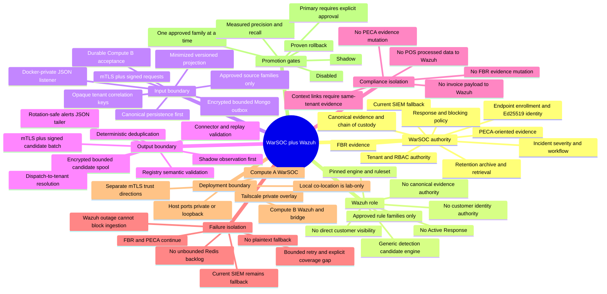

# WarSOC Wazuh Execution Mind Map

**Status:** Authoritative execution index for the current Wazuh integration

**Architecture authority:**
`docs/WARSOC_WAZUH_DETECTION_TARGET_ARCHITECTURE.md`

**Implementation authority:**
`docs/WARSOC_WAZUH_IMPLEMENTATION_AND_LAB_RUNBOOK.md`

**Combined Wazuh/firewall implementation ledger:**
`docs/WARSOC_WAZUH_FIREWALL_IMPLEMENTATION_LEDGER_2026-08-13.md`

## 1. Non-Negotiable Decision

WarSOC remains the security product and system of record. Wazuh is a pinned,
replaceable generic detection engine. Running the complete Wazuh platform does
not authorize every Wazuh rule to create a WarSOC incident. Only telemetry and
candidate rule families approved by the WarSOC registry may cross either
integration boundary.

## 2. Exact Data Flow

```mermaid
flowchart LR
    A["WarSOC signed endpoint event"] --> B["Authenticated WarSOC ingestion"]
    B --> C["Canonical WarSOC persistence"]
    C --> D["Current WarSOC SIEM, FBR and PECA paths"]
    C --> E["Approved generic telemetry projector"]
    E --> F["Encrypted bounded dispatch outbox"]
    F -->|"mTLS + HMAC over Tailscale"| G["Compute B durable bridge input spool"]
    G --> H["Docker-private Wazuh JSON listener"]
    H --> I["Pinned Wazuh rules"]
    I --> J["alerts.json"]
    J --> K["Rotation-safe candidate tailer and encrypted spool"]
    K -->|"mTLS + HMAC over Tailscale"| L["WarSOC candidate API"]
    L --> M["Dispatch, tenant, evidence and registry validation"]
    M --> N["Shadow observation ledger"]
    N -. "future approved family" .-> O["WarSOC incident projection"]

    D --> P["WarSOC customer dashboard"]
    O --> P
```

## 3. Current Gate Status

| Gate | Requirement | Current status | Closure evidence |
|---|---|---|---|
| 0 | Freeze current WarSOC truth and fallback | Complete | Current WarSOC SIEM/FBR/PECA paths remain independent |
| 1 | Contracts, threat model, queues and ownership | Code and contract complete | Versioned contracts, encrypted bounded outbox/spools, strict field registry, signed health channel and disabled-by-default settings exist |
| 2 | Isolated Wazuh lab | Two-host shadow transport accepted | Local and separate-host 4.14.7 canaries, bidirectional mTLS, signed transport, tenant isolation, negative transport and selected outage recovery pass. |
| 3 | Compatibility harness | Contracts and two-host live path complete | Maintained Wazuh and adjacent WarSOC regression gates pass; physical saturation and rule-quality corpora remain. |
| 4 | Shadow integration | Transport accepted; deployment disabled | Signed cross-host dispatch/candidate lineage produced shadow-only observations with zero customer side effects. Production enablement still requires host-firewall, capacity, rollback and rule-quality approval. |
| 5 | Limited primary promotion | Blocked | Requires accepted Gate 4 metrics and one-family rollback proof |
| 6 | Firewall projection to Wazuh | Blocked separately | Network relay must pass its own packaged service, real-device and production-pilot gate first |
| 7 | Security release | Blocked | Requires complete acceptance artifacts, rollback and residual-risk approval |

## 4. Criticality Register

### P0 Release Blockers

1. Wazuh must never receive MongoDB, Redis, FBR, PECA, archive, tenant-admin or
   incident credentials.
2. Compute A and Compute B require separate mTLS trust directions plus separate
   request-signing secrets. Tailscale alone is not authentication.
3. A candidate tenant is always resolved from the WarSOC dispatch record. Any
   tenant value from Wazuh is ignored.
4. Canonical persistence must complete before projection. Wazuh availability
   must never participate in endpoint acknowledgement.
5. Input admission must reject unsigned legacy data, FBR/PECA records,
   unapproved source families, oversized data, stale live events and unknown
   registry versions.
6. Candidate admission must reject unknown dispatches, replay, duplicates,
   expired items, rule mismatches and cross-tenant lineage.
7. Wazuh Active Response, Wazuh email and direct firewall control remain
   disabled.
8. Outbox and bridge spools remain encrypted and bounded. Saturation creates an
   explicit coverage gap; it never falls back to plaintext or unbounded Redis.
9. Wazuh manager, API, enrollment, indexer, dashboard and private listener must
   never be internet-exposed.
10. Forced Wazuh failure must leave canonical ingest, the current WarSOC SIEM,
    FBR, PECA, incidents and archive processing operational.
11. Production starts in `shadow`; `primary` remains impossible unless both the
    per-family registry and `WAZUH_PRIMARY_APPROVED=true` explicitly permit it.
12. Every release must preserve an immediate switch back to
    `warsoc_primary`/`disabled` without deleting audit or queue state.

### P1 Quality Gates

1. Add rule families one at a time with positive, negative, noise, malformed
   and boundary corpora.
2. Measure precision, recall, latency, duplicate rate and analyst usefulness per
   family before promotion.
3. Test alerts-file rotation, truncation, partial writes, manager restart,
   bridge restart, network outage and candidate-API outage.
4. Prove nonce replay, stale timestamp, invalid certificate, invalid HMAC,
   connector revocation and key rotation behavior.
5. Prove tenant-safe correlation with deterministic two-tenant and burst tests.
6. Record engine image digest, ruleset hash, registry hash, connector identity
   and correlation-key version on every accepted candidate.

## 5. Current Phase Execution Order

1. Freeze exact Compute A and Compute B Tailscale names and addresses.
2. Generate four purpose-specific mTLS identities and separate CAs/trust bundles.
3. Configure the Compute B bridge with the exact Wazuh network, log volume,
   reserved container IP, registry hash and Compute A candidate URL.
4. Bind bridge `9443` only to Compute B's Tailscale address and candidate API
   `8443` only to Compute A's Tailscale address.
5. Configure Compute A as `WAZUH_DETECTION_MODE=shadow`; keep
   `WAZUH_PRIMARY_APPROVED=false`.
6. Seed the reviewed connector/rule registry and start only the optional Wazuh
   dispatcher and candidate API services.
7. Run the signed 4688 canary and prove complete dispatch-to-shadow lineage.
8. Run security, durability, tenant-isolation and failure-independence tests.
9. Freeze evidence artifacts and update current-state architecture.
10. Consider one low-risk rule family for promotion only after the shadow gate
    is accepted.

## 6. Interpretation Rule

"Full Wazuh detection" means WarSOC can progressively use Wazuh's generic
detection capabilities through this governed integration. It does not mean
blindly forwarding all customer data, trusting every stock rule, installing a
second endpoint agent, moving compliance logic to Wazuh, or allowing Wazuh to
perform response actions.

## 7. Review Closure Record - 2026-08-12

The implementation review found and closed these code-level gaps before live
shadow activation:

1. The alert tailer now detects same-file truncation and committed-byte digest
   rollback instead of seeking beyond EOF indefinitely.
2. Bridge input and candidate retries now use bounded exponential backoff and
   age expiry. Expiry creates explicit signed health and coverage records.
3. SQLite input receipts, nonces and exported health metadata have bounded
   retention; payload spools remain encrypted and byte bounded.
4. The bridge health endpoint is truthful. Signed periodic health snapshots and
   loss events are stored on Compute A with pinned connector, engine, ruleset and
   registry identity.
5. Candidate output now includes engine detection time. Compute A validates it
   against dispatch creation, live expiry, clock skew and maximum delivery age.
6. WarSOC's purpose-separated tenant correlation HMACs are now delivered to
   Wazuh. Raw tenant IDs are still withheld.
7. Rule registries can request only source-family fields in the reviewed static
   catalog. Arbitrary Mongo paths, raw payloads, identities, invoice/POS fields
   and packet content cannot be enabled by editing JSON alone.
8. The projector now advances on Mongo's indexed insertion `_id`, so a record
   inserted later with an older event timestamp is still considered. Original
   event time continues to enforce the live-correlation window.
9. Bridge counters separate durable ingress, manager handoff, alert lines,
   unapproved matches, candidate spooling/export, quarantine, retry and expiry.

These closures do not change the gate status to production accepted. The live
two-machine proof in Gate 2 through Gate 4 is still mandatory.

## 8. Historical Verification Record - 2026-08-12

The final reviewed files produced these measured results:

| Scope | Result |
|---|---:|
| Wazuh bridge, health, projection, candidate and transport contracts | 32 passed |
| Production deployment, endpoint signing, native detection and relay foundation | 72 passed |
| Relay runtime and tenant/platform quota contracts | 36 passed |
| FBR, PECA, archive, security closure and incident workflow | 44 passed |
| Total | **184 passed** |

The newer 2026-08-13 maintained release-gate selection records **432 passed,
3 skipped**. The skips are one opt-in legacy grand-master harness that is not
safe as a current release gate and two Git metadata checks that passed directly
on the host.
That result and its scope breakdown are authoritative in
`docs/WARSOC_VERIFICATION_AND_CUSTOMER_ACCEPTANCE_2026-08-12.md`; the table
above is retained as the earlier dated snapshot rather than silently rewritten.

Additional checks:

- Wazuh integration bytecode compilation: passed.
- Docker development and production Compose rendering: passed.
- High-severity Bandit scan of Wazuh integration paths: no findings.
- Running local Wazuh images: manager, indexer and dashboard `4.14.7`.
- Running local Wazuh host bindings: loopback only.
- `wazuh-analysisd -t`: exit `0`.
- Repository and manager canary-rule SHA-256: matching.
- Enabled Wazuh Active Response blocks: `0`.
- Isolated live canary: one `shadow_observation`; zero customer incidents,
  security alerts, FBR/PECA records, emails and block actions.
- Isolated live recovery: accepted dispatch survived manager outage and bridge
  restart, then completed automatically after manager recovery.
- Isolated negative transport: replay `409`, tamper/wrong connector `401`,
  oversized body `413`, and missing client certificate rejected at TLS.

This record proves code contracts and the isolated two-host shadow transport.
It does not substitute for physical-host firewall proof, live saturation,
ruleset rollback or rule-quality evidence required before production promotion.

The current cross-system/customer-flow verification record is
`docs/WARSOC_VERIFICATION_AND_CUSTOMER_ACCEPTANCE_2026-08-12.md`.

## 9. Wazuh Capability Boundary

| Wazuh capability | WarSOC decision |
|---|---|
| JSON decoding and approved log-rule execution | Used |
| Approved stock or custom generic rule families | Added one family at a time after corpus review |
| Wazuh level and MITRE metadata | Treated as untrusted candidate data and checked against the WarSOC registry |
| Wazuh agents on customer endpoints | Not used; the signed WarSOC agent remains authoritative |
| Wazuh inventory, vulnerability detection and SCA | Outside the current integration scope |
| Wazuh FIM as FBR evidence | Prohibited; WarSOC FBR remains authoritative |
| Wazuh PECA evidence generation | Prohibited; WarSOC PECA-oriented evidence remains authoritative |
| Wazuh Active Response, email and blocking | Disabled |
| Wazuh dashboard as the customer UI | Not used |
| Blind enablement of every stock rule | Prohibited |

The Wazuh TCP JSON listener does not provide an application-level receipt for
each event. A bridge receipt proves durable bridge acceptance; a socket handoff
proves only successful transport write; a returned candidate proves a matching
alert completed the approved path. Nonmatching events have no individual Wazuh
analysis receipt. WarSOC therefore must not use Wazuh handoff as legal evidence
or as proof of complete analysis. Canonical evidence, stage counters, signed
bridge health, canaries and the existing WarSOC detector are the compensating
controls.
