# WarSOC Wazuh and Firewall Integration Implementation Ledger

**Snapshot date:** 2026-08-13  
**Document role:** Detailed implementation, verification, and remaining-gate record  
**Audience:** WarSOC engineering, operations, security review, and product leadership  
**Data classification:** Internal architecture metadata only; no customer data, credentials, activation codes, private addresses, or raw evidence

## 1. Executive Verdict

The Wazuh and firewall programs have completed their architecture, backend
foundation, maintained contract tests, and controlled lab transport phases.
They have not completed production enablement or broad customer-hardware
acceptance.

The exact current state is:

| Capability | Current status | Meaning |
|---|---|---|
| WarSOC native Windows SIEM/FBR/PECA | Active production path | Continues independently of Wazuh and the firewall relay. |
| Wazuh contracts and bridge implementation | Implemented and regression-proven | Versioned projection, durable transport, candidate validation, and failure controls exist. |
| Wazuh separate-host shadow transport | Two-host lab-proven | A signed canary completed the private mTLS path and produced a WarSOC shadow observation with no customer side effects. |
| Wazuh production detection | Disabled | `WAZUH_DETECTION_MODE=disabled` and `WAZUH_PRIMARY_APPROVED=false` remain required. |
| Firewall relay backend | Implemented and regression-proven | Relay enrollment, strict parsers, bounded spools, signed batches, admission, health, and correlation contracts exist. |
| pfSense integration | Virtual-lab-proven | pfSense CE 2.8.1 pass/block records completed the controlled Hyper-V relay path. |
| Other firewall vendors | Parser/fixture candidate only | Fortinet, Cisco ASA, and MikroTik parser contracts exist but do not have accepted physical-device evidence. |
| Customer firewall production integration | Disabled | `NETWORK_RELAY_ENABLED=false` remains required. |
| Customer firewall UI | Not present in authoritative frontend `main` | Current production UI has no relay workspace. A future UI requires a separate reviewed implementation. |
| Firewall metadata through Wazuh | Designed but blocked | It requires both relay production acceptance and a separately approved Wazuh network rule family. |

Therefore, it is accurate to say that the integration foundations and controlled
labs are complete. It is not accurate to say that Wazuh or general customer
firewall onboarding is production-complete.

## 2. Non-Negotiable Product Ownership

WarSOC remains the only customer product and system of record.

- WarSOC owns endpoint and relay enrollment.
- WarSOC resolves tenants and enforces RBAC.
- WarSOC stores canonical evidence and chain-of-custody records.
- WarSOC owns SIEM/FBR/PECA classifications, incident severity, workflow,
  retention, export, archive, and response policy.
- Wazuh is a private, replaceable generic candidate detector.
- Firewall devices provide metadata to a customer-side WarSOC Relay; they do
  not connect directly to the WarSOC cloud.
- Wazuh does not receive MongoDB, Redis, tenant-admin, archive, FBR, PECA, or
  incident credentials.
- Wazuh Active Response, Wazuh email, and the Wazuh dashboard are not part of
  the customer product.
- General packet capture, packet payload retention, and TLS decryption are not
  approved.

## 3. Combined Target Flow

```mermaid
flowchart LR
    WA["Signed WarSOC Windows Agent"] --> ING["WarSOC authenticated ingestion"]
    FW["Customer firewall metadata"] --> REL["Customer-side WarSOC Relay"]
    REL -->|"Ed25519-signed HTTPS batch"| ING
    ING --> CAN["Canonical WarSOC persistence"]
    CAN --> NS["WarSOC native SIEM"]
    CAN --> CP["WarSOC FBR and PECA evidence paths"]
    CAN --> PRJ["Approved minimized Wazuh projection"]
    PRJ --> OUT["Encrypted bounded dispatch outbox"]
    OUT -->|"mTLS + HMAC on private overlay"| BR["Compute-B durable bridge"]
    BR --> WZ["Pinned Wazuh rules"]
    WZ --> CAND["Signed candidate return"]
    CAND --> VAL["WarSOC tenant, evidence, registry, replay, and time validation"]
    VAL --> SH["Shadow observation"]
    NS --> INC["WarSOC incident workflow"]
    SH -. "future approved family" .-> INC
    CP --> ARC["WarSOC archive and reports"]
```



Canonical persistence occurs before Wazuh dispatch. Wazuh or relay failure
cannot participate in endpoint acknowledgement and cannot block the native
SIEM, FBR, PECA, incident, or archival paths.

## 4. Wazuh Phase Ledger

### Phase W0: Authority and Threat Model

**Status:** Complete.

Decisions implemented:

1. WarSOC remains authoritative; Wazuh returns untrusted candidates.
2. Candidate tenant identity is resolved from the original WarSOC dispatch.
3. FBR records, PECA records, invoice data, secrets, credentials, raw tenant
   identifiers, and unrestricted raw documents are prohibited inputs.
4. Canonical evidence is committed before projection.
5. Wazuh outage cannot block WarSOC ingestion or acknowledgement.
6. Production starts disabled; shadow is the first permitted future mode.
7. Primary promotion requires a global approval and a per-family registry
   approval.

### Phase W1: Contracts, Projection, and Durable Dispatch

**Status:** Complete in source and maintained tests.

Implemented components:

| Component | Responsibility |
|---|---|
| `app/wazuh_integration/contracts.py` | Strict dispatch, receipt, candidate, and health schemas. |
| `projector.py` | Reads persisted SIEM evidence and emits only registry-approved normalized fields. |
| `dispatcher.py` | Claims encrypted outbox records, signs requests, retries with bounds, and expires stale work. |
| `app/workers/wazuh_dispatch_worker.py` | Optional dispatcher process outside the native unified worker. |
| `registry.py` | Pins event families, allowed fields, rule identity, engine identity, and ruleset hash. |
| `security.py` | mTLS/HMAC support, body hashes, nonces, freshness checks, encryption, and purpose-separated correlation keys. |

Admission rejects unsigned legacy endpoint events, unapproved source families,
oversized or stale live events, forbidden fields, unknown registries, and
records without canonical evidence.

### Phase W2: Compute-B Bridge and Failure Boundary

**Status:** Complete in source and maintained tests.

Implemented components:

| Component | Responsibility |
|---|---|
| `bridge_config.py` | Fail-fast Compute-B configuration and pinned identities. |
| `bridge_spool.py` | Encrypted SQLite input/candidate spools, byte and age limits, receipts, nonces, counters, and health events. |
| `bridge_runtime.py` | Signed ingress, loopback Wazuh handoff, rotation-safe alert tailing, signed candidate export, and health reporting. |
| `candidate_api.py` | Private Compute-A candidate and bridge-health endpoints. |
| `candidate_service.py` | Resolves trusted dispatch lineage and writes validated observations. |
| `docker-compose.wazuh-bridge.yml` | Isolated non-root bridge with a narrow volume-ownership initializer. |

Failure behavior is explicit:

- accepted bridge input is durable before acknowledgement;
- retries preserve signed bytes and use bounded backoff;
- expired live events create signed coverage-gap health rather than late
  detections;
- spool saturation fails closed rather than becoming plaintext or unbounded;
- alert-file rotation, truncation, and identity change are detected;
- replay, wrong connector, invalid HMAC, stale request, oversized body, and
  missing client certificate are rejected.

### Phase W3: Isolated Local Canary

**Status:** Complete.

Proved behavior:

1. Bidirectional mTLS.
2. Wazuh manager receipt through the private JSON listener.
3. Canary rule `100500` for a signed Windows 4688 `whoami.exe` event.
4. Signed candidate return to WarSOC.
5. One WarSOC `shadow_observation` with dispatch and evidence lineage.
6. No customer incident, security alert, FBR record, PECA record, email, or
   block action.
7. Manager outage and bridge restart recovery.
8. Replay, tamper, wrong connector, oversized request, and missing-certificate
   rejection.

### Phase W4: Separate Compute-A/Compute-B Shadow Transport

**Status:** Complete as a controlled two-host lab.

The accepted two-host path used the WarSOC machine as Compute A and a separate
Wazuh 4.14.7 laptop as Compute B. It proved:

1. private Tailscale-only service binding;
2. separate mTLS trust directions and separate HMAC identities;
3. durable dispatch receipt before Wazuh handoff;
4. rule `100500` and signed candidate return;
5. exact dispatch-to-event-to-tenant lineage;
6. two concurrent tenants with zero cross-tenant mismatch;
7. manager, bridge, and candidate-API outage recovery;
8. fail-closed expiry outside the five-minute live window;
9. alert-file identity-change recovery; and
10. zero customer-visible or response side effects.

Two defects found by the live run were corrected: fresh bridge volumes are now
initialized for the non-root UID, and Wazuh manager configuration is applied to
the host-mounted source of truth rather than only the running container.

### Phase W5: Rule-Family Quality and Promotion

**Status:** Open; production blocker.

Required evidence for every proposed rule family:

- positive malicious corpus;
- negative benign corpus;
- noisy and repeated benign workloads;
- malformed and boundary inputs;
- measured precision, recall, latency, duplicate rate, and analyst usefulness;
- ruleset upgrade and rollback;
- host-firewall evidence for the exact Compute A and Compute B deployment;
- physical outbox/input/candidate spool saturation; and
- forced-Wazuh-failure proof that native SIEM/FBR/PECA remain healthy.

Only one reviewed generic family may be promoted at a time. Until this closes,
Wazuh remains disabled in production.

## 5. Firewall and Relay Phase Ledger

### Phase F0: Product and Legal Boundary

**Status:** Complete.

The approved scope is metadata-only firewall telemetry: source/destination
addresses, ports, protocol, action, interface, direction, rule identity,
device time, relay receipt time, and bounded vendor metadata. No PCAP or general
packet payload is collected.

Legacy UDP syslog is described as `relay_attested`, not device-authenticated.
The relay proves which registered relay accepted and forwarded the datagram; it
cannot prove that a legacy UDP sender cryptographically created it.

### Phase F1: Customer-Side Relay Foundation

**Status:** Complete in source and maintained tests.

Implemented controls:

1. Separate relay activation and identity; endpoint activation codes cannot
   enroll relays.
2. Tenant binding is established by WarSOC, not by client-supplied tenant data.
3. Source address/device allowlists and per-device/global rate limits.
4. Strict vendor parser selection; unknown formats fail closed.
5. Separate encrypted bounded evidence and control spools.
6. Ed25519-signed deterministic batches with sequence and previous-hash
   continuity.
7. Exact retry, duplicate suppression, atomic Redis admission, and receipt
   repair.
8. Relay revocation, dead-key recovery, source health, drop accounting, spool
   pressure, clock confidence, and loss records.
9. DPAPI-protected identity and restricted service/spool design for Windows.

### Phase F2: Vendor Parser Contracts

**Status:** Complete in source; acceptance differs by vendor.

| Vendor | Parser state | Physical/virtual evidence |
|---|---|---|
| pfSense | Strict `filterlog` parser implemented | pfSense CE 2.8.1 virtual lab accepted. |
| Fortinet | Strict normalized parser implemented | Real/evaluation appliance acceptance open. |
| Cisco ASA | Strict normalized parser implemented | Real/evaluation appliance acceptance open. |
| MikroTik | Strict normalized parser implemented | CHR/physical acceptance open. |

Unknown fields, unsupported families, malformed rows, packet bodies, and
unregistered sources are rejected or quarantined without guessed semantics.

### Phase F3: pfSense Hyper-V Lab

**Status:** Complete as `VIRTUAL_LAB_VALIDATED`.

Environment and proof:

- pfSense CE 2.8.1 on an isolated Hyper-V LAN;
- native BSD `filterlog` UDP forwarding to the Windows relay;
- explicit logged pass and block rules;
- accepted `NET-CONNECTION-ALLOW` and `NET-CONNECTION-BLOCK` evidence;
- tenant binding, `source_assurance=relay_attested`, and verified relay
  signature;
- six records retained while the lab API was unavailable;
- encrypted evidence spool and separate control spool;
- unclean relay restart followed by successful recovery;
- both spools drained to zero without duplicate event UIDs; and
- cloud batch sequences 1 through 83 with no sequence or previous-hash gaps.

This proves parser, transport, signing, outage durability, and functional
correlation behavior for the recorded virtual pfSense version. It does not
prove every pfSense version, a physical Netgate appliance, VPN/authentication
log families, or production EPS.

### Phase F4: Network-Source Isolation and Hybrid Correlation

**Status:** Complete in source and maintained tests; production-disabled.

Implemented safeguards:

- network records cannot execute Windows, web-WAF, FBR, or PECA-native rules;
- Windows records cannot execute firewall-only rules;
- correlations require the same tenant and compatible time/source context;
- backlog processing uses event time plus relay receipt context rather than
  fabricating live chronology;
- allowed/blocked traffic remains evidence unless an approved correlation adds
  security meaning; and
- Wazuh projection is separately gated and accepts only relay-attested,
  signed, approved network families.

### Phase F5: Packaged Relay and Customer Hardware

**Status:** Open; production blocker.

Still required:

1. Reproducible release build and code signing or formally approved hash
   allowlisting for the exact relay artifact.
2. Disposable Windows Server service proof covering NSSM restart, DPAPI reload,
   DACL/SACL behavior, source-scoped Windows firewall rules, graceful stop,
   crash recovery, upgrade, and uninstall evidence preservation.
3. Exact customer vendor/model/configuration fixture and real-device acceptance.
4. Measured normal and burst EPS, byte rate, disk reserve, spoof flood, parser
   pressure, cloud quota, spool saturation, and outage survival.
5. At least one 24-hour non-POS pilot with reviewed drops, spool growth,
   detection latency, and false positives.
6. Approved Azure retention class for the sold network-metadata contract.

### Phase F6: Customer UI and Production Enablement

**Status:** Not implemented in authoritative frontend; production-disabled.

The customer UI eventually needs WarSOC-only controls for relay activation,
registered devices, health, last receipt, drops, spool pressure, revocation,
and customer-safe setup guidance. It must not expose Wazuh, raw vendor messages,
Azure credentials, internal APIs, or unsupported compliance claims.

Backend `NETWORK_RELAY_ENABLED=true` and any future frontend flag must be
enabled together only after Phase F5 closes. No current production customer
depends on this capability.

## 6. Verification Inventory

| Verification | Result | Scope |
|---|---:|---|
| Full maintained backend release gate | 432 passed, 3 explicitly skipped | Native SIEM, FBR, PECA, incidents, signing, archive/retrieval, quotas, relay, Wazuh, security, and user contracts. |
| Focused Wazuh contracts | 32 passed | Projection, transport trust, replay, durability, health, candidate validation, and state machine. |
| Focused network relay contracts | 36 passed | Parser, collector, spools, signing, admission, lifecycle, source isolation, and correlations. |
| Wazuh local live canary | Passed | Private listener, rule 100500, signed return, shadow-only side effects, and selected outage recovery. |
| Wazuh separate-host canary | Passed | Private overlay, bidirectional mTLS/HMAC, tenant isolation, recovery, and expiry. |
| pfSense virtual appliance | Passed | Native pass/block syslog, signing, encrypted outage retention, restart recovery, and batch continuity. |
| Current production preflight | Passed, run `83aa506f9e` | DNS, TLS, frontend assets/API binding, health, CORS, security headers, blocked docs/private ports, and exact Azure agent 4.2.8 hash. |
| Static application security scan | 0 high-severity findings | Current application paths; reviewed medium findings are controlled sentinels/listeners or fixed-allowlist SQLite identifiers. |

Three maintained-suite skips do not conceal a product failure: one destructive
grand-master harness is explicitly isolated-stack-only, and two container-local
Git metadata checks passed on the host.

## 7. Production Configuration State

The approved production defaults are:

```dotenv
AGENT_EVENT_SIGNATURE_MODE=required
NETWORK_RELAY_ENABLED=false
WAZUH_DETECTION_MODE=disabled
WAZUH_PRIMARY_APPROVED=false
ENABLE_SECURITY_ALERT_EMAILS=false
```

Optional Compose profiles for Wazuh and network syslog are not part of the
normal production startup. Direct public Wazuh manager/API/indexer/dashboard
ports and direct public UDP syslog are prohibited.

## 8. Customer Claims Allowed Today

WarSOC may claim its current native Windows SIEM/FBR/PECA capabilities according
to their documented evidence boundaries. It may internally state that Wazuh
shadow transport and pfSense relay transport have passed controlled labs.

WarSOC must not yet claim:

- production Wazuh-assisted detection;
- broad Wazuh ruleset coverage;
- customer-visible Wazuh functionality;
- production firewall ingestion;
- support for every pfSense/Fortinet/Cisco ASA/MikroTik device;
- packet-content monitoring;
- complete PECA compliance from endpoint or firewall evidence alone; or
- production capacity based only on laptop/virtual-appliance tests.

## 9. Exact Next Sequence

1. Keep Wazuh and relay production flags disabled.
2. Freeze a signed/hash-approved relay artifact and complete the Windows service
   lifecycle gate.
3. Complete one exact customer firewall model acceptance and a 24-hour non-POS
   pilot.
4. Build positive/negative/noise corpora for one low-risk Wazuh rule family.
5. Prove physical saturation and rollback on the intended Compute-B host.
6. Enable Wazuh shadow for that one family only after approval.
7. Project accepted firewall metadata to Wazuh only after both the firewall and
   Wazuh gates independently pass.
8. Design and separately accept the customer relay UI last.

## 10. Source-of-Truth Map

| Concern | Authority |
|---|---|
| Full active WarSOC architecture | `docs/WARSOC_CURRENT_STATE_ARCHITECTURE.md` |
| Consolidated current/future status | `docs/WARSOC_CURRENT_IMPLEMENTATION_AND_FUTURE_SCOPE.md` |
| Wazuh architecture decision | `docs/WARSOC_WAZUH_DETECTION_TARGET_ARCHITECTURE.md` |
| Wazuh execution gates | `docs/WARSOC_WAZUH_EXECUTION_MIND_MAP.md` |
| Wazuh implementation and operator procedure | `docs/WARSOC_WAZUH_IMPLEMENTATION_AND_LAB_RUNBOOK.md` |
| Relay backend contract | `docs/NETWORK_RELAY_BACKEND_FOUNDATION.md` |
| Firewall validation model | `docs/NETWORK_FIREWALL_VALIDATION_RESEARCH.md` |
| pfSense controlled lab | `docs/PFSENSE_NETWORK_RELAY_LAB_RUNBOOK.md` |
| Cross-system verification | `docs/WARSOC_VERIFICATION_AND_CUSTOMER_ACCEPTANCE_2026-08-12.md` |

