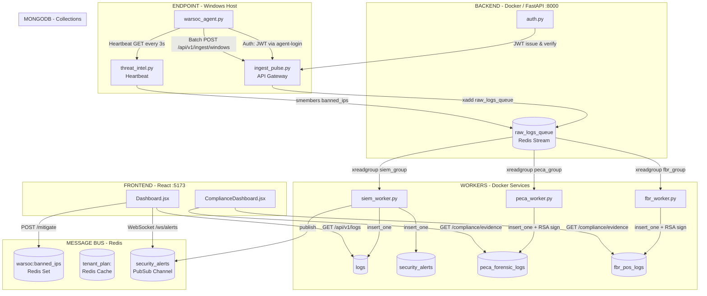

# WarSOC SIEM — Pre-Deployment Architecture Audit
*Audit Date: 2026-04-08 | Auditor: Antigravity AI*

---

## 1. System Architecture



---

## 2. Full Feature Flow Audit

### Flow 1: Agent → Dashboard (Live Logs)
```
Agent → POST /ingest/windows → 4-Layer Security Check → Redis xadd → 
siem_worker xreadgroup → MongoDB logs → GET /api/v1/logs → Dashboard
```
**Polling interval: 1500ms** (frontend)

### Flow 2: Alert → WebSocket (Real-time)
```
siem_worker → processes alert → MongoDB security_alerts + Redis PUBLISH → 
redis_to_websocket_listener → manager.broadcast_to_tenant → Dashboard toast
```

### Flow 3: IP Ban
```
Admin clicks Block → POST /mitigate → MongoDB firewall_rules + Redis SADD → 
Agent heartbeat GET → enforce_bans list → netsh firewall rule
```

### Flow 4: Compliance Evidence
```
Agent → ingest/windows → Redis → peca_worker or fbr_worker → 
RSA-2048 sign + SHA-256 hash → peca_forensic_logs / fbr_pos_logs → 
GET /compliance/evidence → ComplianceDashboard
```

---

## 3. Critical Bugs & Issues

### 🔴 CRITICAL

#### BUG-01: `import time` missing in siem_worker.py
- **Status:** FIXED in this session
- **Impact:** SIEM worker silently crashed on startup; all logs piled up in Redis unprocessed for hours
- **Root Cause:** Hot-reload feature added `time.time()` calls without adding the import
- **Risk if unresolved:** Complete log blindness – dashboard shows no new events

#### BUG-02: JWT Secret Exposed in Terminal History
- **File:** `.env` line 13
- **Value:** `W4rS0c_JWT_Pr0d_K3y_2026!_x9Fq2mZvR8`
- **Exposure:** This was printed in a powershell command by a friend's debug attempt and is now in shell history
- **Fix Required:** Rotate `JWT_SECRET_KEY` in `.env` immediately before production deployment

#### BUG-03: `tamper_seal` vs `forensic_seal` Field Name Mismatch
- **Status:** FIXED in this session
- **Impact:** FBR logs showed "N/A" for the cryptographic hash in the UI
- **Root Cause:** `fbr_worker.py` wrote `tamper_seal`, but `compliance.py` reads `forensic_seal`

---

### 🟠 HIGH

#### BUG-04: Compliance Report Fetches Wrong Collection
- **File:** `ComplianceDashboard.jsx` line 73
- **Code:** `fetch('/logs?source=compliance&pack=${config.pack_id}')`
- **Problem:** The `logs.py` route with `source=compliance` queries based on whether `pack` contains "fbr". The pack_id sent is `fbr_pos` not `fbr` — the `.lower()` check does catch this, BUT the report PDF is built from `compliance` raw logs (which have no `forensic_seal` or `digital_signature`). It should be fetching from `/compliance/evidence/{pack_id}` instead.
- **Impact:** Evidence Summary PDF will **never show cryptographic seals** because it reads from the wrong collection
- **Fix:** Change the `downloadReport()` call to use `/compliance/evidence/${config.pack_id}`

#### BUG-05: `evidence` Tab Shows Static Placeholder Text
- **File:** `ComplianceDashboard.jsx` lines 231–235
- **Problem:** The "Evidence & Retention" tab shows a hard-coded paragraph instead of actually rendering real evidence from the database. The entire evidence browsing UI is missing.
- **Impact:** Compliance officers see no real forensic records, only marketing copy

#### BUG-06: IP Ban Does Not Actually Block at Network Level (Production)
- **File:** `threat_intel.py` — ban is stored in MongoDB + Redis
- **File:** `warsoc_agent.py` — heartbeat receives `enforce_bans` and calls `netsh`
- **Problem:** The `netsh` firewall rule only runs on the Windows machine where the **agent** runs. If the agent machine is rebooted, all netsh rules are gone. There is **no persistence** mechanism (no registry write, no GPO).
- **Impact:** IP bans survive only until the next reboot of the monitored endpoint

#### BUG-07: SIEM Worker Silently Drops Exceptions During DB Write
- **File:** `siem_worker.py` lines 359–361
- **Code:** `except Exception as e: logger.error(f"Processing Error: {e}")`
- **Problem:** If MongoDB is briefly unavailable, the worker logs the error but **does not re-queue the message**. The `ack_ids.append(message_id)` on line 357 only runs after success, but exceptions jump to the outer catch, so failed messages stay in the pending queue until `RECLAIM_MIN_IDLE_MS` (60 seconds) elapses. This is actually correct by design — but the log message is misleading ("Processing Error") rather than clearly indicating a retry will occur.

#### BUG-08: `docker-compose.yml` Missing `env_file` for Worker Services
- **File:** `docker-compose.yml`
- **Problem:** `worker-fbr`, `worker-peca`, `worker-siem` all have individual `environment:` blocks with **hardcoded credentials** duplicated 3 times. The `api` service uses `env_file: - .env` but workers don't. Any credential rotation requires editing 3+ places.
- **Fix:** Add `env_file: - .env` to all worker services

---

### 🟡 MEDIUM

#### BUG-09: Agent Whitelist Not Dynamic
- **File:** `ingest_pulse.py` line 188
- **Problem:** `allowed_ips` is loaded from `config.json` **once at startup** (`_security_config = None` with a singleton pattern). If a new agent IP is added to the whitelist, the API must be **restarted** to pick it up.
- **Impact:** Operational friction during scaling

#### BUG-10: 85+ Ghost User Accounts in Database
- **Seen in:** `fast_diag.py` output
- **Problem:** The database has 86 user accounts from automated tests (`atk_*`, `tscheck_*`, `auditor_*`, `phase_*`). These consume MongoDB storage and could be security vectors if their tokens haven't expired.
- **Fix:** Run a cleanup script before production. All test accounts should be purged.

#### BUG-11: Config Loaded at Module Level in `compliance.py`
- **File:** `compliance.py` lines 24–26
- **Code:** `_RUNTIME_CONFIG = _load_runtime_config()` (module-level, executes at import)
- **Problem:** Config changes to `config.json` require a full API restart to take effect. The SIEM worker hot-reloads every 10s but compliance routes never do.

#### BUG-12: Compliance Evidence Pagination Bug (Double Fetch)
- **File:** `compliance.py` lines 401–437
- **Problem:** When both PECA and FBR packs are active, the code fetches `skip + limit` docs from each collection at offset 0, merges them, sorts, then slices with `curated[skip: skip + limit]`. For page 2 (skip=50), it fetches 100 docs from each (200 total), merges to 200, then slices 50–100. This means **page 2 will return wrong results** because pagination is applied post-merge in memory, not per-collection at DB level.
- **Impact:** Possibly showing duplicate or out-of-order records in Evidence view when scrolling

#### BUG-13: WebSocket Token Validation Doesn't Check Blacklist
- **File:** `main.py` lines 202–208
- **Problem:** The WebSocket endpoint validates the JWT signature and expiry but does **not** check the `warsoc:blacklist:{jti}` Redis key. A logged-out user whose token is blacklisted can still receive live security alert broadcasts.

#### BUG-14: agent's `LOCAL_IP` Used as `source_ip` for ALL Events
- **File:** `warsoc_agent.py` line 726
- **Problem:** Every event (including logon events from remote IPs) is tagged with the agent's own LAN IP as `source_ip`. The `processed_data.source_network_address` field *does* contain the real source IP from the event XML, but the top-level `source_ip` is always local. This means SIEM's threat intel check (which checks `source_ip`) never sees remote attacker IPs — it only sees the machine's own IP.
- **Impact:** Malicious IP detection via the threat intel engine is broken for remote attackers

#### BUG-15: `access_token_expire_minutes` Not Defined in Settings
- **File:** `.env` — not present
- **File:** `auth.py` line 23 — `ACCESS_TOKEN_EXPIRE_MINUTES = settings.access_token_expire_minutes`
- **Problem:** If this setting has no default, startup could fail. (Risk depends on `config.py` implementation)

---

### 🔵 LOW / DEPLOYMENT HARDENING

#### BUG-16: `ALLOWED_ORIGINS` Includes Development Origins
- **File:** `.env` line 18
- **Problem:** Production `.env` still allows `localhost:5173` and `localhost:5174` in CORS. These should be removed and replaced with the production domain only.

#### BUG-17: `private_key.pem` Committed to Repo
- **File:** `keys/private_key.pem`
- **Problem:** The RSA private key used for forensic signing is inside the project directory and likely tracked by git. If this repo is ever pushed to GitHub (even privately), the forensic chain of custody is permanently compromised.
- **Fix:** Add `keys/` to `.gitignore` and rotate the key pair before deployment

#### BUG-18: `clean_slate.py` Can Wipe Production Data
- **File:** `run_grand_master.bat` — runs `clean_slate.py` on every startup
- **Problem:** If someone accidentally runs the startup bat in production, it will **wipe all logs**. This is a data loss disaster waiting to happen.
- **Fix:** Add a `--env production` guard or remove `clean_slate.py` from the startup sequence

#### BUG-19: No MongoDB Indexes Defined for Query Performance
- **Problem:** The `logs` collection will be queried by `{tenant_id: ..., timestamp: -1}` on every dashboard load. With 1000+ logs already in the collection, this will do full collection scans. At scale (100K+ logs) this will cause timeout errors.
- **Fix:** Ensure TTL + compound indexes are defined: `{tenant_id: 1, timestamp: -1}`

#### BUG-20: Frontend Dev Console Leaks Compliance Pack Data
- **File:** `ComplianceDashboard.jsx` line 43
- **Code:** `console.log("State Sync: Unlocked Packs ->", data.compliance_packs);`
- **Problem:** Prints sensitive entitlement data to the browser dev console in production

---

## 4. Priority Fix Order for Deployment

| Priority | Bug ID | Fix Time | Impact |
|----------|--------|----------|--------|
| 🔴 P0 | BUG-02 | 5 min | JWT secret rotation |
| 🔴 P0 | BUG-17 | 10 min | Private key out of git |
| 🔴 P0 | BUG-18 | 5 min | Remove clean_slate from startup |
| 🟠 P1 | BUG-04 | 30 min | Evidence PDF uses wrong collection |
| 🟠 P1 | BUG-14 | 1 hr | Fix source_ip for threat intel |
| 🟠 P1 | BUG-13 | 30 min | WebSocket blacklist check |
| 🟠 P1 | BUG-08 | 15 min | docker-compose env_file dedup |
| 🟡 P2 | BUG-05 | 2 hrs | Build real evidence browser UI |
| 🟡 P2 | BUG-10 | 15 min | Purge test accounts from DB |
| 🟡 P2 | BUG-19 | 30 min | Add MongoDB indexes |
| 🟡 P2 | BUG-16 | 5 min | Remove localhost from CORS |
| 🔵 P3 | BUG-09 | 1 hr | Dynamic whitelist reload |
| 🔵 P3 | BUG-12 | 2 hrs | Fix compliance evidence pagination |
| 🔵 P3 | BUG-20 | 2 min | Remove console.log |

---

## 5. What IS Working Correctly ✅

- **RSA-2048 Digital Signing** — Both PECA and FBR workers now correctly sign and hash every log
- **Tenant Isolation** — All collections are consistently gated by `tenant_id`  
- **Redis Consumer Groups** — All 3 workers have independent groups (FBR/PECA/SIEM), no message collision
- **WebSocket Live Alerts** — Tenant-scoped broadcast working correctly
- **Agent Self-Protection** — Agent auto-whitelists its own LAN IP to prevent self-ban
- **Disk Spooler** — Agent has zero-loss atomic spool/drain for offline resilience
- **Token Revocation** — Logout correctly blacklists JWT in Redis via JTI
- **4-Layer Ingest Security** — IP whitelist, payload size, timestamp validation, JWT verification all active
- **PECA Worker Hardening** — Consumer group lazy-init loop, supports startup race conditions

---

## 6. Deployment Checklist

```
[ ] Rotate JWT_SECRET_KEY in .env
[ ] Add keys/ to .gitignore, regenerate key pair
[ ] Remove clean_slate.py from run_grand_master.bat
[ ] Remove localhost:* from ALLOWED_ORIGINS
[ ] Fix BUG-04 (PDF uses /compliance/evidence endpoint)
[ ] Fix BUG-14 (source_ip from processed_data for threat intel)
[ ] Add BUG-13 (WS blacklist check)
[ ] Purge test accounts from MongoDB
[ ] Ensure MongoDB TTL + compound indexes are in place
[ ] Set up log rotation/monitoring for Docker containers
[ ] Verify private_key.pem is NOT in git history
```
